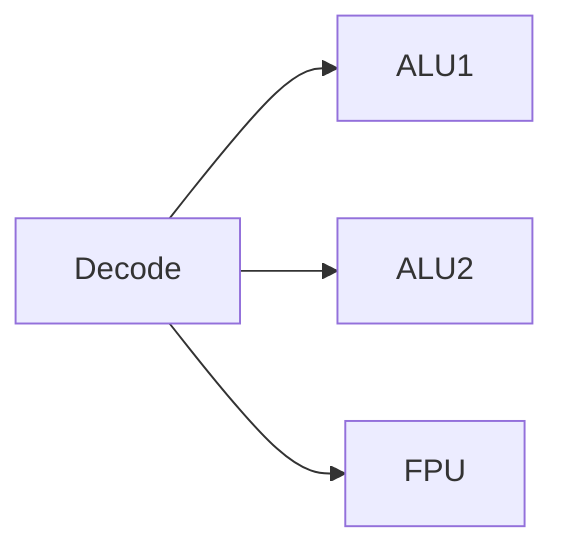
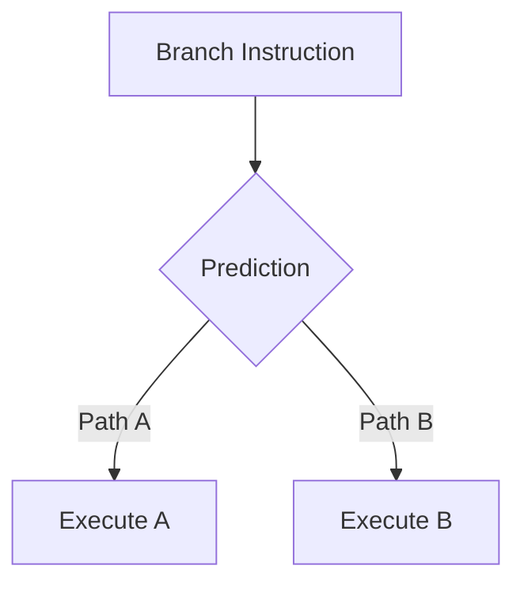

# Clock Speed and Instructions

CPU performance depends on two fundamental factors:

1. **Clock speed** — how frequently the processor advances its internal clock
2. **Instructions per cycle (IPC)** — how much work the processor completes during each cycle

Together these determine the **instruction throughput** of a processor.

Although clock speed is often highlighted in marketing materials, modern CPU performance depends far more on **how efficiently each cycle is used**.

---

## 1. Clock Speed

The **clock speed** (or **frequency**) of a CPU is the number of clock cycles the processor performs per second.

Clock speed is measured in **Hertz (Hz)**.

| Unit | Meaning                   |
| ---- | ------------------------- |
| MHz  | million cycles per second |
| GHz  | billion cycles per second |

For example:

```
4 GHz = 4,000,000,000 cycles per second
```

Each cycle lasts:

$$
\frac{1}{4,000,000,000}
=======================
0.25 \text{ nanoseconds}
$$

---

### Clock cycle visualization


Every CPU operation occurs within these clock cycles.

---

## 2. Instructions Per Cycle (IPC)

**Instructions per cycle (IPC)** measures how many instructions the processor completes during each clock cycle.

This value depends on the CPU’s microarchitecture and the nature of the workload.

---

## Instruction throughput

The approximate instruction throughput of a processor is:

[
\text{Throughput} \approx
\text{Clock Speed} \times \text{IPC}
]

---

### Example

Consider two processors:

| CPU   | Clock | IPC |
| ----- | ----- | --- |
| CPU A | 4 GHz | 2   |
| CPU B | 3 GHz | 4   |

Instruction throughput:

```
CPU A: 4 × 2 = 8 billion instructions/sec
CPU B: 3 × 4 = 12 billion instructions/sec
```

Despite having a lower clock speed, **CPU B is faster**.

This example shows why clock speed alone is not a reliable measure of performance.

---

## 3. Instruction Pipelining

Modern CPUs increase throughput using **instruction pipelines**.

Instead of executing one instruction completely before starting the next, the processor divides execution into stages and overlaps them.

Typical pipeline stages:

```
Fetch → Decode → Execute → Writeback
```

---

### Pipeline example

```
Cycle     Stage1   Stage2   Stage3   Stage4
1         I1
2         I2       I1
3         I3       I2       I1
4         I4       I3       I2       I1
```

Once the pipeline is filled, the processor can complete roughly **one instruction per cycle**.

---

### Pipeline visualization


Pipelining increases throughput but introduces new challenges.

---

## 4. Superscalar Execution

Modern CPUs are **superscalar**, meaning they can execute multiple instructions simultaneously.

They contain several independent execution units such as:

* integer ALUs
* floating-point units
* load/store units
* vector units

This allows a processor to issue multiple instructions per cycle.

---

### Superscalar architecture



Because multiple instructions may execute simultaneously, IPC can exceed 1.

High-performance processors often achieve IPC values between **2 and 6** depending on workload.

---

## 5. Out-of-Order Execution

Programs are written assuming instructions execute sequentially.

However, modern CPUs dynamically **reorder instructions** internally.

This technique is called **out-of-order execution**.

If one instruction stalls while waiting for memory, the processor can execute other independent instructions instead.

---

### Example

Original program order:

```
1: load A
2: add B
3: multiply C
```

If the load instruction stalls, the processor may execute instructions 2 or 3 first.

---

### Out-of-order execution visualization


This mechanism keeps execution units busy and improves IPC.

---

## 6. Branch Prediction

Conditional branches introduce uncertainty into the instruction pipeline.

Example:

```python
if x > 0:
    do_A()
else:
    do_B()
```

The processor does not immediately know which path will execute.

To avoid stalling the pipeline, the CPU uses **branch prediction**.

---

## Speculative execution

The CPU predicts which path will be taken and begins executing instructions along that path.

If the prediction is correct, execution continues normally.

If the prediction is wrong, the pipeline must be **flushed**, and execution restarts.

---

### Branch prediction visualization



Pipeline flush penalties typically cost **10–20 cycles**.

Modern predictors achieve **over 95% accuracy** for typical workloads.

---

## 7. Memory Latency and CPU Stalls

Even with high IPC, CPUs frequently stall waiting for data from memory.

Consider a processor running at **4 GHz**.

Cycle time:

```
0.25 ns
```

Typical RAM latency:

```
~60 ns
```

Equivalent cycles:

[
60 / 0.25 = 240 \text{ cycles}
]

During this time the CPU may be unable to execute dependent instructions.

---

### Memory latency comparison

| Memory Level | Latency        |
| ------------ | -------------- |
| L1 Cache     | 3–5 cycles     |
| L2 Cache     | 10–15 cycles   |
| L3 Cache     | 30–50 cycles   |
| RAM          | 200–400 cycles |

This is why **cache locality is often more important than clock speed**.

---

### Memory latency visualization


Each step away from the CPU increases latency.

---

## 8. Measuring CPU Throughput

Floating-point performance is often measured using **FLOPS (floating-point operations per second)**.

Matrix multiplication is commonly used as a benchmark because it performs a large number of arithmetic operations.

---

### Example: estimating GFLOPS

```python
import numpy as np
import time

def estimate_gflops():
    n = 2048
    A = np.random.rand(n, n)
    B = np.random.rand(n, n)

    flops = 2 * n**3
    start = time.perf_counter()
    C = A @ B
    elapsed = time.perf_counter() - start

    gflops = (flops / elapsed) / 1e9
    print(f"{gflops:.1f} GFLOPS")

estimate_gflops()
```

Optimized BLAS libraries can reach **100–500 GFLOPS** on modern CPUs.

---

## 9. Measuring Python-Level Overhead

The cost of Python operations can be measured using `timeit`.

```python
import timeit

result = timeit.timeit(
    'sum(range(1000))',
    number=10000
)

print(result)
```

This measurement includes:

* interpreter overhead
* object allocation
* dynamic type checks

These factors explain why Python arithmetic is slower than compiled code.

---

## 10. Practical Performance Insights

Several factors determine real-world performance.

---

## Clock speed

Higher frequency increases potential throughput.

However, it is not the dominant factor.

---

## IPC

Modern CPUs improve IPC using:

* pipelining
* superscalar execution
* out-of-order scheduling
* branch prediction

---

## Memory behavior

Many programs are limited by **memory latency and bandwidth**, not computation.

Efficient programs:

* maximize cache locality
* minimize memory traffic
* reuse data when possible

---

## 11. Worked Examples

### Example 1

Compute cycle time of a 3 GHz processor.

[
1 / 3,000,000,000 = 0.33 \text{ ns}
]

---

### Example 2

If IPC = 4 and clock speed = 3 GHz:

```
Throughput = 12 billion instructions/sec
```

---

### Example 3

Why can RAM latency dominate performance?

Because a single memory access may cost **hundreds of CPU cycles**.

---

## 12. Exercises

1. What does clock speed measure?
2. What is IPC?
3. Why does clock speed alone not determine performance?
4. What is instruction pipelining?
5. What is superscalar execution?
6. What is branch prediction?
7. Why can memory latency stall CPUs?
8. Why is cache locality important?

---

## 13. Summary

| Concept                | Description                       |
| ---------------------- | --------------------------------- |
| Clock Speed            | number of cycles per second       |
| IPC                    | instructions completed per cycle  |
| Throughput             | clock speed × IPC                 |
| Pipelining             | overlapping instruction stages    |
| Superscalar            | multiple instructions per cycle   |
| Out-of-order execution | dynamic instruction reordering    |
| Branch prediction      | speculative execution of branches |
| Memory latency         | major cause of CPU stalls         |

Modern CPU performance results from the interaction of **clock frequency, instruction throughput, and memory behavior**.

In practice, programs often run slowly not because CPUs are slow, but because **memory latency and inefficient instruction scheduling limit performance**.
