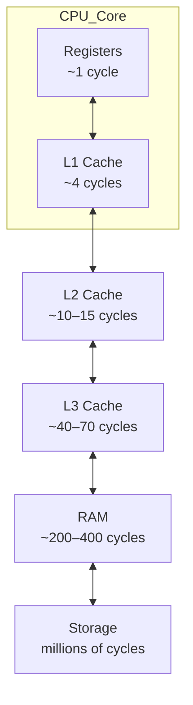
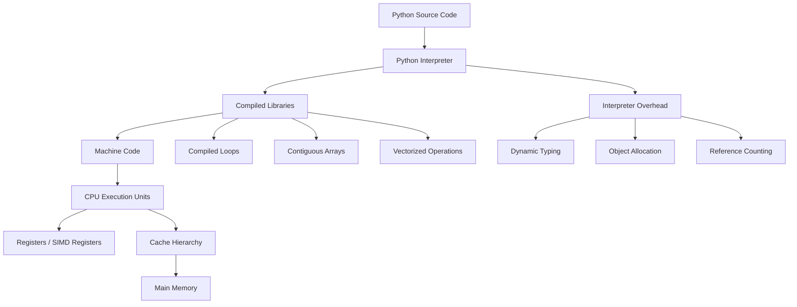

# CPU Basics

Understanding how software interacts with hardware is essential for explaining why some operations run quickly while others run slowly.

In particular, it helps explain why simple arithmetic operations in Python may run much slower than equivalent operations written in C, and why numerical libraries such as **NumPy** achieve dramatically higher performance.

At the lowest level, every program ultimately runs as **machine instructions executed by the CPU** or other processing units.

---

## 1. What Is a CPU?

The **Central Processing Unit (CPU)** is the hardware component responsible for executing machine instructions.

The CPU interprets instructions stored in memory, performs computations, and coordinates interactions with other hardware components.

The architecture of a CPU can be described at two conceptual levels:

| Level                              | Description                             |
| ---------------------------------- | --------------------------------------- |
| Instruction Set Architecture (ISA) | Interface between software and hardware |
| Microarchitecture                  | Internal implementation of the ISA      |

---

## Instruction Set Architecture (ISA)

The **Instruction Set Architecture** defines the programming interface of the processor.

It specifies:

* available machine instructions
* CPU registers
* memory addressing model
* calling conventions
* binary encoding of instructions

Examples of widely used ISAs include:

| ISA    | Common Usage                     |
| ------ | -------------------------------- |
| x86-64 | desktop and server processors    |
| ARM    | mobile devices and Apple Silicon |

Programs compiled for a specific ISA can run on **any processor implementing that ISA** without recompilation. This property is known as **binary compatibility**.

---

## Microarchitecture

The **microarchitecture** describes how a processor internally implements an ISA.

It includes components such as:

* instruction pipelines
* execution units
* cache hierarchies
* branch predictors
* out-of-order execution engines

Different CPUs may implement the **same ISA** but have different microarchitectures.

For example, multiple generations of Intel processors all support the x86-64 ISA while differing significantly in performance and internal design.

---

## 2. The Instruction Execution Cycle

Conceptually, CPUs execute instructions through a repeating cycle.

```
Fetch → Decode → Execute → Writeback
```

---

## 1. Fetch

The processor retrieves the next instruction from memory.

In modern systems this usually occurs from the **instruction cache**, which stores recently executed instructions close to the CPU.

---

## 2. Decode

The instruction is interpreted by the **control unit**, which determines:

* which operation must be performed
* which registers are used
* whether memory must be accessed

---

## 3. Execute

The CPU performs the requested operation using hardware execution units.

Examples include:

* arithmetic operations
* logical operations
* memory loads and stores
* control-flow instructions

---

## 4. Writeback

The result of the instruction is written to:

* registers
* memory

The instruction then completes.

---

### Instruction cycle visualization


This cycle repeats billions of times per second during program execution.

---

## 3. Instruction Pipelining

Modern CPUs improve performance using **instruction pipelining**.

Instead of completing one instruction before starting the next, the processor overlaps stages of multiple instructions.

Example pipeline:

```
Cycle →      1        2        3        4        5
------------------------------------------------------
Instr 1   | Fetch | Decode | Execute | Writeback |
Instr 2   |       | Fetch  | Decode  | Execute   | Writeback
Instr 3   |       |        | Fetch   | Decode    | Execute   | Writeback
Instr 4   |       |        |         | Fetch     | Decode    | Execute   | Writeback
```

Once the pipeline is full, the processor can ideally complete **one instruction per cycle**.

---

## Pipeline hazards

Pipelines introduce several challenges.

| Hazard            | Cause                                 |
| ----------------- | ------------------------------------- |
| Data hazard       | instruction depends on earlier result |
| Control hazard    | branches alter program flow           |
| Structural hazard | hardware resource conflicts           |

Modern processors mitigate these issues using:

* **branch prediction**
* **out-of-order execution**
* **speculative execution**

These techniques allow the CPU to maintain high instruction throughput.

---

## 4. Core CPU Components

Despite the complexity of modern processors, their basic structure can be described using three fundamental components.

| Component                   | Role                                       |
| --------------------------- | ------------------------------------------ |
| Control Unit                | Directs instruction execution              |
| ALU (Arithmetic Logic Unit) | Performs arithmetic and logical operations |
| Registers                   | Fast storage within the CPU                |

---

## Registers

Registers store temporary values used during computation.

They hold:

* instruction operands
* intermediate results
* memory addresses

Registers are the **fastest storage available to the CPU**, typically accessible within a single clock cycle.

Because registers are limited in number, most program data must be fetched from the **memory hierarchy**.

---

## 5. The Memory Hierarchy

Accessing main memory is significantly slower than performing arithmetic operations.

To reduce this gap, computers use a **hierarchy of memory layers**.



Typical latency values:

| Memory Level | Approximate Latency |
| ------------ | ------------------- |
| Registers    | ~1 cycle            |
| L1 Cache     | ~4 cycles           |
| L2 Cache     | ~10–15 cycles       |
| L3 Cache     | ~40–70 cycles       |
| RAM          | ~200–400 cycles     |

Programs that access memory **sequentially and predictably** benefit from caching and hardware prefetching.

---

## 6. Why Python Operations Are Expensive

A simple arithmetic expression in Python may require many machine instructions.

Consider:

```python
x = a + b
```

In a low-level language such as C, this may compile to a single machine instruction:

```
ADD r1, r2
```

In Python, however, the interpreter performs multiple operations:

1. locate objects referenced by `a` and `b`
2. determine their types at runtime
3. dispatch the appropriate `__add__` method
4. allocate a new Python object for the result
5. update reference counts

Each step requires additional instructions and memory accesses.

---

## Python execution model

```
Python Interpreter Loop

Iteration i
   │
   ▼
+---------------------------+
| Lookup object a           |
| Lookup object b           |
| Check object types        |
| Call __add__ method       |
| Allocate result object    |
| Update reference counts   |
+---------------------------+
```

As a result, a single arithmetic operation in Python may involve **dozens or hundreds of machine instructions**.

---

## 7. Why NumPy Is Fast

Libraries such as **NumPy** achieve high performance by moving computation from the Python interpreter into **compiled code**.

Instead of iterating element-by-element in Python, NumPy performs operations on entire arrays.

```python
import numpy as np

a = np.array([1.0,2.0,3.0,4.0])
b = np.array([5.0,6.0,7.0,8.0])

result = np.add(a,b)
```

Here Python performs a single function call into NumPy.

The computation occurs inside optimized C code.

---

### NumPy execution model

```
Python
   │
   ▼
+--------------------------+
| Call NumPy function      |
+--------------------------+
            │
            ▼

Compiled C Loop

for i in 0..n:
    result[i] = a[i] + b[i]
```

This approach eliminates interpreter overhead.

---

## 8. SIMD and Vectorization

Modern CPUs support **SIMD (Single Instruction Multiple Data)** instructions.

SIMD instructions allow one operation to process multiple values simultaneously.

---

## Scalar computation

```
ADD a0, b0
ADD a1, b1
ADD a2, b2
ADD a3, b3
```

Four instructions are required.

---

## SIMD computation

```
VECTOR_ADD [a0 a1 a2 a3], [b0 b1 b2 b3]
```

One instruction performs four additions.

---

## SIMD register widths

| Instruction Set | Register Width |
| --------------- | -------------- |
| SSE             | 128-bit        |
| AVX             | 256-bit        |
| AVX-512         | 512-bit        |

Example capabilities:

* AVX2 → 8 floating-point operations per instruction
* AVX-512 → 16 floating-point operations per instruction

NumPy operations can exploit SIMD instructions because arrays store data contiguously.

---

## 9. Cache Locality and Memory Layout

CPU caches transfer data in blocks called **cache lines**, typically 64 bytes.

The effectiveness of caching depends heavily on **how data is arranged in memory**.

---

## Contiguous arrays

NumPy arrays store values sequentially.

```
Memory
|1.0|2.0|3.0|4.0|
```

Advantages:

* efficient cache utilization
* hardware prefetching
* vectorized instructions

---

## Python lists

Python lists store **references to objects**, not raw numeric values.

```
List
| ptr | ptr | ptr | ptr |

ptr → object
```

The objects are scattered throughout memory.

This causes:

* extra pointer indirection
* poor cache locality

---

## 10. A Mental Model of Python Performance

When Python code runs, multiple layers interact.



Performance depends on:

* minimizing interpreter overhead
* maximizing cache locality
* exploiting vector instructions
* reducing memory traffic

---

## 11. Practical Performance Rules

For numerical Python programs:

1. **Avoid Python loops over large arrays**
2. **Use vectorized NumPy operations**
3. **Store data in contiguous numeric arrays**

These principles allow programs to exploit modern CPU hardware efficiently.

---


## 12. Summary

| Concept           | Explanation                          |
| ----------------- | ------------------------------------ |
| CPU               | Executes machine instructions        |
| ISA               | Defines instruction interface        |
| Microarchitecture | Internal processor design            |
| Instruction cycle | Fetch → Decode → Execute → Writeback |
| Pipelining        | Overlaps instruction execution       |
| Memory hierarchy  | Registers → Cache → RAM              |
| Python overhead   | dynamic typing and object management |
| NumPy performance | compiled loops and contiguous arrays |
| SIMD              | multiple operations per instruction  |

Modern CPUs are extremely fast, but their performance depends heavily on **data layout, memory access patterns, and software design**.

Understanding these principles explains why **vectorized numerical libraries** can achieve performance close to low-level languages while still being used from Python.


## Exercises

**Exercise 1.**
The instruction execution cycle consists of Fetch, Decode, Execute, and Writeback. Consider this Python statement:

```python
x = a + b
```

In C, `a + b` might compile to a single `ADD` instruction. In Python, the interpreter must: (1) look up `a` and `b` as objects, (2) check their types at runtime, (3) dispatch `__add__`, (4) allocate a result object, (5) update reference counts. Estimate: roughly how many more machine instructions does the Python version require compared to the C version? What are the main sources of this overhead?

??? success "Solution to Exercise 1"
    A single C `ADD` instruction is 1 machine instruction. The Python interpreter version involves roughly 50-100+ machine instructions for a single `a + b`:

    - Object lookup: following pointers through the namespace dictionary (~10+ instructions)
    - Type checking: reading the type pointer and comparing (~5+ instructions)
    - Method dispatch: looking up `__add__` in the type's method table (~10+ instructions)
    - Object allocation: requesting memory from the allocator (~20+ instructions)
    - Reference counting: incrementing/decrementing refcounts on multiple objects (~10+ instructions)

    The main overhead sources are: **dynamic typing** (type must be checked at runtime), **object model** (values are heap-allocated objects with metadata), and **interpreter loop** (each bytecode instruction requires fetching, decoding, and dispatching). This is why Python is roughly 10-100x slower than C for tight arithmetic loops.

---

**Exercise 2.**
Instruction pipelining allows CPUs to overlap stages of multiple instructions. A pipeline hazard occurs when this overlap fails. For each scenario, identify the type of hazard:

- (a) Instruction 2 needs the result of Instruction 1, which has not completed the Execute stage yet.
- (b) A conditional branch instruction makes it unclear which instruction should be fetched next.
- (c) Two instructions both need the same ALU in the same cycle.

What hardware techniques do modern CPUs use to mitigate each type?

??? success "Solution to Exercise 2"
    - **(a) Data hazard.** Instruction 2 depends on the result of Instruction 1. Mitigated by **forwarding/bypassing** (routing the result directly from the Execute stage to the next instruction's input without waiting for Writeback) and **pipeline stalls** (inserting bubbles).
    - **(b) Control hazard.** The branch makes the next instruction uncertain. Mitigated by **branch prediction** (guessing which way the branch goes) and **speculative execution** (executing the predicted path and rolling back if wrong).
    - **(c) Structural hazard.** Two instructions compete for the same hardware resource. Mitigated by **resource duplication** (adding more ALUs) and **instruction scheduling** (reordering instructions to avoid conflicts).

---

**Exercise 3.**
The memory hierarchy has vastly different latencies at each level. A register access takes ~1 cycle, L1 cache ~4 cycles, L2 ~12 cycles, L3 ~50 cycles, and RAM ~300 cycles. Consider a program that accesses an array of 1 million floats:

- (a) If the array fits in L1 cache, approximately how many total cycles are spent on memory access for one pass through the array?
- (b) If every access misses all caches and goes to RAM, approximately how many cycles are spent?
- (c) This ratio explains why NumPy (contiguous arrays with good cache locality) outperforms Python lists (scattered objects with poor cache locality). What is the approximate speedup factor from cache locality alone?

??? success "Solution to Exercise 3"
    - **(a)** If the array fits in L1 (~4 cycles per access): 1,000,000 * 4 = **4,000,000 cycles**.
    - **(b)** If every access goes to RAM (~300 cycles per access): 1,000,000 * 300 = **300,000,000 cycles**.
    - **(c)** The ratio is 300,000,000 / 4,000,000 = **75x** speedup from cache locality alone. In practice, the difference is somewhat less because hardware prefetchers help with sequential access patterns, but the order of magnitude is correct.

    This explains why NumPy arrays (contiguous, cache-friendly) massively outperform Python lists (pointer-chasing, cache-hostile) for numerical computation. The data layout difference alone can account for a 10-100x performance gap, even before considering interpreter overhead.
