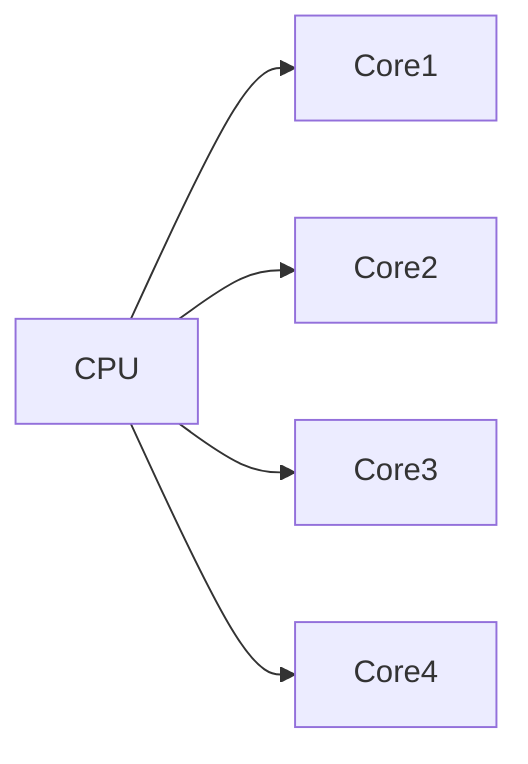
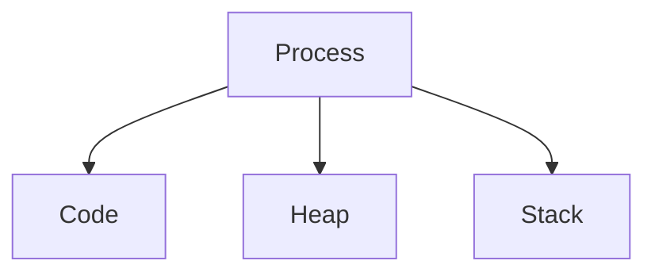
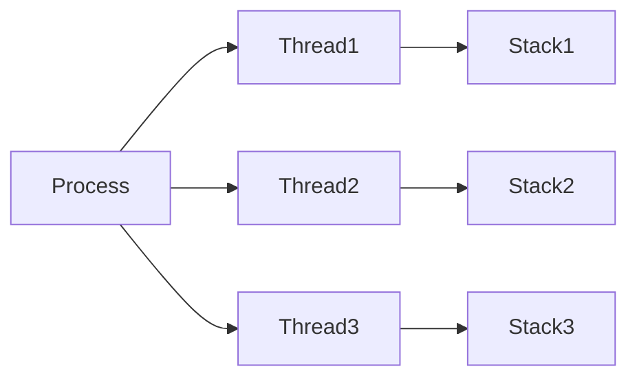
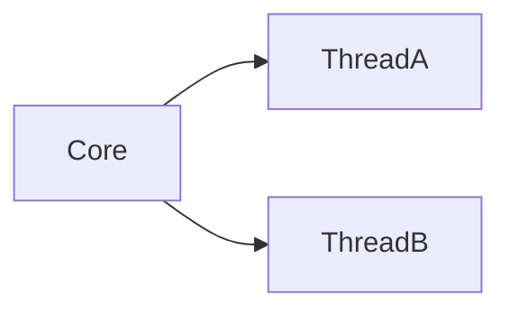
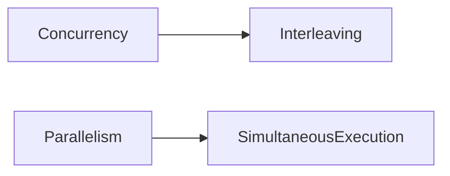
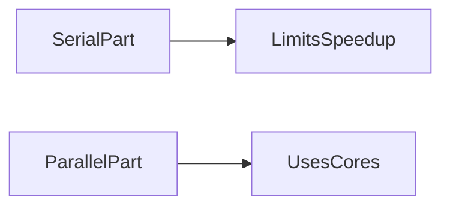

# CPU Cores and Threads

Modern processors contain multiple independent execution units called **cores**. Operating systems schedule program execution onto these cores using **threads**.

Understanding how cores, threads, and processes interact is essential for writing efficient concurrent and parallel programs, especially in Python.

Many performance issues in Python arise not from CPU speed but from how work is distributed across cores and how the Python runtime interacts with hardware.

---

## 1. CPU Cores

A **CPU core** is an independent hardware execution unit capable of running its own instruction stream.

Each core contains:

* arithmetic and logical execution units
* registers
* instruction pipelines
* private caches (L1 and often L2)

Multiple cores allow a processor to execute several programs or tasks simultaneously.

---

## Example CPU configuration

| Component      | Example      |
| -------------- | ------------ |
| CPU package    | 1            |
| Physical cores | 4            |
| Logical cores  | 8 (with SMT) |

---

### Multi-core CPU visualization



Each core can independently fetch and execute instructions.

---

## 2. Processes

A **process** is an isolated execution environment created by the operating system.

Each process has:

* its own **virtual address space**
* its own **heap and stack**
* its own **system resources**

Processes are isolated from one another for security and stability.

---

## Process structure



Because processes have separate address spaces, they cannot directly access each other’s memory.

Communication between processes typically occurs through **inter-process communication (IPC)** mechanisms such as pipes, sockets, or shared memory.

---

## 3. Threads

A **thread** is a lightweight execution unit within a process.

Threads share the process memory but maintain their own execution state.

Each thread has:

* its own stack
* its own program counter
* its own registers

However, threads share:

* the process heap
* global variables
* open files

---

### Thread structure



Because threads share memory, communication between them is faster than between processes.

However, shared memory also introduces risks such as **race conditions**.

---

## 4. Simultaneous Multithreading (SMT)

Many modern CPUs support **Simultaneous Multithreading (SMT)**.

Intel refers to this technology as **Hyperthreading**.

SMT allows one physical core to support **multiple logical threads**.

---

## How SMT works

A single core maintains multiple register states so that it can switch between threads when one stalls.

For example, if one thread is waiting for memory, another thread can use the core’s execution units.

---

### SMT visualization



SMT improves utilization of CPU resources but does not double performance.

Typical gains range from **10% to 30%**, depending on workload.

---

## 5. Concurrency vs Parallelism

Two important concepts often confused in programming are **concurrency** and **parallelism**.

---

## Concurrency

Concurrency refers to a program structure in which multiple tasks can make progress independently.

Tasks may be interleaved on a single CPU core.

Example:

```
Task A
Task B
Task A
Task B
```

---

## Parallelism

Parallelism refers to tasks executing **simultaneously** on different CPU cores.

Example:

```
Core 1 → Task A
Core 2 → Task B
```

---

### Visualization



Concurrency is necessary to exploit parallel hardware, but concurrency alone does not guarantee parallel execution.

---

## 6. The Global Interpreter Lock (GIL)

One important constraint in CPython is the **Global Interpreter Lock (GIL)**.

The GIL ensures that **only one thread executes Python bytecode at a time** within a single process.

---

## Why the GIL exists

The GIL simplifies memory management in CPython by protecting shared data structures such as reference counts.

However, it also prevents Python threads from achieving true parallelism for CPU-bound tasks.

---

## Implication

Python threads cannot parallelize CPU-bound computations.

Example:

```python
for i in range(10_000_000):
    total += i
```

Running this loop in multiple Python threads will not use multiple CPU cores.

---

## When the GIL is released

The GIL is temporarily released during:

* blocking I/O operations
* system calls
* execution of many C extensions (NumPy, SciPy, BLAS)

This allows threads to run concurrently during I/O waits.

---

## 7. Amdahl’s Law

Even with many CPU cores, the speedup of a program is limited by the portion of the code that cannot be parallelized.

This relationship is described by **Amdahl’s Law**.

[
S(n) = \frac{1}{s + \frac{1-s}{n}}
]

Where:

* (S(n)) = speedup using (n) cores
* (s) = fraction of execution time that is serial
* (n) = number of cores

---

## Example

If 10% of a program is serial:

```
s = 0.10
```

Even with infinite cores:

[
S_{max} = \frac{1}{0.10} = 10
]

Thus the maximum speedup is **10×**, regardless of hardware.

---

### Speedup visualization



Amdahl’s Law highlights the importance of minimizing serial sections of code.

---

## 8. Choosing the Right Parallelism Strategy

Different workloads benefit from different parallel programming techniques.

---

## CPU-bound workloads

Use **multiprocessing**.

Each process runs on a separate CPU core and bypasses the GIL.

---

## I/O-bound workloads

Use **threading** or **asyncio**.

Threads can overlap I/O waits even with the GIL.

---

## Numerical computation

Use **NumPy, SciPy, or BLAS libraries**.

These libraries release the GIL and often use parallel native code internally.

---

### Strategy summary

| Workload            | Recommended Tool    |
| ------------------- | ------------------- |
| CPU-bound Python    | multiprocessing     |
| I/O-bound           | threading / asyncio |
| numerical workloads | NumPy / SciPy       |

---

## 9. Example: Counting CPU Cores

```python
import os

print(os.cpu_count())
```

This returns the number of **logical cores** available to the operating system.

For example:

```
8
```

may correspond to a **4-core CPU with SMT**.

---

## 10. Example: Parallel Processing with Multiprocessing

```python
import multiprocessing

def compute(x):
    return x * x

if __name__ == "__main__":
    with multiprocessing.Pool(4) as pool:
        results = pool.map(compute, range(100))

print(results[:5])
```

Each worker process runs independently on a separate CPU core.

---

## 11. Example: Threading for I/O

```python
from concurrent.futures import ThreadPoolExecutor
import urllib.request

def fetch(url):
    with urllib.request.urlopen(url) as resp:
        return len(resp.read())

urls = ["https://example.com"] * 4

with ThreadPoolExecutor(max_workers=4) as executor:
    sizes = list(executor.map(fetch, urls))

print(sizes)
```

Here threads overlap network latency.

---


## 12. Summary

| Concept      | Explanation                                       |
| ------------ | ------------------------------------------------- |
| Core         | independent CPU execution unit                    |
| Thread       | lightweight execution context within a process    |
| Process      | isolated execution environment                    |
| SMT          | multiple logical threads per core                 |
| Concurrency  | tasks make progress independently                 |
| Parallelism  | tasks execute simultaneously                      |
| GIL          | allows only one Python thread to execute bytecode |
| Amdahl’s Law | limits achievable parallel speedup                |

Modern CPUs contain many cores capable of executing multiple threads simultaneously.

However, achieving high performance requires understanding:

* how operating systems schedule threads
* how Python interacts with hardware
* how parallel algorithms scale

By structuring programs to minimize serial work and using appropriate parallel tools, developers can effectively utilize modern multi-core processors.


## Exercises

**Exercise 1.**
The GIL prevents Python threads from achieving true parallelism for CPU-bound tasks. Consider two scenarios:

```python
# Scenario A: CPU-bound (summing numbers)
def compute():
    return sum(range(10_000_000))

# Scenario B: I/O-bound (downloading web pages)
def fetch(url):
    return urllib.request.urlopen(url).read()
```

For each scenario, will running 4 threads on a 4-core CPU be faster than running sequentially? Why or why not? What is the recommended tool for each (threading, multiprocessing, or asyncio)?

??? success "Solution to Exercise 1"
    **Scenario A (CPU-bound):** Threading provides **no speedup** due to the GIL. Only one thread runs Python bytecode at a time, so 4 CPU-bound threads on 4 cores take roughly the same time as sequential execution (possibly slower due to context-switching overhead). Use **multiprocessing** -- each process gets its own GIL and can run on a separate core.

    **Scenario B (I/O-bound):** Threading provides **~4x speedup**. When a thread blocks on I/O (network request), the GIL is released, allowing other threads to run. Four threads each waiting for a 1-second network response complete in ~1 second total. Use **threading** or **asyncio**.

    The GIL is released during I/O system calls and many C extension operations (NumPy, database drivers), which is why threading remains useful for I/O-bound Python programs.

---

**Exercise 2.**
Amdahl's Law states that if 20% of a program is serial (cannot be parallelized), the maximum speedup with infinite cores is:

$$S_{max} = \frac{1}{0.20} = 5$$

(a) If you have 8 cores, what is the actual speedup?
(b) If you reduce the serial fraction to 5%, what is the maximum speedup?
(c) Why does this law explain the diminishing returns of adding more CPU cores?

??? success "Solution to Exercise 2"
    Using Amdahl's Law: $S(n) = \frac{1}{s + \frac{1-s}{n}}$

    **(a)** With s=0.20 and n=8: $S(8) = \frac{1}{0.20 + \frac{0.80}{8}} = \frac{1}{0.20 + 0.10} = \frac{1}{0.30} \approx 3.33$. Only 3.33x speedup from 8 cores.

    **(b)** With s=0.05: $S_{max} = \frac{1}{0.05} = 20$. Reducing the serial fraction from 20% to 5% quadruples the maximum speedup.

    **(c)** Diminishing returns occur because as you add more cores, the parallel portion speeds up but the serial portion remains constant. With 20% serial code, going from 1 to 4 cores gives 2.5x speedup, 4 to 8 cores adds only 0.83x more, and 8 to 16 cores adds only 0.42x more. The serial portion increasingly dominates total runtime. This is why optimizing the serial bottleneck often matters more than adding cores.

---

**Exercise 3.**
Processes and threads have different sharing characteristics. For each resource below, state whether it is shared between threads in the same process, or isolated between separate processes:

- (a) Heap memory (global variables, objects)
- (b) Stack (local variables)
- (c) Open file descriptors
- (d) Python's GIL
- (e) CPU registers

Why does shared heap memory make threads faster to communicate with but also more dangerous?

??? success "Solution to Exercise 3"
    - **(a) Heap memory:** **Shared** between threads, **isolated** between processes. This is the key difference.
    - **(b) Stack:** **Isolated** in both cases. Each thread and each process has its own stack.
    - **(c) Open file descriptors:** **Shared** between threads (they can read/write the same files), **isolated** between processes (though file descriptors can be explicitly passed).
    - **(d) Python's GIL:** **Shared** between threads in one process (this is why it limits parallelism), **irrelevant** between processes (each process has its own GIL).
    - **(e) CPU registers:** **Isolated** -- each thread/process gets its own register state (saved and restored on context switch).

    Shared heap memory makes threads faster for communication because they can directly read and write the same data structures without copying. But this is also dangerous: two threads modifying the same list simultaneously can corrupt it (race condition). This is why threads often require locks, while processes (with isolated memory) are naturally safe but slower to communicate (must serialize/deserialize data).
