# GPU Architecture

Graphics Processing Units (GPUs) are specialized processors designed to execute **massively parallel workloads**.

They power many modern computational tasks including:

* deep learning
* scientific simulations
* computer graphics
* large-scale numerical computation

While CPUs prioritize **low latency for individual threads**, GPUs prioritize **high throughput across thousands of threads**.

Instead of executing a few complex threads quickly, GPUs execute **many lightweight threads simultaneously**.

This design is particularly effective for workloads exhibiting **data parallelism**, where the same operation must be applied to many elements.

---

## 1. CPU vs GPU Design Philosophy

CPUs and GPUs are built with fundamentally different architectural goals.

---

## CPU

CPUs optimize:

* low-latency execution
* complex control flow
* sequential performance

Typical features include:

* few powerful cores
* large caches
* complex out-of-order execution

---

## GPU

GPUs optimize:

* extremely high throughput
* massive thread-level parallelism
* predictable memory access patterns

Typical features include:

* thousands of simple cores
* small caches
* simple in-order execution
* hardware thread scheduling

---

### CPU vs GPU architecture

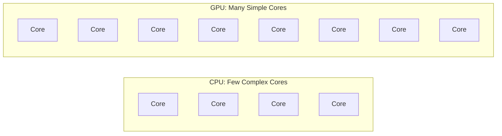

---

## Comparison

| Property        | CPU             | GPU              |
| --------------- | --------------- | ---------------- |
| Cores           | few (4–64)      | thousands        |
| Core complexity | high            | simple           |
| Execution model | out-of-order    | mostly in-order  |
| Optimization    | latency         | throughput       |
| Best workloads  | branching logic | data parallelism |

---

## 2. System Architecture

GPUs operate as **accelerators attached to a CPU system**.

The CPU orchestrates execution while the GPU performs large parallel computations.

---

### System overview


Execution flow:

1. CPU loads data into system RAM
2. Data is copied to GPU memory
3. CPU launches a **GPU kernel**
4. GPU executes parallel computation
5. Results may be copied back to CPU

Thus the conceptual model is:

```
CPU = controller
GPU = accelerator
```

---

## 3. Kernel Execution Model

GPU programs run functions called **kernels**.

A kernel executes **many parallel threads** organized in a hierarchical structure.

---

### Execution hierarchy

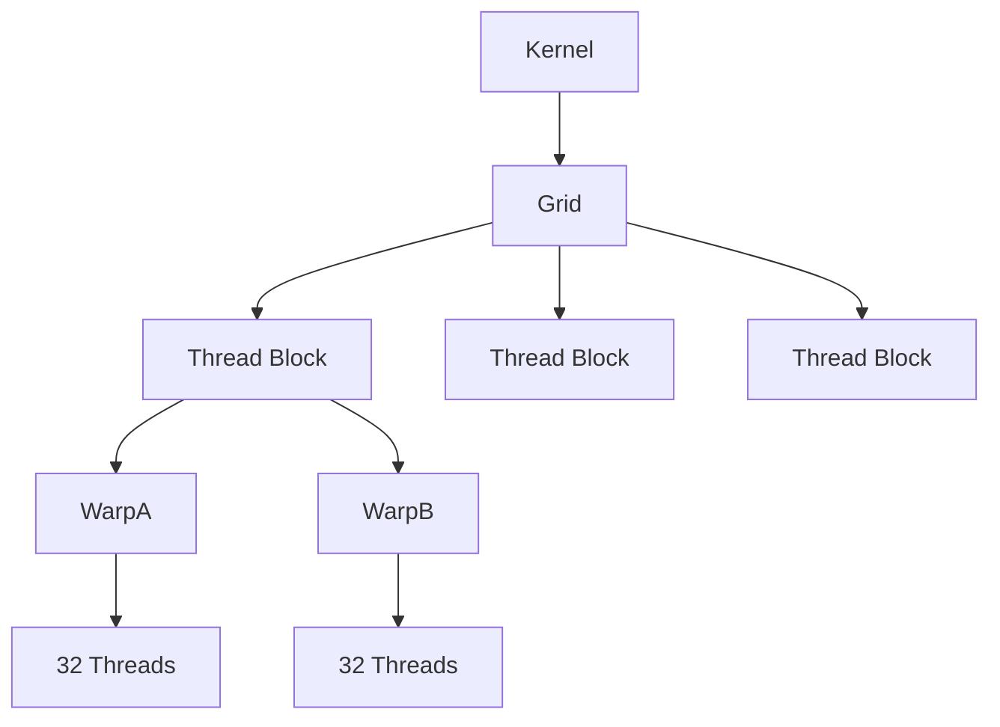

Hierarchy:

```
Kernel
 └ Grid
     └ Thread Blocks
         └ Warps
             └ Threads
```

Key rules:

* **Thread blocks execute on a single SM**
* **Threads in a block share memory**
* **Warps are the hardware scheduling unit**

---

## 4. Streaming Multiprocessors (SM)

The fundamental compute unit of a GPU is the **Streaming Multiprocessor (SM)**.

A GPU contains many SMs that operate independently.

---

### SM architecture

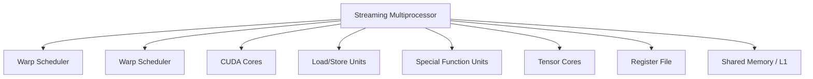

An SM manages many active threads simultaneously.

Typical hardware inside an SM:

* warp schedulers
* CUDA cores (scalar ALUs)
* tensor cores
* load/store units
* register file
* shared memory

---

## 5. Warps and SIMT Execution

GPU threads execute in groups called **warps**.

A warp contains:

```
32 threads
```

Warps execute using the **SIMT (Single Instruction Multiple Threads)** model.

All threads execute the same instruction but operate on different data.

---

### SIMT model

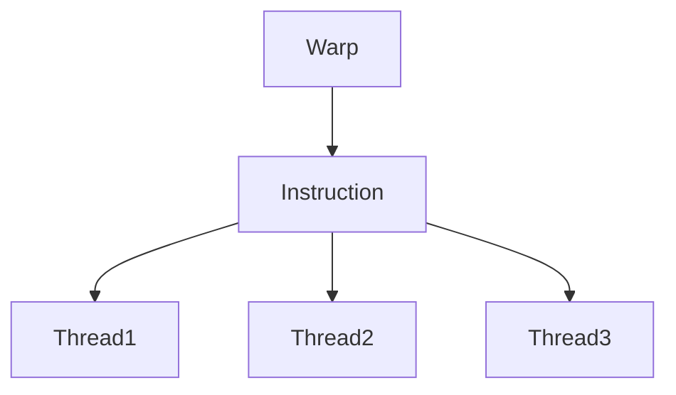

Each thread maintains its own:

* registers
* memory addresses
* control state

---

## 6. Warp Divergence

Problems occur when threads within a warp follow different branches.

Example:

```
if condition:
    path_A
else:
    path_B
```

When divergence occurs, the warp must execute both paths sequentially.

---

### Warp divergence

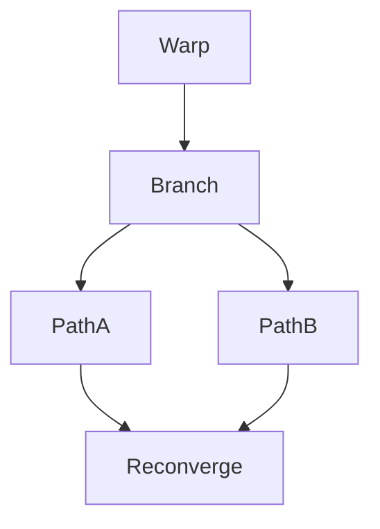

This reduces effective parallelism.

Thus GPUs perform best when threads follow **similar execution paths**.

---

## 7. Latency Hiding Through Concurrency

GPU memory accesses may take **hundreds of cycles**.

Instead of relying on large caches, GPUs hide latency by switching between warps.

---

### Warp scheduling

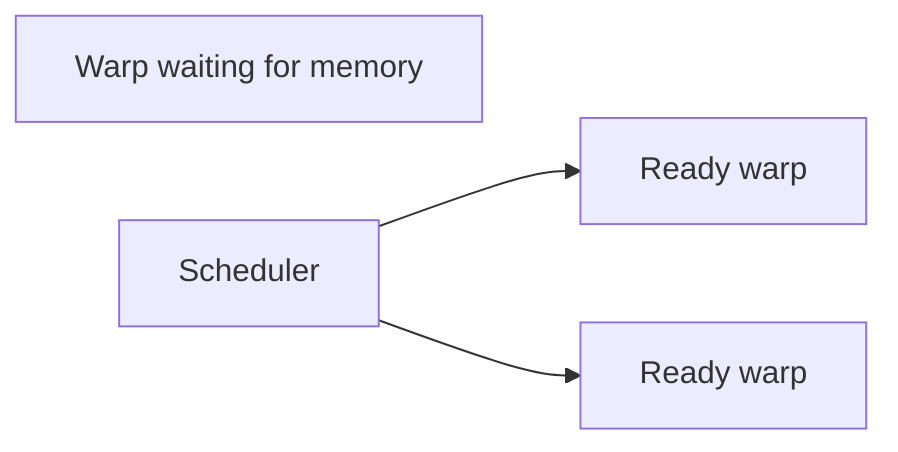

If one warp stalls on memory, another warp immediately runs.

This switching occurs with **zero context switch cost**.

---

## Occupancy

The number of active warps on an SM is called **occupancy**.

High occupancy allows the GPU to hide memory latency effectively.

Occupancy depends on:

* registers per thread
* shared memory usage
* threads per block

---

## 8. GPU Memory Hierarchy

GPUs use a memory hierarchy similar to CPUs but optimized for throughput.

---

### GPU memory hierarchy

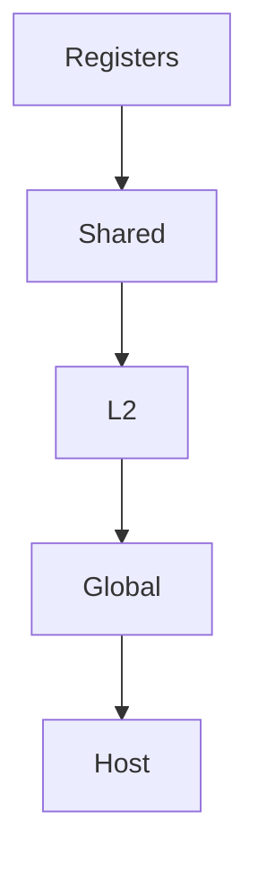

---

## Memory types

| Memory        | Scope      | Latency         |
| ------------- | ---------- | --------------- |
| Registers     | per thread | ~1 cycle        |
| Shared memory | per block  | ~20–30 cycles   |
| L2 cache      | whole GPU  | ~200 cycles     |
| Global memory | VRAM       | ~400–800 cycles |

Additional specialized memory types include:

* constant memory
* texture memory
* local memory

---

## 9. Memory Coalescing

GPU memory bandwidth is maximized when threads in a warp access **contiguous addresses**.

---

### Coalesced access

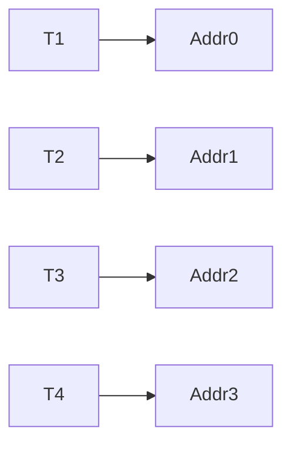

These accesses combine into a **single memory transaction**.

---

### Uncoalesced access

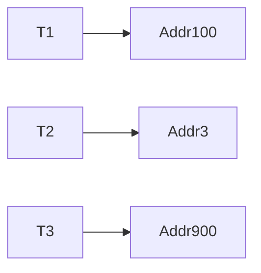

This requires multiple memory transactions and reduces performance.

---

## 10. Tensor Cores

Modern GPUs contain **tensor cores**, specialized units designed for matrix multiplication.

They perform the fused operation:

[
D = A \times B + C
]

in a single instruction.

---

### Tensor core operation

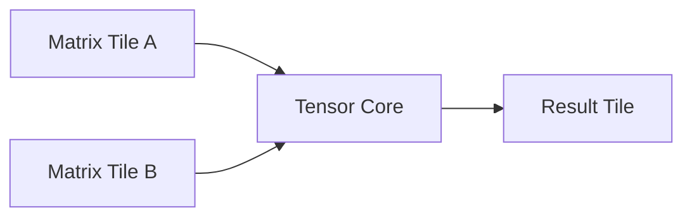

Tensor cores dramatically accelerate deep learning workloads.

---

## 11. Tiling for High Performance

GPU kernels often use **tiling** to reduce global memory access.

Instead of repeatedly reading data from global memory, blocks load tiles into shared memory.

---

### Tiling strategy

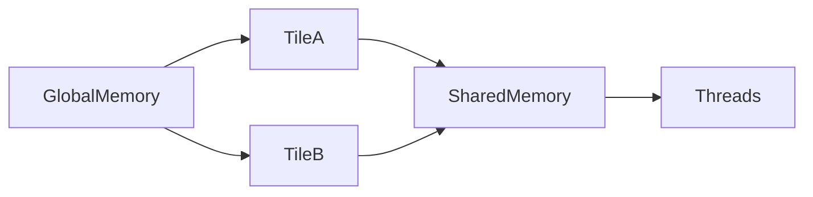

This allows many threads to reuse the same data.

---

## 12. Arithmetic Intensity and the Roofline Model

GPU performance depends on **arithmetic intensity**:

$$
\text{Arithmetic Intensity}
===========================
\frac{\text{FLOPs}}{\text{bytes transferred}}
$$

Programs with:

* low arithmetic intensity → **memory bound**
* high arithmetic intensity → **compute bound**

---

### Roofline model

```
Performance
(FLOPS)
      │
      │           ________  compute limit
      │          /
      │         /
      │        /
      │_______/
      │
      └────────────────
       arithmetic intensity
```

The goal of GPU optimization is to increase **data reuse**, pushing kernels toward the compute limit.

---

## 13. Why GPUs Excel at Deep Learning

Neural networks rely heavily on:

* matrix multiplication
* convolution
* large batch processing

These operations exhibit:

* massive data parallelism
* high arithmetic intensity

Thus GPU hardware matches deep learning workloads extremely well.

---

## 14. Example GPU Usage

### CuPy example

```python
import cupy as cp

a = cp.random.rand(10000,10000)
b = cp.random.rand(10000,10000)

c = cp.dot(a,b)
```

The computation executes entirely on the GPU.

---

### PyTorch example

```python
import torch

device = torch.device("cuda")

x = torch.randn(4096,4096,device=device)
y = torch.randn(4096,4096,device=device)

z = torch.mm(x,y)
```

---

## 15. Key GPU Optimization Principles

GPU performance depends on several factors.

---

| Factor               | Impact                             |
| -------------------- | ---------------------------------- |
| Occupancy            | more active warps hide latency     |
| Memory coalescing    | maximizes bandwidth                |
| Warp divergence      | reduces parallel efficiency        |
| Arithmetic intensity | determines compute vs memory bound |
| CPU-GPU transfers    | may dominate runtime               |

---


## 16. Summary

| Concept           | Explanation                            |
| ----------------- | -------------------------------------- |
| GPU               | massively parallel processor           |
| SM                | primary compute unit                   |
| Kernel            | function executed on GPU               |
| Warp              | 32-thread execution group              |
| SIMT              | single instruction across many threads |
| Occupancy         | number of active warps                 |
| Memory coalescing | contiguous memory access               |
| Tensor cores      | specialized matrix units               |
| Roofline model    | compute vs memory limits               |

GPUs achieve extraordinary performance by combining:

* thousands of lightweight threads
* massive parallel execution
* high memory bandwidth
* latency hiding through concurrency

These architectural principles explain why GPUs excel at **deep learning, scientific computing, and large-scale numerical workloads**.


## Exercises

**Exercise 1.**
GPUs and CPUs have fundamentally different design philosophies. A modern CPU has ~8 cores optimized for low latency, while a GPU has ~10,000 CUDA cores optimized for high throughput.

(a) Why does a CPU core have large caches and sophisticated branch prediction, while a GPU core has minimal cache and no branch prediction?
(b) For which type of workload is each design better: (i) parsing a complex JSON file, (ii) multiplying two 10,000x10,000 matrices?

??? success "Solution to Exercise 1"
    **(a)** CPU cores have large caches and branch prediction because they run **complex, branchy, serial code** (operating systems, compilers, web browsers) where a single thread needs low latency. GPUs have minimal per-core cache because they hide latency through **massive parallelism** -- instead of caching, they switch to another warp when one stalls on memory. Branch prediction is unnecessary because GPUs execute all paths and mask inactive threads.

    **(b)** (i) **CPU** -- JSON parsing is a serial, branchy task with data dependencies between tokens. A single CPU core with branch prediction and out-of-order execution handles this efficiently. (ii) **GPU** -- matrix multiplication is massively data-parallel (each output element is independent) with high arithmetic intensity, perfectly suited for thousands of GPU threads.

---

**Exercise 2.**
Warp divergence reduces GPU performance. Consider this kernel executed by a warp of 32 threads:

```
if thread_id % 2 == 0:
    path_A  (10 instructions)
else:
    path_B  (10 instructions)
```

(a) How many instruction cycles does this warp take (assuming no divergence would take 10 cycles)?
(b) What if the condition were `if thread_id < 16` instead? Would divergence still occur?
(c) Why is warp divergence a problem unique to GPU SIMT execution and not an issue for CPU threads?

??? success "Solution to Exercise 2"
    **(a)** With divergence, the warp takes **20 cycles**: first it executes path_A for the even threads (10 cycles, odd threads masked), then path_B for the odd threads (10 cycles, even threads masked). Without divergence, it would take 10 cycles. Divergence halves the effective throughput.

    **(b)** Yes, divergence still occurs -- threads 0-15 take path_A and threads 16-31 take path_B. Any split within a warp causes divergence. However, this pattern is slightly better than alternating because the two groups are contiguous, which may help the hardware reconverge faster.

    **(c)** CPU threads are fully independent -- each has its own instruction pointer and pipeline. Thread 1 can execute path_A while Thread 2 simultaneously executes path_B on different cores. In GPU SIMT, all 32 threads in a warp share a **single instruction pointer**, so they must all execute the same instruction at the same time. Divergence forces serialization of the divergent paths.

---

**Exercise 3.**
Memory coalescing is critical for GPU performance. A warp of 32 threads accesses memory:

- **Pattern A:** Thread i accesses address `base + i * 4` (sequential, stride-1)
- **Pattern B:** Thread i accesses address `base + i * 1024` (strided)
- **Pattern C:** Thread i accesses a random address

(a) Which pattern achieves the best memory bandwidth and why?
(b) Approximately how many memory transactions does each pattern require (assuming a 128-byte cache line)?
(c) How does this relate to the difference between row-major and column-major matrix storage?

??? success "Solution to Exercise 3"
    **(a)** Pattern A (sequential) achieves the best bandwidth. 32 threads accessing consecutive 4-byte addresses span 128 bytes, which fits in a single cache line. One memory transaction serves the entire warp.

    **(b)**
    - Pattern A: **1 transaction** (128 bytes covers all 32 * 4 = 128 bytes)
    - Pattern B: **32 transactions** (each thread's address is 1024 bytes apart, requiring separate cache lines)
    - Pattern C: up to **32 transactions** (worst case: every address hits a different cache line)

    Pattern A is 32x more bandwidth-efficient than Patterns B and C.

    **(c)** In a row-major matrix, accessing a row is sequential (stride-1, coalesced). Accessing a column requires stride-N jumps (uncoalesced). In column-major, it is reversed. Choosing the right storage order for your access pattern is critical for GPU performance. This is why transposing a matrix before a GPU kernel can dramatically improve performance.
