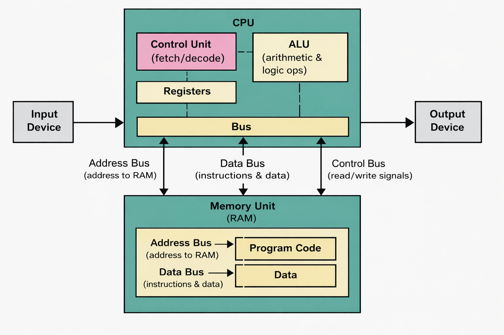

# Von Neumann Architecture

## Overview

The **Von Neumann architecture** is the foundational design for nearly all modern computers. It describes a computer that stores both program instructions and data in the same memory space — a concept known as the **stored-program model**.

> **Historical note**: The architecture is named after John von Neumann, whose 1945 "First Draft of a Report on the EDVAC" described the design. However, its development was collaborative — J. Presper Eckert and John Mauchly, who built ENIAC and EDVAC, contributed substantially and disputed the sole attribution. The name "Von Neumann architecture" has stuck, but the credit is shared.

> **Scope note**: This document describes a simplified conceptual model. Real CPUs include many additional components (branch predictors, reorder buffers, multiple execution units) not shown here.





## Key Components

### Central Processing Unit (CPU)

In the simplified model, the CPU consists of three main parts:

| Component | Function |
|-----------|----------|
| **Control Unit (CU)** | Fetches instructions from memory, decodes them, coordinates execution |
| **Arithmetic Logic Unit (ALU)** | Performs mathematical and logical operations |
| **Registers** | Small, fast storage locations inside the CPU |

### Memory (RAM)

A single memory space that stores both:

- **Instructions** (the program code)
- **Data** (variables, arrays, objects)

This "stored-program" concept was transformative — it made general-purpose computing viable and enabled software to become a commercial product separate from hardware. Earlier computers like ENIAC had programs hardwired or entered via physical switches; changing a program required days of manual rewiring.

### Bus System

The communication pathway connecting CPU and memory:

- **Address Bus**: Specifies which memory location to access
- **Data Bus**: Transfers actual data between CPU and memory
- **Control Bus**: Carries signals like "read" or "write"

### Input/Output

CPUs also communicate with peripherals (keyboard, disk, GPU, network) through I/O controllers connected to the bus system. I/O is not shown in the simplified diagram above but is an essential part of any real system.

## The Fetch-Decode-Execute Cycle

The CPU operates in a continuous loop:

```
┌─────────┐     ┌─────────┐     ┌───────────┐     ┌───────────┐
│  FETCH  │ ──▶ │ DECODE  │ ──▶ │  EXECUTE  │ ──▶ │ WRITEBACK │
└─────────┘     └─────────┘     └───────────┘     └─────────┬─┘
     ▲                                                        │
     └────────────────────────────────────────────────────────┘
```

1. **Fetch**: Read the next instruction from memory (address stored in Program Counter)
2. **Decode**: Control Unit interprets what the instruction means
3. **Execute**: ALU or other components perform the operation
4. **Writeback**: Results are written back to registers or memory
5. **Repeat**: Program Counter increments, cycle continues

Conceptually, instructions execute one at a time in sequence. In practice, modern CPUs use **pipelining**, **superscalar execution**, and **out-of-order execution** to process multiple instructions simultaneously — but the programmer-visible model remains sequential.

## The Von Neumann Bottleneck

The defining limitation of the architecture: instructions and data share the same memory and the same communication pathway.

```
CPU  ◀════════ Single Bus ════════▶  Memory
        (instructions AND data)
```

This creates a bottleneck because the CPU must wait for memory transfers, and instruction fetches compete with data loads for the same bus. As CPU speeds have grown far faster than memory speeds (the "memory wall"), this bottleneck has become the central constraint in modern computing.

### Harvard Architecture: The Contrast

The **Harvard architecture** separates instruction memory from data memory, eliminating the competition between the two. Most microcontrollers use a pure Harvard design. Modern desktop CPUs use a **modified Harvard architecture**: physically they follow Von Neumann (unified RAM), but the L1 cache is split into separate instruction and data caches, recovering much of Harvard's benefit.

### Memory Hierarchy

Modern systems mitigate the bottleneck through a hierarchy of progressively larger, slower storage:

```
Registers       ~1 cycle
L1 cache        ~4 cycles
L2 cache        ~12 cycles
L3 cache        ~40 cycles
RAM             ~100+ cycles
Disk/SSD        ~100,000+ cycles
```

Each level acts as a buffer, keeping frequently used data close to the CPU. Other techniques include **prefetching** (predicting what data will be needed next) and **speculative execution** (executing instructions before knowing if they're needed).

## Python Connection

Understanding Von Neumann architecture explains several Python behaviors.

### Why Python Objects Have Overhead

Every Python object lives in memory with metadata:

```python
import sys

x = 42
print(sys.getsizeof(x))  # 28 bytes, not 4!
```

The 28 bytes include a reference count, type pointer, and the integer value — all stored in the same memory space. Note that `sys.getsizeof()` reports the object's own size; objects that reference other objects (like lists) consume additional memory not counted here.

### Why Memory Access Patterns Matter

NumPy arrays are faster than Python lists for several compounding reasons:

```python
import numpy as np

# Contiguous memory - CPU cache can work efficiently
arr = np.zeros(1_000_000)  # One block in memory

# Scattered objects - unpredictable access patterns
lst = [0.0] * 1_000_000    # Million separate objects
```

NumPy's speed comes from: contiguous memory layout (cache-friendly), vectorized C loops (no Python interpreter overhead per element), and SIMD instructions that process multiple values in a single CPU operation. Memory locality is one contributing factor, but not the whole story.

## Historical Context

| Era | Approach |
|-----|----------|
| **Before (e.g. ENIAC, 1945)** | Programs hardwired via physical switches and cables; changing a program took days |
| **EDSAC (1949)** | One of the first machines to run a stored program in practice |
| **Modern CPUs** | Still fundamentally Von Neumann, with Harvard-style caches mitigating the bottleneck |

## Summary

| Concept | Description |
|---------|-------------|
| **Stored Program** | Instructions and data share the same memory |
| **Sequential Model** | Programmer-visible execution is sequential; hardware optimizations happen underneath |
| **Single Bus** | CPU and memory communicate through a shared pathway |
| **Bottleneck** | Shared instruction/data path limits throughput; mitigated by caches and Harvard-style L1 split |
| **Memory Hierarchy** | Registers → L1/L2/L3 cache → RAM → Disk bridges the speed gap |

The Von Neumann architecture remains the dominant model for CPUs today. Understanding it — and its bottleneck — explains why cache-friendly programming patterns (like vectorization and contiguous array access) matter, and why the gap between CPU speed and memory speed is a fundamental constraint in computing.
