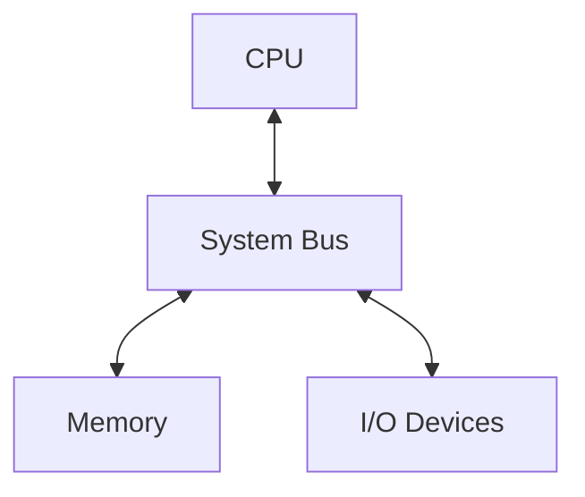
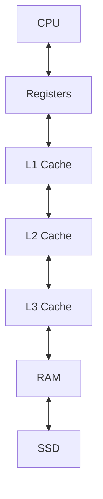
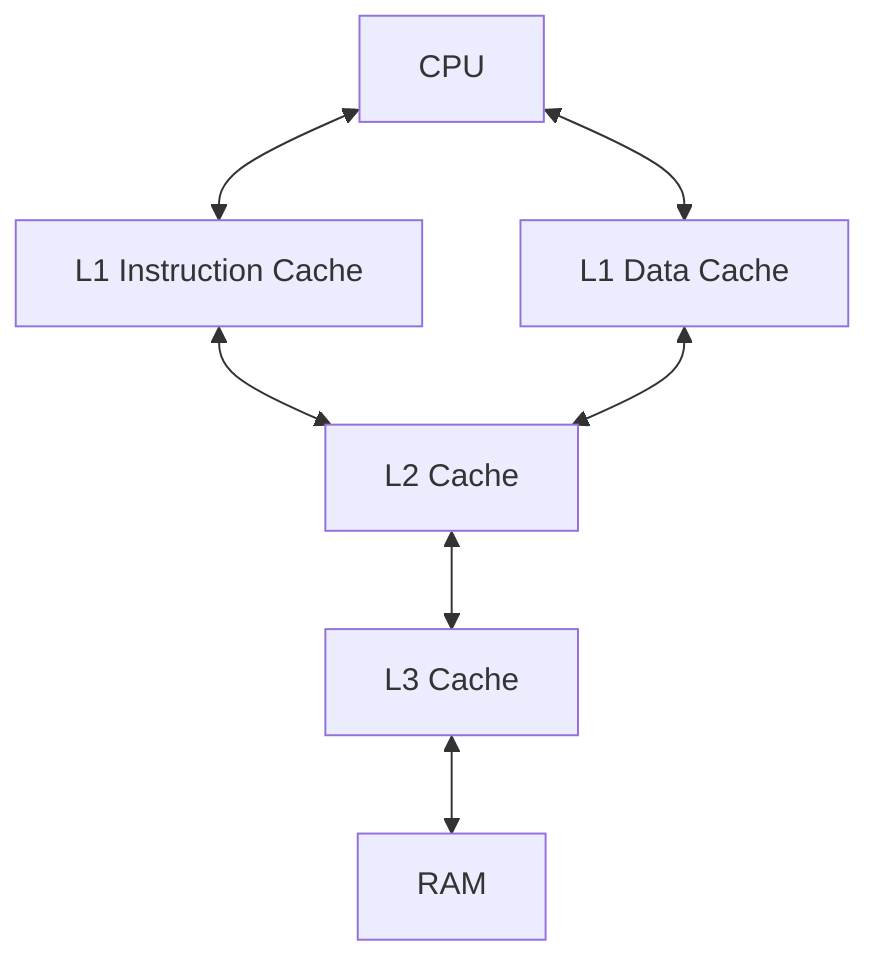

# The von Neumann Architecture

The **von Neumann architecture** describes a model of a stored-program computer in which **program instructions and data share the same memory system**.

In this design, programs are stored in memory as binary instructions. The processor repeatedly fetches these instructions, interprets them, and executes them.

Although modern processors contain far more sophisticated microarchitectures—including pipelines, caches, vector units, and out-of-order execution—the von Neumann model remains the **conceptual foundation of general-purpose computing**.

A computer following this architecture consists of four main components:

* **Central Processing Unit (CPU)**
* **Main memory**
* **Input/Output devices**
* **Communication system (bus)**



The defining feature of this architecture is the **stored-program model**: both program instructions and data reside in the same memory and are represented as binary values defined by the processor's **instruction set architecture (ISA)**.

---

## 1. The Stored-Program Concept

Before stored-program computers existed, early machines were programmed by physically rewiring circuits or configuring plugboards.

The stored-program concept introduced a major innovation:

* Programs are stored **as data in memory**
* The CPU **reads instructions from memory**
* Programs can be **modified dynamically**

This allows software to be loaded, changed, and executed without altering hardware.

---

## 2. The Central Processing Unit

The **CPU** executes instructions and performs computations.

A simplified conceptual model of the CPU includes three components.

| Component                   | Function                                   |
| --------------------------- | ------------------------------------------ |
| Control Unit (CU)           | Fetches and decodes instructions           |
| Arithmetic Logic Unit (ALU) | Performs arithmetic and logical operations |
| Registers                   | Small, fast storage inside the CPU         |

Although real CPUs include many more components, this model captures the essential structure.

---

## Registers

Registers are the **fastest storage locations accessible to the CPU**.

They hold:

* temporary values
* instruction operands
* addresses
* intermediate results

Two particularly important registers are:

| Register                  | Purpose                              |
| ------------------------- | ------------------------------------ |
| Program Counter (PC)      | Address of the next instruction      |
| Instruction Register (IR) | Instruction currently being executed |

Normally, the **Program Counter** increments sequentially, but jumps and branches modify its value.

---

### CPU operation visualization


Operations occur primarily on data stored in registers.

---

## 3. Memory

Main memory stores both:

* **program instructions**
* **program data**

Each location in memory has a unique numeric **address**.

Example layout:

```
Address      Content
0x1000       instruction
0x1004       instruction
0x1008       instruction
```

When executing a program, the CPU repeatedly reads instructions from memory.

---

## 4. The System Bus

The **system bus** connects the CPU, memory, and I/O devices.

Although modern systems use more advanced interconnects, the bus model remains a useful abstraction.

The bus consists of three groups of signals.

---

## Address Bus

Specifies **which memory location** is accessed.

```
CPU ───── Address Bus ─────▶ Memory
```

This bus is typically **unidirectional**.

---

## Data Bus

Transfers actual **data values** between components.

```
CPU ◀──── Data Bus ────▶ Memory
```

This bus is **bidirectional**.

---

## Control Bus

Coordinates system operations.

Control signals include:

* read
* write
* interrupt
* clock

---

## 5. The Instruction Cycle

Processors execute programs through a repeating loop called the **instruction cycle**.

```
Fetch → Decode → Execute → Writeback
```

---

## 1. Fetch

The CPU reads the instruction located at the address stored in the **Program Counter**.

The address is placed on the address bus and the instruction is returned through the data bus.

---

## 2. Decode

The **Control Unit** interprets the instruction and determines which operation must be performed.

---

## 3. Execute

The CPU performs the operation.

Examples include:

* arithmetic operations
* logical operations
* memory loads or stores
* branch instructions

---

## 4. Writeback

The result of the operation is stored in:

* registers
* memory

---

## 5. Repeat

The **Program Counter** advances to the next instruction.

---

### Instruction cycle visualization


This loop continues until the program terminates.

---

## 6. Instruction Pipelining

Modern processors rarely execute instructions strictly one at a time.

Instead they use **pipelining**, which overlaps the execution of multiple instructions.

Example pipeline stages:

```
Fetch → Decode → Execute → Writeback
```

Pipeline behavior:

```
Cycle   Stage1  Stage2  Stage3  Stage4
1       I1
2       I2      I1
3       I3      I2      I1
4       I4      I3      I2      I1
```

Once the pipeline fills, the processor can complete roughly **one instruction per cycle**.

---

## Pipeline hazards

Pipelining introduces several types of hazards.

| Hazard            | Description                            |
| ----------------- | -------------------------------------- |
| Data hazard       | instruction depends on previous result |
| Control hazard    | branch changes instruction flow        |
| Structural hazard | hardware resources conflict            |

Modern processors mitigate these issues using:

* **branch prediction**
* **out-of-order execution**
* **speculative execution**

---

## 7. Memory Hierarchy

Memory systems are organized as a hierarchy of storage layers.

Smaller, faster memories are located close to the CPU, while larger memories are farther away.



Typical latency:

| Layer    | Approximate Latency |
| -------- | ------------------- |
| Register | ~1 cycle            |
| L1 cache | ~4 cycles           |
| L2 cache | ~12 cycles          |
| L3 cache | ~40–70 cycles       |
| RAM      | ~100–300 cycles     |

Because main memory is slow relative to the CPU, programs must exploit **memory locality**.

---

## 8. Memory Locality

Programs typically access memory in predictable patterns.

Two forms of locality occur frequently.

| Locality Type     | Meaning                              |
| ----------------- | ------------------------------------ |
| Temporal locality | recently used data is reused         |
| Spatial locality  | nearby memory locations are accessed |

Caches exploit these patterns by storing recently used data close to the CPU.

---

## 9. The von Neumann Bottleneck

A key limitation of this architecture is the **von Neumann bottleneck**.

Both instructions and data must travel between the CPU and memory over the **same communication path**.

```
CPU  ◀══════════════════▶  Memory
```

This creates two major performance constraints:

* limited **memory bandwidth**
* high **memory latency**

As processors became faster, the gap between CPU speed and memory speed grew, producing what is sometimes called the **memory wall**.

Modern systems reduce this bottleneck using:

* cache hierarchies
* prefetching
* pipelining

---

## 10. Harvard Architecture

The **Harvard architecture** separates instruction memory and data memory.

```
Instruction Memory → CPU ← Data Memory
```

This allows instruction fetches and data accesses to occur simultaneously.

---

## Architecture comparison

| Architecture     | Memory Model                   | Advantage                |
| ---------------- | ------------------------------ | ------------------------ |
| von Neumann      | shared instruction/data memory | simple programming model |
| Harvard          | separate memories              | higher throughput        |
| Modified Harvard | unified memory + split caches  | practical compromise     |

Most modern processors implement a **modified Harvard architecture**.

They maintain a unified memory model but use **separate instruction and data caches**.

---

### Modified Harvard cache structure



---

## 11. Implications for Python Performance

Understanding the von Neumann architecture helps explain many Python performance characteristics.

---

## Python lists and pointer chasing

Python lists store **pointers to objects**, not raw values.

```
Python list

[ptr] → PyObject
[ptr] → PyObject
[ptr] → PyObject
```

The referenced objects are scattered throughout memory.

Each access requires following a pointer to another memory location.

This pattern—called **pointer chasing**—reduces cache efficiency.

---

## NumPy arrays

NumPy arrays store values in **contiguous memory**.

```
[value][value][value][value]
```

Advantages:

* better spatial locality
* efficient CPU cache usage
* SIMD vectorization
* reduced object overhead

---

### Example

```python
import numpy as np

arr = np.zeros(1_000_000)
lst = [0.0] * 1_000_000
```

NumPy arrays generally outperform Python lists for numerical computation.

---

## 12. Arithmetic Intensity and the Roofline Model

Performance is often limited not by computation but by **memory bandwidth**.

---

## Arithmetic intensity

Arithmetic intensity measures how much computation is performed per byte of memory accessed.

$$
\text{Arithmetic intensity}
===========================
\frac{\text{operations}}{\text{bytes transferred}}
$$

Programs with low arithmetic intensity are **memory-bound**.

Programs with high arithmetic intensity are **compute-bound**.

---

### Examples

| Operation             | Likely limit       |
| --------------------- | ------------------ |
| Vector addition       | memory bandwidth   |
| Matrix multiplication | compute capability |

---

## Roofline model

The **Roofline model** visualizes performance limits.

```
Performance
     │
     │           ______  Compute limit
     │          /
     │         /
     │        /
     │_______/
     │
     └────────────────
        Arithmetic Intensity
```

Two regions appear:

* memory-bound region
* compute-bound region

Improving performance often requires increasing arithmetic intensity.

---

## 13. Historical Context

The architecture is named after **John von Neumann**, who described the stored-program model in the 1945 document *First Draft of a Report on the EDVAC*.

Other key contributors included:

* J. Presper Eckert
* John Mauchly
* Alan Turing
* Konrad Zuse

Early stored-program computers such as **EDSAC (1949)** implemented these ideas.

Modern computers still follow the same basic model.

---


## 14. Summary

| Concept                | Description                          |
| ---------------------- | ------------------------------------ |
| Stored Program         | instructions and data share memory   |
| CPU Components         | control unit, ALU, registers         |
| Bus System             | connects CPU, memory, and I/O        |
| Instruction Cycle      | fetch → decode → execute → writeback |
| Pipelining             | overlapping instruction execution    |
| Memory Hierarchy       | registers → cache → RAM → storage    |
| Virtual Memory         | programs use virtual addresses       |
| von Neumann Bottleneck | shared memory channel limits speed   |
| Modified Harvard       | separate instruction and data caches |
| Arithmetic Intensity   | operations per byte of memory        |
| Roofline Model         | compute vs memory performance limits |

The **von Neumann architecture** remains the conceptual framework underlying modern computing. Understanding it provides the foundation for reasoning about **program execution, memory behavior, and performance optimization**.


## Exercises

**Exercise 1.**
The von Neumann bottleneck arises because instructions and data share the same memory bus. Consider a CPU running at 3 GHz (3 billion cycles per second) with RAM that has 100 ns latency.

(a) How many CPU cycles elapse during a single RAM access?
(b) If a program performs one memory access per instruction, what fraction of time does the CPU spend waiting for memory?
(c) How do caches mitigate this bottleneck?

??? success "Solution to Exercise 1"
    **(a)** At 3 GHz, one cycle = 1/3 ns. RAM latency of 100 ns = 100 / (1/3) = **300 cycles**. The CPU sits idle for 300 cycles waiting for data.

    **(b)** If every instruction requires a memory access, the CPU spends 300/(1+300) = ~99.7% of the time waiting. It executes useful work for only ~0.3% of the time. This is the von Neumann bottleneck in its extreme form.

    **(c)** Caches store recently used data close to the CPU. An L1 cache hit takes ~4 cycles instead of 300. If 95% of accesses hit L1, the average access time is 0.95 * 4 + 0.05 * 300 = 3.8 + 15 = 18.8 cycles -- a 16x improvement over always going to RAM. The cache hierarchy transforms the bottleneck from "always slow" to "usually fast."

---

**Exercise 2.**
The Modified Harvard architecture uses separate L1 instruction and data caches but unified main memory. Consider the instruction cycle (Fetch-Decode-Execute-Writeback).

(a) Which step accesses the instruction cache?
(b) Which step accesses the data cache?
(c) Why does separating these caches improve pipeline throughput?
(d) Why is it important that main memory remains unified (unlike pure Harvard)?

??? success "Solution to Exercise 2"
    **(a)** The **Fetch** step reads the next instruction from the instruction cache (L1-I).

    **(b)** The **Execute** step (for load/store instructions) or **Writeback** step accesses the data cache (L1-D).

    **(c)** With unified L1 cache, Fetch and Execute of different pipeline stages would compete for the same cache port, causing structural hazards (pipeline stalls). Separate caches allow the pipeline to fetch the next instruction while simultaneously loading/storing data for another instruction -- both happen in the same cycle without conflict.

    **(d)** Unified main memory is essential for the **stored-program model**: programs can generate, modify, and execute code (JIT compilation, dynamic loading, self-modifying code). With pure Harvard, instructions and data would be in physically separate memories, making it impossible for a program to load new code into instruction memory. Unified memory with split caches provides the best of both worlds.

---

**Exercise 3.**
Memory locality determines cache effectiveness. For each code pattern, identify whether it exhibits good or poor spatial/temporal locality, and predict the cache behavior:

```python
# Pattern A: Sequential array access
for i in range(N):
    total += array[i]

# Pattern B: Random access
for i in range(N):
    total += array[random_index[i]]

# Pattern C: Repeated access to same element
for i in range(N):
    total += array[0]
```

Which pattern benefits most from caching? Which defeats the cache?

??? success "Solution to Exercise 3"
    **Pattern A** (sequential): **Excellent** spatial and temporal locality. Accessing `array[i]` then `array[i+1]` means consecutive memory addresses. The first access loads a cache line (64 bytes = ~8 doubles), and the next 7 accesses are cache hits. Cache hit rate: ~97%+.

    **Pattern B** (random): **Poor** spatial locality, no temporal locality. Each access jumps to an unpredictable location, likely missing the cache every time. If the array is larger than the cache, the hit rate approaches 0%.

    **Pattern C** (repeated): **Excellent** temporal locality. The same address is accessed N times. After the first miss, every subsequent access is a cache hit. Hit rate: (N-1)/N, approaching 100%.

    Pattern A benefits most from caching because both hardware prefetchers and spatial locality work together. Pattern B defeats the cache completely because each access is unpredictable. This explains why sorting data before processing it can improve performance -- sorted access patterns have better locality.
