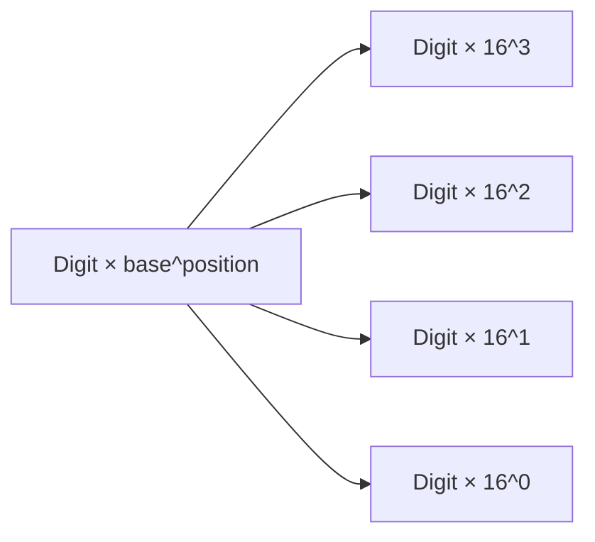
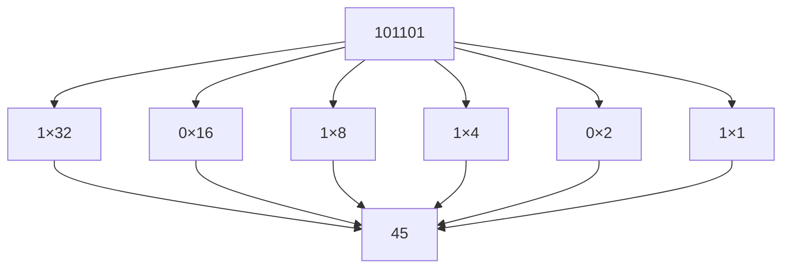
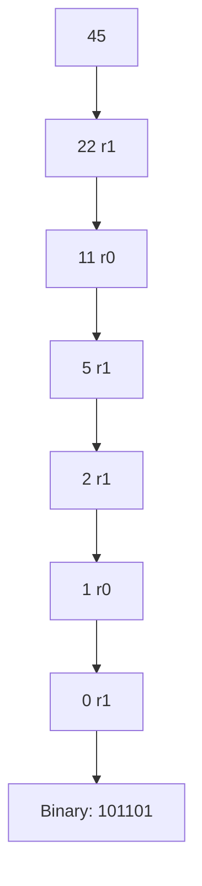
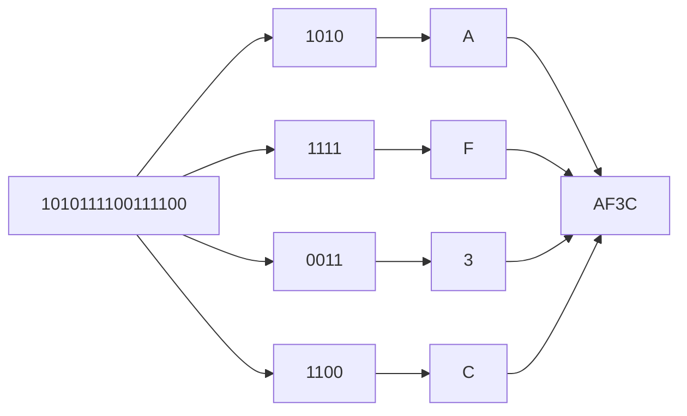
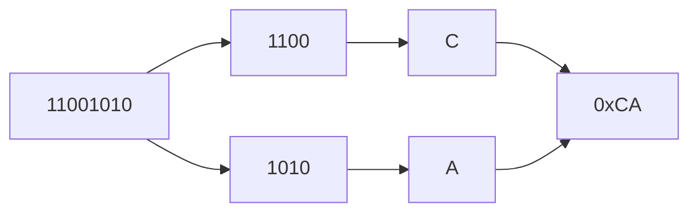
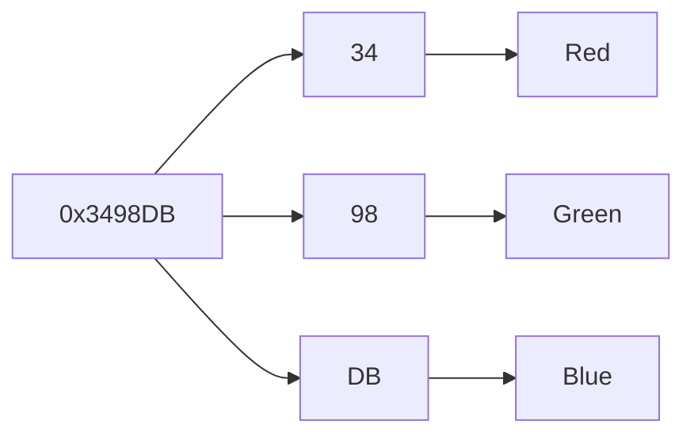

# Binary and Hexadecimal

Computers store and manipulate data using **binary numbers**—numbers written in base 2. While binary is ideal for hardware, it is often inconvenient for humans to read or write long sequences of bits.

To make binary data easier to work with, programmers frequently use **hexadecimal** (base 16) and sometimes **octal** (base 8). These number systems provide compact representations of the same underlying bit patterns.

Understanding how to convert between these bases is an essential skill when working with:

* debugging tools and memory dumps
* binary file formats
* network protocols
* cryptographic data
* low-level systems programming

---

# 1. Number Systems and Bases

A **number system** (or **base**) defines how numbers are represented using digits and positional value.

Each digit position represents a power of the base.

For a base (b):

[
\text{value} = \sum d_i b^i
]

where (d_i) are the digits.

---

## Common bases used in computing

| Base | Name        | Digits   |
| ---- | ----------- | -------- |
| 2    | Binary      | 0–1      |
| 8    | Octal       | 0–7      |
| 10   | Decimal     | 0–9      |
| 16   | Hexadecimal | 0–9, A–F |

Hexadecimal extends decimal with six additional symbols:

| Hex | Value |
| --- | ----- |
| A   | 10    |
| B   | 11    |
| C   | 12    |
| D   | 13    |
| E   | 14    |
| F   | 15    |

---

## Visualization of positional value



Each position represents a power of the base.

---

# 2. Binary Numbers

Binary uses only two digits:

```text
0 and 1
```

Each position represents a power of two.

| Position | Value |
| -------- | ----- |
| (2^0)    | 1     |
| (2^1)    | 2     |
| (2^2)    | 4     |
| (2^3)    | 8     |
| (2^4)    | 16    |
| (2^5)    | 32    |
| (2^6)    | 64    |
| (2^7)    | 128   |

---

## Example: binary to decimal

Convert:

```text
101101
```

[
1\cdot2^5 + 0\cdot2^4 + 1\cdot2^3 + 1\cdot2^2 + 0\cdot2^1 + 1\cdot2^0
]

[
= 32 + 8 + 4 + 1 = 45
]

---

### Visualization



---

# 3. Decimal to Binary Conversion

To convert a decimal number to binary, repeatedly **divide by 2** and record the remainders.

---

## Example: convert 45 to binary

| Division | Quotient | Remainder |
| -------- | -------- | --------- |
| 45 ÷ 2   | 22       | 1         |
| 22 ÷ 2   | 11       | 0         |
| 11 ÷ 2   | 5        | 1         |
| 5 ÷ 2    | 2        | 1         |
| 2 ÷ 2    | 1        | 0         |
| 1 ÷ 2    | 0        | 1         |

Reading remainders **bottom to top**:

```text
101101
```

---

### Visualization



---

# 4. Hexadecimal

Binary numbers become long quickly. For example:

```text
1010111100111100
```

To make these easier to read, programmers use **hexadecimal**.

Hexadecimal uses **base 16**, with digits:

```text
0 1 2 3 4 5 6 7 8 9 A B C D E F
```

---

## Why hexadecimal is useful

Hexadecimal aligns perfectly with binary.

```text
1 hex digit = 4 bits
```

So a **byte (8 bits)** equals:

```text
2 hex digits
```

---

### Binary to hex grouping

Binary:

```text
1010 1111 0011 1100
```

Group into 4 bits:

```text
1010 1111 0011 1100
```

Convert each group:

| Binary | Hex |
| ------ | --- |
| 1010   | A   |
| 1111   | F   |
| 0011   | 3   |
| 1100   | C   |

Result:

```text
AF3C
```

---

### Visualization



---

# 5. Hexadecimal to Decimal

To convert hex to decimal, multiply each digit by the corresponding power of 16.

Example:

```text
0xAF
```

[
A\times16^1 + F\times16^0
]

[
10\times16 + 15 = 175
]

---

## Larger example

```text
0x3C7
```

[
3\times16^2 + 12\times16^1 + 7\times16^0
]

[
= 768 + 192 + 7 = 967
]

---

# 6. Octal

Octal (base 8) uses digits:

```text
0–7
```

Octal was historically useful because:

```text
1 octal digit = 3 bits
```

Example:

```text
101 110 111
```

Convert groups:

| Binary | Octal |
| ------ | ----- |
| 101    | 5     |
| 110    | 6     |
| 111    | 7     |

Result:

```text
567
```

Today, octal is mainly used in **Unix permissions**.

Example:

```text
755
```

means:

```text
rwxr-xr-x
```

---

# 7. Binary, Hex, and Bytes

Because hexadecimal aligns perfectly with binary, it is widely used when inspecting raw data.

Example byte:

```text
11001010
```

Group bits:

```text
1100 1010
```

Convert:

```text
CA
```

So:

```text
11001010 = 0xCA
```

---

### Visualization



---

# 8. Python and Number Bases

Python provides convenient syntax for working with different bases.

---

## Literals

Python uses prefixes to specify number bases.

| Prefix | Base        |
| ------ | ----------- |
| `0b`   | binary      |
| `0x`   | hexadecimal |
| `0o`   | octal       |

Example:

```python
print(0b101101)   # 45
print(0xFF)       # 255
print(0o755)      # 493
```

---

## Converting integers to strings

```python
print(bin(45))   # '0b101101'
print(hex(255))  # '0xff'
print(oct(493))  # '0o755'
```

---

## Parsing numbers from strings

```python
print(int('101101', 2))  # 45
print(int('FF', 16))     # 255
```

---

# 9. Practical Uses of Hexadecimal

Hexadecimal appears frequently in programming because it represents binary data compactly.

Common uses include:

* memory addresses
* binary file formats
* color values
* machine instructions
* cryptographic hashes

---

## Example: RGB colors

Many graphics systems represent colors using hexadecimal.

Example:

```text
#3498DB
```

Structure:

```text
RR GG BB
```

Each pair represents a byte.

---

### Extracting color components

```python
color = 0x3498DB

r = (color >> 16) & 0xFF
g = (color >> 8) & 0xFF
b = color & 0xFF

print(r, g, b)
```

Result:

```text
52 152 219
```

---

### Visualization



---

# 10. Fixed-Width Formatting

Programs often display numbers using a fixed number of digits.

Example:

```python
format(45, '08b')
```

Output:

```text
00101101
```

This shows the number as **8-bit binary**.

---

### Hex formatting

```python
format(255, '02x')
```

Output:

```text
ff
```

---

# 11. Bytes and Hex Strings

Binary data is frequently represented as hexadecimal strings.

Example:

```python
data = bytes([0xDE, 0xAD, 0xBE, 0xEF])
```

This produces:

```text
deadbeef
```

which is a well-known hexadecimal example used in debugging.

Example:

```python
print(data.hex())
print(bytes.fromhex('deadbeef'))
```

---

# 12. Worked Examples

### Example 1

Convert `11011010` to hex.

Group bits:

```text
1101 1010
```

Convert:

```text
D A
```

Result:

```text
0xDA
```

---

### Example 2

Convert `0x7B` to decimal.

[
7\times16 + 11 = 123
]

---

### Example 3

Convert 73 to binary.

Break into powers of two:

[
64 + 8 + 1
]

Binary:

```text
01001001
```

---

# 13. Exercises

1. Convert `10101101` to decimal.
2. Convert 91 to binary.
3. Convert `11100110` to hexadecimal.
4. Convert `0x2F` to decimal.
5. Convert `0xA3` to binary.
6. Convert `755` (octal) to decimal.
7. Why does hexadecimal align so well with binary?
8. What hex value corresponds to `11111111`?

---

# 14. Short Answers

1. 173
2. `01011011`
3. `E6`
4. 47
5. `10100011`
6. 493
7. Because one hex digit equals four bits
8. `FF`

---

# 15. Summary

* Binary (base 2) is the fundamental number system used by computers.
* Hexadecimal (base 16) provides a compact representation of binary data.
* Octal (base 8) groups bits in sets of three and appears in Unix permissions.
* One hex digit represents exactly **four bits**.
* One byte corresponds to **two hex digits**.
* Programmers frequently convert between bases when debugging, inspecting memory, or working with binary protocols.

Understanding binary and hexadecimal allows programmers to reason about **bit patterns, memory layout, and low-level data formats** with precision.


