# Bits and Bytes

All information in a computer—numbers, text, images, sound, and programs—is ultimately represented as patterns of **bits**. To understand how computers store and process information, we begin with the most basic building blocks: **bits** and **bytes**.

This section explains what bits and bytes are, how binary numbers work, how negative integers are represented, how bitwise operations manipulate data, and how multi-byte values are laid out in memory.

---

## 1. Bits: the smallest unit of digital information

A **bit** (*binary digit*) is the smallest unit of information in a digital system. A bit has only two possible values:

```text
0 or 1
```

Those two values correspond to two reliably distinguishable physical states in hardware, such as low vs. high voltage, off vs. on, or absence vs. presence of magnetization.

The key idea is simple:

> computers work with physical systems that can reliably distinguish between two states, so information is encoded in binary.

### Visual intuition

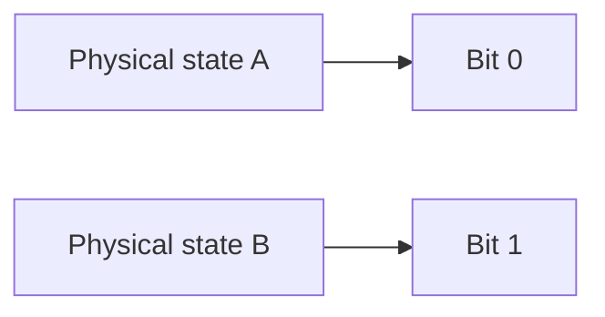

A single bit carries very little information, but many bits together can represent rich and complex data.

---

## 2. Bytes: groups of 8 bits

A **byte** is a group of **8 bits**.

```text
1 byte = 8 bits
```

Since each bit can be either 0 or 1, a byte can represent:

[
2^8 = 256
]

distinct patterns.

So an unsigned byte can store values from:

```text
0 to 255
```

### Why 8 bits?

The 8-bit byte became standard largely through the influence of **IBM System/360 (1964)**. Earlier machines used other sizes such as 6-bit or 9-bit units, but 8 bits proved especially practical because it:

* fits naturally with powers of two
* works well for memory addressing
* provides enough patterns for small integers and character encodings
* aligns neatly with hexadecimal notation

Most modern general-purpose computers are **byte-addressable**, meaning each memory address refers to one byte.

### Byte as a container

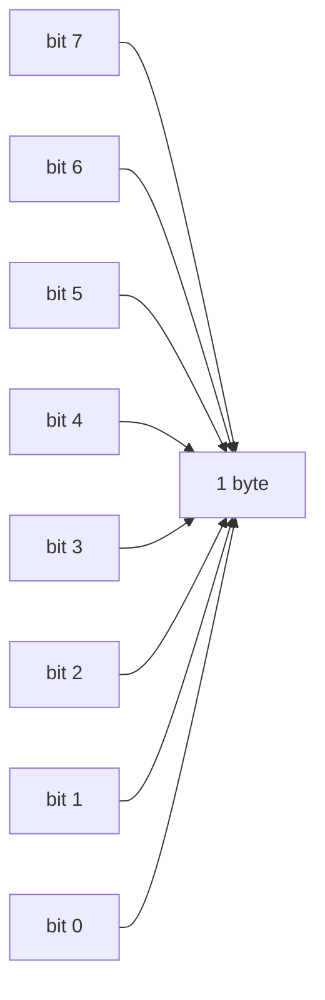

---

## 3. Binary numbers

A byte is not just a sequence of symbols. Each bit position has a **place value**.

For an 8-bit number:

| Bit position |   7 |  6 |  5 |  4 |  3 |  2 |  1 |  0 |
| ------------ | --: | -: | -: | -: | -: | -: | -: | -: |
| Value        | 128 | 64 | 32 | 16 |  8 |  4 |  2 |  1 |

The rightmost bit is the **least significant bit (LSB)**.
The leftmost bit is the **most significant bit (MSB)**.

### Example: interpreting a byte

Consider:

```text
10110110
```

This means:

[
1\cdot128 + 0\cdot64 + 1\cdot32 + 1\cdot16 + 0\cdot8 + 1\cdot4 + 1\cdot2 + 0\cdot1
]

[
= 128 + 32 + 16 + 4 + 2 = 182
]

### Visualization

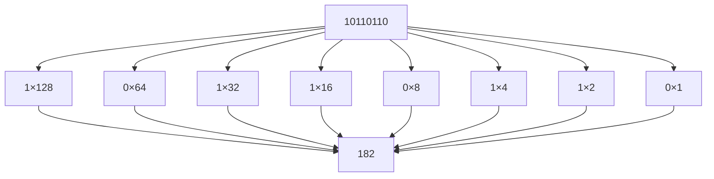

### Another example

```text
00101101
```

[
0\cdot128 + 0\cdot64 + 1\cdot32 + 0\cdot16 + 1\cdot8 + 1\cdot4 + 0\cdot2 + 1\cdot1
]

[
= 32 + 8 + 4 + 1 = 45
]

---

## 4. From binary to hexadecimal

Binary is fundamental, but long binary strings are hard to read. **Hexadecimal** provides a compact way to write bit patterns.

Each hexadecimal digit corresponds to **4 bits**:

| Binary | Hex |
| ------ | --- |
| 0000   | 0   |
| 0001   | 1   |
| 0010   | 2   |
| 0011   | 3   |
| 0100   | 4   |
| 0101   | 5   |
| 0110   | 6   |
| 0111   | 7   |
| 1000   | 8   |
| 1001   | 9   |
| 1010   | A   |
| 1011   | B   |
| 1100   | C   |
| 1101   | D   |
| 1110   | E   |
| 1111   | F   |

Since a byte has 8 bits, one byte equals **two hexadecimal digits**.

Example:

```text
10110110 = B6
```

because:

```text
1011 = B
0110 = 6
```

### Visualization

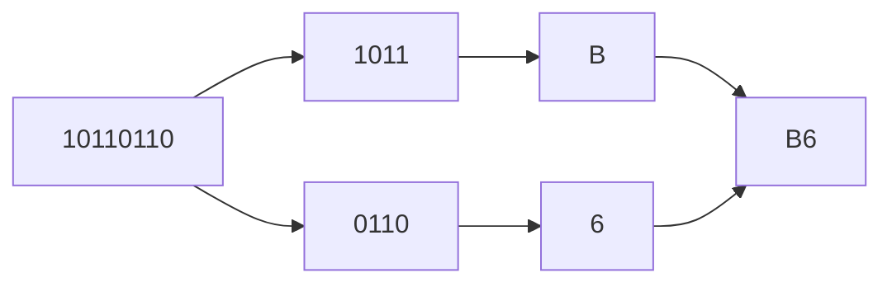

Hexadecimal is widely used in systems programming, debugging, memory inspection, and networking because it is much shorter than binary while still closely matching bit structure.

---

## 5. Unsigned and signed integers

So far, we have treated a byte as an **unsigned** quantity, meaning all 256 patterns represent nonnegative values:

[
0 \text{ to } 255
]

But computers must also represent **negative integers**.

### 5.1 Unsigned integers

With (n) bits, an unsigned integer can represent:

[
0 \text{ to } 2^n - 1
]

For 8 bits:

[
0 \text{ to } 255
]

---

## 5.2 Signed integers and two’s complement

Most modern systems represent signed integers using **two’s complement**.

For an 8-bit signed integer, the range is:

[
-128 \text{ to } 127
]

### Why two’s complement?

It has a major engineering advantage:

> addition and subtraction can be implemented using the same underlying binary hardware.

### Examples

| Binary   | Value |
| -------- | ----: |
| 00000000 |     0 |
| 00000001 |     1 |
| 00000010 |     2 |
| 01111111 |   127 |
| 10000000 |  -128 |
| 11111111 |    -1 |
| 11111110 |    -2 |

### Intuition

In two’s complement:

* positive numbers look mostly familiar
* negative numbers occupy the upper half of the bit-pattern space
* the MSB contributes a negative weight

For 8 bits, the place values are effectively:

| Bit position |    7 |  6 |  5 |  4 |  3 |  2 |  1 |  0 |
| ------------ | ---: | -: | -: | -: | -: | -: | -: | -: |
| Value        | -128 | 64 | 32 | 16 |  8 |  4 |  2 |  1 |

So:

```text
11111111
```

means:

[
-128 + 64 + 32 + 16 + 8 + 4 + 2 + 1 = -1
]

### How to form the negative of a number

A common rule for fixed-width two’s complement is:

1. write the positive number in binary
2. flip all bits
3. add 1

Example: represent (-5) in 8 bits.

```text
  5  = 00000101
flip = 11111010
+ 1  = 11111011
```

So:

```text
-5 = 11111011
```

### Visualization

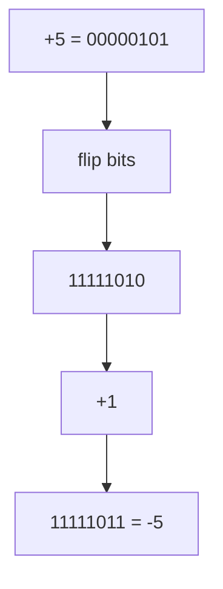

---

## 6. Binary arithmetic

Binary arithmetic follows the same structural rules as decimal arithmetic, but each digit is either 0 or 1.

---

### 6.1 Binary addition

The basic addition rules are:

```text
0 + 0 = 0
0 + 1 = 1
1 + 0 = 1
1 + 1 = 10   (write 0, carry 1)
```

#### Example: (5 + 3)

```text
  0101
+ 0011
------
  1000
```

This equals:

[
5 + 3 = 8
]

### Visualization of carries

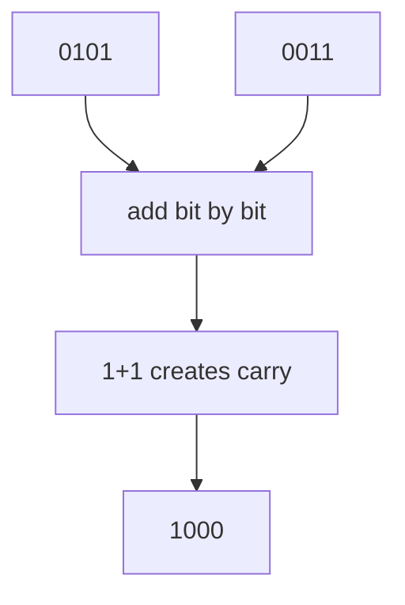

---

### 6.2 Another addition example

```text
  0110   (6)
+ 0101   (5)
------
  1011   (11)
```

Column by column:

* (0 + 1 = 1)
* (1 + 0 = 1)
* (1 + 1 = 10): write 0, carry 1
* (0 + 0 + 1 = 1)

---

### 6.3 Binary subtraction

Binary subtraction also uses borrowing, but in real hardware subtraction is often implemented as:

[
a - b = a + (-b)
]

That is, subtraction can be performed by adding the two’s complement of the subtrahend.

#### Example: (7 - 3)

```text
  0111   (7)
- 0011   (3)
------
  0100   (4)
```

#### Using two’s complement

```text
3      = 00000011
flip   = 11111100
+1     = 11111101   (-3)

7      = 00000111
-3     = 11111101
----------------
sum    = 00000100   (ignore carry out)
```

### Visualization

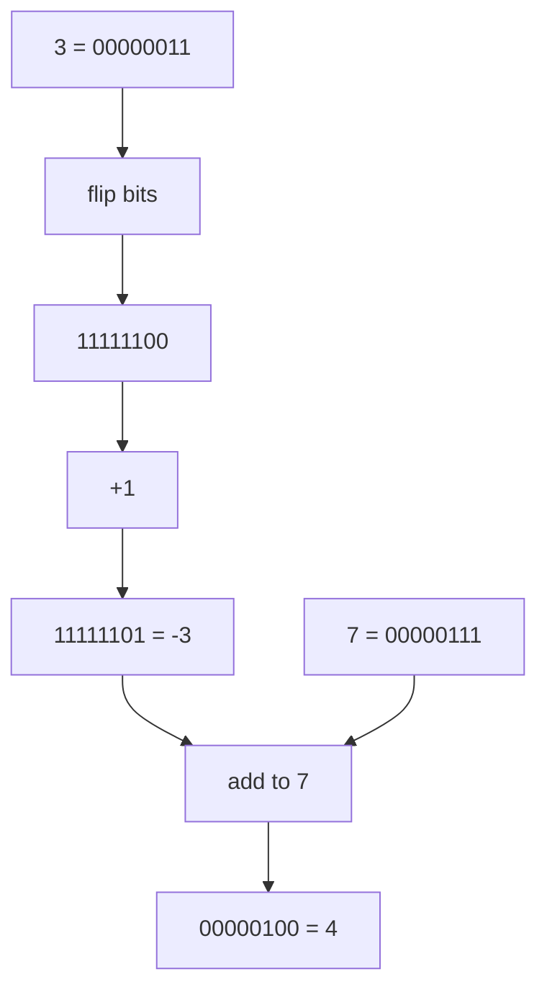

---

## 7. Overflow in fixed-width arithmetic

Real machine integers have a fixed width: 8 bits, 16 bits, 32 bits, 64 bits, and so on. This means there is a maximum and minimum representable value.

When a computation exceeds that range, **overflow** occurs.

### Unsigned overflow example

With 8-bit unsigned integers:

```text
255 = 11111111
```

Now add 1:

```text
  11111111
+ 00000001
----------
1 00000000
```

If only 8 bits are kept, the leading carry is discarded:

```text
00000000
```

So the result wraps around from 255 to 0.

### Signed overflow example

For 8-bit signed integers:

```text
  01111111   (127)
+ 00000001   (1)
----------
  10000000   (-128 in two's complement)
```

The bit pattern is valid, but the mathematical result (128) is outside the representable range. This is signed overflow.

### Visualization

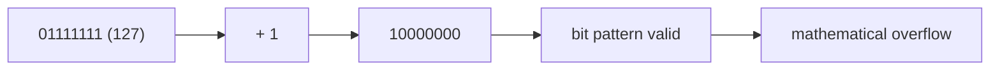

---

## 8. Bitwise operations

A computer often needs to manipulate individual bits directly. This is the purpose of **bitwise operations**.

| Operation   | Symbol | Meaning                                 |                                          |
| ----------- | ------ | --------------------------------------- | ---------------------------------------- |
| AND         | `&`    | result bit is 1 only if both bits are 1 |                                          |
| OR          | `      | `                                       | result bit is 1 if at least one bit is 1 |
| XOR         | `^`    | result bit is 1 if the bits differ      |                                          |
| NOT         | `~`    | inverts each bit                        |                                          |
| left shift  | `<<`   | moves bits left                         |                                          |
| right shift | `>>`   | moves bits right                        |                                          |

---

### 8.1 AND

```text
  1100
& 1010
------
  1000
```

Only positions where both inputs are 1 remain 1.

---

### 8.2 OR

```text
  1100
| 1010
------
  1110
```

If either input has a 1, the result has a 1.

---

### 8.3 XOR

```text
  1100
^ 1010
------
  0110
```

A result bit is 1 when the two input bits are different.

XOR is useful for toggling bits, parity checks, and low-level algorithms.

---

### 8.4 NOT

For a fixed-width value, NOT flips every bit.

```text
~00001111 = 11110000
```

In Python, integers are not fixed-width, so `~x` behaves as:

[
\sim x = -(x+1)
]

because Python models integers as if they had infinite two’s-complement sign extension.

---

### 8.5 Shifts

A left shift moves all bits left:

```text
00000001 << 3 = 00001000
```

For unsigned integers, left shift by (n) positions corresponds to multiplication by (2^n), assuming no overflow.

A right shift moves bits right:

```text
00001000 >> 2 = 00000010
```

For nonnegative integers, right shift by (n) positions corresponds to integer division by (2^n).

### Shift visualization

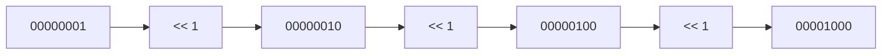

---

## 9. Bitmasks and flags

A powerful use of bits is to store many boolean conditions inside one integer. This is called using **bit flags** or a **bitmask**.

Suppose we define:

```python
READ    = 0b100
WRITE   = 0b010
EXECUTE = 0b001
```

Then:

```python
perms = READ | WRITE   # 0b110
```

means the value stores both read and write permission.

### Common operations

Check whether a flag is present:

```python
bool(perms & READ)
```

Add a flag:

```python
perms |= EXECUTE
```

Remove a flag:

```python
perms &= ~WRITE
```

### Visualization

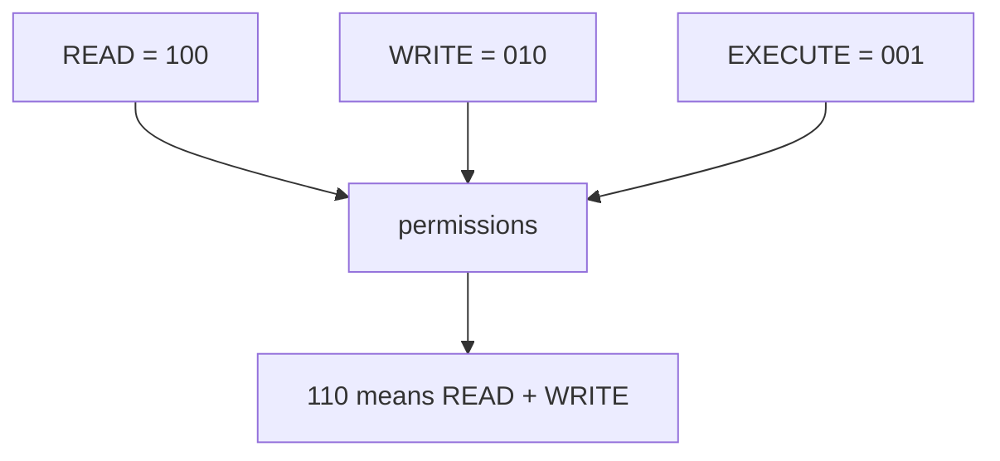

Bitmasks are common in operating systems, graphics APIs, networking code, file permissions, and embedded systems.

---

## 10. Endianness: byte order in memory

When a value uses more than one byte, the computer must decide how to arrange those bytes in memory.

This is called **endianness**.

Consider the 32-bit hexadecimal value:

```text
0x12345678
```

This occupies four bytes:

```text
12 34 56 78
```

But there are two possible memory orders.

### Big-endian

The **most significant byte** comes first.

```text
12 34 56 78
```

### Little-endian

The **least significant byte** comes first.

```text
78 56 34 12
```

### Memory-layout diagram

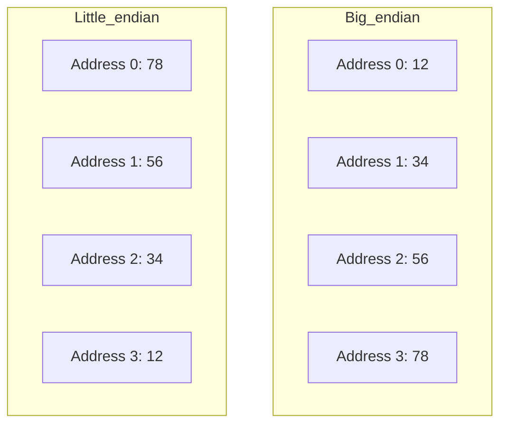

Most modern desktop and mobile CPUs are little-endian. Network protocols traditionally use big-endian, which is why big-endian is often called **network byte order**.

### Why endianness matters

Endianness becomes important when:

* reading raw binary files
* sending data over networks
* working with memory dumps
* interfacing between different machines or languages
* using serialization formats

---

## 11. Bytes, words, and memory units

A **byte** is 8 bits, but computers also operate on larger chunks of data.

A **word** is the natural unit of data a CPU processes efficiently. On a 32-bit system, a word is often 32 bits. On a 64-bit system, it is often 64 bits.

Common sizes:

| Unit     | Size                       |
| -------- | -------------------------- |
| nibble   | 4 bits                     |
| byte     | 8 bits                     |
| word     | architecture-dependent     |
| kilobyte | roughly one thousand bytes |
| megabyte | roughly one million bytes  |
| gigabyte | roughly one billion bytes  |

### Decimal vs binary prefixes

There are two standards for storage units.

#### SI prefixes (decimal)

Used by drive manufacturers:

* 1 KB = 1000 bytes
* 1 MB = 1000 KB
* 1 GB = 1000 MB

#### IEC prefixes (binary)

Used in many operating-system contexts:

* 1 KiB = 1024 bytes
* 1 MiB = 1024 KiB
* 1 GiB = 1024 MiB

This is why a “1 TB” drive may appear as about **931 GiB** when viewed by the operating system.

---

## 12. Python examples

These examples reinforce the concepts above.

### Bitwise operations

```python
a = 0b1100  # 12
b = 0b1010  # 10

print(a & b)       # 8
print(bin(a & b))  # 0b1000

print(a | b)       # 14
print(bin(a | b))  # 0b1110

print(a ^ b)       # 6
print(bin(a ^ b))  # 0b0110
```

### Shifting

```python
print(1 << 3)        # 8
print(bin(1 << 3))   # 0b1000

print(8 >> 2)        # 2
print(bin(8 >> 2))   # 0b10
```

### Endianness

```python
import sys

print(sys.byteorder)  # often 'little'

x = 0x12345678
print(x.to_bytes(4, "big"))     # b'\x12\x34\x56\x78'
print(x.to_bytes(4, "little"))  # b'\x78\x56\x34\x12'
```

### Bit flags

```python
READ    = 0b100
WRITE   = 0b010
EXECUTE = 0b001

perms = READ | WRITE
print(bin(perms))               # 0b110

print(bool(perms & READ))       # True
print(bool(perms & EXECUTE))    # False

perms |= EXECUTE
print(bin(perms))               # 0b111

perms &= ~WRITE
print(bin(perms))               # 0b101
```

---

## 13. Worked examples

### Worked Example 1: convert binary to decimal

Convert `11010101` to decimal.

[
1\cdot128 + 1\cdot64 + 0\cdot32 + 1\cdot16 + 0\cdot8 + 1\cdot4 + 0\cdot2 + 1\cdot1
]

[
= 128 + 64 + 16 + 4 + 1 = 213
]

---

### Worked Example 2: convert decimal to binary

Convert (45) to binary.

Break 45 into powers of two:

[
45 = 32 + 8 + 4 + 1
]

So the bits for (32, 8, 4,) and (1) are 1:

```text
00101101
```

---

### Worked Example 3: interpret a signed 8-bit value

Interpret `11111011` as a signed 8-bit integer.

Use two’s complement weights:

[
-128 + 64 + 32 + 16 + 8 + 0 + 2 + 1 = -5
]

So:

```text
11111011 = -5
```

---

## 14. Common pitfalls

### Confusing bits and bytes

A byte is not one bit. A byte contains **8 bits**.

### Assuming all large storage units are powers of 1024

Manufacturers typically use powers of 1000, while operating systems often display powers of 1024.

### Forgetting fixed width

Bitwise reasoning often depends on how many bits are being used. `11111111` can mean 255 as an unsigned value or -1 as an 8-bit signed value.

### Ignoring endianness

A multi-byte value has no single memory layout without specifying byte order.

### Overgeneralizing shifts

Left shift behaves like multiplication by (2^n) only when overflow is not an issue.

---

## 15. Exercises

### Concept checks

1. How many distinct values can be represented with 12 bits?
2. What decimal value does `00110110` represent?
3. Write 91 in 8-bit binary.
4. Convert `11110000` to hexadecimal.
5. What is the 8-bit two’s complement representation of `-3`?
6. Compute:

   * `0b1101 & 0b1011`
   * `0b1101 | 0b1011`
   * `0b1101 ^ 0b1011`
7. What value results from `1 << 5`?
8. On an 8-bit unsigned system, what happens when `255 + 1` is computed?
9. Why can `0x12345678` have two different byte layouts in memory?
10. Why does Python’s `~x` not simply “flip a fixed number of bits”?

---

### Practice problems

1. Convert `10101100` to decimal.
2. Convert 156 to 8-bit binary.
3. Convert `11001010` to hexadecimal.
4. Interpret `10000001` as:

   * an unsigned 8-bit integer
   * a signed 8-bit integer
5. Use two’s complement to represent `-18` in 8 bits.
6. Show the binary addition of 13 and 6.
7. Show the binary subtraction of 9 and 4 using two’s complement.
8. A permission system uses:

   * READ = `0b1000`
   * WRITE = `0b0100`
   * EXECUTE = `0b0010`
   * DELETE = `0b0001`

   If a file has permissions `0b1101`:

   * which permissions are enabled?
   * how would you remove WRITE?
   * how would you test EXECUTE?

---

## 16. Short answers

### Concept checks

1. (2^{12} = 4096)
2. 54
3. `01011011`
4. `F0`
5. `11111101`
6. * `1001`
   * `1111`
   * `0110`
7. 32
8. It wraps to 0 if only 8 bits are kept.
9. Because endianness determines byte order.
10. Because Python integers are not fixed-width.

---

## 17. Looking ahead

Bits and bytes are only the beginning of data representation. Once these ideas are clear, the next natural questions are:

* How are larger integers represented?
* How are floating-point numbers stored?
* How are characters encoded as bytes?
* How are images and sound reduced to binary data?
* How do programs and machine instructions become bit patterns?

Those topics build directly on the ideas introduced here: place value, fixed-width representation, bit manipulation, and memory layout.

---

## 18. Summary

* A **bit** is the smallest unit of digital information and has value 0 or 1.
* A **byte** is 8 bits and can represent 256 distinct patterns.
* Binary numbers use powers of two for place value.
* Hexadecimal provides a compact notation for binary data.
* Signed integers are usually represented with **two’s complement**.
* Binary arithmetic follows the same structural rules as decimal arithmetic, but with base 2.
* **Overflow** occurs when a value exceeds the range of a fixed-width representation.
* **Bitwise operations** manipulate individual bits efficiently.
* **Bitmasks** store multiple boolean flags inside a single integer.
* **Endianness** determines byte order in multi-byte memory representations.

A solid understanding of bits and bytes is the foundation for understanding data types, memory, machine arithmetic, and low-level programming.


