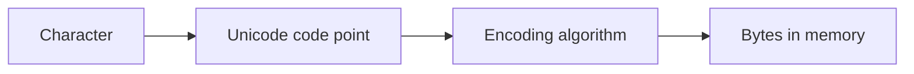
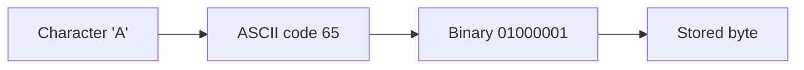
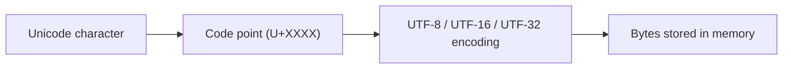
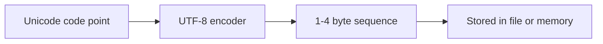
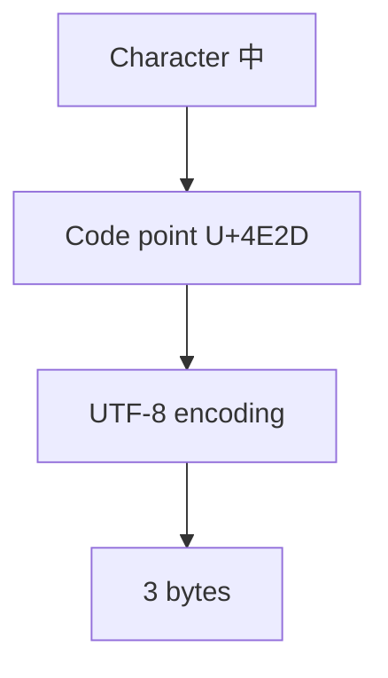
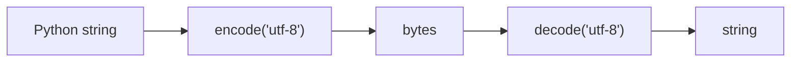

# Character Encoding

Computers ultimately store information as **binary data**—patterns of bits and bytes. Human languages, however, consist of **characters** such as letters, digits, punctuation, and symbols.

A **character encoding** defines how these characters are represented as sequences of bytes so that computers can store, transmit, and display text.

When character encodings are interpreted incorrectly, the result is **garbled text**, sometimes called *mojibake*.

Understanding character encoding is essential when working with:

* text files
* web data
* databases
* international languages
* network protocols

---

## 1. Characters, Code Points, and Encodings

Text representation involves three distinct concepts.

| Concept    | Meaning                                    |
| ---------- | ------------------------------------------ |
| Character  | An abstract symbol (e.g., A, 中, ☕)         |
| Code point | Numeric identifier assigned to a character |
| Encoding   | Mapping from code points to bytes          |

---

### Example

Character:

```text
A
```

Unicode code point:

```text
U+0041
```

Encoding (UTF-8):

```text
0x41
```

---

#### Conceptual pipeline



---

## 2. ASCII: The First Standard

The earliest widely adopted character encoding was **ASCII** (American Standard Code for Information Interchange), standardized in 1963.

ASCII defined **128 characters** using **7 bits**.

---

### ASCII table overview

| Range  | Meaning              |
| ------ | -------------------- |
| 0–31   | control characters   |
| 32–126 | printable characters |
| 127    | delete               |

Example characters:

| Character | Code | Binary   |
| --------- | ---- | -------- |
| A         | 65   | 01000001 |
| a         | 97   | 01100001 |
| 0         | 48   | 00110000 |

---

#### ASCII visualization



---

### Limitations of ASCII

ASCII works well for English but cannot represent:

* accented Latin characters (é, ñ)
* non-Latin scripts (中文, العربية)
* symbols and emoji

To support additional characters, various **8-bit extensions** were created.

Examples:

* ISO-8859-1 (Latin-1)
* Windows-1252
* MacRoman

Unfortunately, these encodings were **incompatible**, meaning the same byte value could represent different characters in different systems.

---

## 3. Unicode: A Universal Character Set

To solve encoding incompatibility, the **Unicode standard** was created.

Unicode assigns every character in every writing system a **unique code point**.

Example code points:

| Character | Code point |
| --------- | ---------- |
| A         | U+0041     |
| é         | U+00E9     |
| 中         | U+4E2D     |
| ☕         | U+2615     |

Unicode supports over **1.1 million possible code points**, though only a fraction are currently assigned.

---

### Unicode architecture

Unicode defines **characters and code points**, but not how they are stored in memory.

Encodings such as **UTF-8**, **UTF-16**, and **UTF-32** specify the actual byte representation.

---

#### Visualization



---

## 4. UTF-8 Encoding

The most widely used encoding today is **UTF-8**.

UTF-8 is a **variable-length encoding** that uses **1 to 4 bytes per character**.

Advantages:

* ASCII compatibility
* efficient for English text
* compact representation
* self-synchronizing
* no byte-order problems

---

### UTF-8 byte structure

| Bytes | Bits    | Range                  |
| ----- | ------- | ---------------------- |
| 1     | 7 bits  | ASCII                  |
| 2     | 11 bits | Latin extensions       |
| 3     | 16 bits | CJK characters         |
| 4     | 21 bits | emoji and rare symbols |

---

#### Bit pattern rules

UTF-8 uses specific leading bit patterns.

| Bytes | Pattern                               |
| ----- | ------------------------------------- |
| 1     | `0xxxxxxx`                            |
| 2     | `110xxxxx 10xxxxxx`                   |
| 3     | `1110xxxx 10xxxxxx 10xxxxxx`          |
| 4     | `11110xxx 10xxxxxx 10xxxxxx 10xxxxxx` |

These patterns allow a decoder to identify **character boundaries automatically**.

---

#### Visualization



---

## 5. Example: Encoding Characters in UTF-8

#### ASCII character

Character:

```text
A
```

Code point:

```text
U+0041
```

UTF-8 bytes:

```text
01000001
```

One byte.

---

#### Chinese character

Character:

```text
中
```

Code point:

```text
U+4E2D
```

UTF-8 representation:

```text
11100100 10111000 10101101
```

Three bytes.

---

#### Visualization



---

## 6. UTF-16 and UTF-32

Unicode also defines other encodings.

---

### UTF-16

Uses **2 or 4 bytes per character**.

Advantages:

* fixed 2-byte units for most characters
* efficient for some languages

Disadvantages:

* surrogate pairs complicate processing
* byte-order issues (big-endian vs little-endian)

---

### UTF-32

Uses **4 bytes per character**.

Advantages:

* constant width
* easy indexing

Disadvantages:

* high memory usage

---

#### Comparison

| Encoding | Bytes per char | Notes                           |
| -------- | -------------- | ------------------------------- |
| UTF-8    | 1–4            | most common                     |
| UTF-16   | 2–4            | used internally in some systems |
| UTF-32   | 4              | simple but large                |

---

## 7. Python Strings and Unicode

In Python 3, **strings are sequences of Unicode code points**.

Example:

```python
text = "Hello"
```

Internally, Python stores characters as Unicode.

The length of a string counts **code points**, not bytes.

---

### Example

```python
text = "Hello, 世界!"
print(len(text))
```

Output:

```text
10
```

But when encoded as UTF-8:

```python
encoded = text.encode("utf-8")
print(len(encoded))
```

Output:

```text
14
```

because the Chinese characters require **3 bytes each**.

---

## 8. Encoding and Decoding

Converting between text and bytes requires explicit encoding and decoding.

---

### Encoding

```python
text = "Hello, 世界!"
encoded = text.encode("utf-8")
print(encoded)
```

Example result:

```text
b'Hello, \xe4\xb8\x96\xe7\x95\x8c!'
```

---

### Decoding

```python
decoded = encoded.decode("utf-8")
print(decoded)
```

Output:

```text
Hello, 世界!
```

---

#### Visualization



---

## 9. File Encodings

Files store text as **bytes**, not characters.

Therefore programs must specify the encoding used when reading or writing text files.

---

### Writing a file

```python
with open("data.txt", "w", encoding="utf-8") as f:
    f.write("café ☕")
```

---

### Reading a file

```python
with open("data.txt", "r", encoding="utf-8") as f:
    print(f.read())
```

Specifying the encoding prevents platform-dependent errors.

---

## 10. Handling Encoding Errors

Sometimes byte sequences do not correspond to valid characters.

Example:

```python
invalid = b'\xff\xfe'
invalid.decode("utf-8")
```

Result:

```text
UnicodeDecodeError
```

Python allows error handling strategies.

---

### Replace invalid characters

```python
invalid.decode("utf-8", errors="replace")
```

Output:

```text
��
```

---

### Ignore errors

```python
invalid.decode("utf-8", errors="ignore")
```

Invalid bytes are skipped.

---

## 11. Common Encoding Problems

#### Mojibake

Occurs when text is decoded with the wrong encoding.

Example:

```text
café
```

interpreted incorrectly might appear as:

```text
café
```

---

#### Mixing encodings

Files created in one encoding (e.g., Windows-1252) may break when interpreted as UTF-8.

---

#### Forgetting to specify encoding

Always specify the encoding in file operations.

---

## 12. Worked Examples

#### Example 1

Find the Unicode code point of a character.

```python
print(ord("中"))
```

Output:

```text
20013
```

Hex form:

```python
print(hex(ord("中")))
```

```text
0x4e2d
```

---

#### Example 2

Convert a code point to a character.

```python
print(chr(65))
```

Output:

```text
A
```

---

#### Example 3

Inspect UTF-8 bytes.

```python
"中".encode("utf-8")
```

Result:

```text
b'\xe4\xb8\xad'
```

---

## 13. Exercises

1. What is the difference between a character set and an encoding?
2. How many characters did ASCII support?
3. What is the Unicode code point for the letter A?
4. Why is UTF-8 compatible with ASCII?
5. How many bytes can UTF-8 use for one character?
6. Why does `len()` sometimes differ from the number of bytes in UTF-8?
7. What happens if a byte sequence is decoded with the wrong encoding?

---

## 14. Short Answers

1. Character set defines characters; encoding defines byte representation
2. 128
3. U+0041
4. ASCII characters use the same byte values in UTF-8
5. 1–4 bytes
6. Some characters require multiple bytes
7. Garbled text (mojibake)

---

## 15. Summary

* Computers store **bytes**, not characters.
* Character encodings map characters to byte sequences.
* ASCII defined the first widely used encoding but supported only English.
* Unicode assigns unique code points to characters from all languages.
* UTF-8 is the dominant encoding because it is compact and ASCII-compatible.
* Python 3 strings represent **Unicode code points**, not raw bytes.
* Encoding converts text to bytes; decoding converts bytes to text.

Understanding character encoding is essential for reliable text processing, especially when working with **files, networks, and multilingual data**.
