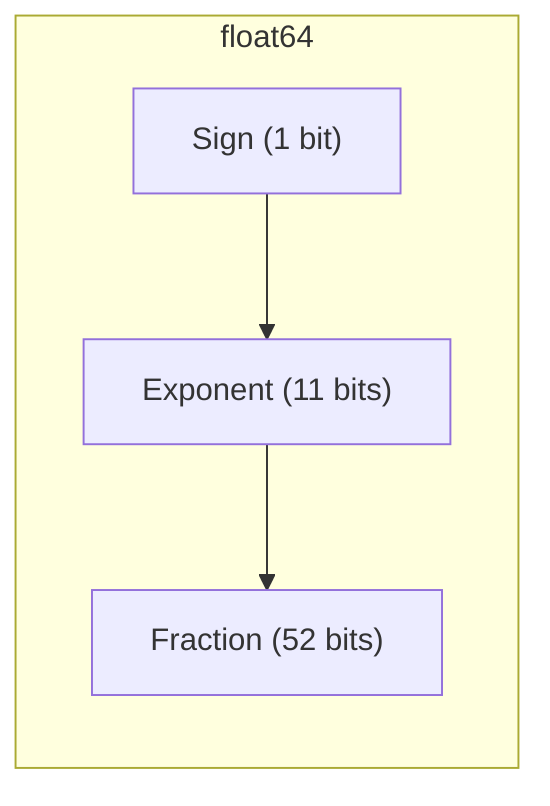
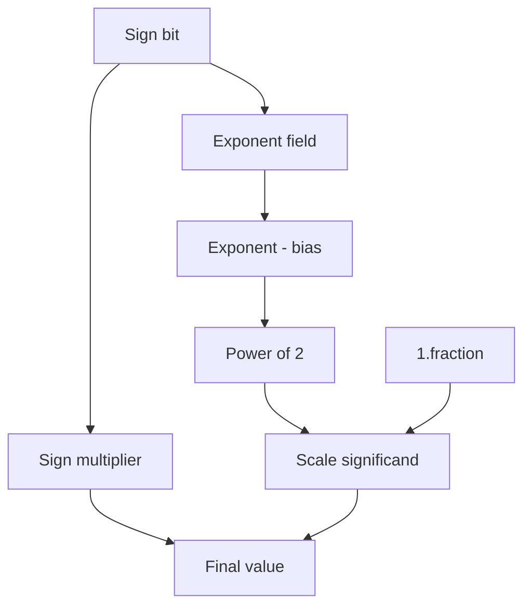
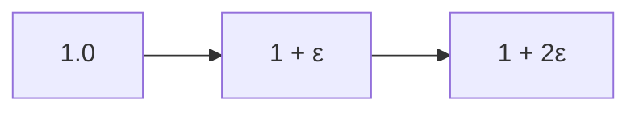
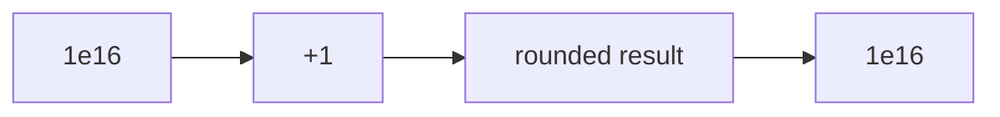
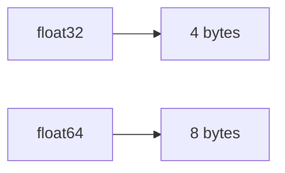

# Floating-Point Representation

Real numbers form a **continuous set**, but computers store numbers using **finite binary representations**. As a result, most real numbers cannot be represented exactly in memory.

To balance **range, precision, and performance**, modern computers use the **IEEE 754 floating-point standard**. This representation underlies floating-point arithmetic in languages such as C, Python, Java, and many scientific libraries.

Understanding floating-point representation explains many surprising behaviors in numerical computing, including:

* rounding errors
* `0.1 + 0.2 != 0.3`
* loss of precision when subtracting nearly equal numbers
* overflow and underflow
* the existence of `NaN` and `Infinity`

---

## 1. Scientific Notation in Binary

Floating-point numbers are essentially **binary scientific notation**.

In decimal scientific notation, a number is written as:

[
x = \pm m \times 10^e
]

Example:

[
314.5 = 3.145 \times 10^2
]

Binary floating-point uses the same idea but with base **2** instead of **10**:

[
x = \pm m \times 2^e
]

Example:

[
13.25 = 1.10101_2 \times 2^3
]

Floating-point numbers store:

* the **sign**
* the **exponent**
* the **significand (mantissa)**

---

## 2. IEEE 754 Floating-Point Format

IEEE 754 defines the standard binary floating-point formats used by modern hardware.

The value of a floating-point number is:

[
\text{value} =
(-1)^S \times 1.\text{fraction} \times 2^{(\text{exponent} - \text{bias})}
]

Where:

* **S** = sign bit
* **exponent** = encoded exponent
* **fraction** = significand bits

---

### Structure of floating-point numbers

#### float32 (single precision)

| Field    | Bits |
| -------- | ---- |
| Sign     | 1    |
| Exponent | 8    |
| Fraction | 23   |

Total:

```text
32 bits
```

---

#### float64 (double precision)

| Field    | Bits |
| -------- | ---- |
| Sign     | 1    |
| Exponent | 11   |
| Fraction | 52   |

Total:

```text
64 bits
```

---

### Bit layout visualization



---

## 3. The Implicit Leading Bit

In normalized floating-point numbers, the leading bit of the significand is always **1**.

For example:

```text
1.010101₂
```

Because this leading **1** is guaranteed, IEEE 754 **does not store it explicitly**.

This provides one additional bit of precision.

So:

| Format  | Stored bits | Effective precision |
| ------- | ----------- | ------------------- |
| float32 | 23          | 24                  |
| float64 | 52          | 53                  |

This is called the **hidden bit** or **implicit leading 1**.

---

## 4. Exponent Bias

The exponent field is stored using a **bias** so that both positive and negative exponents can be represented using unsigned integers.

| Format  | Exponent bits | Bias |
| ------- | ------------- | ---- |
| float32 | 8             | 127  |
| float64 | 11            | 1023 |

The actual exponent is:

[
e = E - \text{bias}
]

Example:

```
Exponent field = 130
Bias = 127
Actual exponent = 3
```

---

## 5. Example: Interpreting a Floating-Point Number

Consider a simplified example:

```
Sign = 0
Exponent = 130
Fraction = 010000...
```

Step 1: sign

```
(-1)^0 = 1
```

Step 2: exponent

```
130 - 127 = 3
```

Step 3: significand

```
1.01₂
```

Step 4: value

[
1.01_2 \times 2^3
]

```
= 1.25 × 8
= 10
```

---

#### Visualization



---

## 6. Why Many Decimal Numbers Cannot Be Represented Exactly

Some decimal fractions have **infinite binary expansions**.

Example:

```
0.1 (decimal)
```

In binary:

```
0.000110011001100110011...
```

The pattern repeats forever.

Because floating-point numbers store only **finite bits**, the number must be **rounded**.

This approximation explains many floating-point surprises.

---

### Famous example

```python
print(0.1 + 0.2)
```

Output:

```
0.30000000000000004
```

This occurs because both 0.1 and 0.2 are stored as approximations.

---

## 7. Machine Epsilon

The **machine epsilon** is the smallest number that can be added to **1.0** that produces a distinct floating-point value.

For float64:

[
\epsilon \approx 2^{-52}
]

Numerically:

```
2.22 × 10⁻¹⁶
```

For float32:

```
1.19 × 10⁻⁷
```

---

#### Visualization of spacing



Machine epsilon determines the **relative precision** of floating-point arithmetic.

---

## 8. Non-Uniform Precision

Floating-point numbers are **not evenly spaced**.

The gap between representable numbers increases with magnitude.

Near value (v):

[
\text{spacing} \approx v \times \epsilon
]

Examples:

| Value | Approx gap |
| ----- | ---------- |
| 1     | 2e-16      |
| 1e6   | 2e-10      |
| 1e16  | ≈ 1        |

---

### Example: absorption

```python
print(1e16 + 1 == 1e16)
```

Output:

```
True
```

The `1` is smaller than the spacing between numbers near `1e16`, so it disappears.

---

#### Visualization



---

## 9. Catastrophic Cancellation

When subtracting two nearly equal numbers, most significant digits cancel out.

Example:

```
a = 1.0000001
b = 1.0000000
```

```
a - b = 0.0000001
```

If the inputs contain rounding error, the result may lose nearly all meaningful digits.

This phenomenon is called **catastrophic cancellation**.

---

### Example

```python
import numpy as np

a = 1.0000001
b = 1.0000000

print(a - b)
```

Small rounding errors may dominate the result.

Often the solution is **algebraic reformulation**.

---

## 10. Special Floating-Point Values

IEEE 754 defines special bit patterns for exceptional conditions.

---

### Infinity

Occurs when numbers exceed representable range.

```
+∞
-∞
```

Example:

```python
import numpy as np

print(np.inf * 2)
```

---

### NaN (Not a Number)

Represents undefined operations.

Examples:

```
0 / 0
∞ - ∞
sqrt(-1)
```

Example:

```python
import numpy as np

print(np.inf - np.inf)
```

Output:

```
nan
```

---

### NaN comparison behavior

NaN is not equal to anything, including itself.

```python
import numpy as np

print(np.nan == np.nan)
```

Output:

```
False
```

Correct check:

```python
np.isnan(x)
```

---

## 11. Memory and Precision Tradeoff

Different floating-point types balance precision and memory usage.

| Type    | Bytes | Precision          |
| ------- | ----- | ------------------ |
| float32 | 4     | ~7 decimal digits  |
| float64 | 8     | ~16 decimal digits |

Example:

```python
import numpy as np

n = 10_000_000

print(np.zeros(n, dtype=np.float64).nbytes)
print(np.zeros(n, dtype=np.float32).nbytes)
```

---

#### Visualization



float32 uses half the memory but also half the precision.

---

## 12. Practical Guidelines

When working with floating-point numbers:

#### Avoid direct equality comparisons

Use tolerances instead.

```python
np.isclose(a, b)
```

---

#### Prefer numerically stable formulas

Example:

Instead of

[
\sqrt{x^2 + y^2}
]

use

```
np.hypot(x, y)
```

---

#### Be cautious with subtraction

Subtracting nearly equal numbers can destroy precision.

---

#### Choose data types carefully

* float32: memory efficient
* float64: higher precision

---

## 13. Worked Examples

#### Example 1

Explain why:

```
0.1 + 0.2 != 0.3
```

Both operands are approximated in binary, so rounding errors accumulate.

---

#### Example 2

Determine the approximate precision of float32.

```
≈ 2⁻²³ ≈ 1.19e-7
```

---

#### Example 3

Show absorption:

```
1e16 + 1 = 1e16
```

The difference is below floating-point resolution.

---

## 14. Exercises

1. What are the three fields of IEEE 754 floating-point numbers?
2. What is the bias for float64?
3. Why can 0.1 not be represented exactly in binary?
4. What is machine epsilon?
5. Why is `np.nan == np.nan` false?
6. What happens when a floating-point value exceeds the maximum representable number?
7. Why does adding a small number to a very large number sometimes have no effect?

---

**Exercise 8.**
A student claims: "Floating-point numbers are just decimals stored in binary, so they work like regular math but with small rounding errors." Critique this claim. Specifically, explain why floating-point arithmetic violates the **associativity** of addition -- that is, why `(a + b) + c` can give a different result than `a + (b + c)`. Construct a concrete Python example using `float` values where changing the grouping of additions produces a different result, and explain the mechanism behind the discrepancy.

??? success "Solution to Exercise 8"
    The claim is misleading because floating-point arithmetic does not obey the same algebraic laws as real-number arithmetic. In particular, **addition is not associative**.

    This happens because each intermediate result is rounded to the nearest representable float. Different groupings produce different intermediate values, which get rounded differently.

    **Concrete example:**

    ```python
    a = 1e16
    b = -1e16
    c = 1.0

    print((a + b) + c)  # (1e16 + (-1e16)) + 1.0 = 0.0 + 1.0 = 1.0
    print(a + (b + c))  # 1e16 + (-1e16 + 1.0) = 1e16 + (-1e16) = 0.0
    ```

    In the second grouping, `b + c = -1e16 + 1.0 = -1e16` because `1.0` is smaller than the spacing between floats near $10^{16}$ (the spacing is approximately $2$). The small value is absorbed. Then `a + (-1e16) = 0.0`, losing the `1.0` entirely.

    In the first grouping, `a + b = 0.0` exactly (no rounding needed), then `0.0 + 1.0 = 1.0`.

---

**Exercise 9.**
The **spacing** between consecutive representable floating-point numbers is not constant -- it grows with the magnitude of the numbers. Explain *why* this non-uniform spacing is an inherent consequence of the IEEE 754 representation (sign, exponent, significand). Then explain the practical implication: why is `1e16 + 1.0 == 1e16` true in Python, while `1.0 + 1e-16 != 1.0` is also true? What determines the threshold at which a small addition "disappears"?

??? success "Solution to Exercise 9"
    In IEEE 754, a floating-point number is $(-1)^S \times 1.\text{fraction} \times 2^e$. The significand (fraction) has a fixed number of bits (52 for float64). The spacing between consecutive representable numbers is determined by the value of the least significant bit of the significand, which is $2^e \times 2^{-52} = 2^{e-52}$.

    As the magnitude increases, the exponent $e$ increases, so the spacing $2^{e-52}$ grows proportionally. Near $1.0$ ($e = 0$), the spacing is $2^{-52} \approx 2.2 \times 10^{-16}$. Near $10^{16}$ ($e \approx 53$), the spacing is $2^{53-52} = 2$.

    `1e16 + 1.0 == 1e16` is true because the spacing between consecutive floats near $10^{16}$ is approximately $2$. Adding $1.0$ (which is less than half the spacing) rounds back to the original value.

    `1.0 + 1e-16 != 1.0` is true because the spacing near $1.0$ is about $2.2 \times 10^{-16}$, and $10^{-16}$ is roughly half of that, just barely enough to cause a change (the exact threshold is $\epsilon/2$ where $\epsilon$ is machine epsilon).

    The general threshold: an addition `x + y` is absorbed (gives `x`) when $|y| < \frac{1}{2} \cdot \text{spacing}(x) = \frac{1}{2} |x| \cdot \epsilon$.

---

**Exercise 10.**
Explain why `0.1 + 0.2 != 0.3` in Python, but `0.5 + 0.25 == 0.75` is exact. What is special about `0.5`, `0.25`, and `0.75` that makes them exactly representable in binary floating-point, while `0.1`, `0.2`, and `0.3` are not? State the general rule for which decimal fractions have exact binary representations.

??? success "Solution to Exercise 10"
    A decimal fraction $p/q$ has an exact binary representation if and only if $q$ is a power of $2$. This is because binary "decimals" represent sums of negative powers of $2$: $2^{-1} = 0.5$, $2^{-2} = 0.25$, $2^{-3} = 0.125$, etc.

    - $0.5 = 1/2 = 2^{-1}$ -- exact in binary: `0.1`
    - $0.25 = 1/4 = 2^{-2}$ -- exact in binary: `0.01`
    - $0.75 = 3/4 = 2^{-1} + 2^{-2}$ -- exact in binary: `0.11`
    - $0.5 + 0.25 = 0.75$ -- all operands and the result are exact, so no rounding occurs.

    - $0.1 = 1/10$ -- the denominator $10 = 2 \times 5$ has a factor of $5$, which is not a power of $2$. Its binary expansion is $0.0\overline{0011}$ (repeating), so it must be rounded.
    - $0.2 = 1/5$ and $0.3 = 3/10$ are similarly non-terminating in binary.

    When `0.1 + 0.2` is computed, both operands carry rounding error, and the sum's rounding error does not cancel. The result is slightly above $0.3$, while the stored value of `0.3` is slightly below $0.3$, so they differ.

---

**Exercise 11.**
IEEE 754 defines that `NaN != NaN` (NaN is not equal to itself). This seems bizarre at first. Explain the reasoning behind this design decision. Consider: if `NaN == NaN` were true, what problems would arise when using `==` to check whether a computation produced a valid result? How does `NaN`'s self-inequality enable a simple idiom for detecting `NaN` without calling a special function?

??? success "Solution to Exercise 11"
    NaN represents the result of **undefined operations** (like $0/0$ or $\sqrt{-1}$). It is not a number -- it has no value. The IEEE 754 committee made `NaN != NaN` for a critical practical reason:

    If `NaN == NaN` were true, then the common pattern of checking `x == x` would always return `True`, making it impossible to detect NaN through comparison. With the actual design, `x != x` is `True` **if and only if** `x` is `NaN`. This provides a simple NaN-detection idiom:

    ```python
    def is_nan(x):
        return x != x
    ```

    Furthermore, if `NaN == NaN` were true, then expressions like `max([1.0, float('nan'), 2.0])` would have to choose NaN as a legitimate "largest" value, propagating undefined results into valid data in confusing ways.

    The self-inequality of NaN signals that the value is not meaningful and should not participate in comparisons as if it were an ordinary number. Any comparison involving NaN (except `!=`) returns `False`, which ensures that NaN does not silently "pass" equality checks that assume valid data.

---

## 15. Short Answers

1. Sign, exponent, significand
2. 1023
3. Its binary expansion is infinite
4. Smallest number distinguishable from 1.0
5. NaN is defined as unequal to everything
6. It becomes infinity
7. Because spacing between floats grows with magnitude

## 16. Summary

* Floating-point numbers represent real values using **binary scientific notation**.
* IEEE 754 stores numbers using **sign, exponent, and significand fields**.
* The **implicit leading 1** increases precision.
* Many decimal fractions cannot be represented exactly in binary.
* **Machine epsilon** defines floating-point precision.
* Floating-point spacing grows with magnitude.
* **Catastrophic cancellation** can destroy precision when subtracting nearly equal numbers.
* IEEE 754 includes special values such as **NaN** and **Infinity**.

Understanding floating-point representation is essential for writing **correct numerical software and scientific code**.
