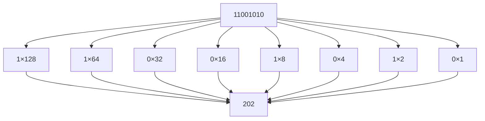
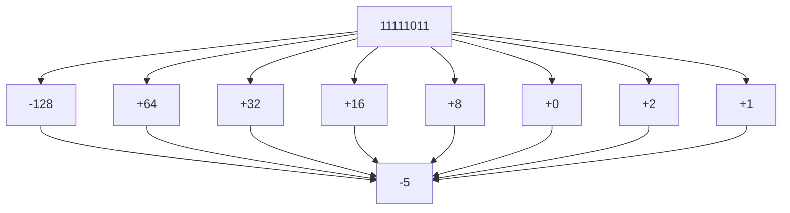
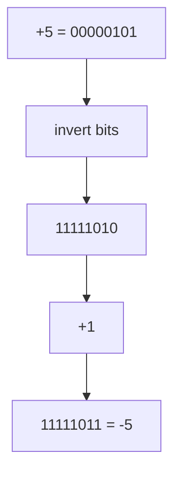
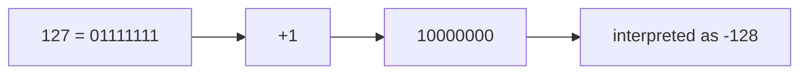
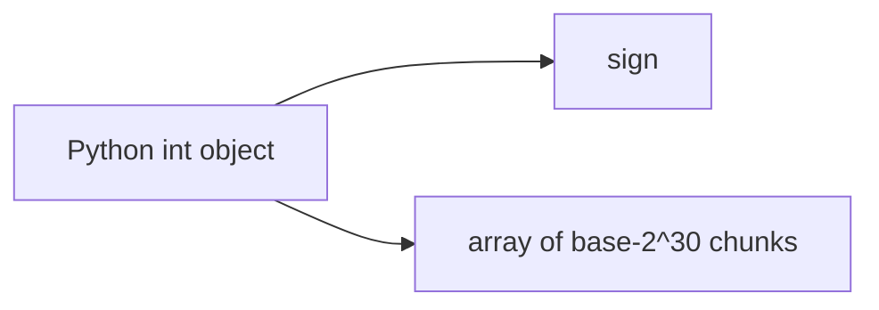
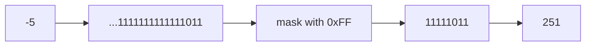

# Integer Representation

Computers represent integers using **binary numbers stored in fixed-width memory**. The exact representation depends on the programming environment.

Most programming languages and hardware systems use **fixed-width two’s complement integers**, while Python uses **arbitrary-precision integers** that grow dynamically as needed.

Understanding these representations is important for:

* preventing **overflow bugs**
* reasoning about **memory usage**
* understanding **bitwise operations**
* working with **NumPy and low-level code**

This chapter explains how integers are represented in hardware, how two’s complement works, and how Python’s integer implementation differs.

---

# 1. Unsigned Integers

The simplest integer representation is an **unsigned integer**.

An **n-bit unsigned integer** stores values using standard binary positional notation.

[
\text{value} = \sum_{i=0}^{n-1} b_i 2^i
]

where each (b_i) is either 0 or 1.

---

## Range of unsigned integers

Because each bit has two possible states, an (n)-bit value has:

[
2^n
]

possible patterns.

Therefore the range is:

[
0 \text{ to } 2^n - 1
]

Examples:

| Bits   | Range                        |
| ------ | ---------------------------- |
| 8-bit  | 0–255                        |
| 16-bit | 0–65535                      |
| 32-bit | 0–4,294,967,295              |
| 64-bit | 0–18,446,744,073,709,551,615 |

---

## Example

Consider the 8-bit number:

```text
11001010
```

[
1\cdot128 + 1\cdot64 + 0\cdot32 + 0\cdot16 + 1\cdot8 + 0\cdot4 + 1\cdot2 + 0\cdot1
]

[
= 202
]

---

### Visualization



Unsigned integers cannot represent negative numbers.

To store signed values efficiently, computers use **two’s complement representation**.

---

# 2. Signed Integers and Two’s Complement

Modern hardware almost universally uses **two’s complement** to represent signed integers.

Two’s complement provides two important advantages:

1. **Addition hardware works for both signed and unsigned values**
2. **Zero has only one representation**

---

## Range of two’s complement integers

For an (n)-bit signed integer:

[
-2^{n-1} \le x \le 2^{n-1}-1
]

Example ranges:

| Bits   | Range                           |
| ------ | ------------------------------- |
| 8-bit  | -128 to 127                     |
| 16-bit | -32768 to 32767                 |
| 32-bit | -2,147,483,648 to 2,147,483,647 |

---

## Bit weights in two’s complement

In an 8-bit signed integer, the leftmost bit has a **negative weight**.

| Bit   | Value |
| ----- | ----- |
| (b_7) | −128  |
| (b_6) | 64    |
| (b_5) | 32    |
| (b_4) | 16    |
| (b_3) | 8     |
| (b_2) | 4     |
| (b_1) | 2     |
| (b_0) | 1     |

---

## Example: interpreting a value

Consider:

```text
11111011
```

Compute:

[
-128 + 64 + 32 + 16 + 8 + 0 + 2 + 1
]

[
= -5
]

So:

```text
11111011 = -5
```

---

### Visualization



---

# 3. Negating Numbers in Two’s Complement

To compute the negative of a number in fixed-width binary:

1. invert all bits
2. add 1

---

## Example: represent −5 in 8 bits

Start with +5:

```text
00000101
```

Invert bits:

```text
11111010
```

Add 1:

```text
11111011
```

Result:

```text
-5 = 11111011
```

---

### Visualization



---

# 4. Why Two’s Complement Works

Two’s complement enables subtraction to be performed using **addition hardware**.

Instead of computing:

[
a - b
]

the hardware computes:

[
a + (-b)
]

Because negation is easy (invert bits + add 1), subtraction becomes simple.

---

## Example

Compute:

[
7 - 3
]

Binary form:

```text
7 = 00000111
3 = 00000011
```

Compute −3:

```text
11111101
```

Add:

```text
 00000111
+11111101
---------
 00000100
```

Result:

```text
4
```

The carry beyond the leftmost bit is discarded.

---

# 5. Overflow in Fixed-Width Integers

Hardware integers have **fixed width**.

If a computation produces a value outside the representable range, the result **wraps around**.

Mathematically, arithmetic occurs **modulo (2^n)**.

---

## Example: 8-bit overflow

Maximum signed value:

```text
127 = 01111111
```

Add 1:

```text
 01111111
+00000001
---------
 10000000
```

But:

```text
10000000 = -128
```

So the value wraps.

---

### Visualization



Overflow occurs silently in many programming environments.

---

# 6. NumPy and Fixed-Width Integers

Libraries like **NumPy** use fixed-width integer types.

Examples include:

| dtype   | size    |
| ------- | ------- |
| `int8`  | 1 byte  |
| `int16` | 2 bytes |
| `int32` | 4 bytes |
| `int64` | 8 bytes |

Because these types follow hardware behavior, **overflow wraps around silently**.

---

## Example: overflow in NumPy

```python
import numpy as np

x = np.int8(127)
print(x + 1)
```

Output:

```text
-128
```

The value wraps because the maximum 8-bit signed integer is 127.

---

# 7. Python Integers

Python integers behave differently.

Python uses **arbitrary-precision integers**, meaning the number of bits expands automatically when needed.

As a result:

* Python integers **never overflow**
* integer size grows dynamically
* operations may require more memory and time

Example:

```python
print(2 ** 1000)
```

This produces a very large integer without overflow.

---

# 8. How Python Stores Integers

Internally, Python stores integers as:

* a **sign**
* a variable-length array of digits

Each digit stores **30 bits of the number**.

Conceptually:



This design allows Python integers to grow without limit.

However, it also means Python integers consume more memory than fixed-width integers.

---

# 9. Memory Comparison

Small Python integers require around **28 bytes of memory**.

Fixed-width integers are much smaller.

Example:

```python
import sys
import numpy as np

print(sys.getsizeof(42))
print(np.int64(42).nbytes)
print(np.int8(42).nbytes)
```

Typical results:

| Type         | Memory    |
| ------------ | --------- |
| Python `int` | ~28 bytes |
| `np.int64`   | 8 bytes   |
| `np.int8`    | 1 byte    |

---

# 10. Bitwise Operations on Python Integers

Python simulates **infinite-width two’s complement arithmetic** for bitwise operations.

This means negative numbers behave as if they have infinitely many leading **1 bits**.

Example:

```python
print(bin(-5))
```

Output:

```text
-0b101
```

But internally Python behaves as if:

```text
...1111111111111111111111111011
```

---

## Example: masking

```python
-5 & 0xFF
```

Result:

```text
251
```

Explanation:

```text
11111011 (8-bit two's complement)
```

This is the unsigned representation of −5.

---

### Visualization



---

# 11. Choosing the Right Integer Type

Different situations require different integer representations.

### Python integers

Advantages:

* no overflow
* simple arithmetic
* arbitrary precision

Disadvantages:

* larger memory usage
* slower for large arrays

---

### NumPy integers

Advantages:

* compact
* fast vectorized operations
* predictable memory layout

Disadvantages:

* overflow wraps silently
* range must be chosen carefully

---

## Example: incorrect dtype

```python
import numpy as np

prices = np.array([30000, 35000, 40000], dtype=np.int16)
print(prices)
```

Output:

```text
[30000 -30536 -25536]
```

The values exceed the `int16` maximum of **32767**.

Correct solution:

```python
prices = np.array([30000, 35000, 40000], dtype=np.int32)
```

---

# 12. Worked Examples

### Example 1

Interpret `11111110` as an 8-bit signed integer.

[
-128 + 64 + 32 + 16 + 8 + 4 + 2 + 0 = -2
]

---

### Example 2

Represent −12 in 8-bit two’s complement.

1. Write 12:

```text
00001100
```

2. Invert:

```text
11110011
```

3. Add 1:

```text
11110100
```

---

### Example 3

Detect overflow.

```text
120 + 20
```

In 8-bit signed arithmetic:

```text
120 = 01111000
20  = 00010100
```

Sum:

```text
10001100
```

This equals **−116**, showing overflow.

---

# 13. Exercises

1. What is the range of a 12-bit unsigned integer?
2. What is the range of a 12-bit two’s complement integer?
3. Interpret `11110110` as an 8-bit signed integer.
4. Represent −9 using 8-bit two’s complement.
5. What happens when `np.int8(120) + np.int8(20)` is computed?
6. Why does Python never overflow on integer arithmetic?
7. How many bytes does an `np.int32` use?
8. Why does two’s complement simplify hardware design?

---

# 14. Short Answers

1. (0) to (4095)
2. −2048 to 2047
3. −10
4. `11110111`
5. Overflow occurs and the value wraps
6. Python integers expand dynamically
7. 4 bytes
8. Addition hardware works for both positive and negative numbers

---

# 15. Summary

* **Unsigned integers** represent values from (0) to (2^n - 1).
* **Two’s complement** is the standard signed representation used in hardware.
* Signed integers range from (−2^{n−1}) to (2^{n−1} − 1).
* Negation is performed by **inverting bits and adding 1**.
* Fixed-width integers can **overflow**, wrapping around modulo (2^n).
* **NumPy integers** follow hardware behavior and may overflow silently.
* **Python integers** use arbitrary precision and never overflow, but require more memory.

Understanding integer representation is essential for reasoning about **overflow, bitwise operations, memory efficiency, and numerical correctness** in software systems.
