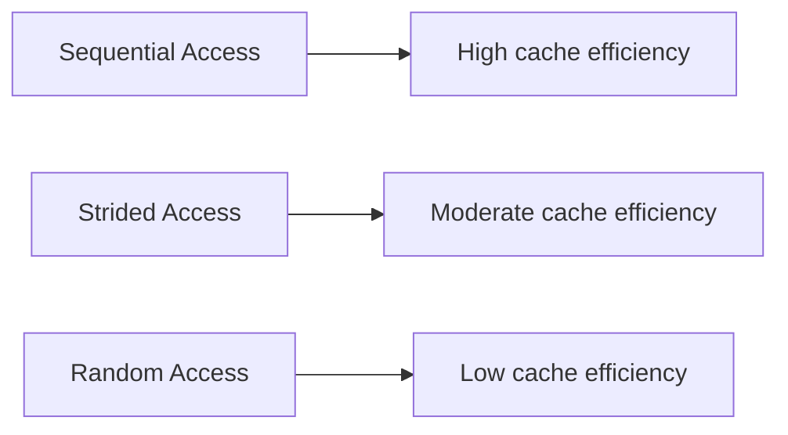
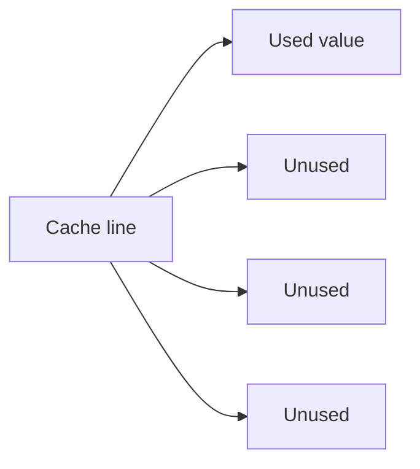
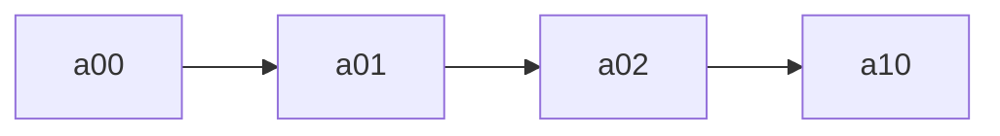
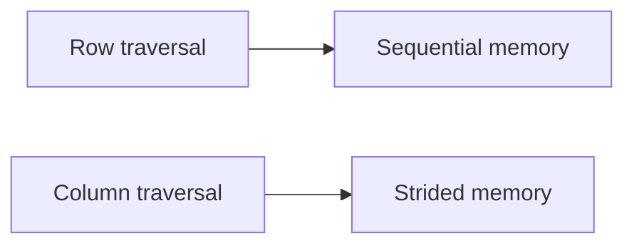
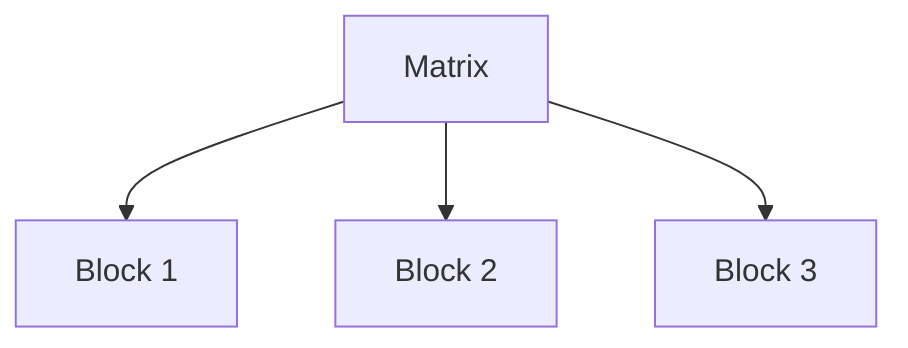
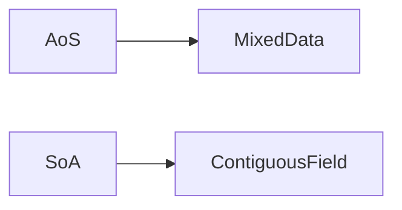

# Memory Access Patterns

The **order in which a program accesses memory** strongly influences performance. Even when performing the same arithmetic operations on the same data, different memory access patterns can produce **10× to 100× differences in execution time**.

These differences arise because modern processors rely heavily on **caches and hardware prefetching**. Programs that access memory in predictable patterns allow the hardware to load data efficiently, while irregular access patterns cause frequent cache misses and slow memory operations.

For many numerical and data-processing workloads, performance is limited not by computation but by **memory access efficiency**.

---

## 1. What Is a Memory Access Pattern?

A **memory access pattern** describes the order in which a program reads or writes memory addresses.

Three common patterns appear in most programs:

| Pattern    | Description                             |
| ---------- | --------------------------------------- |
| Sequential | memory addresses accessed in order      |
| Strided    | addresses accessed at regular intervals |
| Random     | unpredictable addresses accessed        |

These patterns determine how effectively a program uses CPU caches.

---

#### Visualization



Sequential access typically provides the best performance.

---

## 2. Cache Lines and Memory Fetching

Modern CPUs do not load memory one byte at a time. Instead, they load **cache lines**.

Typical cache line size:

```text
64 bytes
```

When a program accesses a memory address, the CPU loads the entire cache line containing that address.

---

### Example

Suppose an array contains `float64` values.

Each element occupies:

```text
8 bytes
```

Therefore a 64-byte cache line contains:

[
64 / 8 = 8
]

elements.

If the program accesses `arr[0]`, the CPU loads:

```text
arr[0] through arr[7]
```

into cache.

---

#### Cache line visualization

```mermaid
flowchart LR
    A[arr[0]] --> B[Cache line loaded]
    B --> C[arr[1]]
    B --> D[arr[2]]
    B --> E[arr[3]]
    B --> F[arr[4]]
    B --> G[arr[5]]
    B --> H[arr[6]]
    B --> I[arr[7]]
```

Subsequent accesses to these elements result in **cache hits**.

---

## 3. Sequential Access

**Sequential access** occurs when a program reads memory addresses in increasing order.

Example:

```text
arr[0], arr[1], arr[2], arr[3]
```

Because each cache line contains multiple elements, sequential access produces many cache hits.

---

### Hardware prefetching

Modern CPUs include **hardware prefetchers** that detect sequential patterns and load future cache lines in advance.

This allows memory to be streamed efficiently.

---

#### Sequential access visualization

```mermaid
flowchart LR
    A[arr[0]] --> B[arr[1]]
    B --> C[arr[2]]
    C --> D[arr[3]]
```

Sequential access maximizes:

* cache utilization
* prefetch efficiency
* memory bandwidth

---

## 4. Strided Access

**Strided access** occurs when memory addresses are accessed at fixed intervals.

Example:

```text
arr[0], arr[8], arr[16], arr[24]
```

Each access may load a new cache line while using only one value.

---

#### Example

If a cache line holds 8 elements but only one is used:

[
7/8
]

of the loaded data is wasted.

---

#### Visualization



Strided access reduces cache efficiency and wastes memory bandwidth.

---

## 5. Random Access

**Random access** occurs when memory addresses are accessed unpredictably.

Example:

```text
arr[42], arr[90000], arr[3], arr[123456]
```

Because the CPU cannot predict future accesses, prefetching fails and cache lines are rarely reused.

---

#### Random access visualization

```mermaid
flowchart TD
    A[arr[42]] --> B[Cache miss]
    C[arr[90000]] --> D[Cache miss]
    E[arr[3]] --> F[Cache miss]
```

Random access often results in:

* frequent cache misses
* poor memory bandwidth utilization
* significantly slower performance

---

## 6. Access Patterns in NumPy Arrays

NumPy arrays store elements in **contiguous memory**.

The default layout is **row-major order** (also called **C order**).

This means elements of the same row are stored next to each other.

---

#### Example 2D array layout

```
[[a00 a01 a02]
 [a10 a11 a12]
 [a20 a21 a22]]
```

Memory order:

```
a00 a01 a02 a10 a11 a12 a20 a21 a22
```

---

#### Row-major visualization



Row traversal is sequential.

---

## 7. Row vs Column Traversal

Consider iterating over a 2D array.

---

### Row traversal (efficient)

```
for i in rows:
    for j in columns:
        arr[i, j]
```

This accesses memory sequentially.

---

### Column traversal (strided)

```
for j in columns:
    for i in rows:
        arr[i, j]
```

This jumps across rows in memory.

---

#### Visualization



Column traversal may require a new cache line for each access.

---

## 8. Blocking and Tiling

Large computations may exceed cache capacity.

**Blocking (or tiling)** divides computations into smaller pieces that fit in cache.

---

### Example: matrix multiplication

Instead of computing the entire matrix at once:

```
for i
  for j
    for k
```

Blocked version:

```
for i_block
  for j_block
    for k_block
```

Each block fits in cache, reducing cache misses.

---

#### Blocking visualization



Blocking improves locality and cache reuse.

---

## 9. Data Layout: AoS vs SoA

Data layout also affects access patterns.

---

### Array of Structures (AoS)

```
particle = [x,y,z,mass]
particle = [x,y,z,mass]
particle = [x,y,z,mass]
```

Accessing only `mass` requires skipping unrelated data.

---

### Structure of Arrays (SoA)

```
x:    [ ... ]
y:    [ ... ]
z:    [ ... ]
mass: [ ... ]
```

Now `mass` values are contiguous.

---

#### Visualization



SoA improves cache performance when accessing individual fields.

---

## 10. NumPy Vectorization

NumPy operations automatically use efficient access patterns.

Example:

```python
import numpy as np

arr = np.arange(10_000_000)
total = np.sum(arr)
```

This operation:

* accesses memory sequentially
* uses SIMD instructions
* runs in optimized compiled code

As a result, it is much faster than Python loops.

---

## 11. Measuring Access Pattern Performance

The impact of access patterns can be measured experimentally.

```python
import numpy as np
import time

arr = np.arange(10_000_000, dtype=np.float64)

start = time.perf_counter()
_ = np.sum(arr)
seq_time = time.perf_counter() - start

indices = np.random.permutation(len(arr))

start = time.perf_counter()
_ = np.sum(arr[indices])
rand_time = time.perf_counter() - start

print(seq_time, rand_time)
```

Random access often runs **10× slower or more** than sequential access.

---

## 12. Worked Examples

#### Example 1

How many float64 values fit in a cache line?

[
64 / 8 = 8
]

---

#### Example 2

Why is sequential access faster?

Because it maximizes cache hits and enables hardware prefetching.

---

#### Example 3

Why does column iteration over a row-major array slow down computation?

Because it produces a strided access pattern.

---

## 13. Exercises

1. What is a memory access pattern?
2. What is the size of a typical cache line?
3. Why is sequential access efficient?
4. What is strided access?
5. Why is random access slow?
6. What memory layout does NumPy use by default?
7. What is blocking (tiling)?
8. What is the difference between AoS and SoA?

---

## 14. Short Answers

1. Order in which memory addresses are accessed
2. 64 bytes
3. It maximizes cache reuse and prefetching
4. Access with fixed spacing between elements
5. It causes frequent cache misses
6. Row-major (C order)
7. Splitting computations into cache-sized blocks
8. AoS stores mixed fields; SoA stores fields separately

---

## 15. Summary

* **Memory access patterns** strongly influence program performance.
* CPUs load data in **cache lines**, typically 64 bytes.
* **Sequential access** achieves the best cache utilization.
* **Strided access** wastes cache line data.
* **Random access** produces frequent cache misses.
* NumPy arrays use **row-major layout**, making row traversal efficient.
* Techniques such as **blocking**, **vectorization**, and **Structure of Arrays** improve cache efficiency.

Designing algorithms with efficient memory access patterns is essential for building **high-performance numerical and data-processing programs**.
