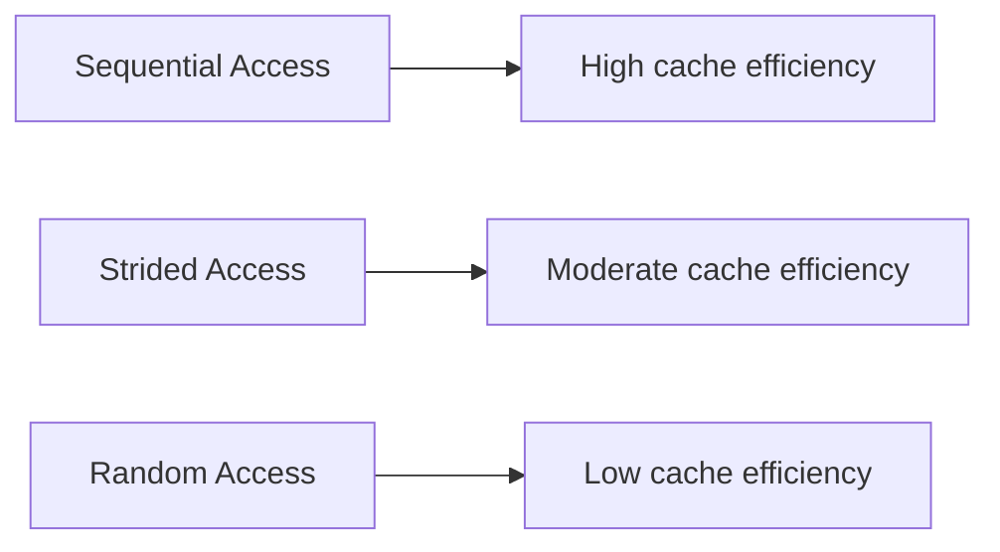
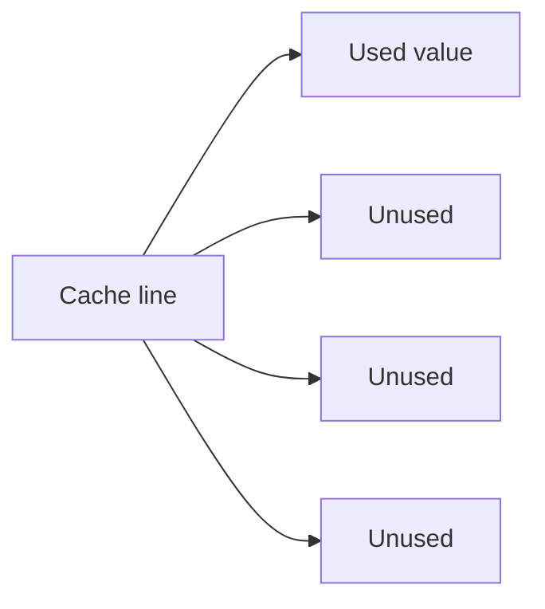
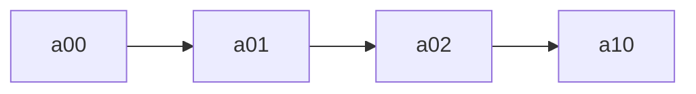
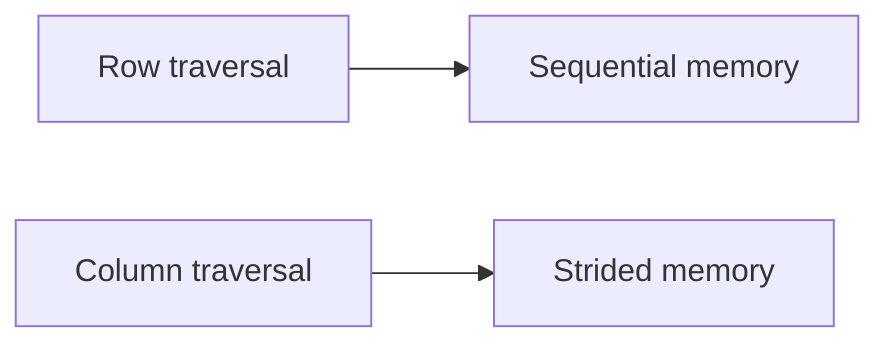
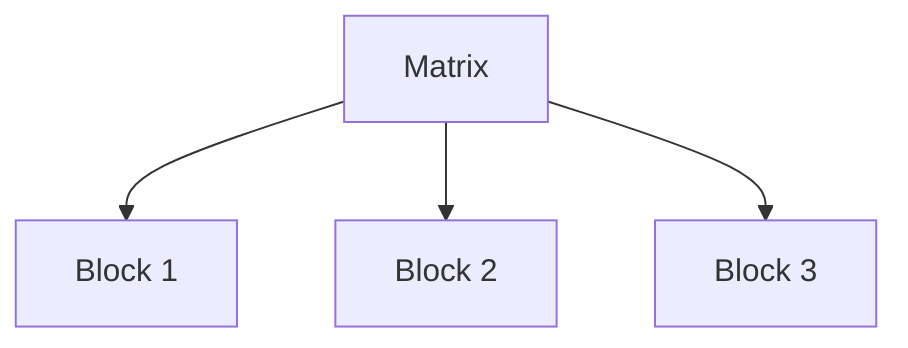
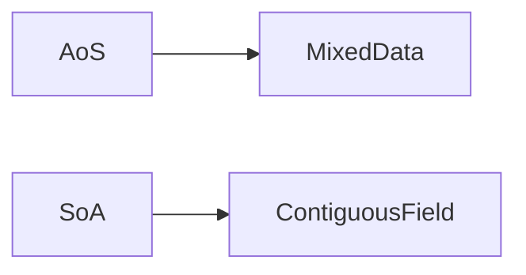

# Memory Access Patterns

The **order in which a program accesses memory** strongly influences performance. Even when performing the same arithmetic operations on the same data, different memory access patterns can produce **10× to 100× differences in execution time**.

These differences arise because modern processors rely heavily on **caches and hardware prefetching**. Programs that access memory in predictable patterns allow the hardware to load data efficiently, while irregular access patterns cause frequent cache misses and slow memory operations.

For many numerical and data-processing workloads, performance is limited not by computation but by **memory access efficiency**.

---

## 1. What Is a Memory Access Pattern?

A **memory access pattern** describes the order in which a program reads or writes memory addresses.

Three common patterns appear in most programs:

| Pattern    | Description                             |
| ---------- | --------------------------------------- |
| Sequential | memory addresses accessed in order      |
| Strided    | addresses accessed at regular intervals |
| Random     | unpredictable addresses accessed        |

These patterns determine how effectively a program uses CPU caches.

---

#### Visualization



Sequential access typically provides the best performance.

---

## 2. Cache Lines and Memory Fetching

Modern CPUs do not load memory one byte at a time. Instead, they load **cache lines**.

Typical cache line size:

```text
64 bytes
```

When a program accesses a memory address, the CPU loads the entire cache line containing that address.

---

### Example

Suppose an array contains `float64` values.

Each element occupies:

```text
8 bytes
```

Therefore a 64-byte cache line contains:

[
64 / 8 = 8
]

elements.

If the program accesses `arr[0]`, the CPU loads:

```text
arr[0] through arr[7]
```

into cache.

---

#### Cache line visualization

```mermaid
flowchart LR
    A[arr[0]] --> B[Cache line loaded]
    B --> C[arr[1]]
    B --> D[arr[2]]
    B --> E[arr[3]]
    B --> F[arr[4]]
    B --> G[arr[5]]
    B --> H[arr[6]]
    B --> I[arr[7]]
```

Subsequent accesses to these elements result in **cache hits**.

---

## 3. Sequential Access

**Sequential access** occurs when a program reads memory addresses in increasing order.

Example:

```text
arr[0], arr[1], arr[2], arr[3]
```

Because each cache line contains multiple elements, sequential access produces many cache hits.

---

### Hardware prefetching

Modern CPUs include **hardware prefetchers** that detect sequential patterns and load future cache lines in advance.

This allows memory to be streamed efficiently.

---

#### Sequential access visualization

```mermaid
flowchart LR
    A[arr[0]] --> B[arr[1]]
    B --> C[arr[2]]
    C --> D[arr[3]]
```

Sequential access maximizes:

* cache utilization
* prefetch efficiency
* memory bandwidth

---

## 4. Strided Access

**Strided access** occurs when memory addresses are accessed at fixed intervals.

Example:

```text
arr[0], arr[8], arr[16], arr[24]
```

Each access may load a new cache line while using only one value.

---

#### Example

If a cache line holds 8 elements but only one is used:

[
7/8
]

of the loaded data is wasted.

---

#### Visualization



Strided access reduces cache efficiency and wastes memory bandwidth.

---

## 5. Random Access

**Random access** occurs when memory addresses are accessed unpredictably.

Example:

```text
arr[42], arr[90000], arr[3], arr[123456]
```

Because the CPU cannot predict future accesses, prefetching fails and cache lines are rarely reused.

---

#### Random access visualization

```mermaid
flowchart TD
    A[arr[42]] --> B[Cache miss]
    C[arr[90000]] --> D[Cache miss]
    E[arr[3]] --> F[Cache miss]
```

Random access often results in:

* frequent cache misses
* poor memory bandwidth utilization
* significantly slower performance

---

## 6. Access Patterns in NumPy Arrays

NumPy arrays store elements in **contiguous memory**.

The default layout is **row-major order** (also called **C order**).

This means elements of the same row are stored next to each other.

---

#### Example 2D array layout

```
[[a00 a01 a02]
 [a10 a11 a12]
 [a20 a21 a22]]
```

Memory order:

```
a00 a01 a02 a10 a11 a12 a20 a21 a22
```

---

#### Row-major visualization



Row traversal is sequential.

---

## 7. Row vs Column Traversal

Consider iterating over a 2D array.

---

### Row traversal (efficient)

```
for i in rows:
    for j in columns:
        arr[i, j]
```

This accesses memory sequentially.

---

### Column traversal (strided)

```
for j in columns:
    for i in rows:
        arr[i, j]
```

This jumps across rows in memory.

---

#### Visualization



Column traversal may require a new cache line for each access.

---

## 8. Blocking and Tiling

Large computations may exceed cache capacity.

**Blocking (or tiling)** divides computations into smaller pieces that fit in cache.

---

### Example: matrix multiplication

Instead of computing the entire matrix at once:

```
for i
  for j
    for k
```

Blocked version:

```
for i_block
  for j_block
    for k_block
```

Each block fits in cache, reducing cache misses.

---

#### Blocking visualization



Blocking improves locality and cache reuse.

---

## 9. Data Layout: AoS vs SoA

Data layout also affects access patterns.

---

### Array of Structures (AoS)

```
particle = [x,y,z,mass]
particle = [x,y,z,mass]
particle = [x,y,z,mass]
```

Accessing only `mass` requires skipping unrelated data.

---

### Structure of Arrays (SoA)

```
x:    [ ... ]
y:    [ ... ]
z:    [ ... ]
mass: [ ... ]
```

Now `mass` values are contiguous.

---

#### Visualization



SoA improves cache performance when accessing individual fields.

---

## 10. NumPy Vectorization

NumPy operations automatically use efficient access patterns.

Example:

```python
import numpy as np

arr = np.arange(10_000_000)
total = np.sum(arr)
```

This operation:

* accesses memory sequentially
* uses SIMD instructions
* runs in optimized compiled code

As a result, it is much faster than Python loops.

---

## 11. Measuring Access Pattern Performance

The impact of access patterns can be measured experimentally.

```python
import numpy as np
import time

arr = np.arange(10_000_000, dtype=np.float64)

start = time.perf_counter()
_ = np.sum(arr)
seq_time = time.perf_counter() - start

indices = np.random.permutation(len(arr))

start = time.perf_counter()
_ = np.sum(arr[indices])
rand_time = time.perf_counter() - start

print(seq_time, rand_time)
```

Random access often runs **10× slower or more** than sequential access.

---

## 12. Worked Examples

#### Example 1

How many float64 values fit in a cache line?

[
64 / 8 = 8
]

---

#### Example 2

Why is sequential access faster?

Because it maximizes cache hits and enables hardware prefetching.

---

#### Example 3

Why does column iteration over a row-major array slow down computation?

Because it produces a strided access pattern.

---

## 13. Exercises

1. What is a memory access pattern?
2. What is the size of a typical cache line?
3. Why is sequential access efficient?
4. What is strided access?
5. Why is random access slow?
6. What memory layout does NumPy use by default?
7. What is blocking (tiling)?
8. What is the difference between AoS and SoA?

---

**Exercise 9.**
A programmer iterates over a 2D NumPy array in two ways:

```python
import numpy as np
a = np.zeros((10000, 10000), dtype=np.float64)

# Method A: row-by-row
for i in range(10000):
    for j in range(10000):
        a[i, j] += 1.0

# Method B: column-by-column
for i in range(10000):
    for j in range(10000):
        a[j, i] += 1.0
```

Both perform the same number of additions and memory accesses. Explain why Method A is significantly faster than Method B. Describe the memory access pattern of each method in terms of cache lines, and estimate the ratio of cache misses.

??? success "Solution to Exercise 9"
    NumPy uses **row-major (C order)** layout by default. This means elements in the same row are contiguous in memory: `a[i, 0], a[i, 1], a[i, 2], ...` are adjacent bytes.

    **Method A (row-by-row):** The inner loop iterates over `j` (columns) with `i` fixed. This accesses `a[i, 0], a[i, 1], a[i, 2], ...` -- consecutive memory addresses. This is **sequential access**. Each cache line (64 bytes = 8 `float64` values) is fully utilized, and the hardware prefetcher loads upcoming cache lines in advance.

    **Method B (column-by-column):** The inner loop iterates over `j` (used as the row index) with `i` fixed. This accesses `a[0, i], a[1, i], a[2, i], ...` -- addresses separated by the row stride ($10{,}000 \times 8 = 80{,}000$ bytes). This is **strided access** with a large stride. Each cache line loaded contains only 1 useful value out of 8, and the stride far exceeds the cache line size, so spatial locality is completely wasted.

    **Cache miss ratio:** Method A causes 1 cache miss per 8 elements. Method B causes 1 cache miss per element (each access is ~80 KB apart, guaranteed to be a different cache line). The ratio is approximately **8:1** in cache misses, translating to a significant speed difference (typically 3--10x depending on cache sizes and prefetcher effectiveness).

---

**Exercise 10.**
The "Structure of Arrays" (SoA) layout stores data as separate arrays per field: `x[i], y[i], z[i]` are in three separate contiguous arrays. The "Array of Structures" (AoS) layout stores data as an array of structs: `points[i].x, points[i].y, points[i].z` are adjacent in memory. Explain why SoA is better for a computation that processes only the `x` values of all points, while AoS is better for a computation that processes all three fields of a single point. Connect your explanation to cache lines and spatial locality.

??? success "Solution to Exercise 10"
    **SoA for x-only computation:** The `x` values are stored contiguously: `x[0], x[1], x[2], ...`. Processing only `x` values reads sequential memory, maximizing cache line utilization -- every byte in each cache line contains a useful `x` value. The `y` and `z` arrays are never loaded into cache, saving bandwidth.

    With AoS: `points[0].x, points[0].y, points[0].z, points[1].x, points[1].y, points[1].z, ...`. Processing only `x` values reads every third element (stride = 24 bytes for 3 `float64` fields). Each 64-byte cache line contains roughly 2--3 `x` values mixed with `y` and `z` values. Two-thirds of the loaded data is wasted.

    **AoS for all-fields-of-one-point:** Accessing `points[i].x, points[i].y, points[i].z` reads 24 consecutive bytes, likely within a single cache line. One cache load gives all three fields for one point.

    With SoA: `x[i]`, `y[i]`, and `z[i]` are in three different arrays, potentially in three different cache lines. Processing one complete point requires three separate memory accesses to distant locations.

    The key insight: SoA favors **field-at-a-time** processing (common in numerical computing), while AoS favors **record-at-a-time** processing (common in databases and game engines).

---

**Exercise 11.**
Hardware prefetchers can detect sequential and simple strided access patterns and pre-load cache lines before they are needed. Explain why random access patterns (e.g., accessing array elements via random indices) defeat the prefetcher. What is the consequence in terms of CPU stall cycles? Then explain why a hash table lookup is inherently "random access" from the memory system's perspective, even though the algorithm is deterministic.

??? success "Solution to Exercise 11"
    Hardware prefetchers work by detecting **patterns** in the sequence of memory addresses requested. They track recent addresses and extrapolate: if the last three accesses were to addresses A, A+64, A+128, the prefetcher predicts A+192 and loads it in advance.

    Random access has **no pattern** to detect. If accesses go to addresses 50000, 12800, 99200, 3500, ... there is no stride or sequence the prefetcher can extrapolate. It gives up and does not prefetch. Every access must wait for the full memory latency (~100 ns for a cache miss to RAM), and the CPU stalls waiting for data.

    A hash table lookup is "random" from the memory perspective because the hash function deliberately scatters keys across the table. Looking up `hash("Alice")` and then `hash("Bob")` produces addresses that are unrelated (that is the point of a good hash function -- distributing keys uniformly). Even though the algorithm is deterministic, the sequence of memory addresses appears random to the prefetcher, which cannot learn the hash function.

    The consequence is that hash table lookups are dominated by memory latency. For tables that fit in L1/L2 cache, this is manageable (~4--12 cycles per lookup). For tables larger than LLC, each lookup may cost ~200 cycles waiting for RAM.

---

**Exercise 12.**
"Blocking" (or "tiling") is a technique where a large computation is broken into small blocks that fit in cache. Consider matrix multiplication $C = A \times B$ where each matrix is $N \times N$ with $N = 10{,}000$. The naive triple loop accesses elements of $B$ column-by-column, which is a strided access pattern in row-major memory. Explain why this strided access is problematic for cache performance, and describe conceptually how blocking helps: what changes about the memory access pattern when the computation is done in small tiles?

??? success "Solution to Exercise 12"
    In the naive triple loop for $C_{ij} = \sum_k A_{ik} \cdot B_{kj}$, the innermost loop varies $k$:

    - `A[i, k]`: sequential access across row $i$ (good -- contiguous in row-major)
    - `B[k, j]`: access down column $j$ with stride $N$ elements (bad -- each access is $80{,}000$ bytes apart for $N = 10{,}000$)

    For each element of `B` accessed, a full cache line is loaded but only 1 of 8 values is used. Worse, column $j$ of `B` spans $10{,}000$ cache lines, far exceeding cache capacity. By the time the next element of the same column is needed, the previous cache line has been evicted. Every access to `B` is essentially a cache miss.

    **Blocking helps** by dividing the matrices into small tiles (e.g., $64 \times 64$). The computation proceeds tile-by-tile: for each pair of tiles, all elements of both tiles are accessed repeatedly before moving on. A $64 \times 64$ tile of `float64` values is $64 \times 64 \times 8 = 32$ KB, which fits comfortably in L1 cache.

    Within a tile, column access in `B` has stride 64 (not 10,000), and all 64 rows of the tile stay in cache. The strided access pattern is limited to a small, cache-resident region. After computing one tile's contribution, the next tile is loaded, reusing the same cache space. This transforms the global stride-$N$ pattern into many local, cache-friendly accesses.

---

## 14. Short Answers

1. Order in which memory addresses are accessed
2. 64 bytes
3. It maximizes cache reuse and prefetching
4. Access with fixed spacing between elements
5. It causes frequent cache misses
6. Row-major (C order)
7. Splitting computations into cache-sized blocks
8. AoS stores mixed fields; SoA stores fields separately

## 15. Summary

* **Memory access patterns** strongly influence program performance.
* CPUs load data in **cache lines**, typically 64 bytes.
* **Sequential access** achieves the best cache utilization.
* **Strided access** wastes cache line data.
* **Random access** produces frequent cache misses.
* NumPy arrays use **row-major layout**, making row traversal efficient.
* Techniques such as **blocking**, **vectorization**, and **Structure of Arrays** improve cache efficiency.

Designing algorithms with efficient memory access patterns is essential for building **high-performance numerical and data-processing programs**.

## Exercises

**Exercise 1.** Explain why iterating over a 2D array row-by-row is faster than column-by-column in C (row-major order).

??? success "Solution to Exercise 1"
    In row-major order, consecutive elements of a row are stored contiguously in memory. Row-by-row iteration accesses these elements sequentially, benefiting from spatial locality and cache prefetching. Column-by-column iteration jumps by one row's worth of elements each step, causing cache misses on every access.

---

**Exercise 2.** What is the difference between temporal and spatial locality.

??? success "Solution to Exercise 2"
    Temporal locality means recently accessed data is likely to be accessed again soon. Spatial locality means data near recently accessed addresses is likely to be accessed soon. Caches exploit both: recently accessed cache lines are kept (temporal), and each cache line loads a block of contiguous bytes (spatial).

