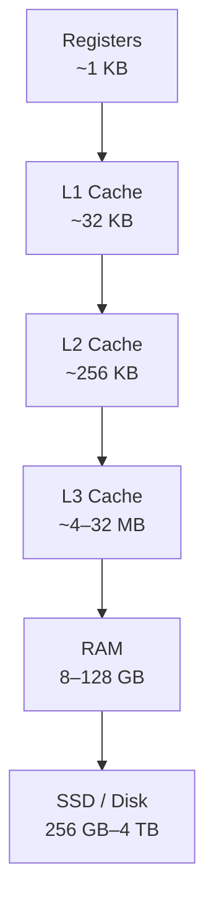
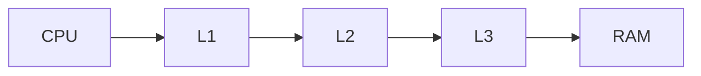
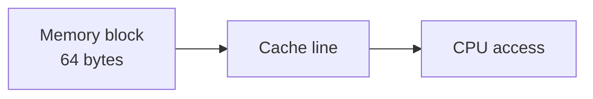
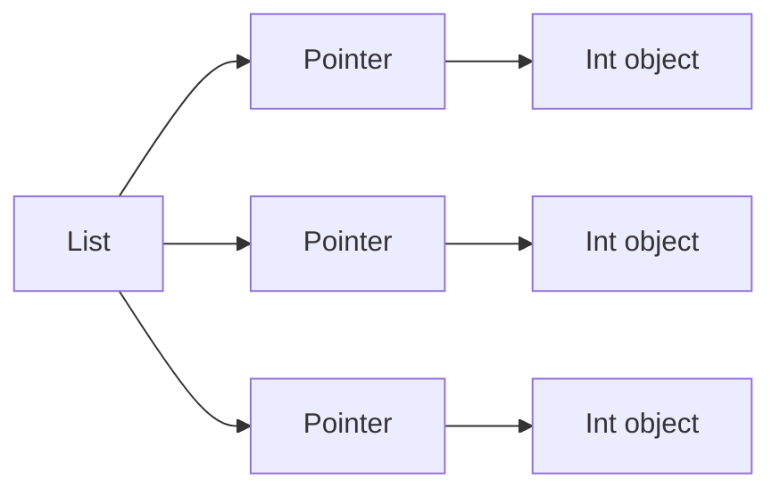
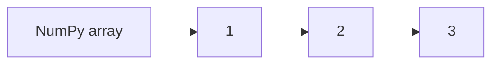
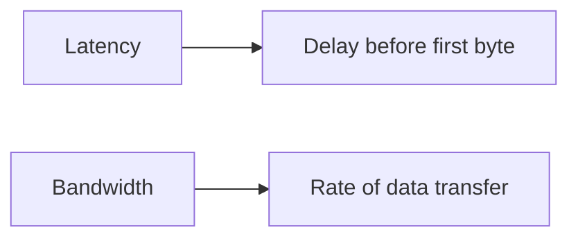

# Memory Overview

Modern processors can execute **billions of instructions per second**, but accessing main memory is far slower than executing arithmetic operations. This large gap between CPU speed and memory speed is known as the **memory wall**.

To bridge this gap, computers use a **memory hierarchy**: multiple layers of storage with different speeds and capacities. Data moves between these layers automatically, allowing frequently used data to be accessed quickly while still supporting large datasets.

Understanding the memory hierarchy is essential for writing high-performance programs. Many performance differences between algorithms arise not from computation but from **how efficiently they access memory**.

---

# 1. The Memory Hierarchy

The **memory hierarchy** organizes storage into layers with different characteristics.

Higher levels are:

* **smaller**
* **faster**
* **more expensive**

Lower levels are:

* **larger**
* **slower**
* **cheaper**

---

## Typical hierarchy

| Level      | Size        | Latency    | Managed By       |
| ---------- | ----------- | ---------- | ---------------- |
| Registers  | ~1 KB       | ~0.25 ns   | Compiler         |
| L1 Cache   | ~32 KB      | ~1 ns      | Hardware         |
| L2 Cache   | ~256–512 KB | ~4 ns      | Hardware         |
| L3 Cache   | ~4–32 MB    | ~12 ns     | Hardware         |
| RAM        | 8–128 GB    | ~80–120 ns | Operating system |
| SSD / Disk | 256 GB–4 TB | ~100 µs    | Operating system |

Latency increases dramatically as we move down the hierarchy.

For comparison:

```text
CPU register access: ~0.25 ns
RAM access:          ~100 ns
SSD access:          ~100,000 ns
```

This means RAM can be **hundreds of times slower** than CPU operations.

---

## Hierarchy visualization



As capacity increases, speed decreases.

---

# 2. How the CPU Accesses Memory

When a program requests data, the CPU checks each level of the hierarchy in order.

1. registers
2. L1 cache
3. L2 cache
4. L3 cache
5. RAM

If the data is not found in a level, the next level must be accessed.

---

## Cache hit vs cache miss

| Event      | Meaning                               |
| ---------- | ------------------------------------- |
| Cache hit  | Data found in cache                   |
| Cache miss | Data must be fetched from lower level |

A cache miss is expensive because data must be copied from a slower layer.

---

### Data flow visualization



If the requested data is found in L1, the access completes immediately.

If not, the hardware fetches the data from lower levels.

---

# 3. Cache Lines

Caches do not load individual bytes. Instead, they load **blocks of memory** called **cache lines**.

Typical cache line size:

```text
64 bytes
```

When a program accesses a single byte, the entire 64-byte block containing that byte is loaded into cache.

---

## Example

Suppose the program accesses:

```text
address 100
```

The CPU loads the entire block:

```text
64-byte block containing addresses 64–127
```

This means nearby data becomes available **for free**.

---

### Visualization



---

# 4. Locality of Reference

The memory hierarchy works because programs exhibit **locality**.

Two important patterns appear in most programs.

---

## Temporal locality

Recently accessed data is likely to be used again soon.

Example:

```python
for i in range(1000):
    total += x
```

The variable `x` is reused repeatedly.

---

## Spatial locality

Data near recently accessed memory is likely to be accessed soon.

Example:

```python
for i in range(len(arr)):
    total += arr[i]
```

Array elements are stored next to each other.

Because cache lines load neighboring data, sequential access is very efficient.

---

### Locality visualization


---

# 5. Why Sequential Access Is Fast

Consider an array of `float64` values.

Each value uses:

```text
8 bytes
```

Since cache lines are **64 bytes**, each cache line contains:

```text
8 float64 values
```

When one value is accessed, the other seven values are already loaded.

Therefore sequential access results in many **cache hits**.

---

## Example

Access pattern:

```text
arr[0], arr[1], arr[2], arr[3]
```

First access:

```
cache miss
```

Remaining accesses:

```
cache hits
```

---

### Visualization

```mermaid
flowchart LR
    A[arr[0]] --> B[load cache line]
    B --> C[arr[1]]
    B --> D[arr[2]]
    B --> E[arr[3]]
```

---

# 6. Python Memory Layout

Python data structures often store objects **indirectly**, which affects memory performance.

---

## Python integers

Each integer is a full Python object stored on the heap.

Example:

```python
import sys

x = 42
print(sys.getsizeof(x))
```

Typical result:

```text
28 bytes
```

This is much larger than a simple 4-byte or 8-byte integer.

---

## Python lists

A list stores **pointers to objects**, not the objects themselves.

Example:

```python
lst = [1, 2, 3]
```

Memory layout:

```text
list → pointer → int object
```

This means elements are scattered throughout memory.

---

### Visualization



This layout results in **poor spatial locality**.

---

# 7. NumPy Arrays and Contiguous Memory

NumPy arrays store raw numeric values in **contiguous memory**.

Example:

```python
import numpy as np

arr = np.array([1, 2, 3], dtype=np.int64)
print(arr.nbytes)
```

Output:

```text
24
```

Memory layout:

```text
[1][2][3]
```

Each element occupies exactly 8 bytes.

---

### Visualization



Because the values are stored next to each other, NumPy achieves excellent spatial locality.

This is one of the primary reasons **NumPy operations are dramatically faster** than equivalent Python loops.

---

# 8. Measuring Memory Bandwidth

The effect of the memory hierarchy can be observed experimentally.

When arrays are small enough to fit in cache, operations are very fast.

As array size increases and exceeds cache capacity, performance drops.

---

## Example experiment

```python
import numpy as np
import time

def measure_bandwidth(size_mb):
    n = size_mb * 1024 * 1024 // 8
    arr = np.random.rand(n)

    _ = np.sum(arr)  # warm up

    start = time.perf_counter()
    for _ in range(10):
        _ = np.sum(arr)

    elapsed = time.perf_counter() - start

    bandwidth = (n * 8 * 10) / elapsed / 1e9
    print(f"{size_mb:6.2f} MB: {bandwidth:.1f} GB/s")

for size in [0.01, 0.1, 1, 10, 100]:
    measure_bandwidth(size)
```

Typical observation:

* small arrays → high bandwidth (cache)
* large arrays → lower bandwidth (RAM)

---

# 9. Memory Latency vs Bandwidth

Two important performance metrics describe memory.

---

## Latency

Latency measures how long it takes to access memory.

Example:

```text
RAM latency ≈ 100 ns
```

This is the delay before data begins to arrive.

---

## Bandwidth

Bandwidth measures how quickly large amounts of data can be transferred.

Example:

```text
Memory bandwidth ≈ 30–80 GB/s
```

Bandwidth determines how quickly large arrays can be processed.

---

### Visualization



---

# 10. Performance Implications

Understanding memory behavior can dramatically improve program performance.

---

## Prefer contiguous data structures

Good:

```python
numpy arrays
```

Poor:

```python
lists of objects
```

---

## Access memory sequentially

Sequential access benefits from spatial locality.

Random access defeats caching.

---

## Avoid unnecessary allocations

Frequent memory allocation can reduce cache efficiency.

---

## Vectorized operations

NumPy operations operate on contiguous memory blocks, maximizing cache efficiency.

---

# 11. Worked Examples

### Example 1

Explain why NumPy is faster than Python lists for numerical loops.

NumPy stores values contiguously, allowing efficient cache usage and vectorized instructions.

---

### Example 2

If a cache line is 64 bytes and each value is 8 bytes, how many values fit in one cache line?

[
64 / 8 = 8
]

---

### Example 3

Explain the performance drop when arrays exceed cache size.

When arrays no longer fit in cache, accesses must fetch data from RAM, which is much slower.

---

# 12. Exercises

1. What is the purpose of the memory hierarchy?
2. What is a cache hit?
3. What is a cache miss?
4. What is a cache line?
5. What is temporal locality?
6. What is spatial locality?
7. Why are NumPy arrays faster than Python lists for numerical work?
8. How many `float64` values fit in a 64-byte cache line?

---

# 13. Short Answers

1. To balance speed and capacity of memory
2. Data found in cache
3. Data must be fetched from lower memory
4. Block of memory transferred between cache and RAM
5. Recently used data reused again
6. Nearby memory accessed together
7. Contiguous memory improves cache efficiency
8. Eight

---

# 14. Summary

* The **memory hierarchy** organizes storage into layers of different speeds and capacities.
* Registers and caches are extremely fast but small; RAM and disk are large but slower.
* Data moves between levels in **cache lines**, typically 64 bytes.
* Programs benefit from **temporal locality** and **spatial locality**.
* Sequential memory access is faster because cache lines preload nearby data.
* Python objects are scattered in memory, reducing cache efficiency.
* NumPy arrays store contiguous data, enabling much faster numerical computation.

Understanding memory hierarchy and data layout is crucial for designing **high-performance programs and efficient numerical algorithms**.
