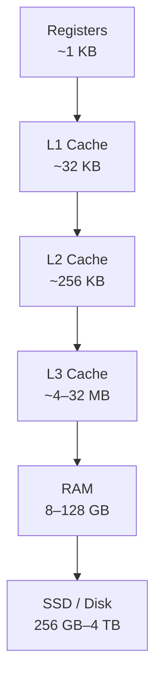
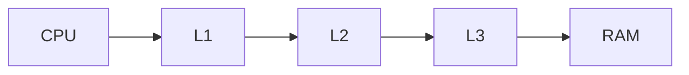
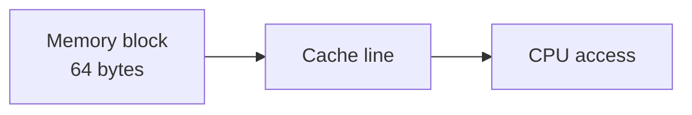
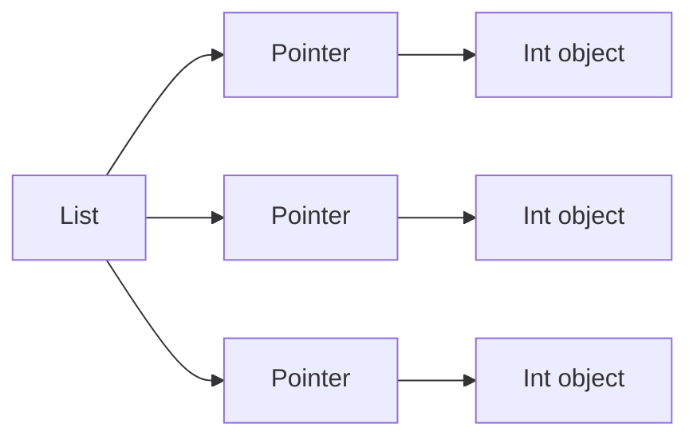
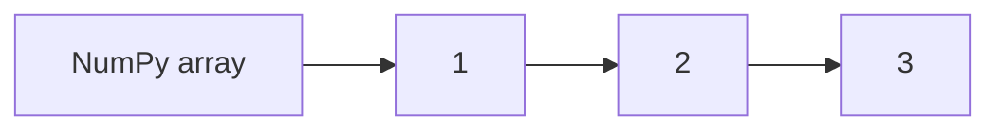
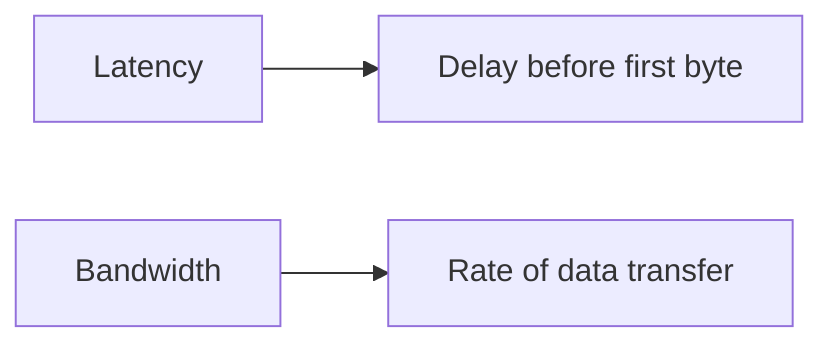

# Memory Overview

Modern processors can execute **billions of instructions per second**, but accessing main memory is far slower than executing arithmetic operations. This large gap between CPU speed and memory speed is known as the **memory wall**.

To bridge this gap, computers use a **memory hierarchy**: multiple layers of storage with different speeds and capacities. Data moves between these layers automatically, allowing frequently used data to be accessed quickly while still supporting large datasets.

Understanding the memory hierarchy is essential for writing high-performance programs. Many performance differences between algorithms arise not from computation but from **how efficiently they access memory**.

---

## 1. The Memory Hierarchy

The **memory hierarchy** organizes storage into layers with different characteristics.

Higher levels are:

* **smaller**
* **faster**
* **more expensive**

Lower levels are:

* **larger**
* **slower**
* **cheaper**

---

### Typical hierarchy

| Level      | Size        | Latency    | Managed By       |
| ---------- | ----------- | ---------- | ---------------- |
| Registers  | ~1 KB       | ~0.25 ns   | Compiler         |
| L1 Cache   | ~32 KB      | ~1 ns      | Hardware         |
| L2 Cache   | ~256–512 KB | ~4 ns      | Hardware         |
| L3 Cache   | ~4–32 MB    | ~12 ns     | Hardware         |
| RAM        | 8–128 GB    | ~80–120 ns | Operating system |
| SSD / Disk | 256 GB–4 TB | ~100 µs    | Operating system |

Latency increases dramatically as we move down the hierarchy.

For comparison:

```text
CPU register access: ~0.25 ns
RAM access:          ~100 ns
SSD access:          ~100,000 ns
```

This means RAM can be **hundreds of times slower** than CPU operations.

---

### Hierarchy visualization



As capacity increases, speed decreases.

---

## 2. How the CPU Accesses Memory

When a program requests data, the CPU checks each level of the hierarchy in order.

1. registers
2. L1 cache
3. L2 cache
4. L3 cache
5. RAM

If the data is not found in a level, the next level must be accessed.

---

### Cache hit vs cache miss

| Event      | Meaning                               |
| ---------- | ------------------------------------- |
| Cache hit  | Data found in cache                   |
| Cache miss | Data must be fetched from lower level |

A cache miss is expensive because data must be copied from a slower layer.

---

#### Data flow visualization



If the requested data is found in L1, the access completes immediately.

If not, the hardware fetches the data from lower levels.

---

## 3. Cache Lines

Caches do not load individual bytes. Instead, they load **blocks of memory** called **cache lines**.

Typical cache line size:

```text
64 bytes
```

When a program accesses a single byte, the entire 64-byte block containing that byte is loaded into cache.

---

### Example

Suppose the program accesses:

```text
address 100
```

The CPU loads the entire block:

```text
64-byte block containing addresses 64–127
```

This means nearby data becomes available **for free**.

---

#### Visualization



---

## 4. Locality of Reference

The memory hierarchy works because programs exhibit **locality**.

Two important patterns appear in most programs.

---

### Temporal locality

Recently accessed data is likely to be used again soon.

Example:

```python
for i in range(1000):
    total += x
```

The variable `x` is reused repeatedly.

---

### Spatial locality

Data near recently accessed memory is likely to be accessed soon.

Example:

```python
for i in range(len(arr)):
    total += arr[i]
```

Array elements are stored next to each other.

Because cache lines load neighboring data, sequential access is very efficient.

---

#### Locality visualization


---

## 5. Why Sequential Access Is Fast

Consider an array of `float64` values.

Each value uses:

```text
8 bytes
```

Since cache lines are **64 bytes**, each cache line contains:

```text
8 float64 values
```

When one value is accessed, the other seven values are already loaded.

Therefore sequential access results in many **cache hits**.

---

### Example

Access pattern:

```text
arr[0], arr[1], arr[2], arr[3]
```

First access:

```
cache miss
```

Remaining accesses:

```
cache hits
```

---

#### Visualization

```mermaid
flowchart LR
    A[arr[0]] --> B[load cache line]
    B --> C[arr[1]]
    B --> D[arr[2]]
    B --> E[arr[3]]
```

---

## 6. Python Memory Layout

Python data structures often store objects **indirectly**, which affects memory performance.

---

### Python integers

Each integer is a full Python object stored on the heap.

Example:

```python
import sys

x = 42
print(sys.getsizeof(x))
```

Typical result:

```text
28 bytes
```

This is much larger than a simple 4-byte or 8-byte integer.

---

### Python lists

A list stores **pointers to objects**, not the objects themselves.

Example:

```python
lst = [1, 2, 3]
```

Memory layout:

```text
list → pointer → int object
```

This means elements are scattered throughout memory.

---

#### Visualization



This layout results in **poor spatial locality**.

---

## 7. NumPy Arrays and Contiguous Memory

NumPy arrays store raw numeric values in **contiguous memory**.

Example:

```python
import numpy as np

arr = np.array([1, 2, 3], dtype=np.int64)
print(arr.nbytes)
```

Output:

```text
24
```

Memory layout:

```text
[1][2][3]
```

Each element occupies exactly 8 bytes.

---

#### Visualization



Because the values are stored next to each other, NumPy achieves excellent spatial locality.

This is one of the primary reasons **NumPy operations are dramatically faster** than equivalent Python loops.

---

## 8. Measuring Memory Bandwidth

The effect of the memory hierarchy can be observed experimentally.

When arrays are small enough to fit in cache, operations are very fast.

As array size increases and exceeds cache capacity, performance drops.

---

### Example experiment

```python
import numpy as np
import time

def measure_bandwidth(size_mb):
    n = size_mb * 1024 * 1024 // 8
    arr = np.random.rand(n)

    _ = np.sum(arr)  # warm up

    start = time.perf_counter()
    for _ in range(10):
        _ = np.sum(arr)

    elapsed = time.perf_counter() - start

    bandwidth = (n * 8 * 10) / elapsed / 1e9
    print(f"{size_mb:6.2f} MB: {bandwidth:.1f} GB/s")

for size in [0.01, 0.1, 1, 10, 100]:
    measure_bandwidth(size)
```

Typical observation:

* small arrays → high bandwidth (cache)
* large arrays → lower bandwidth (RAM)

---

## 9. Memory Latency vs Bandwidth

Two important performance metrics describe memory.

---

### Latency

Latency measures how long it takes to access memory.

Example:

```text
RAM latency ≈ 100 ns
```

This is the delay before data begins to arrive.

---

### Bandwidth

Bandwidth measures how quickly large amounts of data can be transferred.

Example:

```text
Memory bandwidth ≈ 30–80 GB/s
```

Bandwidth determines how quickly large arrays can be processed.

---

#### Visualization



---

## 10. Performance Implications

Understanding memory behavior can dramatically improve program performance.

---

### Prefer contiguous data structures

Good:

```python
numpy arrays
```

Poor:

```python
lists of objects
```

---

### Access memory sequentially

Sequential access benefits from spatial locality.

Random access defeats caching.

---

### Avoid unnecessary allocations

Frequent memory allocation can reduce cache efficiency.

---

### Vectorized operations

NumPy operations operate on contiguous memory blocks, maximizing cache efficiency.

---

## 11. Worked Examples

#### Example 1

Explain why NumPy is faster than Python lists for numerical loops.

NumPy stores values contiguously, allowing efficient cache usage and vectorized instructions.

---

#### Example 2

If a cache line is 64 bytes and each value is 8 bytes, how many values fit in one cache line?

[
64 / 8 = 8
]

---

#### Example 3

Explain the performance drop when arrays exceed cache size.

When arrays no longer fit in cache, accesses must fetch data from RAM, which is much slower.

---

## 12. Exercises

1. What is the purpose of the memory hierarchy?
2. What is a cache hit?
3. What is a cache miss?
4. What is a cache line?
5. What is temporal locality?
6. What is spatial locality?
7. Why are NumPy arrays faster than Python lists for numerical work?
8. How many `float64` values fit in a 64-byte cache line?

---

**Exercise 9.**
A Python `list` of 1,000,000 `float` values and a NumPy `ndarray` of 1,000,000 `float64` values both "store" the same data. Yet iterating over the NumPy array can be 10--100x faster. Explain *why* from the perspective of the memory hierarchy. Specifically, describe the memory layout difference between the two and explain how this affects cache line utilization. How many useful `float64` values does a single 64-byte cache line deliver for each data structure?

??? success "Solution to Exercise 9"
    A Python `list` of floats is an array of **pointers**, where each pointer references a separate Python `float` object allocated somewhere on the heap. These `float` objects are scattered across memory -- they are not contiguous. Each `float` object also carries overhead (reference count, type pointer, etc.), using about 24 bytes per object instead of just 8 bytes for the numeric value.

    A NumPy `ndarray` stores the `float64` values as **raw 8-byte values packed contiguously** in a single memory block.

    Cache impact: A 64-byte cache line fetched for a NumPy array contains $64 / 8 = 8$ useful `float64` values, all adjacent. The next 7 values after a cache miss are "free."

    For a Python list, a cache line fetched for the pointer array contains $64 / 8 = 8$ pointers, but following each pointer to the actual float object triggers a **separate cache miss** (because the float objects are scattered). Each cache line fetched for a float object contains mostly overhead (reference count, type pointer), with only 8 useful bytes out of ~24 bytes fetched.

    The NumPy array achieves near-perfect spatial locality; the Python list forces random-like access patterns due to pointer chasing.

---

**Exercise 10.**
The memory hierarchy has a fundamental design principle: each level acts as a "cache" for the level below it (L1 caches L2, L2 caches RAM, RAM "caches" disk). Explain *why* this layered caching works well despite each level being much smaller than the level below. What statistical property of real program behavior makes this possible? What would happen to performance if programs accessed memory addresses completely at random with no pattern?

??? success "Solution to Exercise 10"
    Layered caching works because real programs exhibit **locality of reference** -- both temporal locality (recently accessed data is likely to be accessed again soon) and spatial locality (nearby memory addresses are likely to be accessed close in time).

    Because of locality, a small fast cache can serve a large fraction of memory requests (the "working set" of a program at any moment is typically much smaller than total data). L1 cache, despite being only ~32--64 KB, often achieves hit rates above 90% because programs repeatedly access the same small set of variables, instructions, and data structures.

    Each level exploits the same principle: the data most likely to be needed next is a small subset of the level below. The working set at each level fits within that level's capacity.

    If programs accessed memory completely at random, every access would be a cache miss at every level. Performance would collapse to the speed of the slowest level actually needed (RAM or disk). The memory hierarchy would provide no benefit, and a CPU running at 4 GHz would stall on almost every instruction, effectively running at the speed of main memory (~100 ns per access, equivalent to ~10 MHz effective speed). The entire rationale for the hierarchy depends on locality.

---

**Exercise 11.**
Consider two algorithms that both sum $N$ floating-point numbers. Algorithm A reads the numbers sequentially from an array. Algorithm B reads numbers from random positions in the array (using random indices). Both perform the same number of additions. Explain why Algorithm A can be dramatically faster than Algorithm B, even though the total amount of data read and the total computation are identical. At what value of $N$ (roughly) would you expect the difference to become significant, and why?

??? success "Solution to Exercise 11"
    Algorithm A (sequential) benefits from **spatial locality** and **hardware prefetching**. When the CPU reads the first element of the array, it fetches an entire 64-byte cache line containing 8 consecutive `float64` values. The next 7 reads are cache hits (essentially free). The CPU's prefetcher also detects the sequential pattern and loads future cache lines before they are needed, further hiding memory latency.

    Algorithm B (random indices) has poor spatial locality. Each random access likely hits a different cache line, wasting the 7 other values loaded with each line. The hardware prefetcher cannot predict the next address, so every access potentially stalls the CPU waiting for RAM (~100 ns per access vs. ~1 ns for a cache hit).

    The difference becomes significant when $N$ exceeds the L1 cache capacity. For a 32 KB L1 cache, that is roughly $32{,}768 / 8 = 4{,}096$ `float64` values. For $N < 4{,}096$, the entire array may fit in L1, and random access still hits cache. Once $N$ exceeds the L1 (and especially the L2/L3 cache), random access increasingly hits RAM, and the performance gap grows to 10--100x.

---

**Exercise 12.**
A cache line is typically 64 bytes. Explain why this size is a design trade-off. What would happen if cache lines were very small (say 1 byte)? What would happen if they were very large (say 4 KB, a full page)? In each extreme case, identify which type of access pattern would suffer and which would benefit.

??? success "Solution to Exercise 12"
    Cache line size is a trade-off between **spatial locality exploitation** and **wasted bandwidth**.

    **Very small cache lines (1 byte):** Every access fetches exactly the byte needed -- no waste. But spatial locality is not exploited at all. Sequential access through an array would require a separate memory fetch for every byte, overwhelming the memory bus. The cache would also need vastly more tag entries (metadata), increasing its complexity and power consumption.

    **Very large cache lines (4 KB):** Sequential access would be extremely efficient -- one fetch loads 4 KB of data. But any access to a different region of memory would evict 4 KB of cached data, even if only a few bytes were needed. Random access patterns would be catastrophic: each access wastes almost the entire 4 KB line. Cache "thrashing" (evicting useful data to make room) would be severe because fewer lines fit in the cache.

    The 64-byte sweet spot balances these concerns: it is large enough to exploit spatial locality for sequential patterns (8 doubles per line) but small enough that random accesses do not waste excessive bandwidth or evict too much useful data.

---

## 13. Short Answers

1. To balance speed and capacity of memory
2. Data found in cache
3. Data must be fetched from lower memory
4. Block of memory transferred between cache and RAM
5. Recently used data reused again
6. Nearby memory accessed together
7. Contiguous memory improves cache efficiency
8. Eight

## 14. Summary

* The **memory hierarchy** organizes storage into layers of different speeds and capacities.
* Registers and caches are extremely fast but small; RAM and disk are large but slower.
* Data moves between levels in **cache lines**, typically 64 bytes.
* Programs benefit from **temporal locality** and **spatial locality**.
* Sequential memory access is faster because cache lines preload nearby data.
* Python objects are scattered in memory, reducing cache efficiency.
* NumPy arrays store contiguous data, enabling much faster numerical computation.

Understanding memory hierarchy and data layout is crucial for designing **high-performance programs and efficient numerical algorithms**.
