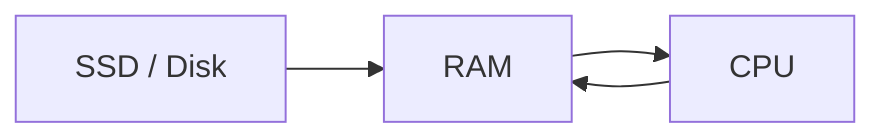
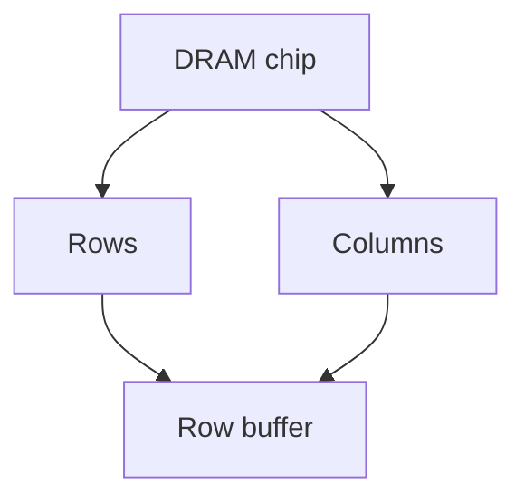
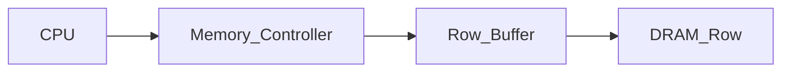
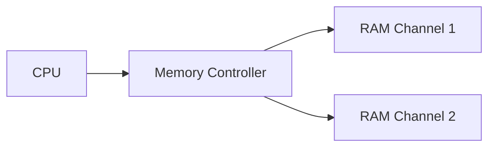
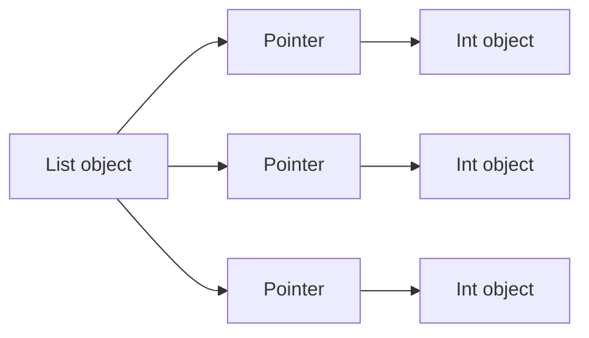
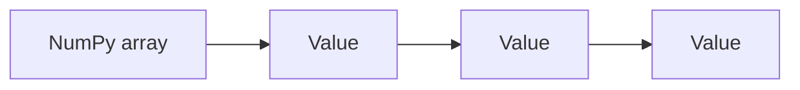

# RAM (Main Memory)

**RAM (Random Access Memory)** is the main working memory of a computer. It stores the programs currently running on the system as well as the data they operate on.

Unlike registers and caches, which are small and extremely fast, RAM is much larger but significantly slower. Despite this latency, RAM provides the capacity needed for large datasets and complex applications.

For many numerical programs—especially those written in Python—**memory bandwidth and latency** become the primary performance bottlenecks rather than CPU speed.

---

# 1. What RAM Stores

RAM contains all active components of a running system.

Examples include:

* program instructions
* application data
* operating system structures
* stack and heap memory
* dynamically allocated objects

When a program starts, its executable code and data are loaded from disk into RAM. The CPU then reads instructions and data from RAM during execution.

---

### Data flow in a running program



Programs constantly move data between the CPU and RAM.

---

# 2. Volatile Memory

RAM is **volatile memory**, meaning its contents disappear when power is lost.

This contrasts with **non-volatile storage**, such as SSDs or hard drives, which retain data permanently.

| Storage Type | Volatile | Example        |
| ------------ | -------- | -------------- |
| Registers    | Yes      | CPU registers  |
| Cache        | Yes      | L1/L2/L3 cache |
| RAM          | Yes      | DRAM           |
| Disk         | No       | SSD / HDD      |

Because RAM is volatile, programs must periodically save important data to persistent storage.

---

# 3. DRAM: How RAM Stores Bits

Modern main memory uses **DRAM (Dynamic Random Access Memory)**.

Each bit is stored as **electric charge in a capacitor**.

The capacitor either:

* contains charge → **1**
* has no charge → **0**

---

### DRAM cell structure

A DRAM cell consists of:

* one capacitor
* one transistor


Because capacitors slowly leak charge, DRAM must periodically **refresh** all stored bits.

---

# 4. Refresh Cycles

DRAM cells lose their stored charge over time.

To maintain correct values, memory controllers refresh each cell periodically.

Typical refresh interval:

```text
~64 milliseconds
```

During a refresh operation, the stored charge is read and rewritten.

Although refresh operations occur frequently, they are scheduled in a way that minimizes performance impact.

---

# 5. DRAM Organization

DRAM chips are organized internally as large **two-dimensional arrays**.

Memory cells are arranged in rows and columns.

To access memory, the controller:

1. selects a row
2. selects a column within that row

---

### DRAM structure visualization



The row buffer temporarily holds an entire row of memory cells.

---

# 6. Row Buffers and Memory Access

DRAM accesses occur in two stages:

1. **row activation**
2. **column access**

When a row is activated, the entire row is loaded into the **row buffer**.

Subsequent accesses to the same row can be performed quickly.

---

## Row hit vs row miss

| Event    | Description                  | Latency    |
| -------- | ---------------------------- | ---------- |
| Row hit  | requested row already open   | ~20 ns     |
| Row miss | different row must be opened | ~80–120 ns |

Row misses are slower because the controller must:

1. close the current row
2. activate a new row
3. read the requested column

---

### Visualization



Row hits reuse the data already in the row buffer.

---

# 7. Memory Latency vs CPU Speed

RAM access is much slower than CPU operations.

Typical values:

| Operation       | Time       |
| --------------- | ---------- |
| CPU cycle       | ~0.3 ns    |
| L1 cache access | ~1 ns      |
| L3 cache access | ~12 ns     |
| RAM access      | ~80–120 ns |

A RAM access may take **hundreds of CPU cycles**.

This gap between CPU speed and memory speed is called the **memory wall**.

---

# 8. DDR Memory

Modern RAM modules use **DDR (Double Data Rate)** technology.

DDR memory transfers data **twice per clock cycle**:

* once on the rising edge
* once on the falling edge

This doubles effective bandwidth without increasing clock frequency.

---

## DDR generations

| Generation | Transfer Rate | Bandwidth (per channel) |
| ---------- | ------------- | ----------------------- |
| DDR4       | ~3200 MT/s    | ~25 GB/s                |
| DDR5       | ~6400 MT/s    | ~50 GB/s                |

(MT/s = million transfers per second)

---

# 9. Memory Channels

Modern CPUs support multiple **memory channels**.

Each channel provides an independent data path between RAM and the memory controller.

---

## Example configurations

| Configuration  | Effective bandwidth |
| -------------- | ------------------- |
| Single channel | 25 GB/s             |
| Dual channel   | ~50 GB/s            |
| Quad channel   | ~100 GB/s           |

Multiple channels allow the CPU to read from several RAM modules simultaneously.

---

### Visualization



More channels increase total bandwidth.

---

# 10. Python Memory Layout

In Python, most data structures allocate objects on the **heap**.

Each object includes metadata such as:

* type information
* reference counts
* memory management fields

This overhead makes Python objects significantly larger than raw data values.

---

## Example

```python
import sys

print(sys.getsizeof(42))
```

Typical result:

```text
28 bytes
```

Even though the integer value itself requires only 4–8 bytes.

---

## Python lists

A Python list stores **pointers to objects**, not the objects themselves.

Example:

```python
lst = [1, 2, 3]
```

Memory structure:

```text
list → pointer → object
```

---

### Visualization



This layout scatters elements throughout memory, reducing cache efficiency.

---

# 11. NumPy and Memory Efficiency

NumPy arrays store values as **raw contiguous memory blocks**.

Example:

```python
import numpy as np

arr = np.zeros(125_000_000, dtype=np.float64)
```

Each element occupies exactly **8 bytes**.

Total memory:

```text
125,000,000 × 8 = 1,000,000,000 bytes
```

or about:

```text
1 GB
```

---

### Visualization



Because the values are stored consecutively, NumPy arrays are both:

* **more memory efficient**
* **more cache friendly**

---

# 12. Memory-Mapped Files

Sometimes datasets are larger than available RAM.

In these cases, programs can use **memory-mapped files**.

Memory mapping allows files on disk to appear as arrays in memory.

The operating system automatically loads pages of the file when needed.

---

## Example

```python
import numpy as np

mmap_arr = np.memmap(
    "large_array.dat",
    dtype="float64",
    mode="w+",
    shape=(100_000_000,)
)

mmap_arr[0] = 42.0
print(mmap_arr[0])
```

The OS transparently swaps data between disk and RAM.

---

### Visualization


This allows programs to work with datasets larger than physical memory.

---

# 13. Worked Examples

### Example 1

How many float64 values fit in 1 GB?

[
1,000,000,000 / 8 = 125,000,000
]

---

### Example 2

Why is RAM slower than cache?

DRAM requires row activation and capacitor refresh, while caches use fast SRAM cells.

---

### Example 3

Explain why Python lists use more memory than NumPy arrays.

Python lists store pointers to separate objects, while NumPy arrays store raw values contiguously.

---

# 14. Exercises

1. What does RAM store?
2. Why is RAM called volatile memory?
3. What technology is used in modern main memory?
4. Why must DRAM refresh its contents?
5. What is a row buffer?
6. What is the difference between a row hit and a row miss?
7. What does DDR stand for?
8. Why are NumPy arrays more memory efficient than Python lists?

---

# 15. Short Answers

1. Active programs and data
2. Data is lost when power is removed
3. DRAM
4. Capacitors leak charge over time
5. Temporary storage for a DRAM row
6. Row hit uses open row; row miss opens a new row
7. Double Data Rate
8. NumPy stores contiguous raw values

---

# 16. Summary

* **RAM** is the main working memory of a computer.
* Modern systems use **DRAM**, which stores bits as electrical charge in capacitors.
* DRAM requires periodic **refresh cycles**.
* Memory accesses depend on **row buffers**, where row hits are faster than row misses.
* RAM latency is far slower than CPU execution speed.
* **DDR technology** increases memory bandwidth by transferring data twice per clock cycle.
* Multiple **memory channels** increase total bandwidth.
* Python objects have large per-object overhead, while **NumPy arrays store raw contiguous data**.
* Techniques such as **memory mapping** allow programs to work with datasets larger than RAM.

Understanding RAM behavior is crucial for building **efficient data-intensive programs and numerical applications**.
