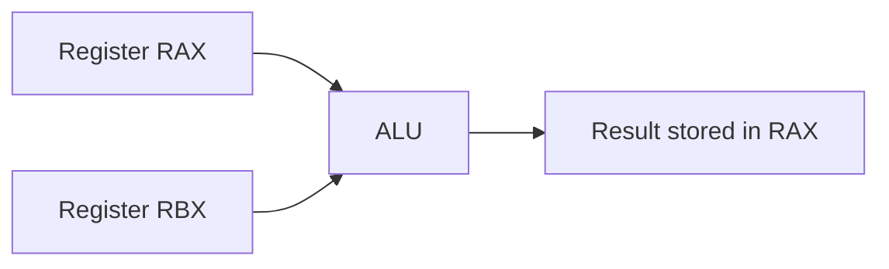
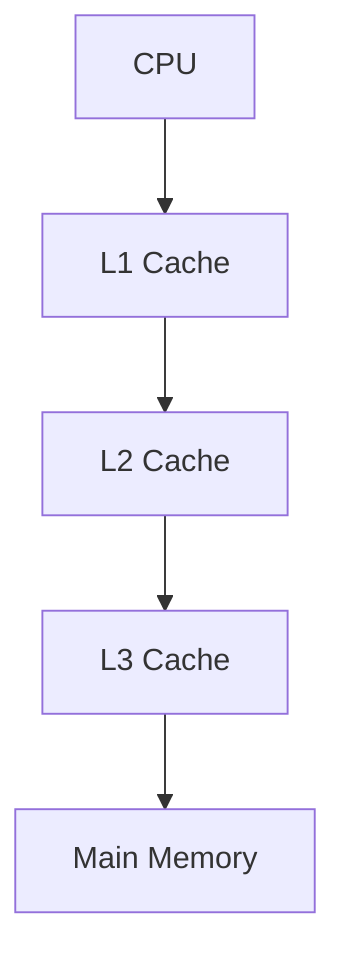
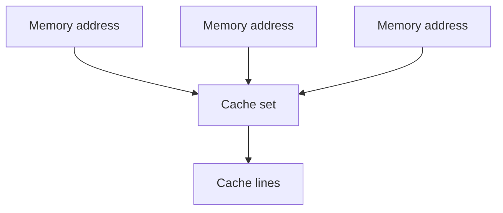
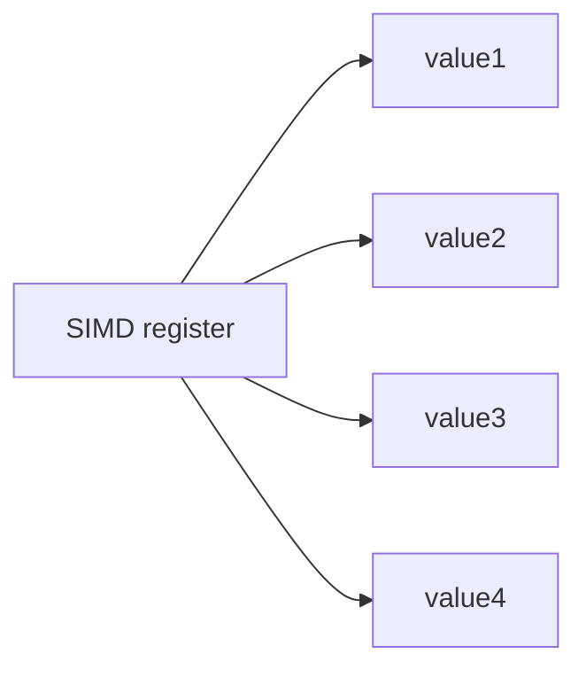
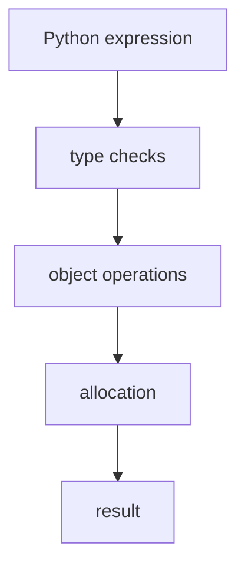
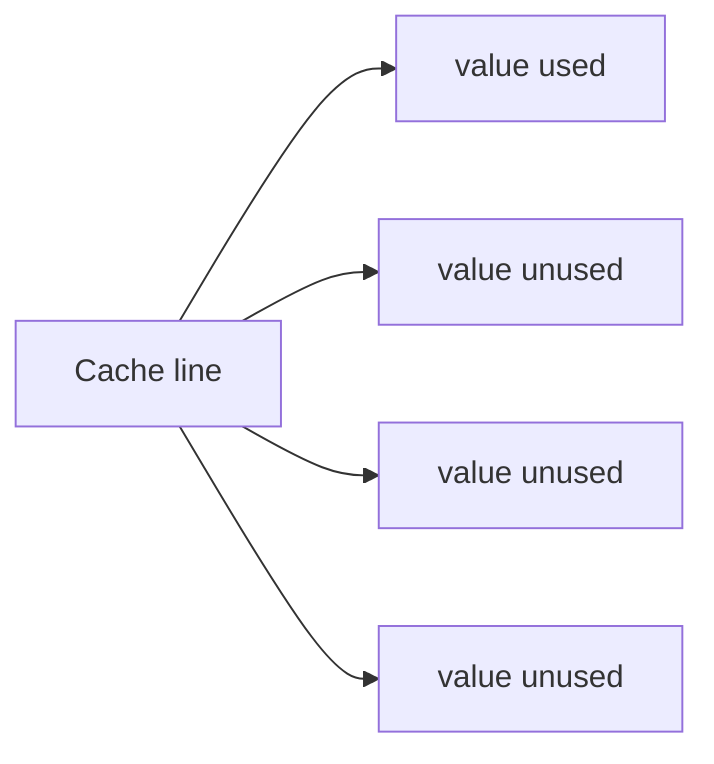

# Registers and Cache

Registers and caches are the **fastest storage locations in a computer**. They sit between the CPU's execution units and main memory, allowing programs to operate on data with extremely low latency.

Because modern processors execute instructions much faster than data can be retrieved from RAM, these small but fast storage layers play a critical role in overall performance.

Understanding registers and caches explains why:

* sequential array processing is fast
* random memory access is slow
* vectorized operations outperform loops
* NumPy is dramatically faster than Python lists for numerical computation

---

## 1. Registers: The Fastest Storage

**Registers** are small storage locations located directly inside the CPU.

They are used to hold:

* intermediate computation results
* operands for arithmetic instructions
* memory addresses
* loop counters and temporary variables

Because registers are part of the processor itself, accessing them requires **only one CPU cycle**.

---

### Register characteristics

Typical properties for modern x86-64 CPUs:

| Property                            | Value        |
| ----------------------------------- | ------------ |
| Number of general-purpose registers | 16           |
| Register size                       | 64 bits      |
| Total capacity                      | ~128 bytes   |
| Access latency                      | ~1 CPU cycle |

Compared to other memory layers, registers are extremely small but extremely fast.

---

### Register usage example

A simple arithmetic operation in machine code might look like:

```text id="j30v79"
ADD RAX, RBX
```

This instruction adds the value in register `RBX` to register `RAX`.

Because both operands are already in registers, the operation completes in a single cycle.

---

#### Visualization



---

## 2. Register Allocation

Registers are limited resources. Programs often require more temporary values than available registers.

Two mechanisms help manage this constraint:

---

### Compiler allocation

Compilers attempt to keep frequently used values in registers.

Example:

```c id="0t86d4"
c = a + b
```

The compiler loads `a` and `b` into registers, performs the addition, and stores the result.

---

### Register renaming

Modern CPUs dynamically map logical registers to physical registers using **register renaming**.

This allows processors to:

* avoid false dependencies
* execute instructions out of order
* improve pipeline utilization

These mechanisms are invisible to software but critical for high performance.

---

## 3. Cache Memory

Caches store recently accessed memory values closer to the CPU.

They are implemented using fast **SRAM** rather than the slower **DRAM** used for main memory.

---

### Cache hierarchy

Most processors use multiple cache levels.

| Cache | Size     | Latency    |
| ----- | -------- | ---------- |
| L1    | ~32 KB   | ~4 cycles  |
| L2    | ~256 KB  | ~12 cycles |
| L3    | ~8–32 MB | ~40 cycles |

---

### L1 cache split

The L1 cache is usually divided into two separate caches:

| Cache | Purpose           |
| ----- | ----------------- |
| L1-I  | instruction cache |
| L1-D  | data cache        |

This separation allows instruction fetching and data access to occur simultaneously.

---

#### Cache hierarchy visualization



Data moves down the hierarchy when needed.

---

## 4. Cache Lines

Caches store memory in blocks called **cache lines**.

Typical size:

```text id="r1k5tq"
64 bytes
```

When a single byte is requested, the entire cache line containing that byte is loaded.

---

### Example

Suppose a program reads memory address:

```text id="9z8htc"
100
```

The CPU loads the block:

```text id="ck7p9p"
64-byte region containing address 100
```

This block might include addresses:

```text id="cy2og1"
64–127
```

---

#### Visualization


This design improves performance when nearby data is accessed.

---

## 5. Sequential Access and Cache Efficiency

Cache lines make **sequential memory access** extremely efficient.

Consider a NumPy array of `float64` values.

Each element uses:

```text id="a4kbf7"
8 bytes
```

Because cache lines contain **64 bytes**, each cache line stores:

```text id="z3k82c"
8 float64 values
```

Thus a single cache miss loads eight elements.

---

### Example access pattern

Sequential access:

```text id="l2jqfh"
arr[0], arr[1], arr[2], arr[3]
```

Behavior:

| Access | Result     |
| ------ | ---------- |
| arr[0] | cache miss |
| arr[1] | cache hit  |
| arr[2] | cache hit  |
| arr[3] | cache hit  |

---

#### Visualization

```mermaid id="k4qnh2"
flowchart LR
    A[arr[0]] --> B[cache line loaded]
    B --> C[arr[1]]
    B --> D[arr[2]]
    B --> E[arr[3]]
```

---

## 6. Cache Associativity

Caches are organized into **sets** containing multiple cache lines.

The number of lines per set defines the **associativity**.

---

### Types of caches

| Type              | Description       |
| ----------------- | ----------------- |
| Direct-mapped     | one line per set  |
| N-way associative | N lines per set   |
| Fully associative | any line anywhere |

Most modern caches are **8-way or 16-way associative**.

---

### Conflict misses

A **conflict miss** occurs when multiple memory addresses map to the same cache set.

If more addresses compete for a set than the associativity allows, lines must be repeatedly evicted.

This can degrade performance significantly.

---

#### Visualization



If too many addresses map to the same set, older lines are evicted.

---

## 7. SIMD Registers and Vectorization

Modern CPUs include **SIMD (Single Instruction Multiple Data)** registers.

These registers allow a single instruction to operate on multiple data elements simultaneously.

---

### SIMD register types

| Register | Size     |
| -------- | -------- |
| XMM      | 128 bits |
| YMM      | 256 bits |
| ZMM      | 512 bits |

Example capacities:

| Data type | Values per register (256-bit) |
| --------- | ----------------------------- |
| float32   | 8                             |
| float64   | 4                             |

---

#### Visualization



Multiple values are processed in parallel.

---

## 8. NumPy and Vectorized Computation

NumPy operations are fast because they:

1. operate on **contiguous memory**
2. use **SIMD instructions**
3. run in **compiled C code**

Example:

```python id="aq9p5c"
import numpy as np

a = np.arange(1_000_000)
b = np.arange(1_000_000)

c = a + b
```

Instead of performing one addition at a time, the CPU processes multiple elements per instruction using SIMD registers.

---

## 9. Python Interpreter Overhead

Pure Python arithmetic is much slower because each operation involves many steps.

Example:

```python id="y10tdg"
x = a + b
```

Internally this requires:

1. type checking
2. method dispatch
3. object allocation
4. reference counting

Instead of a single machine instruction, Python may execute **dozens of instructions**.

---

#### Visualization



NumPy bypasses this overhead by operating on raw memory arrays in compiled code.

---

## 10. Observing Cache Effects

The impact of cache size can be observed experimentally.

When arrays fit in cache, operations are very fast.

When arrays exceed cache capacity, performance drops because data must be fetched from slower memory.

---

### Example experiment

```python id="i21ylt"
import numpy as np
import time

for name, n in [('L1 32KB', 4000), ('L2 256KB', 32000),
                ('L3 8MB', 1000000), ('RAM 64MB', 8000000)]:

    arr = np.random.rand(n)
    _ = np.sum(arr)

    start = time.perf_counter()
    for _ in range(100):
        _ = np.sum(arr)

    elapsed = time.perf_counter() - start
    bw = (n * 8 * 100) / elapsed / 1e9

    print(f"{name:12}: {bw:6.1f} GB/s")
```

Typical result:

* small arrays → high bandwidth
* large arrays → slower bandwidth

---

## 11. Strided Access and Cache Waste

Cache lines improve sequential access but can be wasted by **strided access patterns**.

---

### Example

```python id="5j7bq1"
arr = np.arange(1_000_000, dtype=np.float64)

total_seq = np.sum(arr)
total_strided = np.sum(arr[::64])
```

The strided version accesses only one element per cache line, wasting most of the data fetched.

---

#### Visualization



---

## 12. Worked Examples

#### Example 1

How many `float64` values fit in a 256-bit SIMD register?

[
256 / 64 = 4
]

---

#### Example 2

If a cache line is 64 bytes and each value is 8 bytes:

[
64 / 8 = 8
]

So one cache miss loads 8 elements.

---

#### Example 3

Explain why NumPy operations outperform Python loops.

NumPy performs operations in compiled code using SIMD registers and contiguous memory, avoiding interpreter overhead.

---

## 13. Exercises

1. What are CPU registers used for?
2. How large are general-purpose registers on x86-64?
3. What is a cache line?
4. Why is sequential memory access faster than random access?
5. What is SIMD?
6. How many float64 values fit in a 512-bit register?
7. What causes conflict misses?
8. Why is NumPy faster than Python loops?

---

**Exercise 9.**
A CPU register access takes ~1 cycle, L1 cache takes ~4 cycles, L2 takes ~12 cycles, L3 takes ~40 cycles, and RAM takes ~200 cycles. Explain why the CPU does not simply have one very large, very fast memory instead of this hierarchy. What physical and engineering constraints make a single-level design impossible? Why must faster memory be smaller?

??? success "Solution to Exercise 9"
    Faster memory must be physically closer to the CPU's execution units (speed-of-light delay matters at nanosecond timescales) and uses more transistors per bit (SRAM uses 6 transistors per bit vs. DRAM's 1 transistor + 1 capacitor).

    **Physical constraints:**

    - **Proximity**: Signals travel about 15 cm per nanosecond. A 1-cycle access (0.25 ns at 4 GHz) limits memory to within ~4 cm of the execution units. Larger memories must be physically farther away.
    - **Transistor cost**: SRAM is ~6x less dense than DRAM. A 64 KB L1 cache already occupies significant die area. Scaling it to gigabytes would require an impossibly large chip.
    - **Power**: Faster memories consume more power per bit. A 16 GB SRAM chip running at L1-cache speeds would generate enormous heat.

    The hierarchy is the engineering solution: a tiny amount of the fastest memory (registers, L1) handles the most frequently accessed data, with progressively larger and slower levels catching the rest. Locality of reference ensures that most accesses hit the faster levels, so the average access time is close to the fastest level despite most data residing in the slowest level.

---

**Exercise 10.**
Consider a `for` loop in Python that sums elements of a list:

```python
total = 0
for x in my_list:
    total += x
```

And the NumPy equivalent: `total = np.sum(my_array)`. Both compute the same result. Explain, from the perspective of registers and SIMD, why the NumPy version is dramatically faster. Specifically, describe what happens at the register level in each case -- how many "useful" additions per CPU instruction does each approach achieve?

??? success "Solution to Exercise 10"
    **Python loop at the register level:** Each iteration of the `for` loop requires the Python interpreter to:

    1. Fetch the next object pointer from the list (pointer chase -- likely a cache miss)
    2. Dereference the pointer to reach the `float` object
    3. Check the object's type (is it a `float`? an `int`?)
    4. Extract the raw `float64` value from the object
    5. Perform the addition using a single scalar `ADD` instruction
    6. Create or update the result object, update reference counts

    Each iteration performs **1 useful addition** but executes ~50--100 interpreter instructions.

    **NumPy `np.sum` at the register level:** NumPy calls a compiled C function that:

    1. Loads 4 or 8 `float64` values at once from contiguous memory into a SIMD register (e.g., AVX-256 holds 4 doubles, AVX-512 holds 8)
    2. Performs a single SIMD addition instruction that adds all 4--8 values simultaneously
    3. Repeats with the next block

    Each SIMD instruction performs **4--8 useful additions** with zero interpreter overhead. Combined with perfect spatial locality (contiguous data fills cache lines efficiently), NumPy achieves ~100x more useful work per CPU cycle.

---

**Exercise 11.**
Cache associativity determines how many cache lines can map to the same "set." A direct-mapped cache (1-way associative) is simplest but suffers from **conflict misses**. Explain what a conflict miss is using a concrete example: two arrays A and B whose starting addresses happen to map to the same cache set. How would increasing associativity to 4-way or 8-way help, and what is the trade-off?

??? success "Solution to Exercise 11"
    A **conflict miss** occurs when two memory addresses that the program needs simultaneously map to the same cache set, causing one to evict the other even though the cache has unused capacity in other sets.

    **Concrete example:** Suppose a direct-mapped cache has 256 sets. Array A starts at address `0x0000` and array B starts at address `0x10000`. If the cache maps addresses modulo 256 sets, then `A[0]` and `B[0]` both map to set 0, `A[1]` and `B[1]` both map to set 1, etc. A loop that alternates between `A[i]` and `B[i]`:

    ```python
    for i in range(N):
        result[i] = A[i] + B[i]
    ```

    In a direct-mapped cache, accessing `A[i]` evicts `B[i]`'s cache line (same set), and accessing `B[i]` evicts `A[i]`'s line. Every access is a miss, despite the cache being mostly empty.

    A **4-way associative** cache allows 4 lines per set. Now `A[i]` and `B[i]` can coexist in the same set. The conflict miss disappears. With 8-way, even more concurrent mappings are tolerated.

    **Trade-off:** Higher associativity requires more comparators per set (the cache must check all ways in parallel), increasing hardware complexity, power consumption, and potentially access latency.

---

**Exercise 12.**
A programmer notices that summing a 1D NumPy array of 10 million `float64` values takes 5 ms, but summing the same values stored in a Python list takes 500 ms -- a 100x difference. Break down this 100x factor into its approximate components: how much comes from cache efficiency (memory layout), how much from SIMD vectorization, and how much from Python interpreter overhead (type checking, reference counting, etc.)? Which factor dominates?

??? success "Solution to Exercise 12"
    The ~100x factor decomposes roughly as follows:

    1. **Python interpreter overhead (~20--50x):** Each iteration of the Python loop executes ~50--100 bytecode instructions for type checking, reference counting, object attribute lookup, and bytecode dispatch. The compiled C code in NumPy has zero per-element interpreter overhead. This is typically the **dominant factor**.

    2. **Memory layout / cache efficiency (~2--5x):** Python list elements are scattered heap objects, causing cache misses on nearly every element access (pointer chasing). NumPy's contiguous layout achieves near-perfect cache utilization with 8 values per cache line.

    3. **SIMD vectorization (~4--8x):** NumPy's compiled code can use AVX instructions to process 4 `float64` values per instruction. Python processes one value per (many) instructions.

    **Approximate total:** $30 \times 3 \times 4 \approx 360\text{x}$ potential speedup, though the factors overlap and interact (e.g., interpreter overhead partially includes the cache misses from object access). The observed ~100x is typical because not all factors compound perfectly.

    **Dominant factor:** Interpreter overhead is the largest single contributor. Even with perfect cache behavior, a Python loop adding floats would still be ~20--50x slower than compiled C due to bytecode interpretation.

---

## 14. Short Answers

1. Temporary storage for CPU operations
2. 64 bits
3. Block of memory transferred between cache and RAM
4. Cache lines preload nearby values
5. Single Instruction Multiple Data processing
6. 8
7. Multiple addresses mapping to the same cache set
8. Vectorized compiled operations and contiguous memory

## 15. Summary

* **Registers** are the fastest storage in a computer and hold temporary computation data.
* **Caches** store recently accessed memory to reduce RAM access latency.
* Memory is transferred in **cache lines**, typically 64 bytes.
* Sequential access benefits from **spatial locality**.
* **Cache associativity** affects how memory addresses map to cache sets.
* **SIMD registers** allow multiple values to be processed in parallel.
* NumPy exploits SIMD and contiguous memory to achieve much higher performance than Python loops.

Understanding registers and cache behavior is essential for writing **efficient numerical and high-performance code**.
