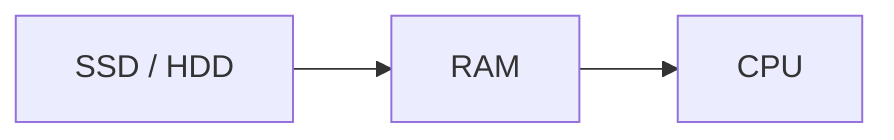
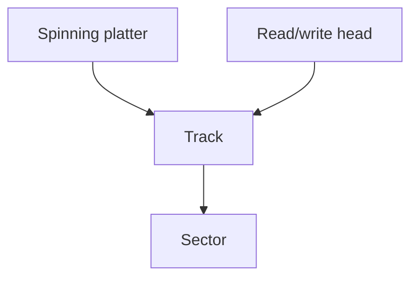
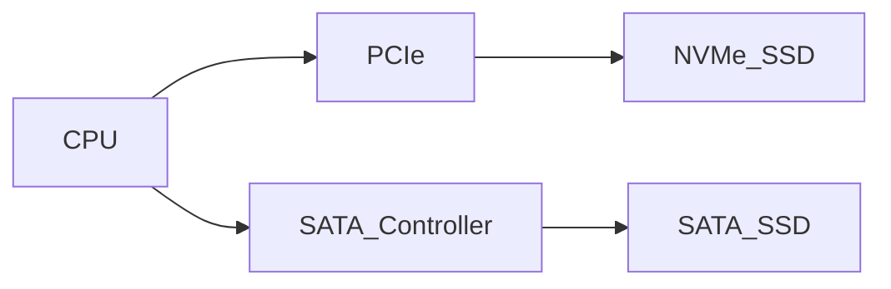
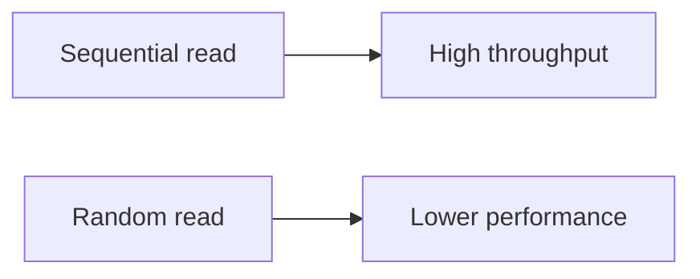

# Storage (SSD and HDD)

Storage devices provide **persistent data storage** for computers. Unlike RAM, which loses its contents when power is removed, storage retains data permanently.

However, storage is much slower than main memory. Accessing data from disk may take **thousands to hundreds of thousands of times longer** than accessing RAM.

Because of this large performance gap, the choice of storage technology and data format can significantly affect the performance of data-intensive programs.

For many Python workloads—especially data science and machine learning—**data loading time from storage can dominate total runtime**.

---

## 1. Persistent Storage

Storage devices retain data even when power is turned off. They store:

* operating systems
* application programs
* databases
* documents and datasets
* backups and archives

When a program starts, its code and data must be **loaded from storage into RAM** before execution.

---

#### Data movement in a program



The CPU cannot execute programs directly from disk; data must first be loaded into memory.

---

## 2. Hard Disk Drives (HDD)

Hard disk drives store data using **magnetic recording** on spinning disks.

Inside an HDD are:

* rotating magnetic platters
* a spindle motor
* read/write heads
* an actuator arm

---

### How HDDs work

Data is stored magnetically on circular tracks on each platter.

To read data:

1. the disk rotates to position the correct sector
2. the actuator moves the read/write head
3. the data is read magnetically

---

#### HDD structure



---

### HDD performance characteristics

Because HDDs rely on mechanical movement, they have relatively high latency.

Typical performance:

| Metric               | Value        |
| -------------------- | ------------ |
| Latency              | 5–15 ms      |
| Sequential bandwidth | 100–200 MB/s |
| Random IOPS          | 50–200       |

(IOPS = input/output operations per second)

Random reads are slow because the disk head must physically move.

---

## 3. Solid-State Drives (SSD)

Solid-state drives store data using **NAND flash memory** rather than magnetic disks.

Because SSDs have **no moving parts**, they are much faster than HDDs.

---

### How SSDs store data

Flash memory cells store electrical charge in floating-gate transistors.

Each cell can represent multiple bits depending on the technology:

| Type | Bits per cell |
| ---- | ------------- |
| SLC  | 1             |
| MLC  | 2             |
| TLC  | 3             |
| QLC  | 4             |

Higher density increases capacity but may reduce performance and durability.

---

#### SSD memory structure


Flash memory is written in **pages** but erased in **blocks**, which complicates memory management.

---

## 4. Flash Translation Layer (FTL)

SSDs use a software layer called the **Flash Translation Layer (FTL)**.

The FTL maps logical block addresses (LBAs) used by the operating system to physical flash memory locations.

The FTL also handles:

* wear leveling
* garbage collection
* bad block management
* error correction

---

#### FTL mapping process


This translation layer allows SSDs to behave like traditional disks while hiding flash-specific complexity.

---

## 5. SATA vs NVMe

SSDs can connect to the system using different interfaces.

---

### SATA SSD

SATA SSDs use the same interface originally designed for hard drives.

Typical characteristics:

| Metric      | Value     |
| ----------- | --------- |
| Latency     | 80–200 µs |
| Bandwidth   | ~500 MB/s |
| Random IOPS | ~90,000   |

SATA bandwidth is limited by the SATA protocol.

---

### NVMe SSD

NVMe (Non-Volatile Memory Express) SSDs connect directly to the CPU using **PCI Express (PCIe)** lanes.

This eliminates the SATA bottleneck.

Typical characteristics:

| Metric      | Value             |
| ----------- | ----------------- |
| Latency     | 20–100 µs         |
| Bandwidth   | 3–7 GB/s          |
| Random IOPS | 500,000–1,000,000 |

---

#### Storage interface comparison



NVMe SSDs provide dramatically higher throughput and lower latency.

---

## 6. Sequential vs Random Access

Storage performance depends heavily on access patterns.

---

### Sequential access

Sequential access reads data in order.

Example:

```text
read bytes 0 → 1 MB
```

This allows the device to stream data efficiently.

---

### Random access

Random access reads data from many different locations.

Example:

```text
read byte 0
read byte 1,000,000
read byte 42
```

Random access is slower because it prevents efficient prefetching and caching.

---

#### Access pattern visualization



---

## 7. File Formats and Data Loading

File format strongly affects performance when loading data.

---

### CSV (text format)

CSV files store data as plain text.

Example:

```text
42,3.14,hello
```

CSV disadvantages:

* large file size
* expensive parsing
* no type information

---

### Parquet (binary columnar format)

Parquet stores data in a **binary column-oriented format**.

Advantages:

* smaller file sizes
* faster loading
* efficient compression
* column-based reading

---

#### File format comparison

| Format  | Type   | Speed |
| ------- | ------ | ----- |
| CSV     | text   | slow  |
| Parquet | binary | fast  |

---

## 8. Python Data Loading

Example comparing CSV and Parquet loading speeds.

```python
import pandas as pd
import time

start = time.perf_counter()
df = pd.read_csv("large_data.csv")
print("CSV:", time.perf_counter() - start)

start = time.perf_counter()
df = pd.read_parquet("large_data.parquet")
print("Parquet:", time.perf_counter() - start)
```

Binary formats typically load **5–10× faster** than CSV.

---

## 9. OS Page Cache

Operating systems cache frequently accessed disk data in RAM.

This is called the **page cache**.

When a program reads a file:

1. the OS loads the file into RAM
2. subsequent reads may come directly from RAM

---

#### Page cache behavior


Because of this caching, repeated reads may appear much faster than the actual disk speed.

Benchmarking disk I/O requires files larger than available RAM.

---

## 10. Processing Data Larger Than RAM

Large datasets may exceed available memory.

Two common approaches allow programs to handle such data.

---

### Chunked processing

Process the file in smaller pieces.

Example:

```python
import pandas as pd

total = 0

for chunk in pd.read_csv("huge.csv", chunksize=100_000):
    total += chunk["value"].sum()

print(total)
```

This approach loads only a portion of the data at a time.

---

### Memory-mapped files

Memory mapping treats a file as an array stored on disk.

Example:

```python
import numpy as np

arr = np.memmap(
    "huge.dat",
    dtype="float64",
    mode="w+",
    shape=(100_000_000,)
)

arr[0] = 3.14
print(arr[0])
```

The OS automatically loads pages of the file into RAM when accessed.

---

#### Memory mapping visualization


This technique allows programs to work with datasets larger than physical memory.

---

## 11. Worked Examples

#### Example 1

Compare latency:

| Device | Latency |
| ------ | ------- |
| RAM    | ~100 ns |
| SSD    | ~100 µs |
| HDD    | ~10 ms  |

An HDD access may be **100,000× slower than RAM**.

---

#### Example 2

How long would it take to read 10 GB sequentially from a 5 GB/s NVMe SSD?

[
10 / 5 = 2 \text{ seconds}
]

---

#### Example 3

Explain why Parquet loads faster than CSV.

Binary columnar storage reduces both file size and parsing overhead.

---

## 12. Exercises

1. What is the difference between volatile and non-volatile memory?
2. How do HDDs store data?
3. Why are SSDs faster than HDDs?
4. What is the Flash Translation Layer?
5. What is the difference between SATA and NVMe?
6. What is sequential access?
7. Why do binary file formats load faster than CSV?
8. What is the OS page cache?

---

**Exercise 9.**
A data scientist loads a 2 GB CSV file into a Pandas DataFrame, which takes 45 seconds. They then save the same data as a Parquet file and reload it, which takes only 3 seconds. Explain the multiple reasons why Parquet is faster than CSV for this workload. Consider: parsing overhead, data representation (text vs. binary), I/O volume (bytes read from disk), and columnar vs. row-based layout. Which of these factors contributes the most to the 15x speedup?

??? success "Solution to Exercise 9"
    The 15x speedup comes from multiple compounding factors:

    **1. Parsing overhead (largest factor, ~5--10x):** CSV is a text format. Every number must be parsed character-by-character from its string representation (e.g., `"3.14159"`) into a binary `float64`. This parsing is computationally expensive. Parquet stores data in binary format -- the bytes on disk are already in the numeric representation Python/Pandas needs, so "loading" is essentially just copying bytes into memory.

    **2. I/O volume (~2--4x):** CSV represents numbers as text strings, which are larger than their binary equivalents. The number `3.14159265358979` is 16 text bytes in CSV but only 8 bytes as a binary `float64`. Parquet also applies compression (e.g., Snappy, zstd), further reducing file size. A 2 GB CSV might be only 400--600 MB as compressed Parquet, meaning less data read from disk.

    **3. Columnar layout (~1.5--2x for typical queries):** Parquet stores data column-by-column, so reading a subset of columns avoids reading the entire file. CSV must scan every row to extract columns. Even when reading all columns, columnar storage compresses better because similar values are adjacent.

    The parsing overhead is typically the dominant factor, followed by reduced I/O volume.

---

**Exercise 10.**
The OS page cache stores recently accessed disk data in RAM so that repeated reads do not hit the disk. Explain why running a Python script that reads a file takes noticeably longer the first time than the second time (even without the script doing any explicit caching). What happens at the OS level between the first and second runs? If the machine has 16 GB of RAM and only 4 GB is used by programs, what happens to the remaining 12 GB?

??? success "Solution to Exercise 10"
    **First run:** The file is not in the OS page cache. The `read()` system call triggers disk I/O -- the OS reads the file from SSD/HDD into RAM (page cache), then copies it to the application's buffer. Disk latency dominates.

    **Second run:** The file's contents remain in the OS page cache (in RAM). The same `read()` system call finds the data already in memory and copies it directly from the page cache -- no disk I/O occurs. The speedup can be 10--1000x.

    The remaining 12 GB of RAM is not wasted. The OS uses unused RAM as page cache, storing recently accessed file data. This happens automatically and transparently -- no application code is needed. If a program later needs that RAM for allocations, the OS evicts page cache entries (since they are just cached copies of disk data and can be re-read if needed).

    This is why `free` on Linux shows most RAM as "used" even with few programs running -- the OS aggressively caches disk data in otherwise-idle memory.

---

**Exercise 11.**
SSDs have no moving parts (unlike HDDs), which makes random reads much faster. However, SSDs still perform significantly worse on random writes than sequential writes. Explain *why* random writes are problematic for flash memory. Consider the erase-before-write constraint, the write amplification problem, and the role of the Flash Translation Layer (FTL) in mitigating these issues.

??? success "Solution to Exercise 11"
    Flash memory has a fundamental asymmetry: **you cannot overwrite a cell directly**. You must first **erase** the entire block containing the cell, then write the new data. Erase operations work on large blocks (typically 128 KB--4 MB), while writes work on smaller pages (typically 4--16 KB).

    **Random writes are problematic because:**

    1. **Erase-before-write constraint:** To modify a single 4 KB page within a 256 KB block, the SSD must read the entire block, erase it, then rewrite all 256 KB (with the one page changed). This is an enormous overhead for a small write.

    2. **Write amplification:** The ratio of data physically written to flash vs. data logically written by the host. For random writes, this ratio can be 10x or higher, because each small write triggers a large block erase-rewrite cycle.

    3. **Wear:** Flash cells can only endure a limited number of erase cycles (~1,000--100,000 depending on technology). High write amplification accelerates wear.

    The **FTL (Flash Translation Layer)** mitigates this by maintaining a logical-to-physical address map. Instead of overwriting in place, it writes new data to a fresh page and updates the map. Old pages are garbage-collected in the background. This converts random logical writes into more sequential physical writes, reducing write amplification but adding complexity and occasional latency spikes during garbage collection.

---

**Exercise 12.**
A programmer needs to process a 50 GB dataset on a machine with 8 GB of RAM. They consider three strategies: (a) load everything into RAM at once, (b) process the file in chunks using `pandas.read_csv(chunksize=...)`, (c) use memory-mapped files with `np.memmap`. Compare and contrast these approaches. Which will fail, which will be slow, and which will work well? Explain the underlying memory mechanism each relies on.

??? success "Solution to Exercise 12"
    **(a) Load everything into RAM at once:** This will **fail** (or cause severe thrashing). The 50 GB dataset cannot fit in 8 GB of RAM. Pandas will try to allocate memory, the OS will begin swapping heavily, and the program will either crash with `MemoryError` or slow to a crawl due to thrashing (continuous swapping between RAM and disk).

    **(b) Chunked processing with `read_csv(chunksize=...)`:** This **works well**. Only one chunk (e.g., 100,000 rows) is in memory at a time. The program processes each chunk and discards it before loading the next. Memory usage stays bounded. The trade-off is that the programmer must write code to accumulate partial results (e.g., running sums, concatenated results). The underlying mechanism is straightforward application-level memory management -- only a small portion of the file is in RAM at any time.

    **(c) Memory-mapped files with `np.memmap`:** This **works well for binary data**. The file is mapped into the process's virtual address space without loading it all into RAM. The OS loads pages on demand (4 KB at a time) as they are accessed, and evicts unused pages when RAM is needed. This relies on the **virtual memory system** -- the OS treats the file as an extension of RAM, paging data in and out transparently. This works best for random access patterns on binary data. For CSV (text) data, `memmap` is not directly useful because the data must still be parsed.

---

## 13. Short Answers

1. Volatile memory loses data without power
2. Magnetic recording on spinning platters
3. No mechanical movement
4. Logical-to-physical flash mapping layer
5. NVMe uses PCIe; SATA uses older disk interface
6. Reading data in order
7. Less parsing and smaller files
8. RAM cache for recently accessed disk data

## 14. Summary

* Storage devices provide **persistent data storage**.
* **HDDs** use spinning magnetic disks and have high latency.
* **SSDs** use flash memory and are much faster.
* **NVMe SSDs** connect via PCIe and provide the highest bandwidth.
* Storage performance depends heavily on **access patterns**.
* Binary file formats such as **Parquet** load much faster than text formats like CSV.
* The **OS page cache** stores frequently accessed disk data in RAM.
* Techniques such as **chunked reading** and **memory mapping** allow programs to process datasets larger than available memory.

Understanding storage performance is crucial for designing efficient **data pipelines and large-scale numerical workflows**.

## Exercises

**Exercise 1.** List the storage devices in order from fastest to slowest access time.

??? success "Solution to Exercise 1"
    From fastest to slowest: CPU registers, L1 cache, L2 cache, L3 cache, RAM, SSD, HDD, tape. Each level trades speed for capacity.

---

**Exercise 2.** Explain why programs that access memory sequentially tend to run faster than those that access memory randomly.

??? success "Solution to Exercise 2"
    Sequential access benefits from spatial locality: when one byte is loaded, nearby bytes are brought into cache automatically (cache lines are typically 64 bytes). Random access causes frequent cache misses, forcing slower loads from main memory.

