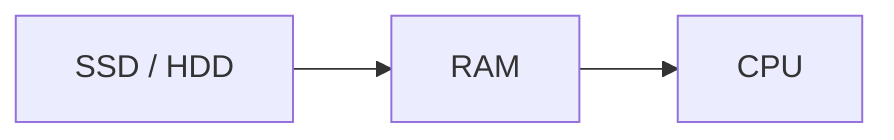
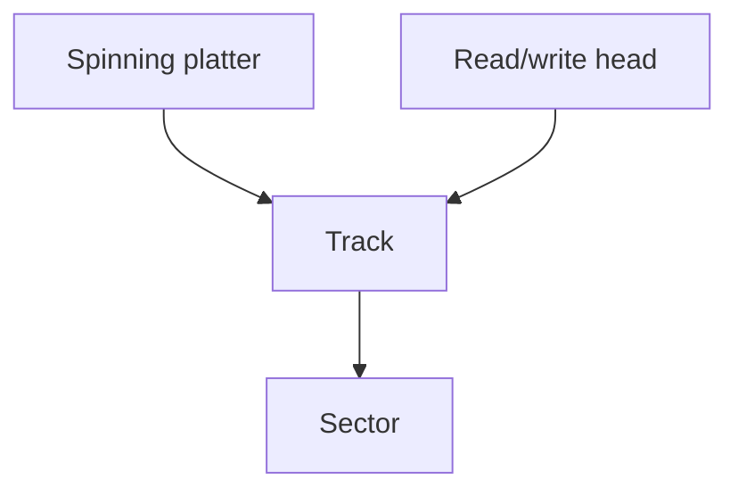
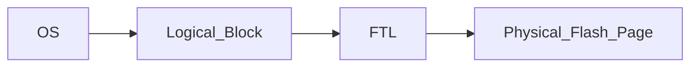
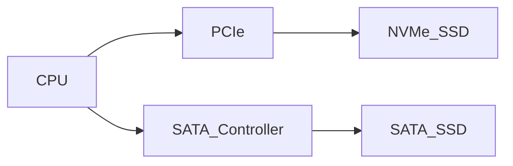
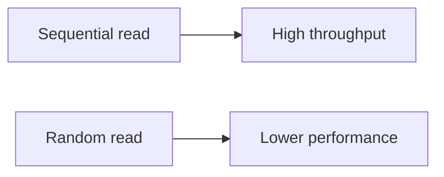
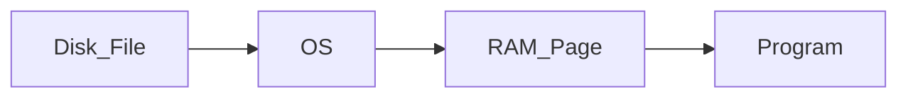

# Storage (SSD and HDD)

Storage devices provide **persistent data storage** for computers. Unlike RAM, which loses its contents when power is removed, storage retains data permanently.

However, storage is much slower than main memory. Accessing data from disk may take **thousands to hundreds of thousands of times longer** than accessing RAM.

Because of this large performance gap, the choice of storage technology and data format can significantly affect the performance of data-intensive programs.

For many Python workloads—especially data science and machine learning—**data loading time from storage can dominate total runtime**.

---

# 1. Persistent Storage

Storage devices retain data even when power is turned off. They store:

* operating systems
* application programs
* databases
* documents and datasets
* backups and archives

When a program starts, its code and data must be **loaded from storage into RAM** before execution.

---

### Data movement in a program



The CPU cannot execute programs directly from disk; data must first be loaded into memory.

---

# 2. Hard Disk Drives (HDD)

Hard disk drives store data using **magnetic recording** on spinning disks.

Inside an HDD are:

* rotating magnetic platters
* a spindle motor
* read/write heads
* an actuator arm

---

## How HDDs work

Data is stored magnetically on circular tracks on each platter.

To read data:

1. the disk rotates to position the correct sector
2. the actuator moves the read/write head
3. the data is read magnetically

---

### HDD structure



---

## HDD performance characteristics

Because HDDs rely on mechanical movement, they have relatively high latency.

Typical performance:

| Metric               | Value        |
| -------------------- | ------------ |
| Latency              | 5–15 ms      |
| Sequential bandwidth | 100–200 MB/s |
| Random IOPS          | 50–200       |

(IOPS = input/output operations per second)

Random reads are slow because the disk head must physically move.

---

# 3. Solid-State Drives (SSD)

Solid-state drives store data using **NAND flash memory** rather than magnetic disks.

Because SSDs have **no moving parts**, they are much faster than HDDs.

---

## How SSDs store data

Flash memory cells store electrical charge in floating-gate transistors.

Each cell can represent multiple bits depending on the technology:

| Type | Bits per cell |
| ---- | ------------- |
| SLC  | 1             |
| MLC  | 2             |
| TLC  | 3             |
| QLC  | 4             |

Higher density increases capacity but may reduce performance and durability.

---

### SSD memory structure


Flash memory is written in **pages** but erased in **blocks**, which complicates memory management.

---

# 4. Flash Translation Layer (FTL)

SSDs use a software layer called the **Flash Translation Layer (FTL)**.

The FTL maps logical block addresses (LBAs) used by the operating system to physical flash memory locations.

The FTL also handles:

* wear leveling
* garbage collection
* bad block management
* error correction

---

### FTL mapping process



This translation layer allows SSDs to behave like traditional disks while hiding flash-specific complexity.

---

# 5. SATA vs NVMe

SSDs can connect to the system using different interfaces.

---

## SATA SSD

SATA SSDs use the same interface originally designed for hard drives.

Typical characteristics:

| Metric      | Value     |
| ----------- | --------- |
| Latency     | 80–200 µs |
| Bandwidth   | ~500 MB/s |
| Random IOPS | ~90,000   |

SATA bandwidth is limited by the SATA protocol.

---

## NVMe SSD

NVMe (Non-Volatile Memory Express) SSDs connect directly to the CPU using **PCI Express (PCIe)** lanes.

This eliminates the SATA bottleneck.

Typical characteristics:

| Metric      | Value             |
| ----------- | ----------------- |
| Latency     | 20–100 µs         |
| Bandwidth   | 3–7 GB/s          |
| Random IOPS | 500,000–1,000,000 |

---

### Storage interface comparison



NVMe SSDs provide dramatically higher throughput and lower latency.

---

# 6. Sequential vs Random Access

Storage performance depends heavily on access patterns.

---

## Sequential access

Sequential access reads data in order.

Example:

```text
read bytes 0 → 1 MB
```

This allows the device to stream data efficiently.

---

## Random access

Random access reads data from many different locations.

Example:

```text
read byte 0
read byte 1,000,000
read byte 42
```

Random access is slower because it prevents efficient prefetching and caching.

---

### Access pattern visualization



---

# 7. File Formats and Data Loading

File format strongly affects performance when loading data.

---

## CSV (text format)

CSV files store data as plain text.

Example:

```text
42,3.14,hello
```

CSV disadvantages:

* large file size
* expensive parsing
* no type information

---

## Parquet (binary columnar format)

Parquet stores data in a **binary column-oriented format**.

Advantages:

* smaller file sizes
* faster loading
* efficient compression
* column-based reading

---

### File format comparison

| Format  | Type   | Speed |
| ------- | ------ | ----- |
| CSV     | text   | slow  |
| Parquet | binary | fast  |

---

# 8. Python Data Loading

Example comparing CSV and Parquet loading speeds.

```python
import pandas as pd
import time

start = time.perf_counter()
df = pd.read_csv("large_data.csv")
print("CSV:", time.perf_counter() - start)

start = time.perf_counter()
df = pd.read_parquet("large_data.parquet")
print("Parquet:", time.perf_counter() - start)
```

Binary formats typically load **5–10× faster** than CSV.

---

# 9. OS Page Cache

Operating systems cache frequently accessed disk data in RAM.

This is called the **page cache**.

When a program reads a file:

1. the OS loads the file into RAM
2. subsequent reads may come directly from RAM

---

### Page cache behavior


Because of this caching, repeated reads may appear much faster than the actual disk speed.

Benchmarking disk I/O requires files larger than available RAM.

---

# 10. Processing Data Larger Than RAM

Large datasets may exceed available memory.

Two common approaches allow programs to handle such data.

---

## Chunked processing

Process the file in smaller pieces.

Example:

```python
import pandas as pd

total = 0

for chunk in pd.read_csv("huge.csv", chunksize=100_000):
    total += chunk["value"].sum()

print(total)
```

This approach loads only a portion of the data at a time.

---

## Memory-mapped files

Memory mapping treats a file as an array stored on disk.

Example:

```python
import numpy as np

arr = np.memmap(
    "huge.dat",
    dtype="float64",
    mode="w+",
    shape=(100_000_000,)
)

arr[0] = 3.14
print(arr[0])
```

The OS automatically loads pages of the file into RAM when accessed.

---

### Memory mapping visualization



This technique allows programs to work with datasets larger than physical memory.

---

# 11. Worked Examples

### Example 1

Compare latency:

| Device | Latency |
| ------ | ------- |
| RAM    | ~100 ns |
| SSD    | ~100 µs |
| HDD    | ~10 ms  |

An HDD access may be **100,000× slower than RAM**.

---

### Example 2

How long would it take to read 10 GB sequentially from a 5 GB/s NVMe SSD?

[
10 / 5 = 2 \text{ seconds}
]

---

### Example 3

Explain why Parquet loads faster than CSV.

Binary columnar storage reduces both file size and parsing overhead.

---

# 12. Exercises

1. What is the difference between volatile and non-volatile memory?
2. How do HDDs store data?
3. Why are SSDs faster than HDDs?
4. What is the Flash Translation Layer?
5. What is the difference between SATA and NVMe?
6. What is sequential access?
7. Why do binary file formats load faster than CSV?
8. What is the OS page cache?

---

# 13. Short Answers

1. Volatile memory loses data without power
2. Magnetic recording on spinning platters
3. No mechanical movement
4. Logical-to-physical flash mapping layer
5. NVMe uses PCIe; SATA uses older disk interface
6. Reading data in order
7. Less parsing and smaller files
8. RAM cache for recently accessed disk data

---

# 14. Summary

* Storage devices provide **persistent data storage**.
* **HDDs** use spinning magnetic disks and have high latency.
* **SSDs** use flash memory and are much faster.
* **NVMe SSDs** connect via PCIe and provide the highest bandwidth.
* Storage performance depends heavily on **access patterns**.
* Binary file formats such as **Parquet** load much faster than text formats like CSV.
* The **OS page cache** stores frequently accessed disk data in RAM.
* Techniques such as **chunked reading** and **memory mapping** allow programs to process datasets larger than available memory.

Understanding storage performance is crucial for designing efficient **data pipelines and large-scale numerical workflows**.
