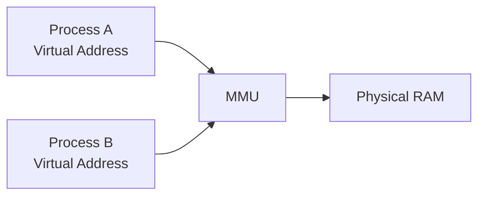
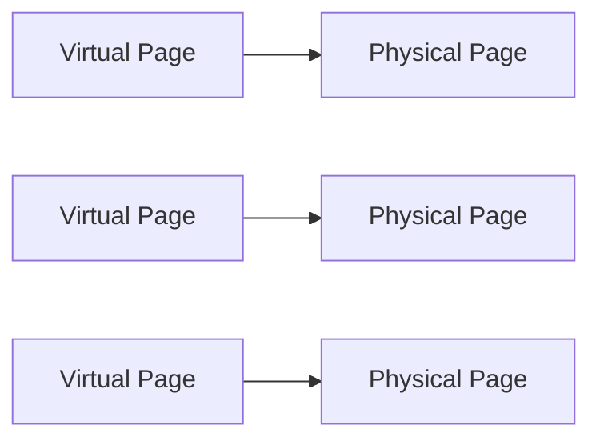
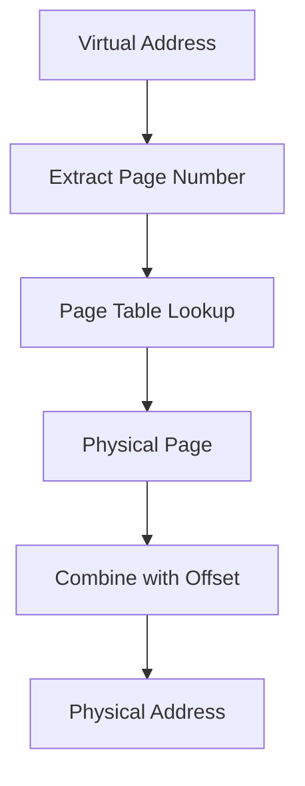
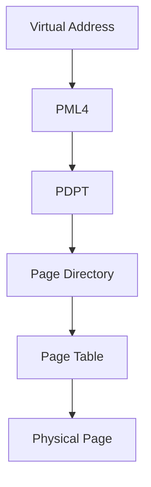
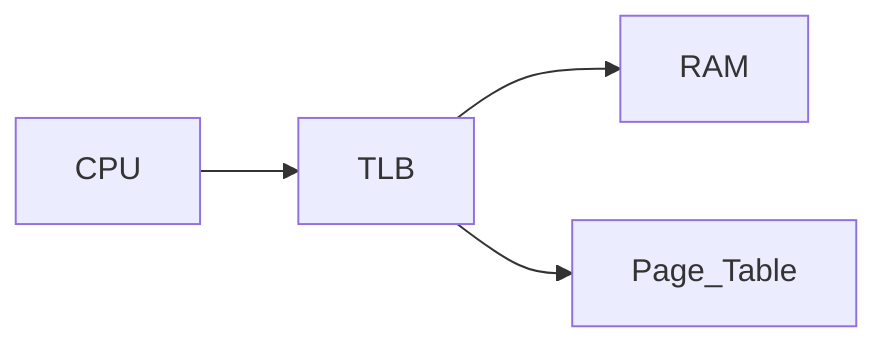
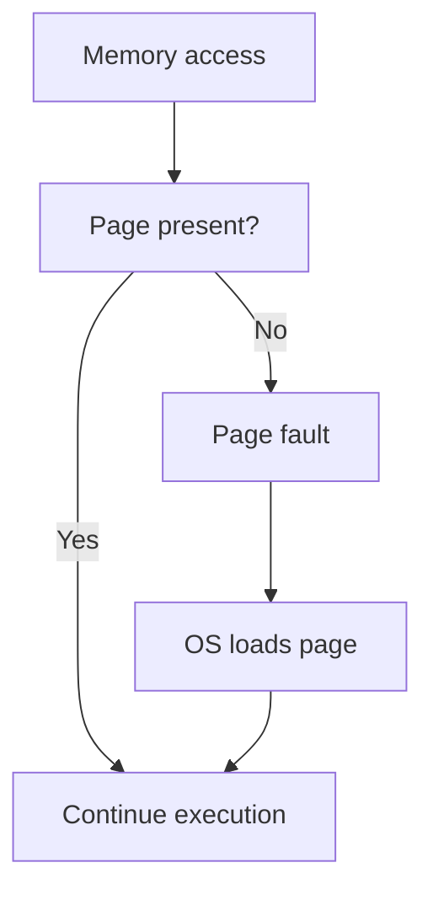
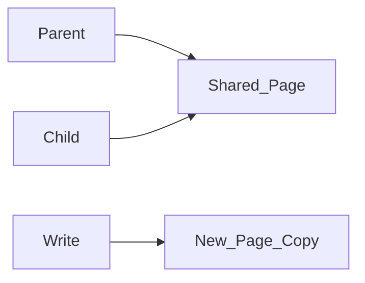

# Virtual Memory

Modern operating systems give every process the illusion that it has access to a large, continuous block of memory. This abstraction is called **virtual memory**.

Virtual memory provides three essential capabilities:

* **process isolation** — programs cannot access each other's memory
* **memory protection** — illegal accesses are detected and prevented
* **memory oversubscription** — programs can use more memory than physically installed

Virtual memory is implemented through cooperation between:

* the **operating system**
* the CPU’s **Memory Management Unit (MMU)**

---

## 1. Virtual vs Physical Memory

Computers contain a limited amount of **physical RAM**. However, programs use **virtual addresses** instead of physical ones.

Each process sees its own **virtual address space**, which the operating system maps to physical memory.

---

### Example

Two processes may both use the same virtual address:

```text
0x7ffd12340000
```

But this address may refer to **different physical memory locations**.

---

#### Visualization



The MMU translates virtual addresses into physical ones.

---

## 2. Pages

Virtual memory divides memory into fixed-size blocks called **pages**.

Typical page size:

```text
4 KB
```

Both virtual memory and physical memory are divided into pages.

---

### Example

A 4 KB page contains:

```text
4096 bytes
```

If a program uses 100 MB of memory:

[
100,000,000 / 4096 \approx 24,400 \text{ pages}
]

---

#### Visualization



Pages can be mapped to any location in physical memory.

---

## 3. Page Tables

The mapping between virtual pages and physical pages is stored in **page tables**.

Each process has its own page table.

A page table entry contains:

* physical page number
* access permissions
* presence flag (in RAM or not)
* other metadata

---

#### Address translation structure


Whenever a program accesses memory, the CPU must perform this translation.

---

## 4. Address Translation

A virtual address consists of two components:

| Field       | Purpose              |
| ----------- | -------------------- |
| Page number | identifies the page  |
| Offset      | position within page |

Example with 4 KB pages:

```text
Offset bits = log2(4096) = 12 bits
```

The remaining bits represent the virtual page number.

---

#### Example translation

```text
Virtual address:
0x7ffd12345678
```

Split into:

```
Page number
Offset
```

The page number is looked up in the page table to obtain the physical page.

---

#### Translation process



---

## 5. Multi-Level Page Tables

Modern CPUs use **multi-level page tables** to reduce memory overhead.

Example: x86-64 uses **four levels** of page tables.

Each lookup involves several steps:

1. Page Map Level 4 (PML4)
2. Page Directory Pointer Table
3. Page Directory
4. Page Table

---

#### Page walk visualization



Without optimization, each memory access could require multiple additional memory accesses.

To avoid this overhead, CPUs use a cache called the **TLB**.

---

## 6. Translation Lookaside Buffer (TLB)

The **TLB (Translation Lookaside Buffer)** is a small cache that stores recent virtual-to-physical address translations.

Typical properties:

| Property | Value       |
| -------- | ----------- |
| Entries  | 64–128      |
| Coverage | ~256–512 KB |

If a translation is in the TLB, the CPU avoids a page table lookup.

---

### TLB hit vs TLB miss

| Event    | Meaning                   |
| -------- | ------------------------- |
| TLB hit  | translation found         |
| TLB miss | page table must be walked |

Frequent TLB misses can significantly slow programs.

---

#### TLB visualization



The TLB acts as a cache for address translations.

---

## 7. Page Faults

A **page fault** occurs when a program accesses a page that is not currently in RAM.

The operating system then handles the fault.

---

### Types of page faults

| Type          | Description                         |
| ------------- | ----------------------------------- |
| Minor fault   | page already in RAM but not mapped  |
| Major fault   | page must be loaded from disk       |
| Invalid fault | illegal access (segmentation fault) |

---

#### Page fault sequence



Major page faults are expensive because they require disk access.

---

## 8. Swap Space

When physical RAM becomes full, the OS may move inactive pages to disk.

This area on disk is called **swap space**.

Swap allows the system to support programs whose combined memory usage exceeds available RAM.

---

### Thrashing

If the system constantly moves pages between RAM and disk, it experiences **thrashing**.

Symptoms include:

* extremely slow performance
* high disk activity
* low CPU utilization

Thrashing occurs when the **working set** of programs exceeds available RAM.

---

#### Visualization


Constant swapping severely degrades performance.

---

## 9. Copy-on-Write (COW)

Operating systems use **copy-on-write** to avoid unnecessary memory duplication.

When a process is duplicated using `fork()`:

* parent and child share the same physical pages
* pages are marked read-only

If either process writes to a page, the OS creates a private copy.

---

#### Copy-on-write process



This technique saves both memory and time.

---

### Python multiprocessing

Python's `multiprocessing` module often relies on `fork()`.

However, CPython uses **reference counting**, which can modify objects and trigger copy-on-write copies even for seemingly read-only operations.

This can increase memory usage unexpectedly.

---

## 10. Memory-Mapped Files

Virtual memory enables **memory-mapped files**.

In this approach, files on disk appear as memory arrays.

The OS loads pages into RAM only when accessed.

---

### Example

```python
import numpy as np

arr = np.memmap(
    "huge.dat",
    dtype="float64",
    mode="w+",
    shape=(1_000_000_000,)
)
```

This creates an array with:

```text
8 GB virtual size
```

but only the accessed pages are loaded into RAM.

---

#### Visualization


Memory mapping allows programs to process datasets larger than physical memory.

---

## 11. Measuring Virtual vs Physical Memory

Programs often allocate more virtual memory than physical RAM.

Example:

```python
import psutil
import os

p = psutil.Process(os.getpid())
mem = p.memory_info()

print(f"RSS: {mem.rss / 1e6:.1f} MB")
print(f"VMS: {mem.vms / 1e6:.1f} MB")
```

---

### Definitions

| Metric | Meaning                     |
| ------ | --------------------------- |
| RSS    | resident physical memory    |
| VMS    | total virtual address space |

Virtual memory can exceed physical RAM.

---

## 12. Worked Examples

#### Example 1

If page size is 4 KB, how many pages are required for 1 GB of memory?

[
1,000,000,000 / 4096 \approx 244,000
]

---

#### Example 2

Why are TLB misses expensive?

Because the CPU must walk the multi-level page table.

---

#### Example 3

Explain why memory-mapped arrays allow datasets larger than RAM.

Pages are loaded into RAM only when accessed.

---

## 13. Exercises

1. What is virtual memory?
2. What component translates virtual addresses?
3. What is a page?
4. What is a page table?
5. What is a TLB?
6. What is a page fault?
7. What happens during thrashing?
8. What is copy-on-write?

---

## 14. Short Answers

1. Abstraction that maps virtual addresses to physical memory
2. Memory Management Unit (MMU)
3. Fixed-size memory block (typically 4 KB)
4. Structure mapping virtual pages to physical pages
5. Cache of recent address translations
6. Access to a page not currently mapped in RAM
7. Continuous swapping between RAM and disk
8. Pages shared until modified

---

## 15. Summary

* **Virtual memory** gives each process its own address space.
* The **MMU** translates virtual addresses to physical addresses using page tables.
* Memory is divided into **pages**, typically 4 KB.
* **TLBs** cache recent address translations to avoid expensive page table walks.
* **Page faults** occur when a page is not currently in RAM.
* **Swap space** extends memory to disk but can cause thrashing.
* **Copy-on-write** allows processes to share memory until modification.
* **Memory-mapped files** allow programs to work with datasets larger than RAM.

Virtual memory is a fundamental abstraction that enables **process isolation, memory protection, and scalable memory management** in modern operating systems.
