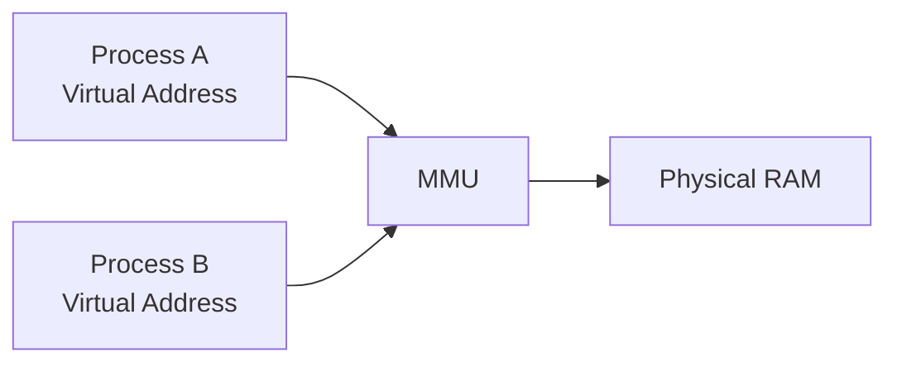
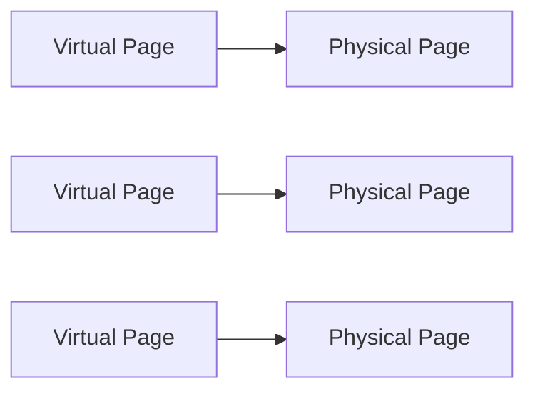
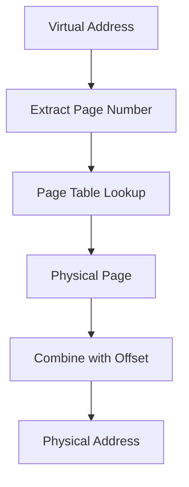
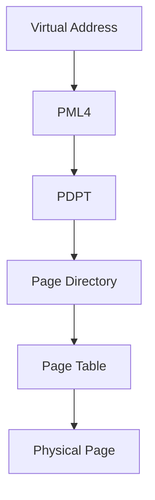
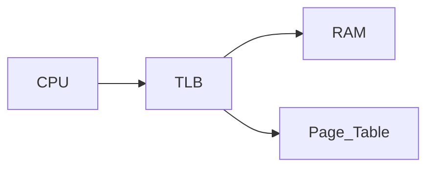
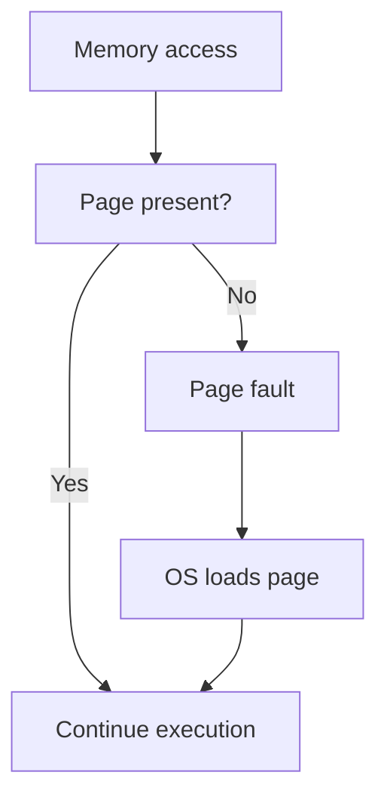
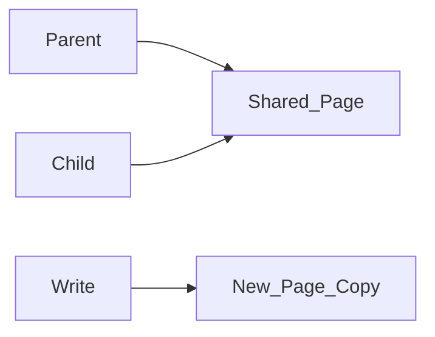

# Virtual Memory

Modern operating systems give every process the illusion that it has access to a large, continuous block of memory. This abstraction is called **virtual memory**.

Virtual memory provides three essential capabilities:

* **process isolation** — programs cannot access each other's memory
* **memory protection** — illegal accesses are detected and prevented
* **memory oversubscription** — programs can use more memory than physically installed

Virtual memory is implemented through cooperation between:

* the **operating system**
* the CPU’s **Memory Management Unit (MMU)**

---

## 1. Virtual vs Physical Memory

Computers contain a limited amount of **physical RAM**. However, programs use **virtual addresses** instead of physical ones.

Each process sees its own **virtual address space**, which the operating system maps to physical memory.

---

### Example

Two processes may both use the same virtual address:

```text
0x7ffd12340000
```

But this address may refer to **different physical memory locations**.

---

#### Visualization



The MMU translates virtual addresses into physical ones.

---

## 2. Pages

Virtual memory divides memory into fixed-size blocks called **pages**.

Typical page size:

```text
4 KB
```

Both virtual memory and physical memory are divided into pages.

---

### Example

A 4 KB page contains:

```text
4096 bytes
```

If a program uses 100 MB of memory:

[
100,000,000 / 4096 \approx 24,400 \text{ pages}
]

---

#### Visualization



Pages can be mapped to any location in physical memory.

---

## 3. Page Tables

The mapping between virtual pages and physical pages is stored in **page tables**.

Each process has its own page table.

A page table entry contains:

* physical page number
* access permissions
* presence flag (in RAM or not)
* other metadata

---

#### Address translation structure


Whenever a program accesses memory, the CPU must perform this translation.

---

## 4. Address Translation

A virtual address consists of two components:

| Field       | Purpose              |
| ----------- | -------------------- |
| Page number | identifies the page  |
| Offset      | position within page |

Example with 4 KB pages:

```text
Offset bits = log2(4096) = 12 bits
```

The remaining bits represent the virtual page number.

---

#### Example translation

```text
Virtual address:
0x7ffd12345678
```

Split into:

```
Page number
Offset
```

The page number is looked up in the page table to obtain the physical page.

---

#### Translation process



---

## 5. Multi-Level Page Tables

Modern CPUs use **multi-level page tables** to reduce memory overhead.

Example: x86-64 uses **four levels** of page tables.

Each lookup involves several steps:

1. Page Map Level 4 (PML4)
2. Page Directory Pointer Table
3. Page Directory
4. Page Table

---

#### Page walk visualization



Without optimization, each memory access could require multiple additional memory accesses.

To avoid this overhead, CPUs use a cache called the **TLB**.

---

## 6. Translation Lookaside Buffer (TLB)

The **TLB (Translation Lookaside Buffer)** is a small cache that stores recent virtual-to-physical address translations.

Typical properties:

| Property | Value       |
| -------- | ----------- |
| Entries  | 64–128      |
| Coverage | ~256–512 KB |

If a translation is in the TLB, the CPU avoids a page table lookup.

---

### TLB hit vs TLB miss

| Event    | Meaning                   |
| -------- | ------------------------- |
| TLB hit  | translation found         |
| TLB miss | page table must be walked |

Frequent TLB misses can significantly slow programs.

---

#### TLB visualization



The TLB acts as a cache for address translations.

---

## 7. Page Faults

A **page fault** occurs when a program accesses a page that is not currently in RAM.

The operating system then handles the fault.

---

### Types of page faults

| Type          | Description                         |
| ------------- | ----------------------------------- |
| Minor fault   | page already in RAM but not mapped  |
| Major fault   | page must be loaded from disk       |
| Invalid fault | illegal access (segmentation fault) |

---

#### Page fault sequence



Major page faults are expensive because they require disk access.

---

## 8. Swap Space

When physical RAM becomes full, the OS may move inactive pages to disk.

This area on disk is called **swap space**.

Swap allows the system to support programs whose combined memory usage exceeds available RAM.

---

### Thrashing

If the system constantly moves pages between RAM and disk, it experiences **thrashing**.

Symptoms include:

* extremely slow performance
* high disk activity
* low CPU utilization

Thrashing occurs when the **working set** of programs exceeds available RAM.

---

#### Visualization


Constant swapping severely degrades performance.

---

## 9. Copy-on-Write (COW)

Operating systems use **copy-on-write** to avoid unnecessary memory duplication.

When a process is duplicated using `fork()`:

* parent and child share the same physical pages
* pages are marked read-only

If either process writes to a page, the OS creates a private copy.

---

#### Copy-on-write process



This technique saves both memory and time.

---

### Python multiprocessing

Python's `multiprocessing` module often relies on `fork()`.

However, CPython uses **reference counting**, which can modify objects and trigger copy-on-write copies even for seemingly read-only operations.

This can increase memory usage unexpectedly.

---

## 10. Memory-Mapped Files

Virtual memory enables **memory-mapped files**.

In this approach, files on disk appear as memory arrays.

The OS loads pages into RAM only when accessed.

---

### Example

```python
import numpy as np

arr = np.memmap(
    "huge.dat",
    dtype="float64",
    mode="w+",
    shape=(1_000_000_000,)
)
```

This creates an array with:

```text
8 GB virtual size
```

but only the accessed pages are loaded into RAM.

---

#### Visualization


Memory mapping allows programs to process datasets larger than physical memory.

---

## 11. Measuring Virtual vs Physical Memory

Programs often allocate more virtual memory than physical RAM.

Example:

```python
import psutil
import os

p = psutil.Process(os.getpid())
mem = p.memory_info()

print(f"RSS: {mem.rss / 1e6:.1f} MB")
print(f"VMS: {mem.vms / 1e6:.1f} MB")
```

---

### Definitions

| Metric | Meaning                     |
| ------ | --------------------------- |
| RSS    | resident physical memory    |
| VMS    | total virtual address space |

Virtual memory can exceed physical RAM.

---

## 12. Worked Examples

#### Example 1

If page size is 4 KB, how many pages are required for 1 GB of memory?

[
1,000,000,000 / 4096 \approx 244,000
]

---

#### Example 2

Why are TLB misses expensive?

Because the CPU must walk the multi-level page table.

---

#### Example 3

Explain why memory-mapped arrays allow datasets larger than RAM.

Pages are loaded into RAM only when accessed.

---

## 13. Exercises

1. What is virtual memory?
2. What component translates virtual addresses?
3. What is a page?
4. What is a page table?
5. What is a TLB?
6. What is a page fault?
7. What happens during thrashing?
8. What is copy-on-write?

---

**Exercise 9.**
Two Python processes each import NumPy and load the same 1 GB dataset using `np.load()`. A naive analysis suggests the system needs 2 GB of RAM for the data alone. Explain how **copy-on-write (COW)** combined with **virtual memory** can allow both processes to share the same physical memory pages for the data, using only ~1 GB. Under what conditions does the sharing break, and what happens to memory usage when one process modifies the data?

??? success "Solution to Exercise 9"
    When both processes load the same file using `np.load()`, the OS can use **memory-mapped file I/O** underneath. The virtual memory system maps the file's contents into each process's virtual address space. Both processes' page tables point to the **same physical pages** in RAM, so the data exists only once in physical memory (~1 GB).

    This works because of copy-on-write: the pages are marked as read-only in both processes' page tables. As long as both processes only read the data, they share the same physical pages transparently.

    **When sharing breaks:** If one process modifies the data (e.g., `data[0] = 999`), the modification triggers a **page fault**. The OS intercepts it, copies the affected 4 KB page to a new physical page, updates the modifying process's page table to point to the copy, and marks it as writable. Only the modified page is duplicated -- all other pages remain shared.

    If Process A modifies 100 MB of the 1 GB dataset, total physical memory usage grows from ~1 GB to ~1.1 GB (the shared 900 MB plus two copies of the modified 100 MB), not 2 GB.

---

**Exercise 10.**
A programmer runs `htop` and sees a Python process using 4 GB of "virtual memory" (VIRT) but only 500 MB of "resident memory" (RES). They panic, thinking their program has a memory leak. Explain why VIRT and RES differ, and why a high VIRT value is not necessarily a problem. What does each metric actually measure, and which one better reflects the program's actual impact on the system?

??? success "Solution to Exercise 10"
    **VIRT (virtual memory)** is the total size of the process's virtual address space -- it includes all memory the process has *mapped*, regardless of whether it is actually using it. This includes:

    - Memory-mapped files (which may not be loaded into RAM yet)
    - Shared libraries (mapped but shared with other processes)
    - Memory allocated but not yet touched (not backed by physical pages)
    - Reserved address space from `mmap` calls

    **RES (resident memory)** is the amount of physical RAM currently used by the process -- pages that are actually in RAM right now.

    A high VIRT with low RES is normal and not a problem. It means the process has mapped large regions of virtual address space but is only actively using a small portion. Virtual address space is essentially free (it is just entries in a page table); physical RAM is the scarce resource.

    **RES** better reflects the program's actual impact on the system. A 4 GB VIRT with 500 MB RES means the program is using 500 MB of actual RAM. The 3.5 GB difference is virtual space that has been reserved but not (yet) backed by physical memory.

---

**Exercise 11.**
Pages are typically 4 KB, but modern CPUs also support "huge pages" of 2 MB or 1 GB. Explain *why* larger page sizes can improve performance for programs that allocate very large blocks of memory (e.g., a 10 GB NumPy array). Consider the role of the TLB (Translation Lookaside Buffer) and the number of page table entries required. What is the trade-off -- when would huge pages hurt performance?

??? success "Solution to Exercise 11"
    A 10 GB NumPy array with 4 KB pages requires $10 \times 1024 \times 1024 / 4 \approx 2{,}621{,}440$ page table entries and the same number of virtual-to-physical mappings.

    The TLB caches recent translations and typically holds 512--4096 entries. With 4 KB pages, the TLB can cover at most $4096 \times 4\text{ KB} = 16\text{ MB}$. Iterating through a 10 GB array causes constant TLB misses, each requiring a page table walk (4--5 memory accesses for a 4-level page table). These TLB misses can add ~10--20% overhead for memory-intensive workloads.

    With 2 MB huge pages, the same 10 GB array requires only $10 \times 1024 / 2 = 5{,}120$ entries. The TLB can cover $4096 \times 2\text{ MB} = 8\text{ GB}$ -- nearly the entire array. TLB misses become rare, eliminating the page-table-walk overhead.

    **Trade-off:** Huge pages waste memory through **internal fragmentation**. If a program allocates a small amount (e.g., 100 KB), a 2 MB huge page wastes 1.9 MB. For programs with many small allocations (typical in Python due to many small objects), huge pages can increase total memory consumption significantly. Huge pages also make memory management less flexible -- the OS must find contiguous 2 MB blocks of physical memory, which becomes harder as memory fragments over time.

---

**Exercise 12.**
Process isolation through virtual memory means that one process cannot directly read another process's memory. Explain the mechanism that enforces this: what happens at the hardware level when Process A tries to access a virtual address that belongs to Process B? Trace the path from virtual address, through page table lookup, to the resulting hardware exception. Why can't a program simply guess another process's physical addresses and access them?

??? success "Solution to Exercise 12"
    Each process has its own **page table**, and the CPU's Memory Management Unit (MMU) uses the currently active page table (set by the OS during context switches) for all address translations.

    When Process A generates a virtual address, the MMU translates it using Process A's page table. Process A's page table only contains mappings for pages that the OS has allocated to Process A. It does not contain entries for Process B's pages.

    If Process A tries to access a virtual address that is not in its page table (or is marked as "not present"), the MMU generates a **page fault exception**. The CPU traps to the OS kernel, which examines the fault. Since the address was never mapped to Process A, the OS sends a **segmentation fault** (SIGSEGV) signal, terminating the process.

    A program cannot "guess physical addresses" because **user-mode programs never see physical addresses**. All memory accesses go through the MMU, which enforces the virtual-to-physical mapping. There is no instruction available to user-mode code that bypasses the MMU. Even if a program knew the physical address of Process B's data, it has no way to access that physical address -- the MMU only accepts virtual addresses and translates them through the current process's page table.

---

## 14. Short Answers

1. Abstraction that maps virtual addresses to physical memory
2. Memory Management Unit (MMU)
3. Fixed-size memory block (typically 4 KB)
4. Structure mapping virtual pages to physical pages
5. Cache of recent address translations
6. Access to a page not currently mapped in RAM
7. Continuous swapping between RAM and disk
8. Pages shared until modified

## 15. Summary

* **Virtual memory** gives each process its own address space.
* The **MMU** translates virtual addresses to physical addresses using page tables.
* Memory is divided into **pages**, typically 4 KB.
* **TLBs** cache recent address translations to avoid expensive page table walks.
* **Page faults** occur when a page is not currently in RAM.
* **Swap space** extends memory to disk but can cause thrashing.
* **Copy-on-write** allows processes to share memory until modification.
* **Memory-mapped files** allow programs to work with datasets larger than RAM.

Virtual memory is a fundamental abstraction that enables **process isolation, memory protection, and scalable memory management** in modern operating systems.
