# Python Data Types

What do you expect this to print?

```python
print(1 + 2)
print("1" + "2")
print([1] + [2])
```

Results: `3`, `"12"`, `[1, 2]`. Same `+` operator, three completely different behaviors. Why? Because **types define what operations mean**. This is one of the most important ideas in Python.

Do not think of types as categories to memorize; think of them as **rules that determine behavior**. You will understand them by seeing how they behave differently under the same operations.

Python provides a rich set of **built-in data types** that allow programs to represent different forms of data: numbers, text, logical conditions, and collections of values.

At a high level, Python types split into two groups:

!!! tip "Big Picture"
    **Immutable** (cannot change after creation): `int`, `float`, `str`, `bool`, `tuple`, `None`

    **Mutable** (can change in place): `list`, `dict`, `set`

    This distinction affects aliasing, function arguments, and hashability throughout Python.

### When to Use Each Type

| Use this | When you need |
|---|---|
| `int` | exact whole numbers |
| `float` | decimal / real numbers |
| `str` | text |
| `bool` | logical decisions |
| `list` | ordered, changeable sequence |
| `tuple` | fixed structure (coordinates, records) |
| `set` | unique elements, fast membership |
| `dict` | key-to-value lookup |

This section introduces each type in detail:

These types form the foundation of nearly all Python programs. 

---

## 1. Objects and Types in Python

In Python, **everything is an object**.

Each object has three fundamental attributes:

| Attribute | Meaning                |
| --------- | ---------------------- |
| Value     | the data stored        |
| Type      | the kind of object     |
| Identity  | its location in memory |

Example:

```python
a = 1
```

Here:

* `1` is the **value**
* its **type** is `int`
* `a` is a reference to the object

We can inspect the type using:

```python
type(a)
```

Output

```
<class 'int'>
```

#### Conceptual model

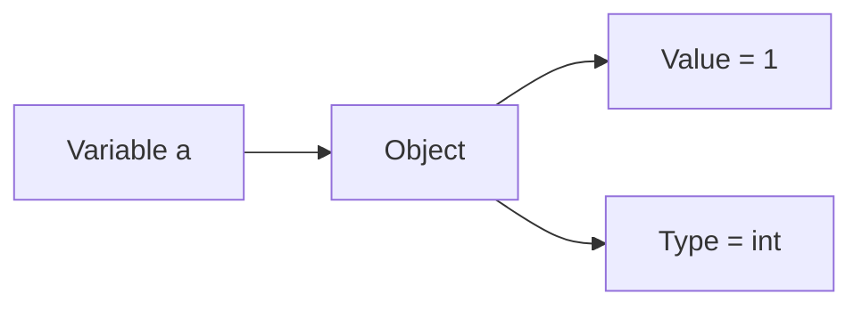

Understanding types helps explain **why operations behave differently depending on the objects involved**.

---

## 2. Categories of Python Data Types

Python’s built-in types can be grouped into several categories.

| Category  | Types                     |
| --------- | ------------------------- |
| Numeric   | `int`, `float`, `complex` |
| Text      | `str`                     |
| Logical   | `bool`                    |
| Special   | `NoneType`                |
| Sequences | `list`, `tuple`           |
| Sets      | `set`                     |
| Mappings  | `dict`                    |

#### Conceptual overview

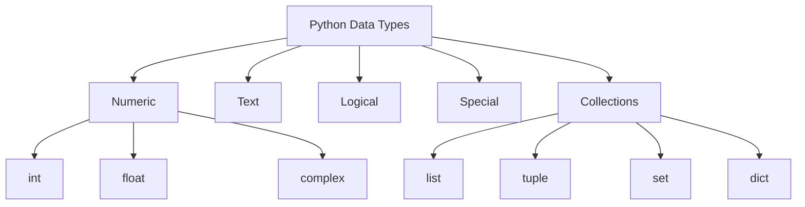

---

## 3. Numeric Types

Python provides three numeric types.

| Type      | Description              |
| --------- | ------------------------ |
| `int`     | integers (whole numbers) |
| `float`   | real numbers             |
| `complex` | complex numbers          |

These support arithmetic operations such as:

```
+
-
*
/
**
```

---

## 4. Integers (`int`)

The `int` type represents **whole numbers without fractional components**.

Examples:

```
0
1
-5
100
```

Unlike many programming languages, Python integers are **arbitrary precision**, meaning they can grow as large as memory allows.

#### Example

```python
a = 1
b = 1

c = a + b
d = int.__add__(a, b)

print(c)
print(d)
```

Output

```
2
2
```

The expression

```
a + b
```

is internally interpreted as a method call on the object. Python first tries `a.__add__(b)` and may fall back to `b.__radd__(a)` if the first attempt returns `NotImplemented`.

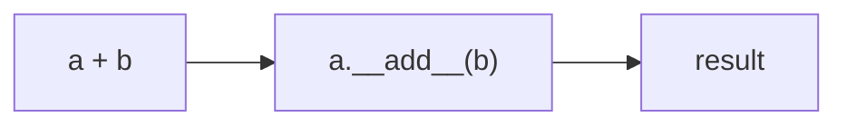

This demonstrates that operators in Python are implemented as **methods on objects**. The type of the object determines which method is called.

---

## 5. Floating-Point Numbers (`float`)

The `float` type represents **numbers with fractional components**.

Examples:

```
1.0
3.14
-0.25
```

Python floats are typically implemented using **64-bit IEEE-754 double precision**.

#### Example

```python
a = 1.
b = 1.0

c = a + b

print(c)
```

Output

```
2.0
2.0
```

#### Floating-point representation

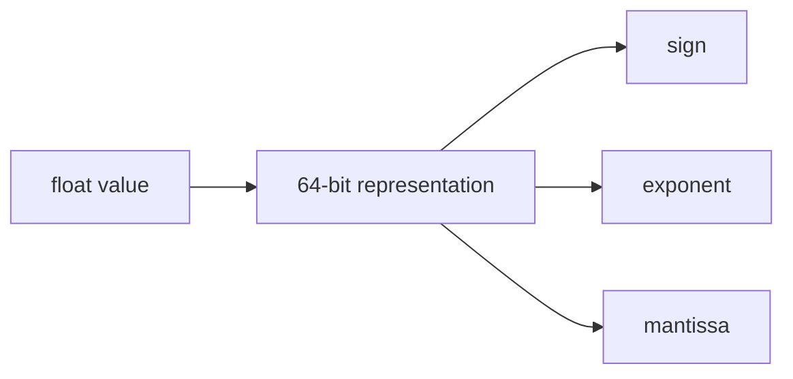

Because floats are stored in binary, some decimal numbers cannot be represented exactly.

Example:

```python
0.1 + 0.2
```

may produce

```
0.30000000000000004
```

This surprises many beginners: `0.1 + 0.2` is not exactly `0.3`. This is not a Python bug---it is a consequence of IEEE-754 binary representation. Never compare floats with `==`; use `math.isclose()` instead.

---

## 6. Complex Numbers (`complex`) --- Advanced

!!! note "Optional for most learners"
    Complex numbers are rarely needed outside scientific computing. Skip this section on first reading if you are not working with engineering or physics applications.

Python supports complex numbers of the form

[
a + bj
]

where

* (a) = real part
* (b) = imaginary part

Python uses `j` to represent the imaginary unit.

#### Example

```python
a = 1. + 2.j
b = 1.0 + 2.0J

c = a + b

print(c)
```

Output

```
(2+4j)
(2+4j)
```

#### Structure of a complex number

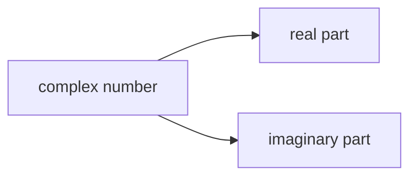

Complex numbers are commonly used in:

* scientific computing
* signal processing
* electrical engineering

---

## 7. Strings (`str`)

Now that you understand numbers, let's look at text---another fundamental kind of data.

Strings represent **textual data**.

A string is a sequence of Unicode characters.

Examples:

```
"hello"
"Python"
"123"
```

#### Concatenation

```python
a = "1"
b = "1"

c = a + b

print(c)
```

Output

```
11
```

This might surprise you: `"1" + "1"` is `"11"`, not `2`. The `+` operator on strings means concatenation, not addition. A common mistake is mixing types:

```python
"1" + 1   # TypeError — str and int cannot be added
```

The `+` operator **joins two strings together**.

#### Visualization

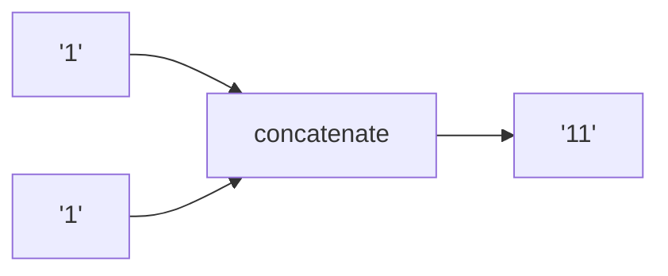

Strings are **immutable**, meaning their contents cannot be modified after creation.

!!! info "Why are strings immutable?"
    Immutability allows strings to be safely shared between variables without risk of accidental modification. It also enables Python to use strings as dictionary keys and to optimize memory by reusing identical string objects (interning). The tradeoff: string "modification" operations like `upper()` or `replace()` always create new strings rather than changing the original.

---

## 8. Boolean Type (`bool`)

Numbers and text represent data. Booleans represent **decisions**.

The Boolean type represents **logical values**.

There are only two Boolean values:

```
True
False
```

#### Example

```python
a = True
b = False

c = a + b

print(c)
```

Output

```
1
1
```

This works because `bool` is a **subclass of `int`**.

```
True  == 1
False == 0
```

#### Type hierarchy

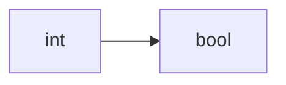

---

## 9. The `None` Object

Python includes a special object called **`None`**.

`None` represents **the absence of a value**.

Example:

```python
a = None
b = None

c = a + b
```

Result

```
TypeError
```

#### Visualization

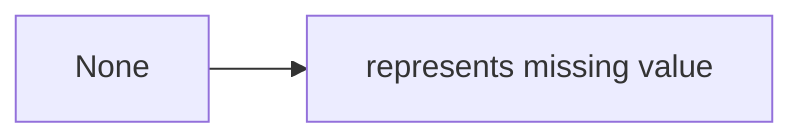

Common uses of `None` include:

* default function arguments
* missing data
* placeholder values

---

## 10. Lists (`list`)

So far, every type holds a single value. Collections hold **multiple values**---and this is where things get interesting.

A list is an **ordered collection of elements**.

Use a list when you need an ordered, changeable sequence of items.

Lists are **mutable**, meaning their contents can change.

Example

```python
a = ["1"]
b = ["1"]

c = a + b

print(c)
```

Output

```
["1","1"]
```

#### List concatenation

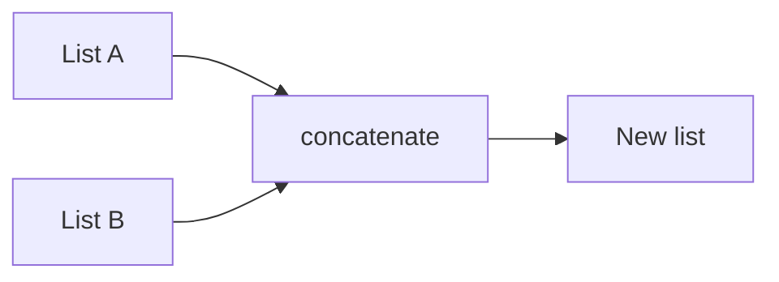

---

## 11. Tuples (`tuple`)

Use a tuple when data should not change after creation---coordinates, records, or fixed structures.

A tuple is similar to a list but **immutable**.

Example

```python
a = ("1","2")
b = ("1","3")

c = a + b
```

Output

```
("1","2","1","3")
```

#### Tuple properties

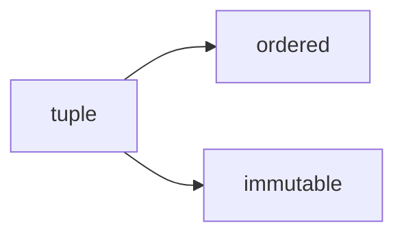

---

## 12. Sets (`set`)

Use a set when you need uniqueness, do not care about order, or want fast membership checks.

A set stores **unique elements with no ordering**.

Example

```python
a = {"1","2","1"}
```

This automatically becomes

```
{"1","2"}
```

Sets use **union** instead of `+`.

```python
a | b
```

#### Set union

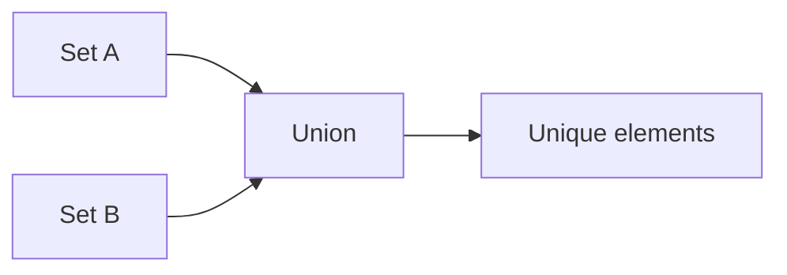

---

## 13. Dictionaries (`dict`)

Use a dictionary when you need to look up values by key---like a phone book or settings map.

A dictionary stores **key-value pairs**.

Example

```python
a = {1:"1",2:"2",3:"1"}
```

Keys map to values.

#### Structure

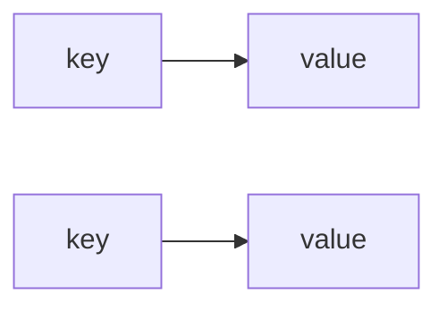

Dictionary merging in Python ≥3.9:

```python
a | b
```

---

## 14. Worked Examples

#### Example 1 — Integer arithmetic

```python
3 + 4
```

Result

```
7
```

Equivalent method call:

```
int.__add__(3,4)
```

---

#### Example 2 — String concatenation

```python
"data" + "science"
```

Result

```
"datascience"
```

---

#### Example 3 — List concatenation

```python
[1,2] + [3,4]
```

Result

```
[1,2,3,4]
```

---

## 15. Concept Checks

1. What is the difference between `int` and `float`?
2. Why does `"1" + "1"` produce `"11"` instead of `2`?
3. Why does `True + True` equal `2`?
4. What property distinguishes lists from tuples?
5. Why does `a + b` fail for sets?
6. What does `None` represent?

---

## 16. Practice Problems

1. Evaluate:

```
5 + 7
```

2. Evaluate:

```
"py" + "thon"
```

3. Determine the result:

```
[1,2] + [3]
```

4. Create a tuple containing three numbers.

5. Create a set containing `{1,2,2,3}`.
   What elements remain?

6. Create a dictionary mapping:

```
"name" → "Ada"
"field" → "mathematics"
```

---


## 17. Summary

Python provides a variety of built-in types for representing different forms of data.

| Category    | Types                          |
| ----------- | ------------------------------ |
| Numeric     | `int`, `float`, `complex`      |
| Text        | `str`                          |
| Logical     | `bool`                         |
| Special     | `None`                         |
| Collections | `list`, `tuple`, `set`, `dict` |

Key ideas:

* Python objects have **value, type, and identity**
* operators such as `+` correspond to **method calls**
* some types are **mutable** (`list`, `dict`, `set`)
* others are **immutable** (`int`, `str`, `tuple`)

Understanding these data types is essential for writing correct and expressive Python programs. Mutability connects directly to [Variables and Objects](variables_and_objects.md) (aliasing), and operator behavior is explored further in [Expressions and Operators](expressions_and_operators.md) (method dispatch).

!!! tip "One thing to remember"
    Same syntax + different type = different meaning. If you know the types involved, you can predict what any expression will do.


## Exercises

**Exercise 1.**
The `+` operator behaves differently depending on the types of its operands. Predict the output of each expression and explain how Python decides what `+` means in each case:

```python
print(1 + 2)
print(1.0 + 2)
print("1" + "2")
print([1] + [2])
print(True + True)
```

What mechanism does Python use to dispatch `+` to the correct implementation? What happens if you try `"1" + 2`?

??? success "Solution to Exercise 1"
    Output:

    ```text
    3
    3.0
    12
    [1, 2]
    2
    ```

    Python uses **method dispatch** to determine what `+` means. Each expression `a + b` is translated to `type(a).__add__(a, b)`. So `1 + 2` calls `int.__add__`, `"1" + "2"` calls `str.__add__`, and `[1] + [2]` calls `list.__add__`. Each type defines its own behavior for `+`.

    For `1.0 + 2`, Python promotes the `int` to `float` via implicit numeric coercion, so the result is `float`. For `True + True`, since `bool` is a subclass of `int`, `True` behaves as `1`, giving `2`.

    `"1" + 2` raises `TypeError` because `str.__add__` does not know how to add a string and an integer -- Python does not implicitly convert between unrelated types.

---

**Exercise 2.**
Python types are divided into mutable and immutable. A programmer writes:

```python
a = [1, 2, 3]
b = a
b.append(4)
print(a)

x = "hello"
y = x
y = y.upper()
print(x)
```

Predict the output of both `print` statements. Explain why mutation of `b` affects `a`, but the operation on `y` does not affect `x`. What fundamental property of the type determines this difference?

??? success "Solution to Exercise 2"
    Output:

    ```text
    [1, 2, 3, 4]
    hello
    ```

    `a = [1, 2, 3]` creates a list object. `b = a` makes `b` refer to the **same object** (not a copy). Since lists are **mutable**, `b.append(4)` modifies the object in place, and `a` sees the change because both names point to the same object.

    `x = "hello"` creates a string object. `y = x` makes `y` refer to the same string. But strings are **immutable** -- `y.upper()` does not modify the original string. Instead, it creates a **new** string `"HELLO"`, and `y = y.upper()` rebinds `y` to this new object. The original string `"hello"` that `x` points to is unchanged.

    The fundamental property is **mutability**: mutable types (list, dict, set) can be changed in place, so aliasing matters. Immutable types (int, str, tuple) cannot be changed, so aliasing is harmless.

---

**Exercise 3.**
Every Python object has identity, type, and value. For each of the following, state what `type()` returns and whether the object is mutable or immutable:

```python
42
3.14
"hello"
True
None
[1, 2]
(1, 2)
{1, 2}
{"a": 1}
```

Why is it important to know whether an object is mutable or immutable when passing it to a function?

??? success "Solution to Exercise 3"
    | Value | `type()` | Mutable? |
    |-------|----------|----------|
    | `42` | `int` | Immutable |
    | `3.14` | `float` | Immutable |
    | `"hello"` | `str` | Immutable |
    | `True` | `bool` | Immutable |
    | `None` | `NoneType` | Immutable |
    | `[1, 2]` | `list` | Mutable |
    | `(1, 2)` | `tuple` | Immutable |
    | `{1, 2}` | `set` | Mutable |
    | `{"a": 1}` | `dict` | Mutable |

    Mutability matters when passing objects to functions because Python uses **pass-by-assignment** (pass-by-object-reference). If you pass a mutable object to a function, the function receives a reference to the same object. Any mutations the function makes (e.g., `lst.append(x)`) will affect the caller's object. With immutable objects, the function cannot modify the original -- any "changes" create new objects, leaving the caller's value intact.

---

**Exercise 4.**
A student writes a program to build a greeting and is surprised by the result. Find the bug:

```python
name = "alice"
greeting = "Hello, " + name.upper
print(greeting)
```

What error occurs? What is the difference between `name.upper` and `name.upper()`? Why does Python not catch this as a syntax error?

??? success "Solution to Exercise 4"
    The code raises `TypeError: can only concatenate str (not "builtin_function_or_method") to str`.

    `name.upper` (without parentheses) is a **reference to the method object** itself, not a call to it. `name.upper()` (with parentheses) **calls** the method and returns `"ALICE"`.

    Python does not catch this as a syntax error because `name.upper` is a valid expression -- it evaluates to a method object. The error only occurs at runtime when `+` tries to concatenate a `str` with a method object. This is a common beginner mistake: forgetting the `()` to call a method. The fix is `"Hello, " + name.upper()`.

---

**Exercise 5.**
Write a function `convert_and_add(a, b)` that accepts two values that may be strings or numbers. It should convert both to numbers (if needed) and return their sum. If conversion fails, return the string `"invalid input"`.

```python
# Expected behavior:
convert_and_add(3, 4)       # 7
convert_and_add("3", 4)     # 7
convert_and_add("3", "4")   # 7
convert_and_add("hello", 4) # "invalid input"
```

??? success "Solution to Exercise 5"
    ```python
    def convert_and_add(a, b):
        try:
            return float(a) + float(b)
        except (ValueError, TypeError):
            return "invalid input"
    ```

    `float()` handles both `int` and `str` inputs: `float(3)` returns `3.0`, `float("3")` returns `3.0`. If the string cannot be parsed as a number, `float("hello")` raises `ValueError`, which the `except` clause catches. `TypeError` is caught for cases like `float(None)`.

    This exercise integrates multiple concepts: types define behavior (`float` conversion), exceptions handle failure (try/except), and the same operation can succeed or fail depending on the value (validation boundary).
