# Python Data Types

Programming languages must represent many kinds of information: numbers, text, logical conditions, and collections of values.

Python provides a rich set of **built-in data types** that allow programs to represent these different forms of data efficiently and clearly.

This chapter introduces the most important built-in types:

* `int`
* `float`
* `complex`
* `str`
* `bool`
* `None`
* `list`
* `tuple`
* `set`
* `dict`

These types form the foundation of nearly all Python programs. 

---

## 1. Objects and Types in Python

In Python, **everything is an object**.

Each object has three fundamental attributes:

| Attribute | Meaning                |
| --------- | ---------------------- |
| Value     | the data stored        |
| Type      | the kind of object     |
| Identity  | its location in memory |

Example:

```python
a = 1
```

Here:

* `1` is the **value**
* its **type** is `int`
* `a` is a reference to the object

We can inspect the type using:

```python
type(a)
```

Output

```
<class 'int'>
```

#### Conceptual model

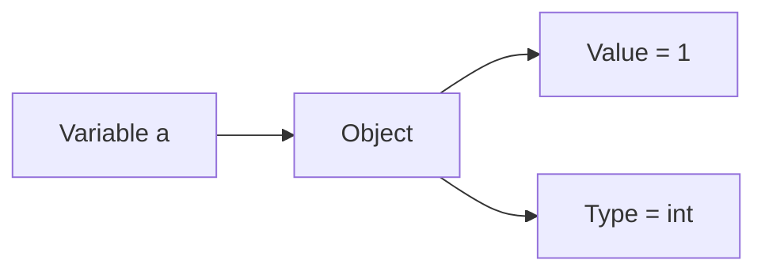

Understanding types helps explain **why operations behave differently depending on the objects involved**.

---

## 2. Categories of Python Data Types

Python’s built-in types can be grouped into several categories.

| Category  | Types                     |
| --------- | ------------------------- |
| Numeric   | `int`, `float`, `complex` |
| Text      | `str`                     |
| Logical   | `bool`                    |
| Special   | `NoneType`                |
| Sequences | `list`, `tuple`           |
| Sets      | `set`                     |
| Mappings  | `dict`                    |

#### Conceptual overview

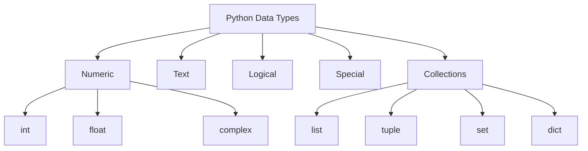

---

## 3. Numeric Types

Python provides three numeric types.

| Type      | Description              |
| --------- | ------------------------ |
| `int`     | integers (whole numbers) |
| `float`   | real numbers             |
| `complex` | complex numbers          |

These support arithmetic operations such as:

```
+
-
*
/
**
```

---

## 4. Integers (`int`)

The `int` type represents **whole numbers without fractional components**.

Examples:

```
0
1
-5
100
```

Unlike many programming languages, Python integers are **arbitrary precision**, meaning they can grow as large as memory allows.

#### Example

```python
a = 1
b = 1

c = a + b
d = int.__add__(a, b)

print(c)
print(d)
```

Output

```
2
2
```

The expression

```
a + b
```

is internally interpreted as

```
int.__add__(a, b)
```

#### Operator interpretation

```mermaid
flowchart LR
    A[a + b] --> B[int.__add__(a,b)]
    B --> C[result]
```

This demonstrates that operators in Python are implemented as **methods on objects**.

---

## 5. Floating-Point Numbers (`float`)

The `float` type represents **numbers with fractional components**.

Examples:

```
1.0
3.14
-0.25
```

Python floats are typically implemented using **64-bit IEEE-754 double precision**.

#### Example

```python
a = 1.
b = 1.0

c = a + b
d = float.__add__(a, b)

print(c)
print(d)
```

Output

```
2.0
2.0
```

#### Floating-point representation

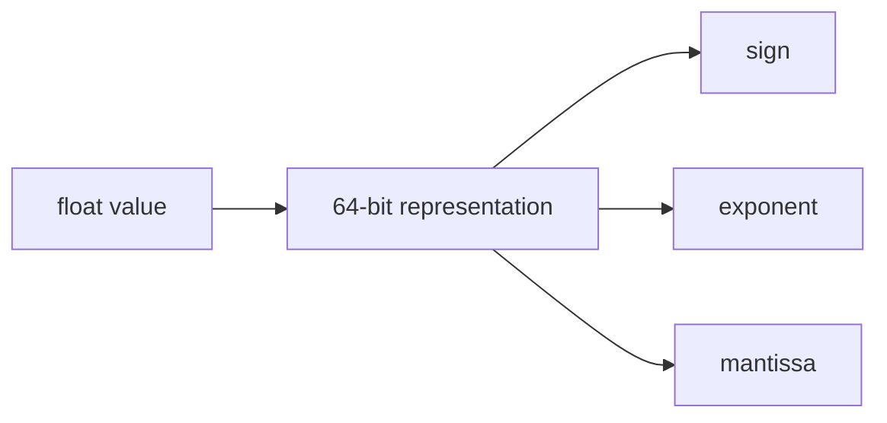

Because floats are stored in binary, some decimal numbers cannot be represented exactly.

Example:

```python
0.1 + 0.2
```

may produce

```
0.30000000000000004
```

---

## 6. Complex Numbers (`complex`)

Python supports complex numbers of the form

[
a + bj
]

where

* (a) = real part
* (b) = imaginary part

Python uses `j` to represent the imaginary unit.

#### Example

```python
a = 1. + 2.j
b = 1.0 + 2.0J

c = a + b
d = complex.__add__(a, b)

print(c)
print(d)
```

Output

```
(2+4j)
(2+4j)
```

#### Structure of a complex number

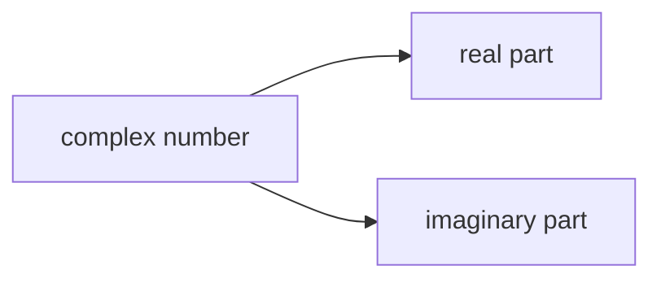

Complex numbers are commonly used in:

* scientific computing
* signal processing
* electrical engineering

---

## 7. Strings (`str`)

Strings represent **textual data**.

A string is a sequence of Unicode characters.

Examples:

```
"hello"
"Python"
"123"
```

#### Concatenation

```python
a = "1"
b = "1"

c = a + b
d = str.__add__(a, b)

print(c)
print(d)
```

Output

```
11
11
```

The `+` operator **joins two strings together**.

#### Visualization

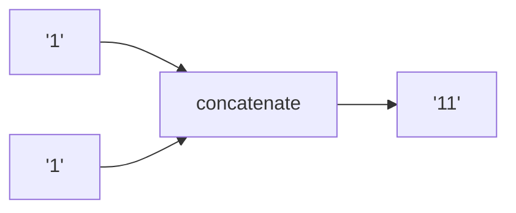

Strings are **immutable**, meaning their contents cannot be modified after creation.

---

## 8. Boolean Type (`bool`)

The Boolean type represents **logical values**.

There are only two Boolean values:

```
True
False
```

#### Example

```python
a = True
b = False

c = a + b
d = bool.__add__(a, b)

print(c)
print(d)
```

Output

```
1
1
```

This works because `bool` is a **subclass of `int`**.

```
True  == 1
False == 0
```

#### Type hierarchy

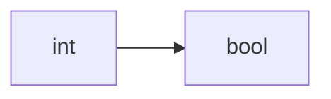

---

## 9. The `None` Object

Python includes a special object called **`None`**.

`None` represents **the absence of a value**.

Example:

```python
a = None
b = None

c = a + b
```

Result

```
TypeError
```

#### Visualization

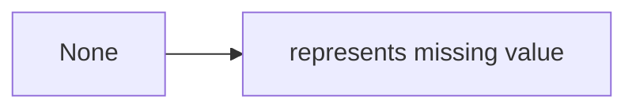

Common uses of `None` include:

* default function arguments
* missing data
* placeholder values

---

## 10. Lists (`list`)

A list is an **ordered collection of elements**.

Lists are **mutable**, meaning their contents can change.

Example

```python
a = ["1"]
b = ["1"]

c = a + b
d = list.__add__(a, b)

print(c)
```

Output

```
["1","1"]
```

#### List concatenation

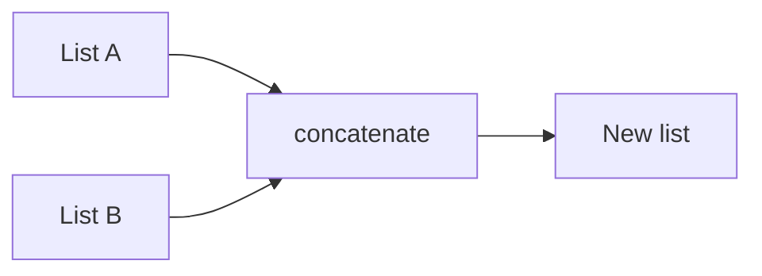

---

## 11. Tuples (`tuple`)

A tuple is similar to a list but **immutable**.

Example

```python
a = ("1","2")
b = ("1","3")

c = a + b
```

Output

```
("1","2","1","3")
```

#### Tuple properties

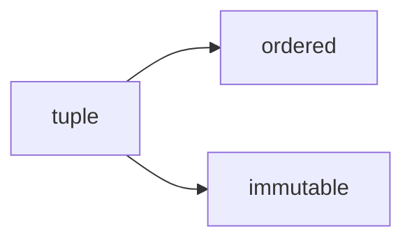

---

## 12. Sets (`set`)

A set stores **unique elements with no ordering**.

Example

```python
a = {"1","2","1"}
```

This automatically becomes

```
{"1","2"}
```

Sets use **union** instead of `+`.

```python
a | b
```

#### Set union

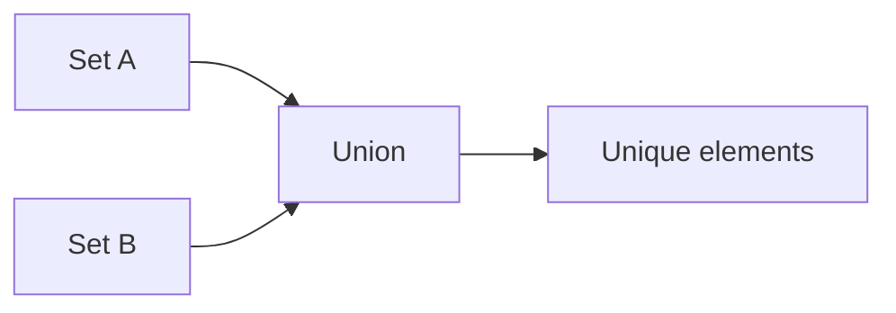

---

## 13. Dictionaries (`dict`)

A dictionary stores **key-value pairs**.

Example

```python
a = {1:"1",2:"2",3:"1"}
```

Keys map to values.

#### Structure

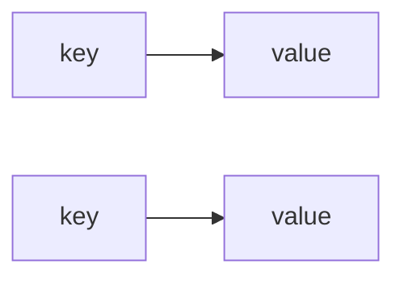

Dictionary merging in Python ≥3.9:

```python
a | b
```

---

## 14. Worked Examples

#### Example 1 — Integer arithmetic

```python
3 + 4
```

Result

```
7
```

Equivalent method call:

```
int.__add__(3,4)
```

---

#### Example 2 — String concatenation

```python
"data" + "science"
```

Result

```
"datascience"
```

---

#### Example 3 — List concatenation

```python
[1,2] + [3,4]
```

Result

```
[1,2,3,4]
```

---

## 15. Concept Checks

1. What is the difference between `int` and `float`?
2. Why does `"1" + "1"` produce `"11"` instead of `2`?
3. Why does `True + True` equal `2`?
4. What property distinguishes lists from tuples?
5. Why does `a + b` fail for sets?
6. What does `None` represent?

---

## 16. Practice Problems

1. Evaluate:

```
5 + 7
```

2. Evaluate:

```
"py" + "thon"
```

3. Determine the result:

```
[1,2] + [3]
```

4. Create a tuple containing three numbers.

5. Create a set containing `{1,2,2,3}`.
   What elements remain?

6. Create a dictionary mapping:

```
"name" → "Ada"
"field" → "mathematics"
```

---

## 17. Summary

Python provides a variety of built-in types for representing different forms of data.

| Category    | Types                          |
| ----------- | ------------------------------ |
| Numeric     | `int`, `float`, `complex`      |
| Text        | `str`                          |
| Logical     | `bool`                         |
| Special     | `None`                         |
| Collections | `list`, `tuple`, `set`, `dict` |

Key ideas:

* Python objects have **value, type, and identity**
* operators such as `+` correspond to **method calls**
* some types are **mutable** (`list`, `dict`, `set`)
* others are **immutable** (`int`, `str`, `tuple`)

Understanding these data types is essential for writing correct and expressive Python programs. 


