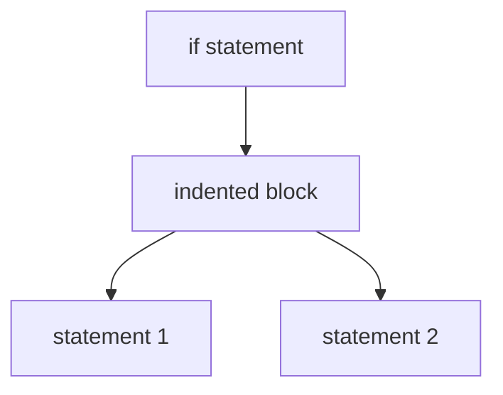

# Code Structure and Readability

Readable code is easier to maintain and less likely to contain errors.
Python enforces readability through **indentation rules and simple syntax**.

This chapter explains:

* indentation and blocks
* comments
* the `pass` statement

---

## 1. Indentation and Blocks

Unlike many languages, Python uses **indentation to define code blocks**.

Example:

```python
if temperature > 30:
    print("Hot")
    print("Stay hydrated")
```

The colon `:` introduces a block, and all lines in the block must have the same indentation.

### Standard indentation

PEP 8 recommends **4 spaces per indentation level**.

### Block structure



Mixing tabs and spaces can cause errors such as:

```
IndentationError
```

or

```
TabError
```

---

## 2. Nested Blocks

Blocks can be nested.

Example:

```python
for i in range(3):
    for j in range(3):
        if i == j:
            print(i, j)
```

Each nested level increases indentation.

---

## 3. Guard Clauses

Guard clauses help avoid deep nesting.

Example:

```python
def process(data):
    if data is None:
        return None

    if not validate(data):
        return None

    return transform(data)
```

This improves readability.

---

## 4. Comments

Comments are annotations ignored by the interpreter.

Example:

```python
# This is a comment
x = 5
```

The most important rule:

**comment why, not what**.

Example:

```python
x = 5  # server requires minimum timeout
```

Bad example:

```python
x = x + 1  # increment x by 1
```

Comments that repeat obvious code are not useful. 

---

## 5. Docstrings

Docstrings document functions, classes, and modules.

Example:

```python
def calculate_area(length, width):
    """Calculate rectangle area."""
    return length * width
```

Docstrings are accessible at runtime:

```python
print(calculate_area.__doc__)
```

---

## 6. Comment Markers

Common markers include:

```
TODO
FIXME
HACK
NOTE
```

Example:

```python
# TODO: optimize algorithm
# FIXME: handle empty list
```

---

## 7. The `pass` Statement

Python requires every block to contain at least one statement.

The `pass` statement acts as a **placeholder**.

Example:

```python
def future_feature():
    pass
```

Example class:

```python
class DatabaseConnection:
    pass
```

`pass` performs **no operation** but satisfies the syntax requirement. 

---

## 8. pass vs Ellipsis

Python also provides the **ellipsis literal**:

```python
...
```

Example:

```python
def parse():
    ...
```

Both serve as placeholders.

---

## 9. pass Does Not Exit a Function

Example:

```python
def demo():
    pass
    print("Still runs")

demo()
```

Output:

```
Still runs
```

Unlike `return`, `pass` does not stop execution.

---


## 10. Summary

Key ideas:

* indentation defines program structure
* blocks follow a colon `:`
* comments explain **intent**
* docstrings document functions and modules
* `pass` creates intentionally empty blocks

These conventions help Python code remain **clear and readable**.


## Exercises

**Exercise 1.**
Python uses indentation to define blocks, whereas most other languages use braces `{}`. A programmer writes:

```python
if True:
    x = 1
    if True:
        y = 2
    z = 3
```

Which variables are set inside the inner `if` block, and which belong to the outer `if` block? Then explain what happens if you accidentally mix tabs and spaces for indentation. Why did Python's designers choose significant whitespace over braces?

??? success "Solution to Exercise 1"
    `y = 2` is inside the inner `if` block (indented 8 spaces). `x = 1` and `z = 3` are inside the outer `if` block (indented 4 spaces). `z = 3` is NOT inside the inner block -- it "de-dents" back to the outer block level.

    If you mix tabs and spaces, Python 3 raises a `TabError`. Python 3 does not allow mixing tabs and spaces for indentation (Python 2 was more permissive, which caused subtle bugs where code appeared aligned but was actually in different blocks).

    Python chose significant whitespace because it enforces the visual structure that programmers already use for readability. In brace-based languages, indentation is optional, so code can be correctly indented for the compiler but misleading to the human reader. Python eliminates this class of bugs by making the visual structure the actual structure.

---

**Exercise 2.**
A programmer writes `pass` and `return` in similar contexts:

```python
def version_a():
    pass
    print("after pass")

def version_b():
    return
    print("after return")
```

Predict the output of calling each function. Why does `pass` exist as a keyword if it does nothing? Give two realistic situations where `pass` is the correct choice.

??? success "Solution to Exercise 2"
    `version_a()` prints `"after pass"` and returns `None`. `version_b()` prints nothing and returns `None`.

    `pass` is a no-op -- it does nothing and execution continues to the next line. `return` exits the function immediately, so `print("after return")` is unreachable dead code.

    `pass` exists because Python's syntax requires at least one statement in every block. Without `pass`, you could not write:

    1. **Placeholder functions during development**: `def process_data(): pass` -- you plan to implement it later but need the function to exist now so other code can reference it.
    2. **Empty exception handlers**: `except KeyboardInterrupt: pass` -- you intentionally want to ignore an exception.

    The ellipsis `...` can also serve as a placeholder and is increasingly preferred in type stubs and abstract methods.

---

**Exercise 3.**
The Python style guide (PEP 8) says "comment why, not what." Evaluate each comment below and explain which are useful and which are not:

```python
x = x + 1                  # increment x
x = x + 1                  # compensate for border pixel
results = []               # create empty list
results = []               # accumulator for valid responses
if not user.is_active:     # check if user is not active
    send_reminder(user)    # inactive users get a weekly reminder
```

Why does commenting "what" become harmful as code evolves?

??? success "Solution to Exercise 3"
    - `# increment x` -- **not useful**. It restates the code. Anyone who reads `x = x + 1` already knows it increments `x`.
    - `# compensate for border pixel` -- **useful**. It explains *why* the increment is needed -- a domain-specific reason that is not obvious from the code alone.
    - `# create empty list` -- **not useful**. `results = []` is self-evident.
    - `# accumulator for valid responses` -- **useful**. It explains the *purpose* of the list, which helps readers understand the algorithm.
    - `# check if user is not active` -- **not useful**. It restates the condition.
    - `# inactive users get a weekly reminder` -- **useful**. It explains the business rule behind the code.

    "What" comments become harmful as code evolves because the code changes but comments often do not get updated. A stale comment that says "increment x" when the line now says `x = x + 2` is worse than no comment -- it actively misleads. "Why" comments are more durable because the reason for doing something changes less frequently than the specific implementation.
