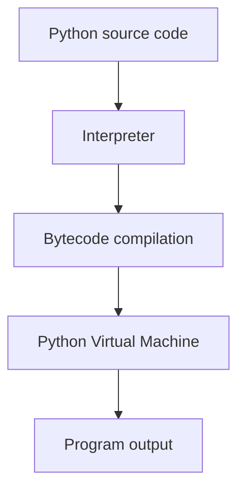

# Running Python

Execution is how expressions come to life. Everything you write is eventually evaluated step-by-step by the Python interpreter. Before writing programs, we must understand how this process works.

When you run a program, you are interacting with a loop: **write, run, observe, modify**. Understanding this cycle bridges theory and practice.

Python code can be run in several ways:

| Method                                    | Description                      |
| ----------------------------------------- | -------------------------------- |
| Interactive interpreter                   | run commands one line at a time  |
| Script execution                          | run `.py` files                  |
| Jupyter notebooks                         | interactive code + documentation |
| Integrated development environments (IDE) | full programming environment     |

---

## 1. Interactive Interpreter

The Python interpreter allows immediate evaluation of expressions.

Example session:

```python
>>> 2 + 3
5
>>> "hello".upper()
'HELLO'
```

Each line entered into the interpreter is evaluated immediately.

---

## 2. Running a Script

Python programs are commonly stored in `.py` files.

Example file:

```python
print("Hello, Python!")
```

Run it from the command line:

```bash
python hello.py
```

Output:

```
Hello, Python!
```

---

## 3. Program Execution Model

When Python runs a script, it performs the following steps:



The interpreter translates Python code into **bytecode**, which is executed by the **Python Virtual Machine (PVM)**.

Python reports errors at two different stages:

| Error type | When | Example |
|---|---|---|
| `SyntaxError` | during compilation (before any code runs) | `x = 10 +` |
| `TypeError` | during execution (at runtime) | `"1" + 2` |

A syntax error prevents the entire script from running. A runtime error only occurs when the faulty line is reached.

Learning to read **tracebacks** is one of the most practical debugging skills:

```text
Traceback (most recent call last):
  File "example.py", line 2, in <module>
    total = price + tax
TypeError: unsupported operand type(s) for +: 'int' and 'str'
```

Read from the bottom up: the last line tells you *what* failed, the line above tells you *where*, and the chain above that tells you *how execution got there*.

You can inspect bytecode using the `dis` module:

```python
import dis
dis.dis(lambda x, y: x + y)
```

This shows the low-level instructions the PVM executes. You do not need to understand bytecode to write Python, but knowing it exists explains why Python can report errors at two different stages: **syntax errors** at compile time (before any code runs) and **runtime errors** during execution.

---

## 4. Practical Workflow

In practice, the development cycle looks like this:

1. **Write** code in an editor or notebook
2. **Run** the script or cell
3. **Observe** the output or error traceback
4. **Modify** the code based on what you learned

The interactive interpreter is ideal for exploring small ideas. Scripts are better for complete programs. Most real work alternates between the two.

Try this in the interpreter to see the cycle in action:

```python
>>> "hello" + 5
TypeError: can only concatenate str (not "int") to str
```

You wrote code, ran it, observed a failure, and now you know: Python does not auto-convert types. Modify to `"hello" + str(5)` and try again.

!!! tip "One thing to remember"
    Python compiles your code to bytecode, then executes it. Syntax errors stop compilation; runtime errors happen during execution. Learn to read tracebacks from the bottom up.

---

## Exercises

**Exercise 1.**
Open the Python interpreter and evaluate the following expressions one at a time. Write down the output of each before running them, then verify your predictions.

```python
>>> 10 + 20
>>> "hello" * 3
>>> type(3.14)
```

??? success "Solution to Exercise 1"
    ```python
    >>> 10 + 20
    30
    >>> "hello" * 3
    'hellohellohello'
    >>> type(3.14)
    <class 'float'>
    ```

    The interpreter evaluates each expression and prints the result immediately. `10 + 20` performs integer addition. `"hello" * 3` repeats the string three times. `type(3.14)` returns the type of the float literal.

---

**Exercise 2.**
Create a file called `greet.py` with the following content:

```python
name = "World"
print("Hello, " + name + "!")
```

Run the file from the command line. What command do you use? What is the output?

??? success "Solution to Exercise 2"
    Run from the terminal:

    ```bash
    python greet.py
    ```

    Output:

    ```
    Hello, World!
    ```

    On some systems you may need to use `python3 greet.py` instead. The interpreter reads the entire file, executes it top to bottom, and prints the result of the `print` call.

---

**Exercise 3.**
Explain the three stages that occur when Python runs a `.py` script. Describe the role of each stage.

??? success "Solution to Exercise 3"
    When Python runs a script, three stages occur:

    1. **Source code reading** -- The interpreter reads the `.py` file as text.
    2. **Bytecode compilation** -- The source code is compiled into bytecode, an intermediate, platform-independent representation.
    3. **Execution by the Python Virtual Machine (PVM)** -- The PVM executes the bytecode instructions and produces the program's output.

    This process happens automatically every time a script is run. The bytecode step is why Python is sometimes called a "compiled interpreted" language.

---

**Exercise 4.**
A student types `print("Hello")` in the interactive interpreter and sees `Hello` as output. They then type `"Hello"` (without `print`) and also see `'Hello'`. Explain why both produce visible output and describe the difference between the two results.

??? success "Solution to Exercise 4"
    In the interactive interpreter, any expression that evaluates to a non-`None` value is automatically displayed using its `repr` form. So typing `"Hello"` displays `'Hello'` (with quotes), because the interpreter shows the representation of the string object.

    When `print("Hello")` is used, the `print` function writes the string's **content** to standard output (without quotes), producing `Hello`. The `print` call itself returns `None`, which the interpreter does not display.

    Key difference: the bare expression shows the `repr` (with quotes), while `print` shows the `str` form (without quotes).

---

**Exercise 5.**
Write a Python script called `calculator.py` that defines two variables `a = 7` and `b = 3`, then prints their sum, difference, product, and quotient on separate lines. Run the script and verify the output.

??? success "Solution to Exercise 5"
    File `calculator.py`:

    ```python
    a = 7
    b = 3

    print(a + b)
    print(a - b)
    print(a * b)
    print(a / b)
    ```

    Run:

    ```bash
    python calculator.py
    ```

    Output:

    ```
    10
    4
    21
    2.3333333333333335
    ```

    Note that `/` performs true division and returns a `float`, even when both operands are integers.

---

**Exercise 6.**
A student runs this script and gets an error before any output appears:

```python
print("start")
x = 10 +
print("end")
```

Is this a compile-time error or a runtime error? Why does `"start"` never print? How does this relate to Python's execution model?

??? success "Solution to Exercise 6"
    This is a **compile-time error** (`SyntaxError: invalid syntax`). Python compiles the entire script to bytecode before executing any of it. The syntax error on line 2 prevents compilation from completing, so the PVM never runs --- not even the first `print`.

    This demonstrates the two-stage execution model: compilation happens first (catches syntax errors), then execution (catches runtime errors like `TypeError`, `ValueError`). If compilation fails, nothing runs.
