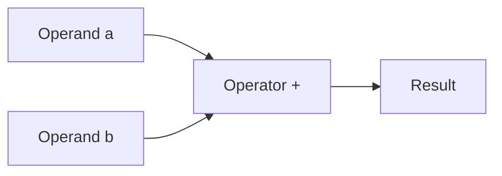
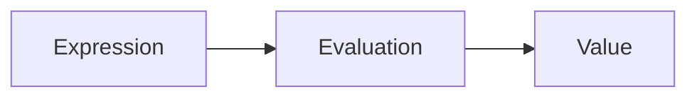
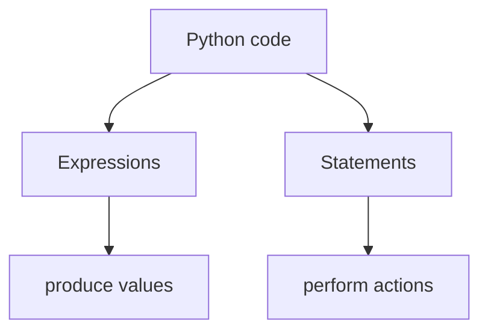
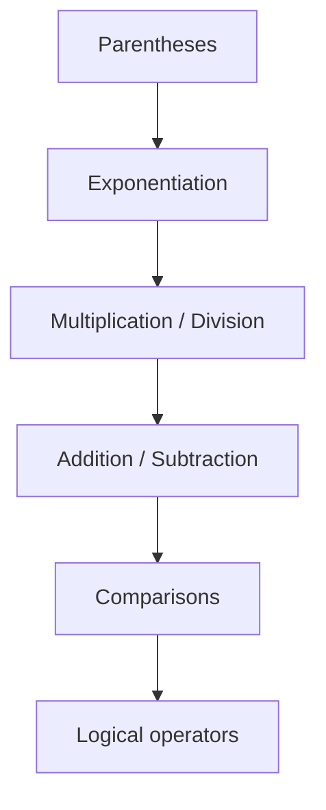
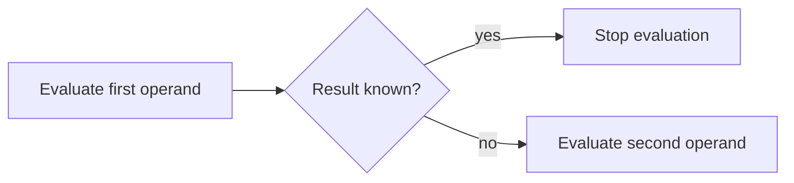
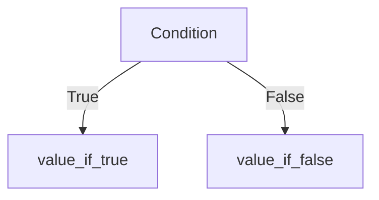

# Python Operators and Expressions

Programs manipulate data by **combining values using operators**.
In Python, these combinations form **expressions**, which Python evaluates to produce results.

Understanding operators and expressions explains how Python performs arithmetic, comparisons, logical reasoning, and function calls.

This chapter introduces:

* operators and operands
* expressions and statements
* operator precedence
* short-circuit evaluation
* Python’s operator methods (dunder methods)

These concepts explain **how Python interprets and evaluates code**.

---

## 1. Operators and Operands

An **operator** is a symbol that performs an operation on one or more values.

The values involved are called **operands**.

Example:

```python
a = 1
b = 1

c = a + b
```

In the expression

```
a + b
```

* `+` is the **operator**
* `a` and `b` are the **operands**

The result is a new value produced by applying the operator to the operands. 

#### Conceptual structure



Operators appear throughout Python programs, performing tasks such as:

* arithmetic
* comparison
* logical reasoning
* sequence manipulation

---

## 2. Operators as Method Calls

Python implements operators using **special methods**, often called **dunder methods** (double-underscore methods).

Example:

```
a + b
```

is equivalent to

```
a.__add__(b)
```

or explicitly

```
int.__add__(a, b)
```

Example code:

```python
a = 1
b = 2

print(a + b)
print(int.__add__(a, b))
```

Output

```
3
3
```

This means operators are essentially **syntactic sugar for method calls**. 

#### Operator translation

```mermaid
flowchart LR
    A[a + b] --> B[a.__add__(b)]
    B --> C[int.__add__(a,b)]
    C --> D[result]
```

This mechanism allows Python objects to define **custom behavior for operators**.

For example, lists implement `+` as concatenation rather than arithmetic.

---

## 3. Common Operator Methods

Python defines many special methods corresponding to operators.

| Operator | Method        |
| -------- | ------------- |
| `+`      | `__add__`     |
| `-`      | `__sub__`     |
| `*`      | `__mul__`     |
| `/`      | `__truediv__` |
| `==`     | `__eq__`      |
| `<`      | `__lt__`      |
| `>`      | `__gt__`      |

Example with strings:

```python
a = "1"
b = "1"

print(a + b)
print(str.__add__(a, b))
```

Output

```
11
11
```

Example with lists:

```python
a = [1]
b = [2]

print(a + b)
print(list.__add__(a, b))
```

Output

```
[1, 2]
```

Different types can therefore define **different meanings for the same operator**.

---

## 4. Expressions

An **expression** is any piece of code that evaluates to a value.

Examples:

```python
3 + 5
len([1,2,3])
x > 0
```

Each expression produces a result when evaluated.

#### Expression evaluation



Examples:

```python
3 + 5
```

produces

```
8
```

```python
len([1,2,3])
```

produces

```
3
```

Expressions can appear inside larger expressions or statements. 

---

## 5. Statements

A **statement** is a complete instruction executed by Python.

Examples:

```python
x = 10
import math
del x
```

Statements perform actions such as:

* creating variables
* importing modules
* controlling program flow

#### Expression vs statement



Expressions can appear inside statements:

```python
x = 3 + 5
```

Here:

* `3 + 5` is an **expression**
* `x = ...` is an **assignment statement**

Statements themselves do **not evaluate to values**. 

---

## 6. Operator Precedence

When an expression contains multiple operators, Python follows **operator precedence rules**.

Higher-precedence operators are evaluated first.

Example:

```python
2 + 3 * 4
```

Multiplication occurs before addition:

```
2 + (3 * 4)
```

Result

```
14
```

#### Example with exponentiation

```python
2 + 3 * 4 ** 2
```

Evaluation order:

```
4 ** 2 = 16
3 * 16 = 48
2 + 48 = 50
```

#### Precedence hierarchy

| Level   | Operators         |
| ------- | ----------------- |
| highest | `()`              |
|         | `**`              |
|         | `* /`             |
|         | `+ -`             |
|         | comparisons       |
| lowest  | logical operators |

#### Precedence diagram



Parentheses override precedence:

```python
(2 + 3) * 4
```

Result

```
20
```

---

## 7. Associativity

When operators have the same precedence, **associativity** determines evaluation order.

Most operators associate **left-to-right**.

Example:

```python
10 - 5 - 2
```

Evaluation:

```
(10 - 5) - 2 = 3
```

Exponentiation associates **right-to-left**.

Example:

```python
2 ** 3 ** 2
```

Evaluation:

```
2 ** (3 ** 2)
```

Result

```
512
```

---

## 8. Logical Operators and Short-Circuiting

Logical operators include:

| Operator | Meaning          |
| -------- | ---------------- |
| `and`    | logical AND      |
| `or`     | logical OR       |
| `not`    | logical negation |

Python evaluates logical expressions using **short-circuit evaluation**.

#### AND

Evaluation stops when the result becomes false.

Example:

```python
False and print("hello")
```

`print()` is never executed.

#### OR

Evaluation stops when the result becomes true.

Example:

```python
True or print("hello")
```

Again, `print()` is not executed.

#### Short-circuit visualization



Short-circuiting is useful for guard expressions:

```python
x is not None and x.method()
```

The method call only occurs if `x` is not `None`. 

---

## 9. Type Promotion

When operands have different numeric types, Python **promotes the result to the wider type**.

Example:

```python
1 + 1.5
```

Result

```
2.5
```

This occurs because:

```
int + float → float
```

Another example:

```python
True + 2
```

Result

```
3
```

because `bool` is a subclass of `int`.

---

## 10. Conditional Expressions

Python provides a compact conditional expression called the **ternary operator**.

Syntax:

```
value_if_true if condition else value_if_false
```

Example:

```python
age = 20
status = "adult" if age >= 18 else "minor"
```

Result:

```
adult
```

#### Visualization



---

## 11. Assignment Expressions (Walrus Operator)

Python 3.8 introduced the **assignment expression** operator `:=`.

Example:

```python
if (n := len(items)) > 10:
    print(n)
```

Here the variable `n` is assigned and used in the same expression.

This can simplify code involving repeated computations. 

---

## 12. Worked Examples

#### Example 1 — operator precedence

```python
2 + 3 * 4 ** 2
```

Step-by-step:

```
4 ** 2 = 16
3 * 16 = 48
2 + 48 = 50
```

Result

```
50
```

---

#### Example 2 — logical evaluation

```python
False and (5 / 0)
```

Result

```
False
```

The division is never evaluated.

---

#### Example 3 — ternary expression

```python
temperature = 30
state = "hot" if temperature > 25 else "cool"
```

Result

```
hot
```

---

## 13. Concept Checks

1. What is the difference between an operator and an operand?
2. Why does `a + b` correspond to a method call in Python?
3. What distinguishes expressions from statements?
4. Why does `False and something()` skip evaluating `something()`?
5. Why does `1 + 1.5` produce a float?

---

## 14. Practice Problems

1. Evaluate:

```
5 + 3 * 2
```

2. Evaluate:

```
2 ** 3 ** 2
```

3. What value does this produce?

```python
True + True + False
```

4. Rewrite the expression using parentheses:

```
2 + 4 * 5
```

5. Write a conditional expression that returns `"positive"` if `x > 0` and `"nonpositive"` otherwise.

---


## 15. Summary

Key ideas from this chapter:

* **operators** perform actions on operands
* operators correspond to **special methods**
* **expressions evaluate to values**
* **statements perform actions**
* Python evaluates expressions using **precedence and associativity**
* logical operators use **short-circuit evaluation**
* Python supports **conditional expressions and assignment expressions**

These rules determine how Python **interprets and executes code**.


## Exercises

**Exercise 1.**
Python's `and` and `or` operators do not return `True` or `False` -- they return one of their operands. Predict the output of each line and explain *why* Python returns that specific value:

```python
print(0 or "hello")
print("hello" or "world")
print("" and "world")
print("hello" and "world")
print(0 or "" or [] or "found it")
```

How does short-circuit evaluation determine which operand is returned?

??? success "Solution to Exercise 1"
    Output:

    ```text
    hello
    hello

    world
    found it
    ```

    Python's `or` returns the **first truthy operand**, or the last operand if all are falsy. Python's `and` returns the **first falsy operand**, or the last operand if all are truthy.

    - `0 or "hello"`: `0` is falsy, so `or` continues to `"hello"` (truthy) and returns it.
    - `"hello" or "world"`: `"hello"` is truthy, so `or` short-circuits and returns `"hello"` without evaluating `"world"`.
    - `"" and "world"`: `""` is falsy, so `and` short-circuits and returns `""` without evaluating `"world"`.
    - `"hello" and "world"`: `"hello"` is truthy, so `and` continues to `"world"` (truthy) and returns it (the last operand).
    - `0 or "" or [] or "found it"`: `0`, `""`, `[]` are all falsy, so `or` keeps going until it finds `"found it"` (truthy) and returns it.

---

**Exercise 2.**
Python operators like `+` are actually method calls in disguise: `a + b` calls `a.__add__(b)`. Explain why this design is powerful. What does it mean for user-defined classes? If you create a `Vector` class, how would `v1 + v2` work? What happens if `a.__add__(b)` returns `NotImplemented` -- and why is that mechanism necessary?

??? success "Solution to Exercise 2"
    Python's operator-as-method design means operators are **polymorphic** -- the same `+` symbol can mean different things for different types. Integers add numerically, strings concatenate, lists concatenate. This is because each type defines its own `__add__` method.

    For a `Vector` class, you would define `__add__`:

    ```python
    class Vector:
        def __init__(self, x, y):
            self.x, self.y = x, y
        def __add__(self, other):
            return Vector(self.x + other.x, self.y + other.y)
    ```

    Now `v1 + v2` calls `v1.__add__(v2)` and produces a new `Vector`.

    If `a.__add__(b)` returns `NotImplemented`, Python tries `b.__radd__(a)` (the reflected version). This is necessary for mixed-type operations. For example, `my_vector + 5` calls `my_vector.__add__(5)`, which might return `NotImplemented` if it does not know how to handle integers. Python then tries `(5).__radd__(my_vector)`. If neither works, Python raises `TypeError`. This two-step protocol allows types to cooperate on operations without requiring either type to know about the other in advance.

---

**Exercise 3.**
Consider this expression:

```python
result = 2 ** 3 ** 2
```

What is the value of `result`? The `**` operator is **right-associative**, meaning `2 ** 3 ** 2` is evaluated as `2 ** (3 ** 2)`, not `(2 ** 3) ** 2`. Compute both groupings and show that they give different results. Then explain *why* right-associativity is the mathematically correct choice for exponentiation.

??? success "Solution to Exercise 3"
    `result = 2 ** 3 ** 2`

    Right-associative: `2 ** (3 ** 2) = 2 ** 9 = 512`
    Left-associative: `(2 ** 3) ** 2 = 8 ** 2 = 64`

    The value is `512`.

    Right-associativity is mathematically correct because exponentiation towers are conventionally evaluated top-down. In mathematics, $2^{3^2}$ means $2^{(3^2)} = 2^9 = 512$, not $(2^3)^2 = 64$.

    The reason: left-associative exponentiation would be redundant. $(2^3)^2 = 2^{3 \times 2} = 2^6$ -- it collapses to a single exponentiation with a multiplied exponent. Right-associative evaluation produces genuinely new values (towers of exponents) that cannot be simplified this way. If `**` were left-associative, `a ** b ** c` would just equal `a ** (b * c)`, making the chained notation pointless.

---

**Exercise 4.**
The walrus operator (`:=`) was added in Python 3.8. Consider:

```python
data = [1, 2, 3, 4, 5, 6, 7, 8]
filtered = [y for x in data if (y := x ** 2) > 10]
print(filtered)
```

Predict the output. Then explain the key difference between `:=` (assignment expression) and `=` (assignment statement). Why can `:=` appear inside a list comprehension's `if` clause while `=` cannot? What conceptual distinction between "expressions" and "statements" does this illustrate?

??? success "Solution to Exercise 4"
    Output:

    ```text
    [16, 25, 36, 49, 64]
    ```

    The comprehension iterates over `data`. For each `x`, it computes `y := x ** 2` (assigns the square to `y`), then checks if `y > 10`. If true, `y` is included in the result. The squares are: 1, 4, 9, 16, 25, 36, 49, 64. Those greater than 10 are: 16, 25, 36, 49, 64.

    The key difference: `=` is a **statement** -- it performs an action but does not produce a value. It cannot appear where an expression is expected. `:=` is an **expression** -- it both assigns a value AND evaluates to that value. Inside `if (y := x ** 2) > 10`, the `:=` assigns to `y` and simultaneously provides the value for the `> 10` comparison.

    This illustrates the expression/statement distinction: expressions produce values and can be composed (nested inside other expressions); statements are standalone actions. A list comprehension's `if` clause requires an expression, so `=` is syntactically illegal there, but `:=` works because it is an expression that happens to have a side effect (assignment).
