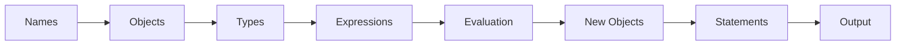
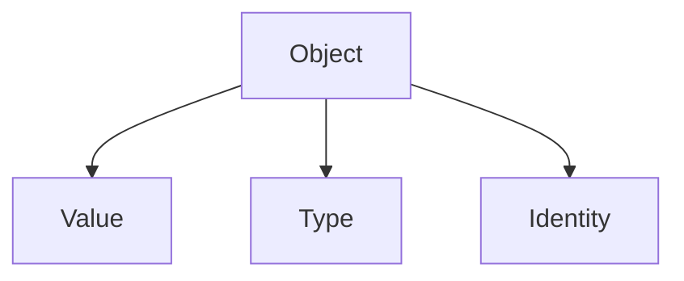
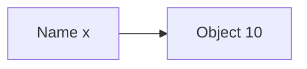
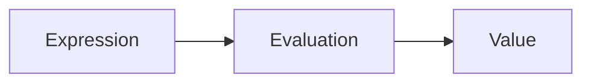
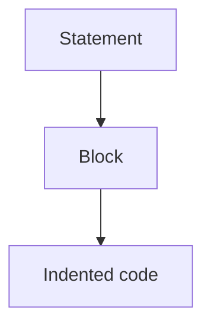
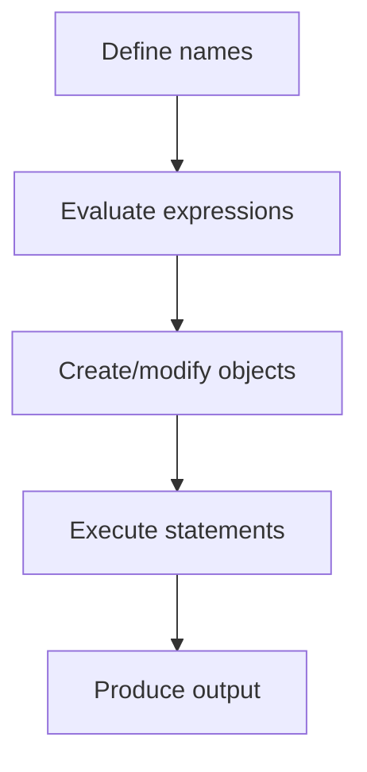

# Overview

This chapter explains **why Python behaves the way it does**---not just how to use it.

Rather than focusing on memorizing rules, the goal is to develop a **mental model of how Python works**.

---

## 1. The Core Idea

Even a two-line program contains every fundamental element:

```python
x = 2
y = x + 3
```

Here: `2` and `3` are **objects**, `x` and `y` are **names**, `x + 3` is an **expression**, and the `=` lines are **statements** that bind names to results. Everything in Python is built from these pieces.

Python programs are built from a small number of fundamental elements:

* **objects** (data)
* **names** (variables)
* **operations** (expressions)
* **structure** (statements and indentation)

Together, these define how a program represents information and performs computation.

---

## 2. A Unifying Mental Model

At a high level, Python execution can be understood as:



* Names **refer to objects**
* Types **define what operations mean**
* Expressions **transform objects into new objects**
* Statements **control which expressions run**

This diagram summarizes everything in this section---and much of Python.

---

## 3. Objects and Types

Everything in Python is an **object**.

Each object has:

* a **value**
* a **type**
* an **identity**

Types determine what operations are allowed.



For example:

* numbers support arithmetic
* strings support concatenation
* lists support mutation

---

## 4. Names and Binding

Variables are not containers — they are **names bound to objects**.



This explains key Python behaviors:

* variables can be **reassigned**
* multiple names can refer to the **same object**
* types belong to **objects**, not names

---

## 5. Expressions and Evaluation

An **expression** is any piece of code that produces a value.

Examples:

* arithmetic: `3 + 5`
* comparison: `x > 0`
* function calls: `len(data)`

Python evaluates expressions using:

* **operator rules**
* **precedence and associativity**
* **method dispatch (e.g. `a + b → a.__add__(b)`)**



---

## 6. Statements and Program Structure

A **statement** performs an action:

* assignment: `x = 10`
* control flow: `if`, `for`
* function definitions

Python uses **indentation** to define structure:



This enforces readability and eliminates ambiguity.

---

## 7. How It All Fits Together

A Python program is executed as a sequence of steps:



Example:

```python
price = 10
quantity = 2
total = price * quantity
print(total)
```

This program:

1. binds names to objects
2. evaluates an expression
3. produces a result

---

## 8. Why This Chapter Matters

These concepts form the **foundation of all Python programming**.

They explain:

* why `"1" + "1"` behaves differently from `1 + 1`
* why `True + True == 2`
* why modifying a list can affect multiple variables
* how Python decides what an operator means

Without this model, Python can feel inconsistent.
With it, Python becomes **predictable and logical**.

---

## 9. This Section

These ideas are developed across the following pages:

| Page | Focus |
|---|---|
| [Running Python](execution_model.md) | executing scripts and using the REPL |
| [Variables and Objects](variables_and_objects.md) | names, objects, types, identity |
| [Basic Data Types](basic_data_types.md) | int, float, str, bool, None |
| [Operators and Expressions](expressions_and_operators.md) | arithmetic, comparison, logical operators |
| [Code Structure and Readability](code_structure.md) | indentation, comments, naming conventions |
| [Putting It All Together](putting_it_all_together.md) | combining concepts into complete programs |

With these fundamentals in place, later sections build on them: control flow, functions, data types, and modules all rely on the model introduced here.

## Exercises

**Exercise 1.** Summarize the key concepts introduced in this overview in your own words. Identify which concept you find most important and explain why.

??? success "Solution to Exercise 1"
    Answers will vary. A strong response should demonstrate understanding of the main ideas and articulate a clear reason for prioritizing one concept, connecting it to practical programming tasks.

---

**Exercise 2.** For each concept introduced in this overview, write a short code snippet (2-5 lines) that demonstrates it in action.

??? success "Solution to Exercise 2"
    Answers will vary based on the specific overview content. Each snippet should be self-contained and clearly illustrate the concept it targets.

