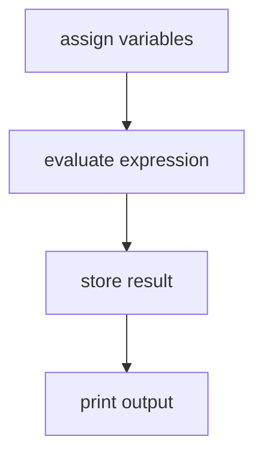

# Putting It All Together

The following short program ties together variables, data types, expressions, and the `print` function from the preceding sections:

```python
# Calculate total price
price = 19.99
quantity = 3

total = price * quantity

print("Total:", total)
```

When Python executes this script, it follows four sequential steps:



Output:

```
Total: 59.97
```

This example demonstrates how variables, data types, expressions, and statements work together in a program.

