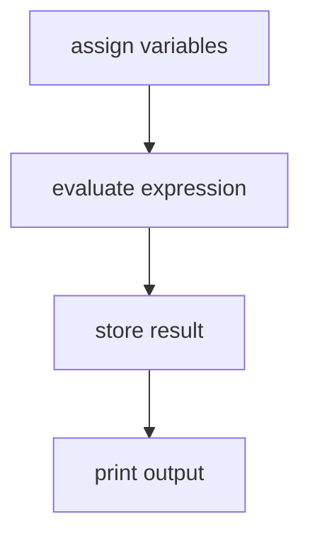

# Putting It All Together

The following short program ties together variables, data types, expressions, and the `print` function from the preceding sections:

```python
# Calculate total price
price = 19.99
quantity = 3

total = price * quantity

print("Total:", total)
```

When Python executes this script, it follows four sequential steps:



Output:

```
Total: 59.97
```

This example demonstrates how variables, data types, expressions, and statements work together in a program.

## Exercises

**Exercise 1.**
Predict the output of the following program without running it, then verify your answer.

```python
width = 5
height = 3
area = width * height
perimeter = 2 * (width + height)
print("Area:", area)
print("Perimeter:", perimeter)
```

??? success "Solution to Exercise 1"
    Output:

    ```
    Area: 15
    Perimeter: 16
    ```

    `width * height` evaluates to `5 * 3 = 15`. `2 * (width + height)` evaluates to `2 * (5 + 3) = 2 * 8 = 16`. Each result is stored in a variable and then printed.

---

**Exercise 2.**
Write a short program that converts a temperature from Celsius to Fahrenheit. Define a variable `celsius = 25`, compute the Fahrenheit value using the formula $F = C \times \frac{9}{5} + 32$, and print the result.

??? success "Solution to Exercise 2"
    ```python
    celsius = 25
    fahrenheit = celsius * 9 / 5 + 32
    print("Fahrenheit:", fahrenheit)
    ```

    Output:

    ```
    Fahrenheit: 77.0
    ```

    The expression `25 * 9 / 5 + 32` evaluates left to right: `25 * 9 = 225`, then `225 / 5 = 45.0` (true division returns a float), then `45.0 + 32 = 77.0`.

---

**Exercise 3.**
A student writes the following program and expects the output `Total: 10`. Instead, the program produces `Total: 55`. Identify the bug and fix it.

```python
price = 5
quantity = "10"
total = price + quantity
print("Total:", total)
```

??? success "Solution to Exercise 3"
    The program raises a `TypeError` because `price` is an `int` and `quantity` is a `str` (the quotes make it a string). Python cannot add an integer and a string.

    To fix the bug, remove the quotes so that `quantity` is an integer:

    ```python
    price = 5
    quantity = 10
    total = price * quantity
    print("Total:", total)
    ```

    Output:

    ```
    Total: 50
    ```

    Note: the expected output of `10` in the problem statement suggests addition (`5 + 10 = 15`), not multiplication. If the intent was `price * quantity`, the correct output is `50`. The key lesson is that mixing types without conversion causes errors.

---

**Exercise 4.**
Explain the difference between an **expression** and a **statement** in Python. Give one example of each.

??? success "Solution to Exercise 4"
    An **expression** is a piece of code that evaluates to a value. For example:

    ```python
    3 + 4 * 2
    ```

    This evaluates to `11`.

    A **statement** is a complete instruction that Python executes. For example:

    ```python
    x = 10
    ```

    This is an assignment statement -- it binds the name `x` to the integer object `10`. While the right-hand side `10` is an expression, the entire `x = 10` line is a statement.

    All expressions can appear as statements (expression statements), but not all statements are expressions. For instance, `print("hello")` is both an expression (it evaluates to `None`) and a statement.

---

**Exercise 5.**
Write a program that defines three variables -- your name (a string), your age (an integer), and your height in meters (a float) -- and prints a single sentence containing all three values using string concatenation or an f-string.

??? success "Solution to Exercise 5"
    Using an f-string:

    ```python
    name = "Alice"
    age = 25
    height = 1.68

    print(f"{name} is {age} years old and {height} meters tall.")
    ```

    Output:

    ```
    Alice is 25 years old and 1.68 meters tall.
    ```

    Alternatively, using concatenation and `str()`:

    ```python
    name = "Alice"
    age = 25
    height = 1.68

    print(name + " is " + str(age) + " years old and " + str(height) + " meters tall.")
    ```

    Both approaches produce the same output. The f-string version is more readable and is generally preferred.
