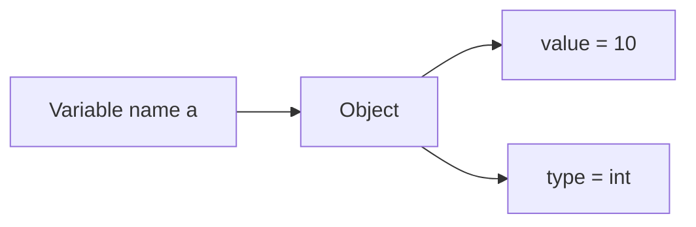
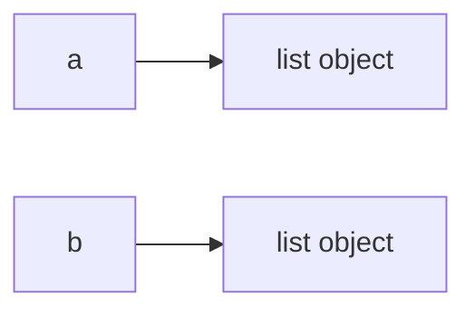

# Python Variables and Objects

Variables allow Python programs to store and manipulate values.
Understanding how Python handles variables requires understanding **objects, references, equality, and identity**.

This chapter explains:

* variable assignment
* object references
* equality vs identity
* dynamic typing
* common variable operations

---

## 1. Variables as Names Bound to Objects

In Python, a variable is **not a container that stores a value**.

Instead, a variable is a **name that refers to an object**.

Example:

```python
a = 10
```

Here:

* `10` is an **integer object**
* `a` is a **name referring to that object**

### Conceptual model



This model explains why variables can later refer to different values.

---

## 2. Basic Variable Assignment

Variables can refer to objects of many different types.

Example:

```python
name = "Alice"
age = 25
height = 5.6
is_student = True
```

Each variable refers to a different type of object.

| Variable     | Object type |
| ------------ | ----------- |
| `name`       | string      |
| `age`        | integer     |
| `height`     | float       |
| `is_student` | boolean     |

Example output:

```
Name: Alice
Age: 25
Height: 5.6
Is Student: True
```

---

## 3. Multiple Assignment

Python allows assigning multiple variables in a single statement.

### Same value assignment

```python
x = y = z = 100
```

All variables refer to the **same integer object**.

### Unpacking assignment

```python
a, b, c = 1, 2, 3
```

Each variable receives one value from the sequence.

---

## 4. Rebinding Variables

Variables in Python can be **rebound** to different objects.

Example:

```python
counter = 0
counter = 10
counter = counter + 5
```

Here the name `counter` successively refers to three different objects.

---

## 5. Swapping Variables

Python supports convenient variable swapping.

```python
first = "Apple"
second = "Banana"

first, second = second, first
```

Result:

```
First: Banana
Second: Apple
```

Python internally uses **tuple unpacking** to perform this swap.

---

## 6. Dynamic Typing

Python is **dynamically typed**.

This means variable names are not restricted to a single type.

Example:

```python
variable = 10
variable = "Now I'm a string"
variable = [1, 2, 3]
```

Output:

```
<class 'int'>
<class 'str'>
<class 'list'>
```

The object type changes because the variable name is **rebound to different objects**.

---

## 7. Inspecting Types

Python provides the `type()` function.

Example:

```python
integer_var = 42
float_var = 3.14
string_var = "Hello"
boolean_var = True
list_var = [1,2,3]

print(type(integer_var))
print(type(float_var))
print(type(string_var))
print(type(boolean_var))
print(type(list_var))
```

Example output:

```
<class 'int'>
<class 'float'>
<class 'str'>
<class 'bool'>
<class 'list'>
```

---

## 8. Equality vs Identity

Python provides two different comparison concepts.

| Operator | Meaning         |
| -------- | --------------- |
| `==`     | value equality  |
| `is`     | object identity |

### Equality

Equality checks whether **two objects have the same value**.

Example:

```python
a = [1,2]
b = [1,2]

print(a == b)
```

Output

```
True
```

---

### Identity

Identity checks whether **two variables refer to the same object**.

Example:

```python
a = [1,2]
b = [1,2]

print(a is b)
```

Output

```
False
```

### Visualization



Even though the lists contain the same values, they are different objects. 

---

## 9. Object Interning

Python sometimes **reuses objects internally**.

### Small integers

Python caches integers typically in the range:

```
-5 to 256
```

Example:

```python
a = 1
b = 1

print(a is b)
```

Output may be

```
True
```

because both variables reference the **same cached object**.

---

### Strings

Python may also intern certain strings.

```python
a = "hello"
b = "hello"

print(a is b)
```

Possible output

```
True
```

However, this behavior is **not guaranteed**.

---

## 10. Naming Conventions

Python code typically uses **snake_case**.

Example:

```python
first_name = "John"
user_age = 30
```

Constants are written in uppercase by convention:

```python
PI = 3.14159
MAX_CONNECTIONS = 100
```

Python does not enforce constants, but the naming signals intent.

---

## 11. Worked Examples

### Integer example

```python
a = 1
b = 1

print(a + b)
print(int.__add__(a,b))
```

Output

```
2
2
```

---

### String example

```python
a = "1"
b = "1"

print(a + b)
print(str.__add__(a,b))
```

Output

```
11
```

---

### List example

```python
a = ["1"]
b = ["1"]

print(a + b)
print(list.__add__(a,b))
```

Output

```
["1","1"]
```

---

## 12. Summary

Key ideas:

* variables are **names bound to objects**
* Python is **dynamically typed**
* `==` compares values
* `is` compares object identity
* Python may reuse objects through **interning**

Understanding these concepts explains many common Python behaviors.

