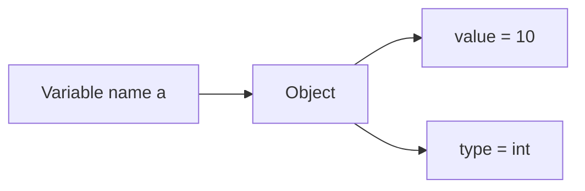
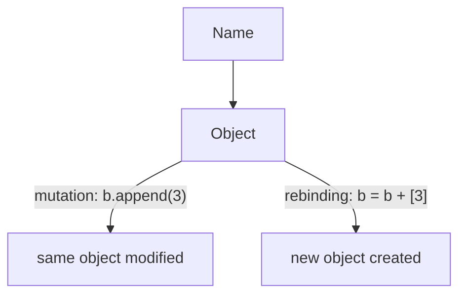
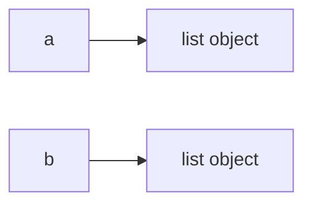

# Python Variables and Objects

Everything in Python builds on this idea: variables are names that refer to objects.

Consider this surprising result:

```python
a = [1, 2, 3]
b = a
b.append(4)
print(a)   # [1, 2, 3, 4] — why did a change?
```

If variables were containers, changing `b` should not affect `a`. But Python variables are **names bound to objects**, and both `a` and `b` refer to the same list. Understanding this model explains why Python behaves the way it does.

This section covers:

* variable assignment
* object references
* equality vs identity
* dynamic typing
* common variable operations

---

## 1. Variables as Names Bound to Objects

In Python, a variable is **not a container that stores a value**.

Instead, a variable is a **name that refers to an object**.

Example:

```python
a = 10
```

Here:

* `10` is an **integer object**
* `a` is a **name referring to that object**

### Conceptual model



This model explains why variables can later refer to different values.

---

## 2. Basic Variable Assignment

Variables can refer to objects of many different types.

Example:

```python
name = "Alice"
age = 25
height = 5.6
is_student = True
```

Each variable refers to a different type of object.

| Variable     | Object type |
| ------------ | ----------- |
| `name`       | string      |
| `age`        | integer     |
| `height`     | float       |
| `is_student` | boolean     |

Example output:

```
Name: Alice
Age: 25
Height: 5.6
Is Student: True
```

---

## 3. Multiple Assignment

Python allows assigning multiple variables in a single statement.

### Same value assignment

```python
x = y = z = 100
```

All variables refer to the **same integer object**.

### Unpacking assignment

```python
a, b, c = 1, 2, 3
```

Each variable receives one value from the sequence.

---

## 4. Rebinding Variables

Variables in Python can be **rebound** to different objects.

Example:

```python
counter = 0
counter = 10
counter = counter + 5
```

Here the name `counter` successively refers to three different objects.

### Mutation vs Rebinding

This is one of the most important distinctions in Python:



**Mutation** changes the object itself---all names pointing to it see the change. **Rebinding** makes a name point to a different object---other names are unaffected.

```python
# Mutation — both names see the change
a = [1, 2]
b = a
b.append(3)
print(a)       # [1, 2, 3]

# Rebinding — only b changes
a = [1, 2]
b = a
b = b + [3]
print(a)       # [1, 2]
```

---

## 5. Swapping Variables

Python supports convenient variable swapping.

```python
first = "Apple"
second = "Banana"

first, second = second, first
```

Result:

```
First: Banana
Second: Apple
```

Python internally uses **tuple unpacking** to perform this swap.

---

## 6. Dynamic Typing

Python is **dynamically typed**.

This means variable names are not restricted to a single type.

Example:

```python
variable = 10
variable = "Now I'm a string"
variable = [1, 2, 3]
```

Output:

```
<class 'int'>
<class 'str'>
<class 'list'>
```

The object type changes because the variable name is **rebound to different objects**.

---

## 7. Inspecting Types

Python provides the `type()` function.

Example:

```python
integer_var = 42
float_var = 3.14
string_var = "Hello"
boolean_var = True
list_var = [1,2,3]

print(type(integer_var))
print(type(float_var))
print(type(string_var))
print(type(boolean_var))
print(type(list_var))
```

Example output:

```
<class 'int'>
<class 'float'>
<class 'str'>
<class 'bool'>
<class 'list'>
```

---

## 8. Equality vs Identity

Python provides two different comparison concepts.

| Operator | Meaning         |
| -------- | --------------- |
| `==`     | value equality  |
| `is`     | object identity |

### Equality

Equality checks whether **two objects have the same value**.

Example:

```python
a = [1,2]
b = [1,2]

print(a == b)
```

Output

```
True
```

---

### Identity

Identity checks whether **two variables refer to the same object**.

Example:

```python
a = [1,2]
b = [1,2]

print(a is b)
```

Output

```
False
```

### Visualization



Even though the lists contain the same values, they are different objects. 

---

## 9. Object Interning (Advanced)

!!! note "This section covers an implementation detail"
    Interning is a CPython optimization, not a language guarantee. You do not need to understand it to write correct Python. The key takeaway is: **always use `==` for value comparison, never `is`**.

Python sometimes **reuses objects internally**.

### Small integers

Python caches integers typically in the range:

```
-5 to 256
```

Example:

```python
a = 1
b = 1

print(a is b)
```

Output may be

```
True
```

because both variables reference the **same cached object**.

---

### Strings

Python may also intern certain strings.

```python
a = "hello"
b = "hello"

print(a is b)
```

Possible output

```
True
```

However, this behavior is **not guaranteed**.

---

## 10. Naming Conventions

Python code typically uses **snake_case**.

Example:

```python
first_name = "John"
user_age = 30
```

Constants are written in uppercase by convention:

```python
PI = 3.14159
MAX_CONNECTIONS = 100
```

Python does not enforce constants, but the naming signals intent.

---

## 11. Worked Examples

### Integer example

```python
a = 1
b = 1

print(a + b)
print(int.__add__(a,b))
```

Output

```
2
2
```

---

### String example

```python
a = "1"
b = "1"

print(a + b)
print(str.__add__(a,b))
```

Output

```
11
```

---

### List example

```python
a = ["1"]
b = ["1"]

print(a + b)
print(list.__add__(a,b))
```

Output

```
["1","1"]
```

---


## 12. Summary

Key ideas:

* variables are **names bound to objects**
* Python is **dynamically typed**
* `==` compares values
* `is` compares object identity
* Python may reuse objects through **interning**

Understanding these concepts explains many common Python behaviors.

!!! tip "One thing to remember"
    Names point to objects---they do not store values. If two names point to the same mutable object, changing it through one name affects the other.


## Exercises

**Exercise 1.**
Predict the output of the following code and explain *why* each comparison produces its result:

```python
a = [1, 2, 3]
b = a
c = [1, 2, 3]

print(a == b)
print(a is b)
print(a == c)
print(a is c)
```

What is the fundamental difference between `==` and `is`? Why does the distinction matter for mutable objects like lists?

??? success "Solution to Exercise 1"
    Output:

    ```text
    True
    True
    True
    False
    ```

    - `a == b` is `True`: `==` checks if the **values** are equal. Both refer to `[1, 2, 3]`.
    - `a is b` is `True`: `is` checks if both names refer to the **same object in memory**. `b = a` makes `b` point to the exact same list object, so they have the same identity.
    - `a == c` is `True`: `c` was created as a separate list with the same contents. The values are equal.
    - `a is c` is `False`: `c` is a **different object** (a separate list created by a separate `[1, 2, 3]` literal). Same values, different identity.

    The distinction matters for mutable objects because if `a is b` is `True`, modifying the object through `b` also affects `a` -- they are the same object. If `a is c` is `False`, modifying `c` does not affect `a`.

---

**Exercise 2.**
Consider this code:

```python
x = 256
y = 256
print(x is y)

a = 257
b = 257
print(a is b)
```

In a standard CPython REPL, the first `is` comparison may return `True` while the second may return `True` or `False` depending on context. Explain *why* this happens. Is this behavior guaranteed by the Python language, or is it an implementation detail? Why should you never use `is` to compare integer values?

??? success "Solution to Exercise 2"
    CPython pre-creates and caches integer objects for small values (typically -5 through 256). This is called **integer interning**. When you write `x = 256`, Python reuses the cached object, so `x` and `y` point to the same object, making `x is y` return `True`.

    For `257`, no pre-cached object exists. Whether `a is b` is `True` depends on whether the Python compiler happens to create one shared object or two separate ones. In an interactive REPL, each line may be compiled separately, creating distinct objects. In a script, the compiler may optimize both literals into one object.

    This behavior is an **implementation detail of CPython**, not a language guarantee. Other Python implementations (PyPy, Jython) may intern different ranges. This is why `is` should never be used to compare integer values -- it may give inconsistent results. Always use `==` for value comparison.

---

**Exercise 3.**
A student writes:

```python
x = 10
x = "hello"
```

They ask: "How can `x` change from an integer to a string? Doesn't that break type safety?" Explain why this is perfectly valid in Python. What does "dynamically typed" mean in terms of where the type information lives? Contrast this with a statically typed language where `int x = 10; x = "hello";` would be an error.

??? success "Solution to Exercise 3"
    In Python, the type belongs to the **object**, not to the **variable**. A variable is just a name (a label) that refers to an object. When `x = 10` executes, an `int` object with value 10 is created, and the name `x` is bound to it. When `x = "hello"` executes, a `str` object is created, and the name `x` is rebound to this new object. The old `int` object is unaffected (and may be garbage-collected if nothing else refers to it).

    "Dynamically typed" means type checking happens at runtime, and names have no fixed type. The name `x` can refer to any object of any type at any time. The type information lives inside each object (every Python object carries its type as part of its internal structure), not in the variable name.

    In a statically typed language like C or Java, `int x` declares that the *name* `x` can only refer to integers. The type is a property of the variable, enforced at compile time. Assigning a string to an `int` variable is a compile-time error because the name's type constraint is violated.

---

**Exercise 4.**
Predict the output and explain the underlying mechanism:

```python
a = [1, 2, 3]
b = a
b.append(4)
print(a)
print(a is b)
```

Why does modifying `b` also change `a`? Draw a mental model showing what `a` and `b` refer to. How would the behavior differ if the first line were `a = 10` and the second line were `b = a` followed by `b = b + 1`?

??? success "Solution to Exercise 4"
    Output:

    ```text
    [1, 2, 3, 4]
    True
    ```

    `a = [1, 2, 3]` creates a list object and binds the name `a` to it. `b = a` binds the name `b` to the **same object**. Now `a` and `b` are two names for one list. `b.append(4)` mutates that single list object by adding `4`. Since `a` still refers to the same object, `print(a)` shows the modified list. `a is b` is `True` because they remain the same object.

    With integers: `a = 10` binds `a` to an `int` object. `b = a` binds `b` to the same `int` object. But `b = b + 1` computes `10 + 1 = 11`, creating a **new** `int` object `11`, and rebinds `b` to this new object. The name `a` still refers to the original `10`. Integers are immutable, so there is no way to "modify" the `10` object in place -- any arithmetic operation creates a new object. This is why reassignment and mutation are fundamentally different.

---

**Exercise 5.**
A function is supposed to add an item to a list, but it does not work. Explain why and provide two different fixes --- one that mutates the original and one that returns a new list:

```python
def add_item(lst, item):
    lst = lst + [item]

data = [1, 2, 3]
add_item(data, 4)
print(data)   # still [1, 2, 3] — why?
```

??? success "Solution to Exercise 5"
    `lst = lst + [item]` creates a **new list** and rebinds the local name `lst` to it. The caller's `data` still refers to the original list. Rebinding a local name never affects the caller.

    **Fix 1 --- mutate the original:**

    ```python
    def add_item(lst, item):
        lst.append(item)
    ```

    `append` mutates the existing list object, which `data` also refers to.

    **Fix 2 --- return a new list:**

    ```python
    def add_item(lst, item):
        return lst + [item]

    data = add_item(data, 4)
    ```

    This creates a new list and the caller explicitly rebinds `data` to the result. The original list is not modified.

---

**Exercise 6.**
Write a function `safe_update(original, updates)` that takes a list and a list of items to add. It must return a new list with the items added, **without modifying the original**. Verify with `is` that the original is unchanged.

??? success "Solution to Exercise 6"
    ```python
    def safe_update(original, updates):
        return original + updates

    data = [1, 2, 3]
    result = safe_update(data, [4, 5])

    print(data)            # [1, 2, 3]
    print(result)          # [1, 2, 3, 4, 5]
    print(data is result)  # False
    ```

    `original + updates` creates a new list. The original list is never mutated. `data is result` is `False` because they are different objects. This is the "functional style" of working with data --- produce new values instead of modifying existing ones.
