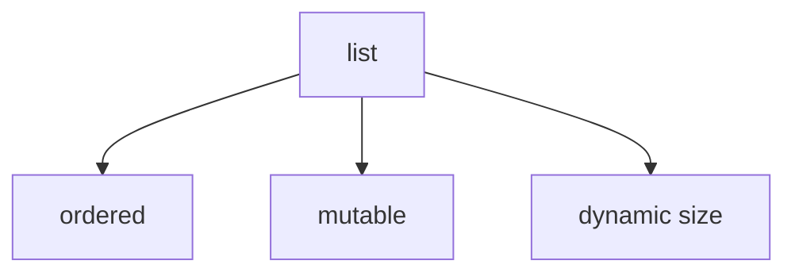

# Lists

A `list` is an **ordered, mutable sequence**.

Lists are one of the most widely used data structures in Python because they are flexible and easy to modify.



---

## 1. Creating Lists

Lists are written with square brackets.

```python
numbers = [10, 20, 30]
names = ["Alice", "Bob", "Charlie"]
empty = []
```

A list may contain values of mixed types, although in practice lists often hold related elements.

---

## 2. Indexing and Slicing

Lists support indexing and slicing.

```python
values = [10, 20, 30, 40]

print(values[0])
print(values[1:3])
```

Output:

```text
10
[20, 30]
```

Negative indices count from the end of the list.

```python
values = [10, 20, 30, 40]

print(values[-1])
print(values[-2])
print(values[::-1])
```

Output:

```text
40
30
[40, 30, 20, 10]
```

`len()` returns the number of elements in a list.

```python
print(len(values))
```

Output:

```text
4
```

---

## 3. Mutability

Unlike tuples, lists can be modified. For an immutable sequence, see [Tuples](tuples.md).

```python
values = [10, 20, 30]
values[1] = 99

print(values)
```

Output:

```text
[10, 99, 30]
```

This mutability is one of the defining features of lists.

---

## 4. Common List Methods

Lists provide many useful methods.

| Method             | Purpose                                  |
| ------------------ | ---------------------------------------- |
| `append(x)`        | add element at end                       |
| `extend(iterable)` | add multiple elements                    |
| `insert(i, x)`     | insert at position                       |
| `remove(x)`        | remove first matching element            |
| `pop()`            | remove and return last element           |
| `pop(i)`           | remove and return element at index `i`   |
| `sort()`           | sort in place                            |
| `reverse()`        | reverse in place                         |

`remove(x)` raises `ValueError` if `x` is not in the list. `pop()` raises `IndexError` on an empty list.

`sort()` sorts the list in place and returns `None`. To get a new sorted list without modifying the original, use the built-in `sorted()` function.

```python
numbers = [3, 1, 2]
result = numbers.sort()
print(result)
print(numbers)

print(sorted([5, 2, 8]))
```

Output:

```text
None
[1, 2, 3]
[2, 5, 8]
```

---

## 5. Lists as Dynamic Arrays

Internally, a Python list is backed by a dynamic array. This has practical consequences for performance.

- `append` is amortized O(1) — fast, because the array over-allocates space
- indexing by position is O(1) — direct access by offset
- `insert` and `remove` are O(n) — because elements are stored contiguously in memory, inserting or removing at an arbitrary position requires all subsequent elements to move

For most use cases, `append` and index access are the primary operations, and lists handle them efficiently.

---

## 6. Iteration

Lists are often used with loops.

```python
fruits = ["apple", "banana", "orange"]

for fruit in fruits:
    print(fruit)
```

Output:

```text
apple
banana
orange
```

---

## 7. Worked Examples

### Example 1: append values

```python
items = []
items.append("pen")
items.append("paper")
print(items)
```

Output:

```text
['pen', 'paper']
```

### Example 2: modify an element

```python
scores = [80, 90, 70]
scores[2] = 75
print(scores)
```

Output:

```text
[80, 90, 75]
```

### Example 3: remove last value

```python
data = [1, 2, 3]
x = data.pop()
print(x)
print(data)
```

Output:

```text
3
[1, 2]
```

---

## 8. Common Pitfalls

### Confusing `append()` with `extend()`

`append()` adds one object. `extend()` adds multiple elements from an iterable.

```python
a = [1, 2]
a.append([3, 4])
print(a)

b = [1, 2]
b.extend([3, 4])
print(b)
```

Output:

```text
[1, 2, [3, 4]]
[1, 2, 3, 4]
```

### Aliasing instead of copying

Assigning a list to another variable does not create a copy. Both names refer to the same object.

```python
a = [1, 2, 3]
b = a
b[0] = 99
print(a)
```

Output:

```text
[99, 2, 3]
```

To create an independent copy, use `a.copy()` or `a[:]`.

### Modifying a list while iterating over it

This can lead to skipped elements.

```python
nums = [1, 2, 3, 4]
for n in nums:
    if n % 2 == 0:
        nums.remove(n)
print(nums)
```

Output:

```text
[1, 3, 4]
```

`4` is silently skipped because `remove` shifts elements while the loop advances. Iterate over a copy instead.

---


## 9. Summary

Key ideas:

- lists are ordered and mutable
- lists support indexing, slicing, and negative indexing
- lists can grow and shrink dynamically
- `append` is fast (amortized O(1)); `insert` and `remove` are O(n)
- aliasing is a common source of bugs with mutable types

Lists are the standard tool for storing ordered collections that need to change over time. List comprehensions provide a concise way to build lists; see [Comprehensions](comprehensions.md).


## Exercises

**Exercise 1.**
Predict the output and explain what is happening with aliasing vs. copying:

```python
a = [1, 2, 3]
b = a
c = a[:]

a.append(4)
print(b)
print(c)
```

Why does `b` see the change but `c` does not? What does `a[:]` create, and why is it called a "shallow copy"?

??? success "Solution to Exercise 1"
    Output:

    ```text
    [1, 2, 3, 4]
    [1, 2, 3]
    ```

    `b = a` creates an **alias**: `b` and `a` refer to the **same list object**. Modifying the list through `a` (via `a.append(4)`) is visible through `b` because they point to the same object.

    `c = a[:]` creates a **shallow copy**: a new list object containing copies of the references to the same elements. `c` is an independent list. Appending to `a` does not affect `c` because they are different list objects.

    It is called "shallow" because only the top-level list is copied. If the elements are mutable objects (e.g., nested lists), both `a` and `c` would share references to those inner objects. A "deep copy" (`copy.deepcopy`) would recursively copy everything.

---

**Exercise 2.**
A programmer creates a list of lists like this:

```python
grid = [[0] * 3] * 3
grid[0][0] = 5
print(grid)
```

The output surprises them. Predict the output and explain *why* all three rows changed. What is the correct way to create a 3x3 grid of independent lists?

??? success "Solution to Exercise 2"
    Output:

    ```text
    [[5, 0, 0], [5, 0, 0], [5, 0, 0]]
    ```

    `[[0] * 3] * 3` creates **one** inner list `[0, 0, 0]` and makes the outer list contain **three references to that same object**. `grid[0]`, `grid[1]`, and `grid[2]` are all the same list. Modifying `grid[0][0]` modifies the single shared inner list, so the change appears in all "rows."

    Correct approach using a comprehension:

    ```python
    grid = [[0] * 3 for _ in range(3)]
    grid[0][0] = 5
    print(grid)  # [[5, 0, 0], [0, 0, 0], [0, 0, 0]]
    ```

    The comprehension creates a new `[0, 0, 0]` list on each iteration, so each row is an independent object.

---

**Exercise 3.**
Consider this buggy code:

```python
nums = [1, 2, 3, 4, 5, 6]
for n in nums:
    if n % 2 == 0:
        nums.remove(n)
print(nums)
```

The programmer expects `[1, 3, 5]` but gets `[1, 3, 5, 6]` -- `6` survives. Explain *why* modifying a list while iterating over it causes elements to be skipped. What is happening internally with the iterator's index? What is the correct approach?

??? success "Solution to Exercise 3"
    Modifying a list while iterating over it is unreliable because the loop advances by index while removals shift later elements left.

    Step by step:

    - Start: `[1, 2, 3, 4, 5, 6]`
    - The loop sees `1` --- keep it
    - The loop sees `2` --- remove it --- list becomes `[1, 3, 4, 5, 6]`
    - The loop moves to the next index, which now points to `4` rather than `3`
    - The loop sees `4` --- remove it --- list becomes `[1, 3, 5, 6]`
    - Again the loop advances past `5` due to shifting
    - The result is unpredictable and should not be relied upon

    The key idea: removing an element changes the list while the loop is still using positions based on the old structure. Some elements are skipped because they shift into positions the loop has already passed.

    **Correct approaches:**

    Iterate over a copy:

    ```python
    nums = [1, 2, 3, 4, 5, 6]
    for n in nums[:]:
        if n % 2 == 0:
            nums.remove(n)
    print(nums)  # [1, 3, 5]
    ```

    Or build a new list:

    ```python
    nums = [1, 2, 3, 4, 5, 6]
    nums = [n for n in nums if n % 2 != 0]
    print(nums)  # [1, 3, 5]
    ```
