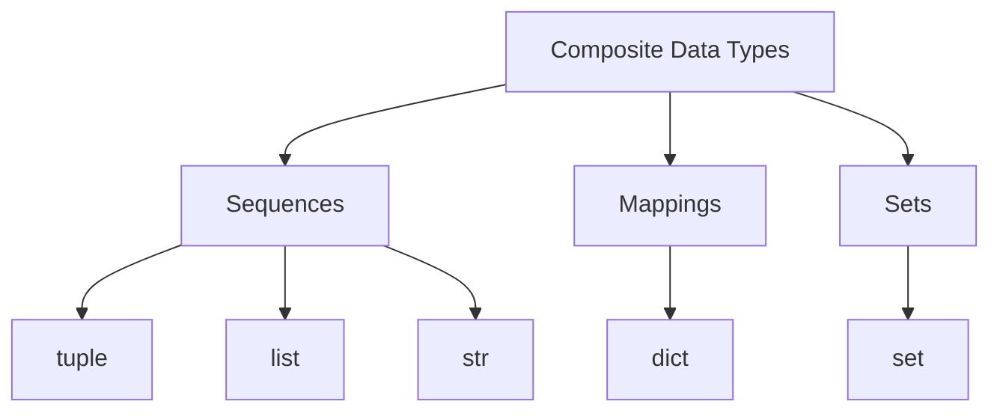

# Sequences Overview

Python includes several **composite data types** that store multiple values inside a single object. When choosing a composite data type, ask:

1. **Does order matter?** (sequences vs sets)
2. **Can the data change?** (mutable vs immutable)
3. **How do I access elements?** (by position, key, or membership)
4. **Do I need uniqueness?** (sets and dict keys)

Composite data types are different ways of organizing data: sequences organize by position, dictionaries organize by key, and sets organize by membership. Choosing the right structure determines how your program stores, accesses, and reasons about data.

These questions map directly to Python's core collection types:

| Type | Ordered | Mutable | Access model | Unique |
| --- | --- | --- | --- | --- |
| `tuple` | yes | no | positional | no |
| `list` | yes | yes | positional | no |
| `str` | yes | no | positional | no |
| `set` | no | yes | membership | yes |
| `dict` | insertion-ordered | yes | key-based | keys |

Composite types fall into three categories:

- `tuple` — immutable sequence
- `list` — mutable sequence
- `str` — immutable sequence of characters
- `dict` — mapping of keys to values
- `set` — unordered collection of unique elements

This page focuses on **sequences**: types that store elements in a defined order. Tuples, lists, and strings are all sequences. For mappings and sets, see [Dictionaries](dictionaries.md) and [Sets](sets.md).



---

## 1. What Is a Sequence?

A sequence is an ordered collection of elements. Knowing that a type is a sequence means it supports indexing, slicing, `len()`, `in`, and iteration — the same interface across all sequence types.

```python
numbers = [10, 20, 30]
letters = ("a", "b", "c")
text = "Python"
```

All three of these are sequences. Python also provides `range`, a lazy sequence used primarily in loops. Like other sequences, `range` supports indexing and `len()`: `range(10)[0]` returns `0` and `len(range(10))` returns `10`.

---

## 2. Common Sequence Operations

All sequences support these operations:

| Operation          | Example          | Meaning                    |
| ------------------ | ---------------- | -------------------------- |
| indexing           | `seq[0]`         | first element              |
| negative indexing  | `seq[-1]`        | last element               |
| slicing            | `seq[1:3]`       | subsequence                |
| length             | `len(seq)`       | number of elements         |
| membership         | `x in seq`       | containment test           |
| iteration          | `for x in seq`   | visit elements             |
| concatenation      | `seq + seq`      | combine two sequences      |
| repetition         | `seq * 3`        | repeat elements            |

Example:

```python
data = [10, 20, 30, 40]

print(data[0])
print(data[-1])
print(data[1:3])
print(len(data))
print(20 in data)
```

Output:

```text
10
40
[20, 30]
4
True
```

Concatenation and repetition create new sequences:

```python
print([1, 2] + [3, 4])
print([0] * 3)
```

Output:

```text
[1, 2, 3, 4]
[0, 0, 0]
```

---

## 3. Mutable vs Immutable Sequences

Not all sequences behave the same way.

| Type    | Ordered | Mutable |
| ------- | ------- | ------- |
| `tuple` | yes     | no      |
| `list`  | yes     | yes     |
| `str`   | yes     | no      |

A mutable sequence can be changed after creation. An immutable sequence cannot. This distinction is one of the most important ideas in Python's data model.

```python
numbers = [10, 20, 30]
numbers[0] = 99
print(numbers)
```

Output:

```text
[99, 20, 30]
```

```python
values = (10, 20, 30)
values[0] = 99
```

Output:

```text
TypeError: 'tuple' object does not support item assignment
```

---

## 4. Worked Examples

### Example 1: mutable vs immutable under the same operation

```python
a = [1, 2, 3]
b = (1, 2, 3)

print(a[1:3])
print(b[1:3])
```

Output:

```text
[2, 3]
(2, 3)
```

Slicing works on both, but the result type matches the source.

### Example 2: string as a sequence

```python
text = "hello"

print(text[0])
print(text[-1])
print(len(text))
print("e" in text)
```

Output:

```text
h
o
5
True
```

### Example 3: concatenation and repetition

```python
print((1, 2) + (3, 4))
print("ab" * 3)
```

Output:

```text
(1, 2, 3, 4)
ababab
```

---


## 5. Summary

Key ideas:

- composite data types store multiple values; sequences, mappings, and sets are the main categories
- sequences are ordered and support indexing, slicing, `len()`, `in`, and iteration
- `tuple`, `list`, and `str` are all sequences
- mutable sequences (lists) can be modified; immutable sequences (tuples, strings) cannot

Knowing that something is a sequence tells you immediately what operations it supports. See [Tuples](tuples.md) and [Lists](lists.md) for full coverage of each type.


## Exercises

**Exercise 1.**
All sequences support the same operations (indexing, slicing, `len`, `in`, iteration). Predict the output for each sequence type:

```python
for seq in [[10, 20, 30], (10, 20, 30), "abc"]:
    print(type(seq).__name__, seq[0], seq[-1], len(seq), 20 in seq)
```

Why does `20 in "abc"` behave differently from `20 in [10, 20, 30]`? What does the shared sequence interface buy you as a programmer?

??? success "Solution to Exercise 1"
    Output:

    The list and tuple lines print normally, but the string line raises an error:

    ```text
    list 10 30 3 True
    tuple 10 30 3 True
    TypeError: 'in <string>' requires string as left operand, not int
    ```

    For `[10, 20, 30]` and `(10, 20, 30)`, `20 in seq` checks if the **value** `20` is an element. For `"abc"`, `20 in seq` raises `TypeError` because the `in` operator on strings requires a string operand on the left side, not an integer. Strings only support substring containment checks (`"bc" in "abc"` is valid), not arbitrary element membership.

    The shared sequence interface (called the **Sequence ABC** or protocol) means code that works with indexing, slicing, and iteration works with **any** sequence type. A function that takes `seq[0]` and `len(seq)` works equally well with lists, tuples, and strings. This is Python's "duck typing" in action.

---

**Exercise 2.**
Slicing returns a new object of the same type. Predict the types:

```python
a = [1, 2, 3][1:]
b = (1, 2, 3)[1:]
c = "abc"[1:]
print(type(a), type(b), type(c))
```

Now explain: when you slice a list, does the new list share elements with the original, or are they independent copies? What happens if those elements are mutable objects?

??? success "Solution to Exercise 2"
    Output:

    ```text
    <class 'list'> <class 'tuple'> <class 'str'>
    ```

    Each slice returns a new object of the **same type** as the source.

    When you slice a list, the new list contains **references to the same objects** -- this is a **shallow copy**. For immutable elements (ints, strings), this distinction does not matter. But if elements are mutable:

    ```python
    original = [[1, 2], [3, 4]]
    sliced = original[:]
    sliced[0].append(99)
    print(original)  # [[1, 2, 99], [3, 4]]
    ```

    The inner list `[1, 2]` is shared between `original` and `sliced`. Mutating it through one reference affects both. This is the shallow copy behavior -- the outer container is new, but the inner objects are shared.

---

**Exercise 3.**
Concatenation with `+` creates a new sequence. Explain why this matters for mutable sequences:

```python
a = [1, 2]
b = [3, 4]
c = a + b
c[0] = 99
print(a)
print(c)
```

Predict the output. Then explain: does `+` create a shallow copy or a deep copy of the elements? What would happen if `a` contained a list: `a = [[1], 2]`?

??? success "Solution to Exercise 3"
    Output:

    ```text
    [1, 2]
    [99, 2, 3, 4]
    ```

    `c = a + b` creates a **new list** that is independent from `a` and `b`. Modifying `c[0]` does not affect `a` because `c` is a separate list object.

    However, `+` creates a **shallow copy**. If `a` contains a mutable object:

    ```python
    a = [[1], 2]
    b = [3, 4]
    c = a + b
    c[0].append(99)
    print(a)  # [[1, 99], 2]
    ```

    `c[0]` and `a[0]` refer to the **same inner list**. The concatenation copied the reference, not the inner list itself. This is the standard shallow copy behavior: the top-level container is new, but the elements inside are shared references.
