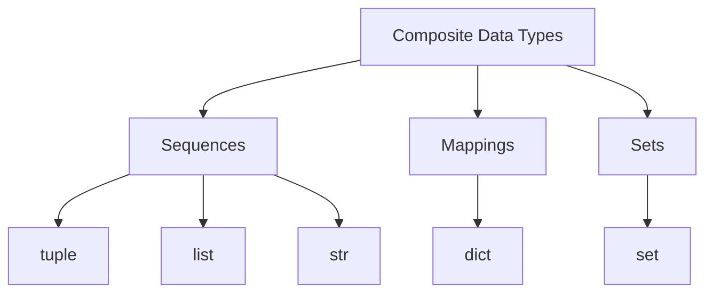

# Sequences Overview

Python includes several **composite data types** that store multiple values inside a single object. These allow programs to represent structured information such as a list of scores, a tuple of coordinates, or a dictionary of settings.

Composite types fall into three categories:

- `tuple` — immutable sequence
- `list` — mutable sequence
- `str` — immutable sequence of characters
- `dict` — mapping of keys to values
- `set` — unordered collection of unique elements

This page focuses on **sequences**: types that store elements in a defined order. Tuples, lists, and strings are all sequences. For mappings and sets, see [Dictionaries](dictionaries.md) and [Sets](sets.md).



---

## 1. What Is a Sequence?

A sequence is an ordered collection of elements. Knowing that a type is a sequence means it supports indexing, slicing, `len()`, `in`, and iteration — the same interface across all sequence types.

```python
numbers = [10, 20, 30]
letters = ("a", "b", "c")
text = "Python"
```

All three of these are sequences. Python also provides `range`, a lazy sequence used primarily in loops. Like other sequences, `range` supports indexing and `len()`: `range(10)[0]` returns `0` and `len(range(10))` returns `10`.

---

## 2. Common Sequence Operations

All sequences support these operations:

| Operation          | Example          | Meaning                    |
| ------------------ | ---------------- | -------------------------- |
| indexing           | `seq[0]`         | first element              |
| negative indexing  | `seq[-1]`        | last element               |
| slicing            | `seq[1:3]`       | subsequence                |
| length             | `len(seq)`       | number of elements         |
| membership         | `x in seq`       | containment test           |
| iteration          | `for x in seq`   | visit elements             |
| concatenation      | `seq + seq`      | combine two sequences      |
| repetition         | `seq * 3`        | repeat elements            |

Example:

```python
data = [10, 20, 30, 40]

print(data[0])
print(data[-1])
print(data[1:3])
print(len(data))
print(20 in data)
```

Output:

```text
10
40
[20, 30]
4
True
```

Concatenation and repetition create new sequences:

```python
print([1, 2] + [3, 4])
print([0] * 3)
```

Output:

```text
[1, 2, 3, 4]
[0, 0, 0]
```

---

## 3. Mutable vs Immutable Sequences

Not all sequences behave the same way.

| Type    | Ordered | Mutable |
| ------- | ------- | ------- |
| `tuple` | yes     | no      |
| `list`  | yes     | yes     |
| `str`   | yes     | no      |

A mutable sequence can be changed after creation. An immutable sequence cannot. This distinction is one of the most important ideas in Python's data model.

```python
numbers = [10, 20, 30]
numbers[0] = 99
print(numbers)
```

Output:

```text
[99, 20, 30]
```

```python
values = (10, 20, 30)
values[0] = 99
```

Output:

```text
TypeError: 'tuple' object does not support item assignment
```

---

## 4. Worked Examples

### Example 1: mutable vs immutable under the same operation

```python
a = [1, 2, 3]
b = (1, 2, 3)

print(a[1:3])
print(b[1:3])
```

Output:

```text
[2, 3]
(2, 3)
```

Slicing works on both, but the result type matches the source.

### Example 2: string as a sequence

```python
text = "hello"

print(text[0])
print(text[-1])
print(len(text))
print("e" in text)
```

Output:

```text
h
o
5
True
```

### Example 3: concatenation and repetition

```python
print((1, 2) + (3, 4))
print("ab" * 3)
```

Output:

```text
(1, 2, 3, 4)
ababab
```

---

## 5. Summary

Key ideas:

- composite data types store multiple values; sequences, mappings, and sets are the main categories
- sequences are ordered and support indexing, slicing, `len()`, `in`, and iteration
- `tuple`, `list`, and `str` are all sequences
- mutable sequences (lists) can be modified; immutable sequences (tuples, strings) cannot

Knowing that something is a sequence tells you immediately what operations it supports. See [Tuples](tuples.md) and [Lists](lists.md) for full coverage of each type.
