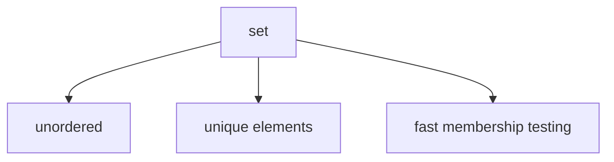

# Sets

A `set` is an **unordered collection of unique elements**.

Sets are useful when the main concern is not order, but **membership and uniqueness**.



---

## 1. Creating Sets

Sets can be written with braces.

```python
colors = {"red", "green", "blue"}
```

An empty set must be created with `set()`.

```python
empty = set()
```

Using `{}` creates an empty dictionary, not a set.

```python
print(type({}))
print(type(set()))
```

Output:

```text
<class 'dict'>
<class 'set'>
```

---

## 2. Uniqueness

Sets automatically remove duplicates.

```python
data = {1, 2, 2, 3, 3, 3}
print(data)
```

Output:

```text
{1, 2, 3}
```

This makes sets very useful for eliminating repeated values.

---

## 3. Membership Testing

Sets are especially good for membership checks.

```python
vowels = {"a", "e", "i", "o", "u"}

print("a" in vowels)
print("z" in vowels)
```

Output:

```text
True
False
```

---

## 4. Set Operations

Sets support important mathematical operations.

| Operation             | Symbol | Meaning                              |
| --------------------- | ------ | ------------------------------------ |
| union                 | `\|`   | all elements from both sets          |
| intersection          | `&`    | common elements                      |
| difference            | `-`    | elements in first not second         |
| symmetric difference  | `^`    | elements in either set, but not both |

Example:

```python
a = {1, 2, 3}
b = {3, 4, 5}

print(a | b)
print(a & b)
print(a - b)
print(a ^ b)
```

Output:

```text
{1, 2, 3, 4, 5}
{3}
{1, 2}
{1, 2, 4, 5}
```

Each operator also has a method form: `union()`, `intersection()`, `difference()`, `symmetric_difference()`.

In-place variants update the set directly instead of creating a new one. The pattern extends to all operators.

```python
a = {1, 2, 3}
a |= {4, 5}
print(a)
```

Output:

```text
{1, 2, 3, 4, 5}
```

---

## 5. Common Set Methods

| Method       | Purpose                  |
| ------------ | ------------------------ |
| `add(x)`     | add element              |
| `remove(x)`  | remove element           |
| `discard(x)` | remove if present        |
| `pop()`      | remove arbitrary element |
| `clear()`    | remove all elements      |

`remove(x)` raises `KeyError` if `x` is not in the set. `discard(x)` does nothing if `x` is absent. `pop()` raises `KeyError` on an empty set.

Example:

```python
s = {1, 2, 3}

s.remove(2)
print(s)

s.discard(99)
print(s)

s.discard(3)
print(s)
```

Output:

```text
{1, 3}
{1, 3}
{1}
```

---

## 6. Worked Examples

### Example 1: remove duplicates

```python
nums = [1, 2, 2, 3, 3]
unique = set(nums)
print(unique)
```

Output:

```text
{1, 2, 3}
```

### Example 2: membership test

```python
allowed = {"admin", "editor"}

if "admin" in allowed:
    print("granted")
```

Output:

```text
granted
```

### Example 3: intersection

```python
a = {"red", "green"}
b = {"green", "blue"}

print(a & b)
```

Output:

```text
{'green'}
```

---

## 7. Common Pitfalls

### Expecting order

Sets are unordered collections. Do not rely on iteration order.

```python
s = {3, 1, 2}
print(s)
```

On CPython, small integer sets may appear sorted due to hash values, but this is an implementation detail and must not be relied upon.

### Using `{}` for an empty set

`{}` creates a dictionary, not a set. Always use `set()` for an empty set, as shown in Section 1.

### Assuming all objects can be stored in a set

Set elements must be hashable. Mutable types like lists and dictionaries cannot be added to a set.

```python
s = set()
s.add([1, 2])
```

Output:

```text
TypeError: unhashable type: 'list'
```

Python also provides `frozenset`, an immutable variant that is itself hashable and can be stored inside another set. See [Hashing and Hash Tables](../../ch02/composites/hashing_deep_dive.md) for a full explanation.

---

## 8. Summary

Key ideas:

- sets store unique elements
- sets are unordered
- membership testing is a major strength of sets
- set operations reflect mathematical set ideas
- `frozenset` provides an immutable, hashable alternative

Sets are especially useful for uniqueness, filtering, and fast membership logic.
