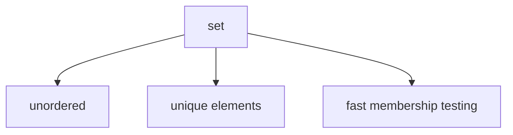

# Sets

A `set` is an **unordered collection of unique elements**. Sets trade order for fast membership testing and uniqueness guarantees.

Sets are useful when the main concern is not order, but **membership and uniqueness**.



---

## 1. Creating Sets

Sets can be written with braces.

```python
colors = {"red", "green", "blue"}
```

An empty set must be created with `set()`.

```python
empty = set()
```

Using `{}` creates an empty dictionary, not a set.

```python
print(type({}))
print(type(set()))
```

Output:

```text
<class 'dict'>
<class 'set'>
```

---

## 2. Uniqueness

Sets automatically remove duplicates.

```python
data = {1, 2, 2, 3, 3, 3}
print(data)
```

Output:

```text
{1, 2, 3}
```

This makes sets very useful for eliminating repeated values.

---

## 3. Membership Testing

Sets are especially good for membership checks.

```python
vowels = {"a", "e", "i", "o", "u"}

print("a" in vowels)
print("z" in vowels)
```

Output:

```text
True
False
```

---

## 4. Set Operations

Sets support important mathematical operations.

| Operation             | Symbol | Meaning                              |
| --------------------- | ------ | ------------------------------------ |
| union                 | `\|`   | all elements from both sets          |
| intersection          | `&`    | common elements                      |
| difference            | `-`    | elements in first not second         |
| symmetric difference  | `^`    | elements in either set, but not both |

Example:

```python
a = {1, 2, 3}
b = {3, 4, 5}

print(a | b)
print(a & b)
print(a - b)
print(a ^ b)
```

Output:

```text
{1, 2, 3, 4, 5}
{3}
{1, 2}
{1, 2, 4, 5}
```

Each operator also has a method form: `union()`, `intersection()`, `difference()`, `symmetric_difference()`.

In-place variants update the set directly instead of creating a new one. The pattern extends to all operators.

```python
a = {1, 2, 3}
a |= {4, 5}
print(a)
```

Output:

```text
{1, 2, 3, 4, 5}
```

---

## 5. Common Set Methods

| Method       | Purpose                  |
| ------------ | ------------------------ |
| `add(x)`     | add element              |
| `remove(x)`  | remove element           |
| `discard(x)` | remove if present        |
| `pop()`      | remove arbitrary element |
| `clear()`    | remove all elements      |

`remove(x)` raises `KeyError` if `x` is not in the set. `discard(x)` does nothing if `x` is absent. `pop()` raises `KeyError` on an empty set.

Example:

```python
s = {1, 2, 3}

s.remove(2)
print(s)

s.discard(99)
print(s)

s.discard(3)
print(s)
```

Output:

```text
{1, 3}
{1, 3}
{1}
```

---

## 6. Worked Examples

### Example 1: remove duplicates

```python
nums = [1, 2, 2, 3, 3]
unique = set(nums)
print(unique)
```

Output:

```text
{1, 2, 3}
```

### Example 2: membership test

```python
allowed = {"admin", "editor"}

if "admin" in allowed:
    print("granted")
```

Output:

```text
granted
```

### Example 3: intersection

```python
a = {"red", "green"}
b = {"green", "blue"}

print(a & b)
```

Output:

```text
{'green'}
```

---

## 7. Common Pitfalls

### Expecting order

Sets are unordered collections. Do not rely on iteration order.

```python
s = {3, 1, 2}
print(s)
```

On CPython, small integer sets may appear sorted due to hash values, but this is an implementation detail and must not be relied upon.

### Using `{}` for an empty set

`{}` creates a dictionary, not a set. Always use `set()` for an empty set, as shown in Section 1.

### Assuming all objects can be stored in a set

Set elements must be hashable. Mutable types like lists and dictionaries cannot be added to a set.

```python
s = set()
s.add([1, 2])
```

Output:

```text
TypeError: unhashable type: 'list'
```

Python also provides `frozenset`, an immutable variant that is itself hashable and can be stored inside another set. Hashing is covered in more detail in a later chapter.

---


## 8. When to Use a Set

Use a set when:

- **uniqueness** matters --- duplicates should be automatically eliminated
- **membership testing** is frequent --- `in` on a set is O(1), versus O(n) on a list
- **order is not semantically important** --- you care about *what* is present, not *where*

Use a list instead when order matters or when you need to store duplicate values.

---

## 9. Summary

Key ideas:

- sets store unique elements
- sets are unordered
- membership testing is a major strength of sets
- set operations reflect mathematical set ideas
- `frozenset` provides an immutable, hashable alternative

Sets are especially useful for uniqueness, filtering, and fast membership logic.


## Exercises

**Exercise 1.**
Checking membership with `in` is dramatically faster for sets than for lists. Explain *why* from a data structure perspective. If you have a list of 1 million items and need to check whether 10,000 values exist in it, why is converting to a set first (and then checking) much faster than checking the list directly?

??? success "Solution to Exercise 1"
    A list `in` check scans elements one by one until a match is found -- **O(n)** time on average. For 10,000 checks against a 1 million-item list: $10{,}000 \times 1{,}000{,}000 / 2 = 5 \times 10^9$ comparisons.

    A set uses a **hash table**. `in` computes the hash of the value, looks up the corresponding bucket, and checks a small number of entries -- **O(1)** average time. For 10,000 checks: $10{,}000 \times O(1) = O(10{,}000)$ operations.

    Converting the list to a set costs O(n) -- one pass through the data. After that, each `in` check is O(1). Total: $O(1{,}000{,}000) + O(10{,}000) = O(1{,}010{,}000)$, which is roughly 5000x faster than the list approach.

    This is why converting to a set is worthwhile whenever you need repeated membership checks.

---

**Exercise 2.**
Explain why `{}` creates an empty dictionary rather than an empty set. If you need an empty set, how do you create one? Why did Python's designers make this choice, given that `{1, 2, 3}` creates a set?

??? success "Solution to Exercise 2"
    `{}` creates an empty dictionary because **dictionaries existed in Python before sets**. The `{key: value}` syntax was already established for dictionaries. When set literals were added (Python 2.7 / 3.1), the non-empty form `{1, 2, 3}` was unambiguous (no colons = set), but `{}` was already taken.

    To create an empty set: `set()`.

    This is a historical artifact. If Python were designed from scratch with both types, the syntax might be different. The key distinction: `{...}` without colons and with at least one element is a set literal; `{key: value, ...}` is a dict literal; `{}` is always a dict.

---

**Exercise 3.**
Predict the output and explain:

```python
a = {1, 2, 3}
b = {3, 4, 5}
print(a | b)
print(a & b)
print(a - b)
print(a ^ b)
```

How do these set operations correspond to mathematical set concepts? Why are sets the natural data structure for these operations, rather than lists?

??? success "Solution to Exercise 3"
    Output:

    ```text
    {1, 2, 3, 4, 5}
    {3}
    {1, 2}
    {1, 2, 4, 5}
    ```

    - `a | b` is **union**: all elements in either set. Corresponds to $A \cup B$.
    - `a & b` is **intersection**: elements in both sets. Corresponds to $A \cap B$.
    - `a - b` is **difference**: elements in `a` but not in `b`. Corresponds to $A \setminus B$.
    - `a ^ b` is **symmetric difference**: elements in either set but not both. Corresponds to $A \triangle B$.

    Sets are natural for these operations because they enforce uniqueness and are backed by hash tables, making each operation efficient (O(n) where n is the size of the sets). Lists would require manual deduplication and nested loops, making the same operations O(n*m) and more error-prone.
