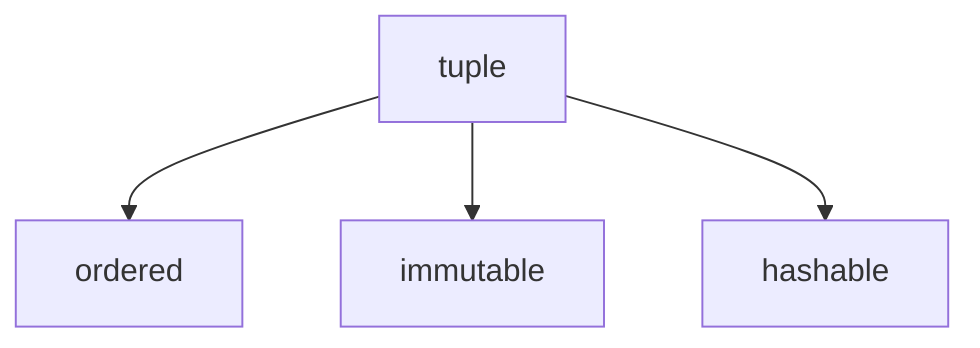

# Tuples

A `tuple` is an **ordered, immutable sequence**.

Tuples are useful when a collection of values should stay fixed after creation.



---

## 1. Creating Tuples

Tuples are usually written with parentheses.

```python
point = (3, 4)
colors = ("red", "green", "blue")
empty = ()
```

A one-element tuple requires a trailing comma.

```python
single = (5,)
```

Without the comma, Python interprets `(5)` as an ordinary grouped expression, not a tuple.

---

## 2. Indexing and Slicing

Tuples support indexing and slicing just like other sequences.

```python
t = ("a", "b", "c", "d")

print(t[0])
print(t[1:3])
```

Output:

```text
a
('b', 'c')
```

Negative indices count from the end.

```python
print(t[-1])
print(t[-2])
```

Output:

```text
d
c
```

`len()` returns the number of elements in a tuple.

```python
print(len(t))
```

Output:

```text
4
```

---

## 3. Immutability

Tuples cannot be changed after creation.

```python
t = (1, 2, 3)
t[0] = 10
```

Output:

```text
TypeError: 'tuple' object does not support item assignment
```

Because tuples are immutable, they are hashable and can be used as dictionary keys or set elements — unlike [lists](lists.md). See [Hashing and Hash Tables](../../ch02/composites/hashing_deep_dive.md) for a full explanation.

---

## 4. Tuple Packing and Unpacking

Python supports packing multiple values into a tuple and unpacking them into variables.

```python
point = 3, 4
x, y = point

print(x)
print(y)
```

Output:

```text
3
4
```

Extended unpacking with `*` collects remaining elements. Note that `rest` is a list, not a tuple, regardless of the source type.

```python
first, *rest = (1, 2, 3, 4)
print(first)
print(rest)
```

Output:

```text
1
[2, 3, 4]
```

---

## 5. When Tuples Are Useful

Tuples are often used for:

- fixed records such as (name, age) pairs
- return values from functions
- dictionary keys (because tuples are hashable)
- fixed configuration data

---

## 6. Worked Examples

### Example 1: coordinate pair

```python
point = (10, 20)
print(point[0], point[1])
```

Output:

```text
10 20
```

### Example 2: unpacking

```python
person = ("Alice", 25)
name, age = person
print(name, age)
```

Output:

```text
Alice 25
```

### Example 3: function returning two values

```python
def min_max(a, b):
    if a < b:
        return a, b
    return b, a

print(min_max(8, 3))
```

Output:

```text
(3, 8)
```

### Example 4: tuple as dictionary key

```python
locations = {}
locations[(0, 0)] = "origin"
locations[(1, 2)] = "point A"

print(locations[(0, 0)])
```

Output:

```text
origin
```

---

## 7. Common Pitfalls

### Forgetting the comma in a one-element tuple

```python
print(type((5)))
print(type((5,)))
```

Output:

```text
<class 'int'>
<class 'tuple'>
```

### Assuming mutable contents cannot change

A tuple itself is immutable, but it may contain mutable elements such as lists. The mutable contents can still be modified in place.

```python
t = (1, [2, 3])
t[1].append(4)
print(t)
```

Output:

```text
(1, [2, 3, 4])
```

---

## 8. Summary

Key ideas:

- tuples are ordered and immutable
- tuples support indexing, slicing, and negative indexing
- tuple packing and unpacking are very useful
- tuples are hashable and can serve as dictionary keys
- mutable objects inside a tuple can still be changed

Tuples provide a compact and reliable way to represent stable structured data. For a mutable sequence, see [Lists](lists.md).
