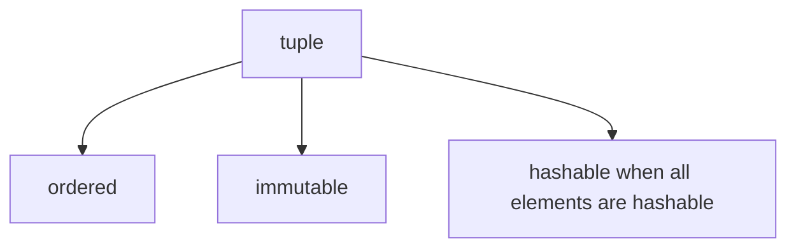

# Tuples

A `tuple` is an **ordered, immutable sequence**.

Tuples are useful when a collection of values should stay fixed after creation. They trade flexibility for safety and predictability.



---

## 1. Creating Tuples

Tuples are usually written with parentheses.

```python
point = (3, 4)
colors = ("red", "green", "blue")
empty = ()
```

A one-element tuple requires a trailing comma.

```python
single = (5,)
```

Without the comma, Python interprets `(5)` as an ordinary grouped expression, not a tuple.

---

## 2. Indexing and Slicing

Tuples support indexing and slicing just like other sequences.

```python
t = ("a", "b", "c", "d")

print(t[0])
print(t[1:3])
```

Output:

```text
a
('b', 'c')
```

Negative indices count from the end.

```python
print(t[-1])
print(t[-2])
```

Output:

```text
d
c
```

`len()` returns the number of elements in a tuple.

```python
print(len(t))
```

Output:

```text
4
```

---

## 3. Immutability

Tuples cannot be changed after creation.

```python
t = (1, 2, 3)
t[0] = 10
```

Output:

```text
TypeError: 'tuple' object does not support item assignment
```

Because tuples are immutable, they can be hashable---but only when all their elements are also hashable. A tuple of integers or strings is hashable; a tuple containing a list is not. Hashable tuples can be used as dictionary keys or set elements, unlike [lists](lists.md). Hashing is covered in more detail in a later chapter.

---

## 4. Tuple Packing and Unpacking

Python supports packing multiple values into a tuple and unpacking them into variables.

```python
point = 3, 4
x, y = point

print(x)
print(y)
```

Output:

```text
3
4
```

Extended unpacking with `*` collects remaining elements. Note that `rest` is a list, not a tuple, regardless of the source type.

```python
first, *rest = (1, 2, 3, 4)
print(first)
print(rest)
```

Output:

```text
1
[2, 3, 4]
```

---

## 5. When Tuples Are Useful

Tuples are often used for:

- fixed records such as (name, age) pairs
- return values from functions
- dictionary keys (because tuples are hashable)
- fixed configuration data

---

## 6. Worked Examples

### Example 1: coordinate pair

```python
point = (10, 20)
print(point[0], point[1])
```

Output:

```text
10 20
```

### Example 2: unpacking

```python
person = ("Alice", 25)
name, age = person
print(name, age)
```

Output:

```text
Alice 25
```

### Example 3: function returning two values

```python
def min_max(a, b):
    if a < b:
        return a, b
    return b, a

print(min_max(8, 3))
```

Output:

```text
(3, 8)
```

### Example 4: tuple as dictionary key

```python
locations = {}
locations[(0, 0)] = "origin"
locations[(1, 2)] = "point A"

print(locations[(0, 0)])
```

Output:

```text
origin
```

---

## 7. Common Pitfalls

### Forgetting the comma in a one-element tuple

```python
print(type((5)))
print(type((5,)))
```

Output:

```text
<class 'int'>
<class 'tuple'>
```

### Assuming mutable contents cannot change

A tuple itself is immutable, but it may contain mutable elements such as lists. The mutable contents can still be modified in place.

```python
t = (1, [2, 3])
t[1].append(4)
print(t)
```

Output:

```text
(1, [2, 3, 4])
```

---


## 8. Summary

Key ideas:

- tuples are ordered and immutable
- tuples support indexing, slicing, and negative indexing
- tuple packing and unpacking are very useful
- tuples are hashable and can serve as dictionary keys
- mutable objects inside a tuple can still be changed

Tuples provide a compact and reliable way to represent stable structured data. For a mutable sequence, see [Lists](lists.md).


## Exercises

**Exercise 1.**
A tuple is immutable, yet the following code modifies a tuple's "contents":

```python
t = (1, [2, 3], 4)
t[1].append(5)
print(t)
```

Predict the output. Does this violate tuple immutability? Explain exactly what "immutable" means for a tuple -- what can and cannot change. What would happen if you tried `t[1] = [2, 3, 5]` instead?

??? success "Solution to Exercise 1"
    Output:

    ```text
    (1, [2, 3, 5], 4)
    ```

    This does NOT violate tuple immutability. A tuple's immutability means that the **references** stored in the tuple cannot be changed -- you cannot make `t[0]` point to a different object. But the tuple stores a reference to a list object at `t[1]`, and that list object itself is mutable. Modifying the list via `t[1].append(5)` changes the list object's contents, not the tuple's reference to it.

    `t[1] = [2, 3, 5]` would fail with `TypeError: 'tuple' object does not support item assignment`, because that tries to change which object `t[1]` refers to -- which IS a modification of the tuple's structure.

    The key insight: immutability of a container means the container's structure (which references it holds) is fixed, but the objects those references point to may themselves be mutable.

---

**Exercise 2.**
Tuples can be dictionary keys but lists cannot. Explain why immutability is the key property that enables this. Then consider: can a tuple containing a list be used as a dictionary key? Predict what happens and explain why.

??? success "Solution to Exercise 2"
    Dictionary keys must be hashable, which requires that the hash value never changes. Immutable objects can guarantee this because their state never changes, so their hash remains constant.

    A tuple containing a list **cannot** be used as a dictionary key:

    ```python
    d = {}
    d[(1, [2, 3])] = "value"  # TypeError: unhashable type: 'list'
    ```

    Even though the tuple itself is immutable, it contains a mutable element (a list), which is unhashable. The tuple's hash would depend on the list's contents, which could change. Python detects this and refuses to compute a hash, raising `TypeError`.

    Only tuples whose **every element** is also hashable can be used as dictionary keys. A tuple of ints, strings, and other tuples is fine. A tuple containing any mutable element is not.

---

**Exercise 3.**
Explain the difference between these two lines:

```python
a = (42)
b = (42,)
```

What are the types of `a` and `b`? Why does the comma matter? How would you create a tuple containing a single element?

??? success "Solution to Exercise 3"
    `a = (42)` -- the parentheses are just grouping (like in math). This is the integer `42`. `type(a)` is `int`.

    `b = (42,)` -- the trailing comma makes this a one-element tuple. `type(b)` is `tuple`.

    The comma is what creates a tuple, not the parentheses. In fact, `b = 42,` (without parentheses) also creates a tuple. The parentheses are optional in most contexts -- they are just used for clarity and for empty tuples (`()`).

    To create a single-element tuple, you must include the trailing comma: `(42,)` or simply `42,`. This syntax exists because Python needed a way to distinguish between "parenthesized expression" and "one-element tuple," and the comma is the disambiguator.
