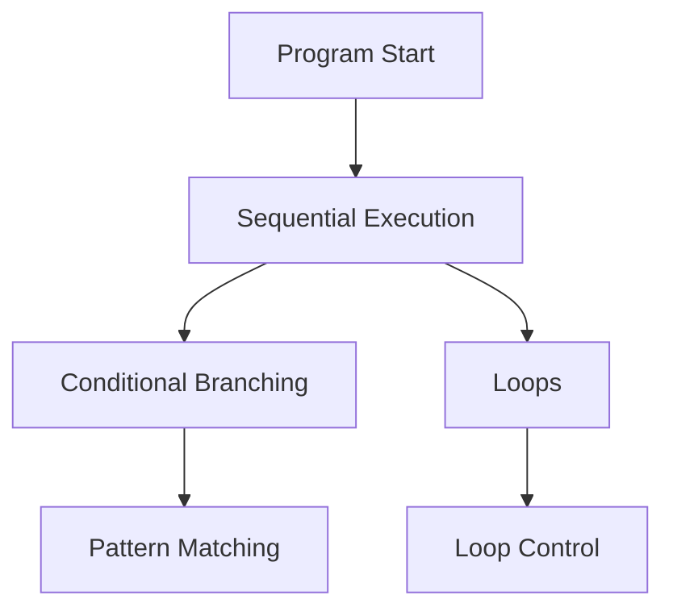

# Control Flow in Python

Control flow determines **which parts of a program execute and in what order**.

At its core, control flow answers three questions:

- **What should happen?** (decision)
- **When should it happen?** (repetition)
- **When should it stop?** (control)

So far, our programs executed sequentially---one line after another.
Control flow introduces mechanisms that allow programs to make decisions, repeat actions, and exit early when needed.

These three roles map directly to Python's constructs:

1. **Decision** --- `if` / `match`
2. **Repetition** --- `for` / `while`
3. **Control** --- `break` / `continue` / `else`

The following diagram shows how these control flow mechanisms branch from sequential execution:

This chapter introduces Python's core control flow tools:

| Construct          | Purpose                           |
| ------------------ | --------------------------------- |
| `if`               | conditional branching             |
| `for`              | iteration over sequences          |
| `while`            | repetition while condition holds  |
| `break`            | exit loops early                  |
| `continue`         | skip an iteration                 |
| `else` on loops    | detect successful loop completion |
| ternary expression | inline conditional expression     |
| `match`            | structural pattern matching       |

### Perspective

Control flow is where programs stop being sequences of instructions and become decision-making systems. Most bugs and complexity in real programs arise not from individual statements, but from how control flows between them. Understanding control flow is therefore more important than understanding any single construct.

Control flow is not syntax---it is how programs *adapt*. Without control flow, programs are static sequences. With it, programs become responsive to data.

Together, these tools allow a program to:

- decide what path to take
- repeat actions as needed
- adjust behavior dynamically during execution

This combination is what makes programs responsive rather than static.

## Exercises

**Exercise 1.** Summarize the key concepts introduced in this overview in your own words. Identify which concept you find most important and explain why.

??? success "Solution to Exercise 1"
    Answers will vary. A strong response should demonstrate understanding of the main ideas and articulate a clear reason for prioritizing one concept, connecting it to practical programming tasks.

---

**Exercise 2.** For each concept introduced in this overview, write a short code snippet (2-5 lines) that demonstrates it in action.

??? success "Solution to Exercise 2"
    Answers will vary based on the specific overview content. Each snippet should be self-contained and clearly illustrate the concept it targets.

