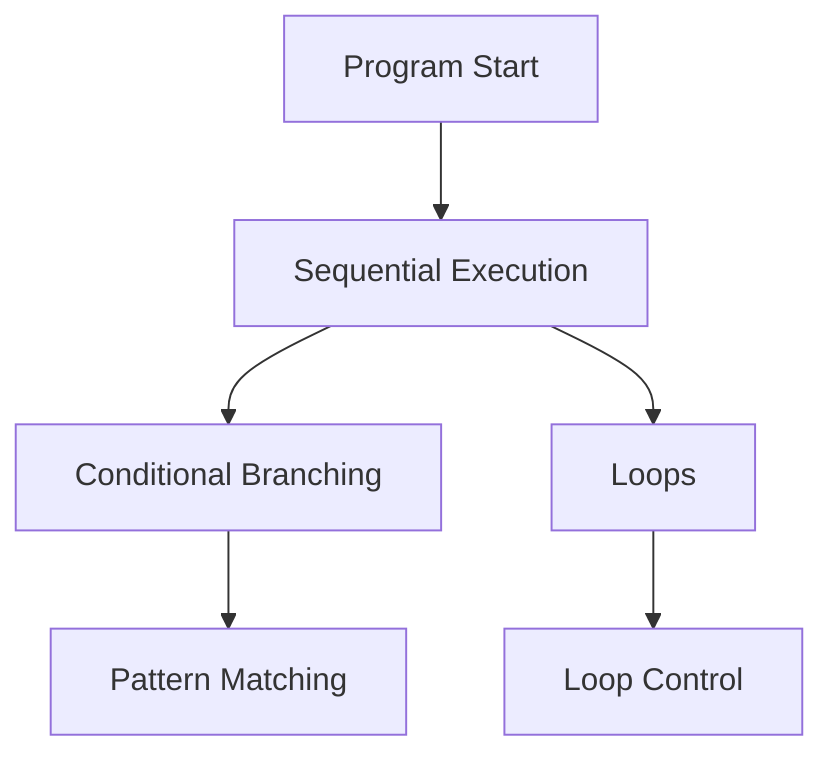

# Control Flow in Python

Control flow determines **which parts of a program execute and in what order**.

So far, our programs executed sequentially---one line after another.
Control flow introduces mechanisms that allow programs to:

- make decisions
- repeat actions
- terminate loops early
- select behaviors based on patterns

These constructs are essential for building real programs. The following diagram shows how these control flow mechanisms branch from sequential execution:

This chapter introduces Python's core control flow tools:

| Construct          | Purpose                           |
| ------------------ | --------------------------------- |
| `if`               | conditional branching             |
| `for`              | iteration over sequences          |
| `while`            | repetition while condition holds  |
| `break`            | exit loops early                  |
| `continue`         | skip an iteration                 |
| `else` on loops    | detect successful loop completion |
| ternary expression | inline conditional expression     |
| `match`            | structural pattern matching       |

Understanding control flow allows programs to **adapt their behavior based on data and conditions**.
