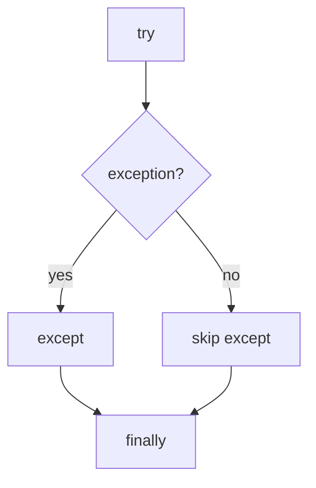

# Exception Handling

Python allows programs to **catch and handle exceptions** using `try` and `except`.

This allows a program to recover from errors instead of crashing.

```mermaid
flowchart TD
    A[try block]
    A --> B{exception occurs?}
    B -->|yes| C[except block]
    B -->|no| D[continue normally]
````

---

## 1. Basic try / except

```python
try:
    x = int("hello")
except ValueError:
    print("Conversion failed")
```

Output:

```text
Conversion failed
```

The program continues running instead of stopping.

---

## 2. Handling Multiple Exceptions

```python
try:
    x = int(input("Number: "))
    print(10 / x)
except ValueError:
    print("Invalid number")
except ZeroDivisionError:
    print("Cannot divide by zero")
```

Each exception type can be handled separately.

---

## 3. Catching Multiple Types Together

```python
except (ValueError, TypeError):
    print("Invalid input")
```

This handles multiple error types with a single handler.

---

## 4. The finally Clause

The `finally` block runs regardless of whether an exception occurred.

```python
try:
    f = open("data.txt")
finally:
    print("Done")
```

This is often used for cleanup tasks.



---

## 5. else Clause

`else` runs only when no exception occurs.

```python
try:
    x = int("10")
except ValueError:
    print("Bad input")
else:
    print("Success")
```

---

## 6. Worked Example

```python
try:
    value = int(input("Enter number: "))
    result = 10 / value
    print(result)
except ValueError:
    print("Please enter a valid number")
except ZeroDivisionError:
    print("Division by zero")
finally:
    print("Program finished")
```

---

## 7. Good Practices

* catch only exceptions you expect
* keep `try` blocks small
* avoid using `except:` without specifying types

---

## 8. Summary

Key ideas:

* `try` protects code that might fail
* `except` handles specific exceptions
* `finally` always executes
* `else` runs when no error occurs

Exception handling allows programs to recover gracefully from unexpected situations.