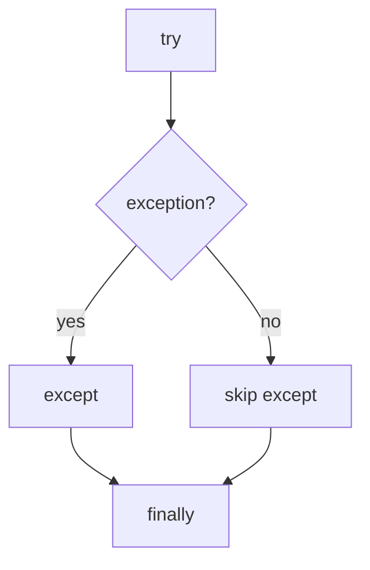

# Exception Handling

Python allows programs to **catch and handle exceptions** using `try` and `except`.

This allows a program to recover from errors instead of crashing.

```mermaid
flowchart TD
    A[try block]
    A --> B{exception occurs?}
    B -->|yes| C[except block]
    B -->|no| D[continue normally]
````

---

## 1. Basic try / except

```python
try:
    x = int("hello")
except ValueError:
    print("Conversion failed")
```

Output:

```text
Conversion failed
```

The program continues running instead of stopping.

---

## 2. Handling Multiple Exceptions

```python
try:
    x = int(input("Number: "))
    print(10 / x)
except ValueError:
    print("Invalid number")
except ZeroDivisionError:
    print("Cannot divide by zero")
```

Each exception type can be handled separately.

---

## 3. Catching Multiple Types Together

```python
except (ValueError, TypeError):
    print("Invalid input")
```

This handles multiple error types with a single handler.

---

## 4. The finally Clause

The `finally` block runs regardless of whether an exception occurred.

```python
try:
    f = open("data.txt")
finally:
    print("Done")
```

This is often used for cleanup tasks.



---

## 5. else Clause

`else` runs only when no exception occurs.

```python
try:
    x = int("10")
except ValueError:
    print("Bad input")
else:
    print("Success")
```

---

## 6. Worked Example

```python
try:
    value = int(input("Enter number: "))
    result = 10 / value
    print(result)
except ValueError:
    print("Please enter a valid number")
except ZeroDivisionError:
    print("Division by zero")
finally:
    print("Program finished")
```

---

## 7. Good Practices

* catch only exceptions you expect
* keep `try` blocks small
* avoid using `except:` without specifying types

---


## 8. Summary

Key ideas:

* `try` protects code that might fail
* `except` handles specific exceptions
* `finally` always executes
* `else` runs when no error occurs

Exception handling allows programs to recover gracefully from unexpected situations.


## Exercises

**Exercise 1.**
Explain the difference between the `else` and `finally` clauses in a `try` statement. When does each execute? Consider this code:

```python
try:
    result = int("42")
except ValueError:
    print("error")
else:
    print("success")
finally:
    print("cleanup")
```

What is the output? What would change if the string were `"abc"` instead of `"42"`?

??? success "Solution to Exercise 1"
    Output with `"42"`:

    ```text
    success
    cleanup
    ```

    - `else` executes only when the `try` block completes **without** raising an exception. It runs after `try` succeeds.
    - `finally` executes **always**, regardless of whether an exception occurred, was caught, or was re-raised. It is for cleanup code.

    With `"abc"`: `int("abc")` raises `ValueError`. The `except` block runs, printing `"error"`. The `else` block is skipped (an exception occurred). The `finally` block runs, printing `"cleanup"`. Output: `error`, `cleanup`.

    The `else` clause is useful for code that should run only on success but is not "protected" code. Putting it in the `try` block would accidentally catch its exceptions too.

---

**Exercise 2.**
A common anti-pattern is using a bare `except:` clause:

```python
try:
    do_something()
except:
    pass
```

Explain why this is dangerous. What kinds of exceptions does bare `except:` catch that you probably do NOT want to catch? What should you write instead?

??? success "Solution to Exercise 2"
    Bare `except:` catches **every exception**, including:

    - `KeyboardInterrupt` (user pressing Ctrl+C to stop the program)
    - `SystemExit` (calls to `sys.exit()`)
    - `MemoryError` (system running out of memory)
    - `GeneratorExit` and other internal signals

    Combined with `pass`, this silently swallows ALL errors, making bugs invisible. The program may produce wrong results, corrupt data, or behave unpredictably, with no indication of what went wrong.

    Better approaches:

    ```python
    # Catch specific exceptions
    try:
        do_something()
    except (ValueError, IOError) as e:
        print(f"Error: {e}")

    # Or at minimum, catch Exception (which excludes KeyboardInterrupt, SystemExit)
    try:
        do_something()
    except Exception as e:
        print(f"Unexpected error: {e}")
    ```

---

**Exercise 3.**
Why does Python use exceptions for "expected" situations (like a missing dictionary key raising `KeyError`) rather than returning error codes? Compare Python's EAFP ("Easier to Ask Forgiveness than Permission") style with the LBYL ("Look Before You Leap") style. Which approach does this code follow, and why?

```python
try:
    value = my_dict[key]
except KeyError:
    value = default
```

??? success "Solution to Exercise 3"
    The code follows **EAFP** (Easier to Ask Forgiveness than Permission): it attempts the operation directly and handles the exception if it fails.

    The LBYL alternative would check first:

    ```python
    if key in my_dict:
        value = my_dict[key]
    else:
        value = default
    ```

    Python favors EAFP for several reasons:

    1. **Atomicity**: In concurrent code, the key could be deleted between the `if key in my_dict` check and the `my_dict[key]` access (a race condition). EAFP avoids this.
    2. **Performance**: When the key usually exists, EAFP avoids the cost of checking twice (once for `in`, once for access). Exceptions are cheap when not raised.
    3. **Duck typing**: EAFP works with any object that supports `[]`, without checking its type first. LBYL requires knowing what checks to perform.

    Python uses exceptions for "expected" situations because exceptions are a structured, type-safe error-handling mechanism. Unlike error codes (which can be ignored, forgotten, or confused with valid return values), exceptions cannot be silently ignored -- they propagate up the call stack until caught.
