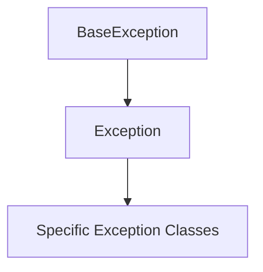

# Exception Hierarchy

Exceptions are Python's mechanism for handling **failure in programs**. At a high level, exceptions answer three questions:

- **What went wrong?** (exception type)
- **Where did it happen?** (traceback)
- **What should happen next?** (handling)

While control flow describes what happens when operations succeed, exceptions describe what happens when they fail. Exceptions are not just errors---they are a structured form of **control flow for failure cases**.

Understanding how exceptions are organized helps interpret error messages and handle problems correctly.

```mermaid
flowchart TD
    A[BaseException]
    A --> B[Exception]
    B --> C[ArithmeticError]
    B --> D[LookupError]
    B --> E[TypeError]
    B --> F[ValueError]
    B --> G[RuntimeError]
````

---

## 1. What Is an Exception?

An exception is an event that occurs during program execution and disrupts the normal flow of instructions.

Example:

```python
print(10 / 0)
```

Output:

```text
ZeroDivisionError: division by zero
```

Python stops execution because it cannot perform the operation.

---

## 2. Exception Objects

Exceptions are implemented as objects belonging to classes.

For example:

* `ZeroDivisionError`
* `TypeError`
* `ValueError`

These classes inherit from a common base.



Most user programs interact only with exceptions derived from `Exception`.

---

## 3. Why Exceptions Exist

Exceptions separate normal logic from error handling. Instead of checking for errors at every step, programs can:

- assume operations succeed
- handle failures only when they occur

This leads to clearer and more maintainable code. Without exceptions, programs would need complex error-checking code everywhere.

---

## 4. Interpreting Tracebacks

When an exception occurs, Python prints a **traceback**.

Example:

```python
def f():
    return 1 / 0

f()
```

Output:

```text
Traceback (most recent call last):
  ...
ZeroDivisionError: division by zero
```

The traceback shows the chain of function calls that led to the error.

---

## 5. Built-in Exception Categories

Some common exception families include:

| Category       | Example                  |
| -------------- | ------------------------ |
| arithmetic     | `ZeroDivisionError`      |
| type errors    | `TypeError`              |
| value errors   | `ValueError`             |
| lookup errors  | `IndexError`, `KeyError` |
| runtime issues | `RuntimeError`           |

The hierarchy is not just classification---it determines how exceptions are caught. Catching a parent class (e.g., `LookupError`) also catches all its subclasses (`IndexError`, `KeyError`). More specific exceptions should be handled before general ones.

These exception types are explored in more detail in the next section on common runtime errors.

---

## 6. Example: Index Error

```python
values = [1, 2, 3]
print(values[5])
```

Output:

```text
IndexError: list index out of range
```

This occurs when accessing a sequence outside its valid range.

---


## 7. Summary

Key ideas:

* exceptions are objects derived from `Exception`
* Python prints tracebacks to explain failures
* different exception types represent different kinds of failure

The hierarchy allows programs to decide how broadly or narrowly to handle failure, balancing specificity with generality.

In real programs, most complexity arises not from the success path, but from handling failures correctly. Exceptions make this complexity manageable by structuring failure into predictable and composable mechanisms. They allow programs to defer error handling decisions to higher levels, enabling separation between low-level operations and high-level control.


## Exercises

**Exercise 1.**
`except Exception` catches most errors, but `except BaseException` catches even more. Explain the difference:

```python
# Catches most errors
try:
    ...
except Exception:
    pass

# Catches everything
try:
    ...
except BaseException:
    pass
```

What exceptions does `BaseException` catch that `Exception` does not? Why is catching `BaseException` almost always wrong?

??? success "Solution to Exercise 1"
    `BaseException` is the root of the entire exception hierarchy. `Exception` inherits from `BaseException`. Three important exceptions inherit from `BaseException` but NOT from `Exception`:

    - `KeyboardInterrupt`: raised when the user presses Ctrl+C.
    - `SystemExit`: raised by `sys.exit()`.
    - `GeneratorExit`: raised when a generator is closed.

    Catching `BaseException` catches these too, which is almost always wrong because:
    - Catching `KeyboardInterrupt` prevents the user from stopping a runaway program.
    - Catching `SystemExit` prevents `sys.exit()` from working.

    The separation exists by design: `except Exception` handles **program errors** (bugs and expected failures), while `KeyboardInterrupt` and `SystemExit` are **control signals** that should propagate normally.

---

**Exercise 2.**
`IndexError` and `KeyError` both inherit from `LookupError`. Predict what happens:

```python
try:
    data = [1, 2, 3]
    print(data[10])
except LookupError as e:
    print(f"Caught: {type(e).__name__}: {e}")
```

Why does catching `LookupError` work here even though an `IndexError` was raised? How does the exception hierarchy enable this? Is catching parent exceptions good practice or should you always catch the specific type?

??? success "Solution to Exercise 2"
    Output:

    ```text
    Caught: IndexError: list index out of range
    ```

    Catching `LookupError` works because `IndexError` is a **subclass** of `LookupError`. When `except` checks if the raised exception matches, it uses `isinstance()` -- so `except LookupError` catches any exception that is a `LookupError` or a subclass of it (including `IndexError` and `KeyError`).

    Whether to catch parent or specific exceptions depends on intent:
    - Catch **specific** (`IndexError`) when you want to handle that exact error differently.
    - Catch **parent** (`LookupError`) when you want to handle all lookup failures the same way.
    - Catch **`Exception`** only as a last resort, and always log or re-raise.

---

**Exercise 3.**
Exceptions are objects and can store information. Predict the output:

```python
try:
    int("hello")
except ValueError as e:
    print(type(e))
    print(e.args)
    print(str(e))
    print(isinstance(e, Exception))
```

What is stored in `e.args`? Why are exceptions objects rather than simple error codes?

??? success "Solution to Exercise 3"
    Output:

    ```text
    <class 'ValueError'>
    ("invalid literal for int() with base 10: 'hello'",)
    invalid literal for int() with base 10: 'hello'
    True
    ```

    `e.args` is a tuple containing the arguments passed to the exception constructor. For most built-in exceptions, this is a single error message string.

    Exceptions are objects (rather than simple error codes) because:
    1. **Hierarchy**: class inheritance lets you catch groups of related errors.
    2. **Information**: objects can carry detailed context (message, traceback, attributes).
    3. **Custom behavior**: you can subclass and add methods or attributes.
    4. **Consistency**: they follow Python's "everything is an object" principle.

    Error codes (as used in C) require checking return values at every call site, which is error-prone. Exception objects propagate automatically up the call stack until handled, separating error handling from normal logic.
