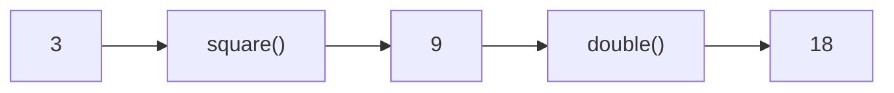

# Function Examples

These examples reinforce the concepts from the previous sections:
parameters, return values, reuse, and composition.

---

## Square Function

A function with a single parameter and a return value.

```python
def square(x):
    return x * x

print(square(5))
```

Output

```text
25
```

---

## Rectangle Area Function

A function with multiple parameters.

```python
def area(length, width):
    return length * width

print(area(3, 4))
```

Output

```text
12
```

---

## Greeting Function

Functions work with any data type, not just numbers.

```python
def greet(name):
    return "Hello, " + name

print(greet("Alice"))
```

Output

```text
Hello, Alice
```

---

## Temperature Conversion Function

A function that performs a real calculation.

```python
def celsius_to_fahrenheit(c):
    return (c * 9/5) + 32

print(celsius_to_fahrenheit(25))
```

Output

```text
77.0
```

---

## Maximum Value Function

Functions can include conditional logic.

```python
def max_value(a, b):
    if a > b:
        return a
    return b

print(max_value(10, 4))
```

Output

```text
10
```

---

## Function Composition

Functions can be combined by passing the return value of one function as the argument to another.

```python
def double(x):
    return 2 * x

print(double(square(3)))
```

`square(3)` runs first and returns 9.
That value is then passed to `double()`.

Output

```text
18
```



---

## Key Idea

Functions allow complex tasks to be broken into small reusable pieces.
Small functions can also be combined to build more complex programs.
