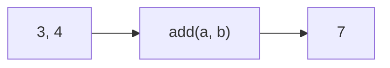

# Return Values

Functions can compute results and send them back to the caller.

This is done using the `return` statement.

---

## The Problem

Consider this function:

```python
def add(a, b):
    print(a + b)

result = add(3, 4)

print("Result:", result)
```

Output

```text
7
Result: None
```

The function printed the value 7, but it did not return anything.
When a function does not return a value, Python returns `None`.

---

## The Solution

The `return` statement sends a value back to the caller.

```python
def add(a, b):
    return a + b

result = add(3, 4)

print("Result:", result)
```

Output

```text
Result: 7
```

---

## Printing vs Returning

`print` displays a value on the screen.
`return` sends a value back to the caller.

Returning allows the result to be reused.



---

## Using Return Values

The returned value can be stored, printed, or used in expressions.

```python
print(add(2, 5) * 2)
```

Output

```text
14
```

---

## Returning Multiple Values

Python functions can return multiple values separated by commas.

```python
def min_max(a, b):
    if a < b:
        return a, b
    return b, a

small, large = min_max(10, 3)

print(small, large)
```

Output

```text
3 10
```

Python actually returns a **tuple**.
Values separated by commas are automatically grouped into a tuple.

---

## Early Return

Sometimes a function should stop immediately when an invalid input is detected.

```python
def reciprocal(x):
    if x == 0:
        return None
    return 1 / x
```

This pattern is useful for **guard conditions** and validation.

---

## Summary

Key ideas:

- `return` sends a value back to the caller
- printing displays a value but does not return it
- returned values can be stored or reused
- functions can return multiple values
- functions can return early based on conditions

So far we have passed and returned values without specifying what kinds of values they are.
Next we will see how **type hints** can document the expected types of parameters and return values.
