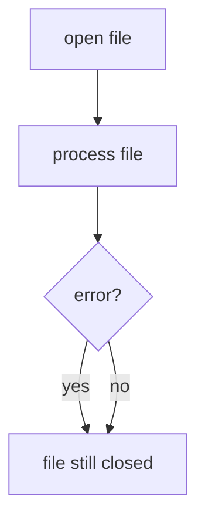

# Context Managers (with)

Python provides a safer and more convenient way to manage files using **context managers**.

The `with` statement automatically handles opening and closing files.

```mermaid
flowchart TD
    A[with open()]
    A --> B[file operations]
    B --> C[file automatically closed]
````

---

## 1. Basic Syntax

```python
with open("data.txt") as f:
    text = f.read()
    print(text)
```

After the block finishes, the file is automatically closed.

---

## 2. Why Context Managers Are Useful

They ensure resources are released even if errors occur.



This makes programs more robust.

---

## 3. Writing Files with with

```python
with open("output.txt", "w") as f:
    f.write("Hello\n")
```

No explicit `close()` call is required.

---

## 4. Nested File Operations

Multiple files can be opened.

```python
with open("input.txt") as f1, open("output.txt", "w") as f2:
    for line in f1:
        f2.write(line)
```

---

## 5. Conceptual Model

A context manager is any object that implements two special methods:

* `__enter__()` -- called when execution enters the `with` block. Its return value is bound to the variable after `as`.
* `__exit__()` -- called when execution leaves the `with` block, whether normally or via an exception.

The `with` statement translates into a `try/finally` pattern:

```python
# with open("data.txt") as f:
#     process(f)

# is equivalent to:
f = open("data.txt").__enter__()
try:
    process(f)
finally:
    f.__exit__()
```

This guarantees that cleanup occurs regardless of how the block exits.

---

## 6. Worked Example

```python
with open("numbers.txt") as f:
    total = 0
    for line in f:
        total += int(line)

print(total)
```

---


## 7. Summary

Key ideas:

* context managers simplify resource handling
* `with` automatically closes files
* they prevent resource leaks
* they are the recommended approach for file I/O

Using `with` is considered best practice when working with files.


## Exercises

**Exercise 1.**
A programmer opens a file without `with` and an exception occurs before `close()`:

```python
f = open("data.txt")
data = f.read()
result = int(data)  # Raises ValueError if data is not a number
f.close()           # Never reached!
```

Explain why the file is not closed. Then rewrite using `with` and explain how `with` guarantees the file is closed even when an exception occurs. What method does `with` call to close the file?

??? success "Solution to Exercise 1"
    Without `with`, if `int(data)` raises `ValueError`, execution jumps to the exception handler (or crashes). The `f.close()` line is skipped. The file remains open, consuming a file descriptor.

    Rewritten with `with`:

    ```python
    with open("data.txt") as f:
        data = f.read()
        result = int(data)
    # f.close() is called automatically here, even if int() raised an error
    ```

    `with` calls `f.__exit__()` when the block exits, whether normally or via an exception. For file objects, `__exit__()` calls `f.close()`. The guarantee comes from Python's implementation: the `with` statement is syntactic sugar for a `try/finally` pattern:

    ```python
    f = open("data.txt")
    try:
        data = f.read()
        result = int(data)
    finally:
        f.close()
    ```

---

**Exercise 2.**
Context managers work with more than just files. Explain what resource management problem this pattern solves:

```python
import threading

lock = threading.Lock()

with lock:
    # Critical section
    shared_data.append(item)
```

What happens if an exception occurs inside the `with lock:` block? Why is `with` safer than manually calling `lock.acquire()` and `lock.release()`?

??? success "Solution to Exercise 2"
    The `with lock:` pattern ensures the lock is **always released**, even if the critical section raises an exception. `lock.__enter__()` acquires the lock, and `lock.__exit__()` releases it.

    Without `with`, if an exception occurs between `lock.acquire()` and `lock.release()`:

    ```python
    lock.acquire()
    shared_data.append(item)  # If this raises an exception...
    lock.release()            # ...this line is never reached
    ```

    The lock remains held, potentially causing a **deadlock** -- other threads waiting for the lock will wait forever.

    Context managers solve the general problem of **resource cleanup**: any resource that needs to be released (file handles, locks, database connections, network sockets) benefits from the `with` pattern. The cleanup is guaranteed regardless of how the block exits.

---

**Exercise 3.**
After the `with` block ends, the file variable still exists but the file is closed. Predict the output:

```python
with open("data.txt") as f:
    first_line = f.readline()

print(f.closed)
print(f.readline())
```

What happens when you try to read from a closed file? Why does Python not delete the variable `f` when the `with` block exits?

??? success "Solution to Exercise 3"
    Output:

    ```text
    True
    ```

    Then `f.readline()` raises `ValueError: I/O operation on closed file.`

    `f.closed` is `True` because `with` closed the file when the block ended. Attempting to read from a closed file raises an error because the underlying file descriptor has been released to the OS.

    Python does not delete `f` when the `with` block exits because `with` manages **resources**, not **variable scope**. The variable `f` still refers to the file object, but that object is now in a "closed" state. This is by design: you might need to check `f.closed` or access `f.name` after the block. The `with` statement only guarantees that `__exit__` is called, not that the variable disappears.
