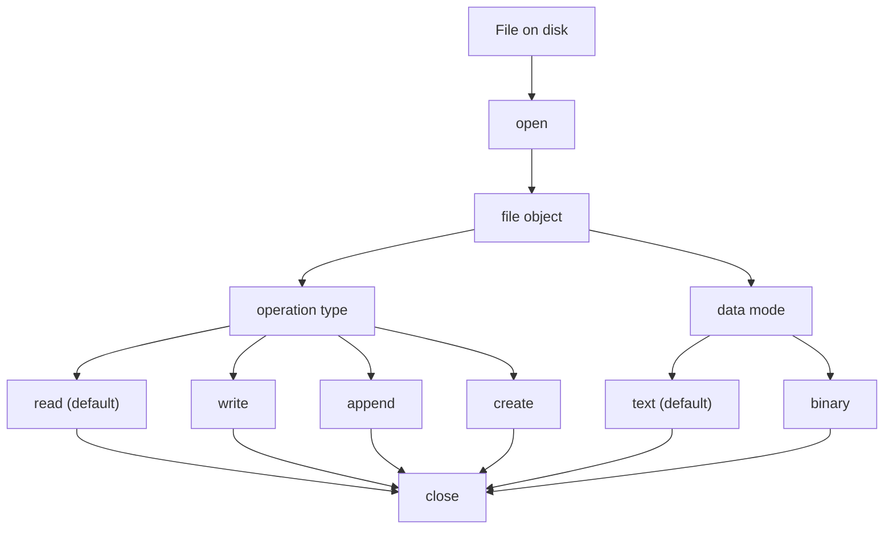

# Opening and Reading Files

Programs often need to read data stored in files.

Python provides built-in tools for opening and reading files.

Typical tasks include:

- reading configuration files
- loading datasets
- processing logs
- reading user input stored in files



---

## 1. Opening and Reading a File with `with`

The standard way to open a file in Python is the `with` statement (a **context manager**). It opens the file, gives you a file object, and **automatically closes** the file when the block ends -- even if an exception occurs.

```python
with open("data.txt") as f:
    text = f.read()

print(text)
```

`open()` returns a **file object**. The default mode is **read mode** (`"r"`), so `open("data.txt")` and `open("data.txt", "r")` are equivalent.

When reading text files that may contain non-ASCII characters, specify the encoding explicitly:

```python
with open("data.txt", encoding="utf-8") as f:
    text = f.read()
```

Without `encoding="utf-8"`, Python uses the platform default, which varies across systems and can cause garbled text or errors.

### Relative vs. Absolute Paths

`"data.txt"` is a **relative path**. Python looks for the file in the **current working directory** (the directory from which the script is run), not necessarily the directory containing the script.

If the file is not found, Python raises:

```text
FileNotFoundError: [Errno 2] No such file or directory: 'data.txt'
```

To check the current working directory:

```python
import os
print(os.getcwd())
```

To open a file relative to the script's location (regardless of where you run the script from):

```python
from pathlib import Path

script_dir = Path(__file__).parent

with open(script_dir / "data.txt") as f:
    text = f.read()
```

---

## 2. Reading the Entire File

`read()` loads the entire file contents into a single string.

```python
with open("data.txt") as f:
    text = f.read()

print(text)
```

This is convenient for small files. For very large files, prefer reading line by line (see next section).

---

## 3. Reading Line by Line

Files can also be processed one line at a time by iterating over the file object.

```python
with open("data.txt") as f:
    for line in f:
        print(line)
```

This approach is memory-efficient for large files because only one line is loaded into memory at a time.

---

## 4. read(), readline(), readlines()

| Method        | Description   |
| ------------- | ------------- |
| `read()`      | entire file   |
| `readline()`  | one line      |
| `readlines()` | list of lines |

Example:

```python
with open("data.txt") as f:
    print(f.readline())
    print(f.readline())
```

---

## 5. Worked Example

```python
with open("numbers.txt") as f:
    for line in f:
        print(int(line))
```

This example reads numbers from a file and prints them.

---

## 6. File Modes

The default mode for `open()` is `"r"` (read text). For the full table of file modes (`"w"`, `"a"`, `"b"`, etc.), see [File Writing](file_writing.md).

---

## 7. Manual open() and close() (Background)

Before the `with` statement was introduced, files were opened and closed manually:

```python
f = open("data.txt")
text = f.read()
f.close()
```

`f.close()` releases the file handle and flushes any buffered data to disk. The problem with this pattern is that if an error occurs between `open()` and `close()`, the file is never closed. The `with` statement solves this by guaranteeing cleanup, and should always be preferred.

---

## 8. Common Pitfalls

### Forgetting to close files

Unclosed files may cause resource problems. Using `with` eliminates this issue entirely.

### Reading extremely large files with `read()`

This loads the entire file into memory. Iterate line by line instead.

### Assuming files always exist

Attempting to open a missing file raises `FileNotFoundError`. See [Handling File Errors](file_errors.md) for how to handle this with `try`/`except`.

### Running scripts from unexpected directories

When using relative paths like `"data.txt"`, the file must exist in the current working directory, not the script's directory. Use `pathlib` to build paths relative to `__file__` for reliable file access.

---


## 9. Summary

Key ideas:

* the `with` statement is the standard way to open files -- it guarantees the file is closed automatically
* `open()` defaults to read mode (`"r"`) and uses relative paths, resolving from the current working directory
* specify `encoding="utf-8"` when reading text files with non-ASCII content
* `read()` loads the entire file; iterating line by line is preferred for large files
* `read()`, `readline()`, and `readlines()` offer different levels of granularity
* manual `open()`/`close()` is a legacy pattern; prefer `with` in all new code

File reading is the first step in processing external data sources.


## Exercises

**Exercise 1.**
Explain why `f.read()` should be avoided for very large files. What happens in memory when you call `read()` on a 10 GB file with only 8 GB of RAM? What is the preferred alternative for processing large files line by line, and why is it memory-efficient?

??? success "Solution to Exercise 1"
    `f.read()` loads the **entire file contents** into a single string in memory. For a 10 GB file on a machine with 8 GB of RAM, this would exhaust memory, causing either a `MemoryError` or severe swapping (the OS moves data between RAM and disk), making the program extremely slow.

    The preferred alternative:

    ```python
    with open("data.txt") as f:
        for line in f:
            process(line)
    ```

    Iterating over the file object reads **one line at a time**. Each line is loaded into memory, processed, and then the previous line can be garbage-collected. Memory usage stays roughly constant regardless of file size. This works because file objects are **iterators** -- they lazily produce lines on demand rather than loading everything at once.

---

**Exercise 2.**
After reading a file with `f.read()`, calling `f.read()` again returns an empty string `""`. Explain why. What is the "file position cursor," and how does it explain this behavior? How would you read the file contents a second time without reopening the file?

??? success "Solution to Exercise 2"
    Every open file object has a **position cursor** (or "file pointer") that tracks where the next read will start. When you first open a file, the cursor is at position 0 (the beginning).

    `f.read()` reads from the cursor to the end of the file, advancing the cursor to the end. A second `f.read()` tries to read from the end of the file -- there is nothing left, so it returns `""`.

    To read again without reopening: use `f.seek(0)` to move the cursor back to the beginning:

    ```python
    data1 = f.read()   # Reads everything, cursor at end
    f.seek(0)           # Move cursor back to start
    data2 = f.read()   # Reads everything again
    ```

    The cursor model explains why `for line in f` processes each line once -- each iteration advances the cursor past the line just read.

---

**Exercise 3.**
A programmer writes:

```python
f = open("data.txt")
data = f.read()
# ... process data ...
# forgot to call f.close()
```

Explain the potential problems of not closing a file. Then explain why the `with` statement is the correct solution and how it guarantees the file is closed even if an exception occurs.

??? success "Solution to Exercise 3"
    Not closing a file can cause:

    1. **Resource leaks**: The OS has a limited number of file handles. Opening many files without closing them can exhaust this limit, causing `OSError: Too many open files`.
    2. **Data loss**: For files opened for writing, data may be buffered in memory and not flushed to disk until the file is closed. If the program crashes, buffered data is lost.
    3. **Locking**: On some systems (especially Windows), an open file may be locked, preventing other programs from accessing it.

    The `with` statement guarantees cleanup:

    ```python
    with open("data.txt") as f:
        data = f.read()
    # f.close() is called automatically here, even if an exception occurred
    ```

    `with` calls `f.__exit__()` (which calls `f.close()`) when the block exits, whether normally or due to an exception. This is called a **context manager** pattern and is the only reliable way to ensure resources are properly released.
