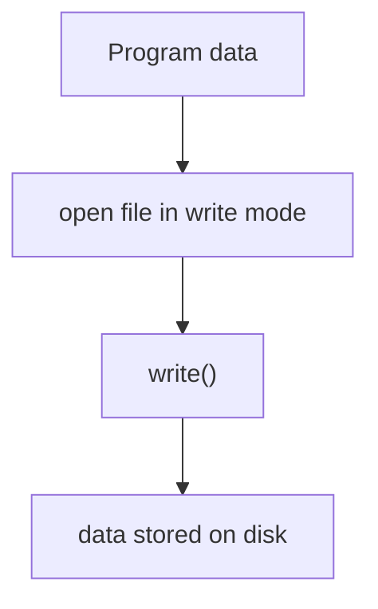

# Writing Files

Programs often need to write data to files.

Examples include:

- saving program output
- generating reports
- storing logs
- exporting processed data



---

## 1. Opening Files for Writing

To write to a file, open it with a write mode.

| Mode  | Meaning                                          |
| ----- | ------------------------------------------------ |
| `"w"` | Write -- creates the file or **overwrites** it   |
| `"a"` | Append -- creates the file or adds to the end    |
| `"x"` | Exclusive creation -- **fails** if file exists   |

The full table of all file modes (including read and binary modes) is on the
[Opening and Reading Files](file_reading.md#7-file-modes) page.

### Write mode (`"w"`)

```python
with open("output.txt", "w") as f:
    f.write("Hello\n")
```

This creates the file if it does not exist.
If the file already exists, its contents are **erased** before writing begins.

### Append mode (`"a"`)

```python
with open("log.txt", "a") as f:
    f.write("New entry\n")
```

Append mode preserves existing content and adds new data to the end.
This is the correct mode for log files and any situation where previous data must be kept.

### Exclusive creation mode (`"x"`)

```python
with open("config.txt", "x") as f:
    f.write("initial settings\n")
```

Mode `"x"` raises `FileExistsError` if the file already exists.
This prevents accidental overwrites and is useful when creating files that should not be replaced, such as configuration files or unique reports.

```python
try:
    with open("config.txt", "x") as f:
        f.write("initial settings\n")
except FileExistsError:
    print("File already exists -- skipping creation")
```

---

## 2. Why `with` Matters for Writing

When writing to a file, Python buffers data in memory before flushing it to disk.
Calling `f.close()` triggers this flush, but if an exception occurs before `close()` is reached, buffered data can be **lost**.

The `with` statement guarantees that the file is closed (and therefore flushed) when the block exits, even if an error occurs.

```python
# Risky -- buffered data may be lost if an exception occurs
f = open("output.txt", "w")
f.write("important data\n")
# if an exception happens here, the data may never reach disk
f.close()

# Safe -- the with statement guarantees the file is flushed and closed
with open("output.txt", "w") as f:
    f.write("important data\n")
# f is automatically closed here, even if an exception occurred
```

For reading, a missed `close()` wastes a file handle but no data is lost.
For writing, a missed `close()` can mean **lost output**.
Always use `with` when writing files.

---

## 3. Writing Text

The `write()` method writes a string to the file and returns the number of characters written.
It does **not** add a newline automatically -- you must include `"\n"` yourself.

```python
with open("output.txt", "w") as f:
    f.write("Hello\n")
    f.write("Python\n")
```

---

## 4. Writing Multiple Lines

`writelines()` writes an iterable of strings to the file.
Like `write()`, it does not add newlines between items -- each string must already contain its own newline if desired.

```python
lines = ["a\n", "b\n", "c\n"]

with open("letters.txt", "w") as f:
    f.writelines(lines)
```

---

## 5. Text Encoding

By default, `open()` uses the system's default encoding, which varies by platform.
To ensure consistent behavior across all systems, specify `encoding="utf-8"` explicitly.

```python
with open("output.txt", "w", encoding="utf-8") as f:
    f.write("cafe\u0301\n")   # café with combining accent
    f.write("naïve\n")
```

UTF-8 can represent any Unicode character and is the most widely used encoding.
Omitting the encoding parameter can lead to different results on different machines, or to `UnicodeEncodeError` when writing characters outside the system's default encoding.

A good rule: **always pass `encoding="utf-8"`** unless you have a specific reason to use another encoding.

```python
# Reading back a UTF-8 file -- use the same encoding
with open("output.txt", "r", encoding="utf-8") as f:
    print(f.read())
```

---

## 6. Newline Handling

In text mode, Python translates the newline character `"\n"` to the platform's native line ending on write, and translates native line endings back to `"\n"` on read.

| Platform       | Native line ending |
| -------------- | ------------------ |
| Linux / macOS  | `\n` (LF)         |
| Windows        | `\r\n` (CR+LF)    |

This means `f.write("hello\n")` produces `hello\r\n` on Windows and `hello\n` on Linux.

To control this behavior, use the `newline` parameter:

```python
# Write Unix-style line endings on all platforms
with open("output.txt", "w", newline="\n") as f:
    f.write("line one\n")
    f.write("line two\n")

# Write Windows-style line endings on all platforms
with open("output.txt", "w", newline="\r\n") as f:
    f.write("line one\n")
    f.write("line two\n")
```

When `newline=""` is passed, no translation is performed -- `"\n"` is written as the literal byte `0x0A` regardless of platform.

For most purposes, the default behavior (let Python handle translation) is correct.
Explicit control is useful when producing files for a specific platform or when writing CSV files (the `csv` module recommends `newline=""`).

---

## 7. Worked Example

```python
numbers = [1, 2, 3]

with open("numbers.txt", "w", encoding="utf-8") as f:
    for n in numbers:
        f.write(str(n) + "\n")
```

---

## 8. Common Pitfalls

### Overwriting files accidentally

Using `"w"` replaces existing content silently.
Consider `"x"` mode when creating files that must not already exist, or check with `Path.exists()` before opening.

### Writing non-string objects

`write()` expects strings.
Convert values first:

```python
with open("output.txt", "w") as f:
    f.write(str(42))
```

### Forgetting to flush

Data written to a file may sit in a buffer.
Using `with` ensures the buffer is flushed when the block exits.
If you need to flush mid-block, call `f.flush()` explicitly.

### Encoding mismatches

Writing a file with one encoding and reading it with another produces garbled text or errors.
Always use `encoding="utf-8"` on both sides unless you have a reason not to.

---

## 9. Summary

Key ideas:

* `"w"` mode creates or overwrites a file; `"a"` mode appends; `"x"` mode fails if the file exists
* always use the `with` statement when writing -- it guarantees data is flushed and the file is closed
* `write()` stores text data; `writelines()` writes multiple strings
* specify `encoding="utf-8"` for portable, consistent behavior
* Python translates `"\n"` to the platform's native line ending in text mode

File writing allows programs to persist data beyond program execution.


## Exercises

**Exercise 1.**
`write()` does not add newlines automatically. Predict the content of the file:

```python
with open("test.txt", "w") as f:
    f.write("hello")
    f.write("world")
```

What does `test.txt` contain? How does this differ from `print("hello", file=f)`? Why does `write()` not add newlines while `print()` does?

??? success "Solution to Exercise 1"
    `test.txt` contains: `helloworld` (no newline between them, no trailing newline).

    Using `print("hello", file=f)` would write `hello\n` -- `print()` adds a newline by default (controlled by the `end` parameter, which defaults to `"\n"`).

    `write()` does not add newlines because it is a **low-level** method that writes exactly the bytes you give it. This gives you full control over the output format. `print()` is a **high-level** function designed for human-readable output, so it adds separators and newlines by default. The design principle: low-level tools should be precise; high-level tools should be convenient.

---

**Exercise 2.**
Mode `"w"` overwrites existing content, while mode `"a"` appends. Predict the final content of the file after running this code:

```python
with open("log.txt", "w") as f:
    f.write("first\n")

with open("log.txt", "w") as f:
    f.write("second\n")

with open("log.txt", "a") as f:
    f.write("third\n")
```

Why is accidental use of `"w"` a common source of data loss? What simple precaution can prevent it?

??? success "Solution to Exercise 2"
    Final content of `log.txt`:

    ```text
    second
    third
    ```

    The first `"w"` open creates the file with `"first\n"`. The second `"w"` open **overwrites** the entire file with `"second\n"` -- `"first\n"` is gone. The `"a"` open appends `"third\n"` to the existing content.

    Accidental use of `"w"` is a common source of data loss because it silently destroys the previous content without warning. Precautions:
    1. Check if the file exists before writing: `if Path(filename).exists(): raise FileExistsError(...)`.
    2. Use `"x"` mode (exclusive creation): `open("log.txt", "x")` raises `FileExistsError` if the file already exists.
    3. Always use `"a"` for log files.

---

**Exercise 3.**
`write()` only accepts strings. A programmer wants to write a list of numbers:

```python
numbers = [1, 2, 3, 4, 5]

with open("nums.txt", "w") as f:
    f.write(numbers)
```

This raises `TypeError`. Show two correct approaches: one using `write()` with explicit conversion, and one using `print()` with the `file` parameter. Which approach is more convenient for complex output?

??? success "Solution to Exercise 3"
    Using `write()` with explicit conversion:

    ```python
    numbers = [1, 2, 3, 4, 5]
    with open("nums.txt", "w") as f:
        for n in numbers:
            f.write(str(n) + "\n")
    ```

    Using `print()` with `file` parameter:

    ```python
    numbers = [1, 2, 3, 4, 5]
    with open("nums.txt", "w") as f:
        for n in numbers:
            print(n, file=f)
    ```

    `print()` is more convenient because it automatically converts values to strings (via `str()`) and adds newlines. For complex output with multiple values, `print(a, b, c, file=f)` handles spacing and conversion automatically, while `write()` would require `f.write(f"{a} {b} {c}\n")`.
