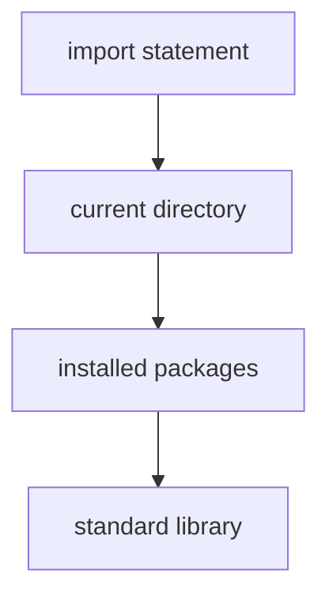

# Import Mechanics

Python programs are typically organized into **modules**.

A module is simply a Python file containing functions, classes, and variables that can be reused by other programs.

The `import` statement allows one module to access definitions from another.

```mermaid
flowchart LR
    A[Module A] -->|import| B[Module B]
    B --> C[functions]
    B --> D[classes]
    B --> E[variables]
````

---

## 1. What Is a Module?

A module is a file ending in `.py`.

Example file:

```python
# math_utils.py

def square(x):
    return x * x
```

Another program can use this function by importing the module.

```python
import math_utils

print(math_utils.square(5))
```

---

## 2. Basic Import Syntax

The simplest form:

```python
import module_name
```

Example:

```python
import math

print(math.sqrt(9))
```

Output:

```text
3.0
```

The module name acts as a namespace.

---

## 3. Importing Specific Names

Sometimes only certain functions are needed.

```python
from math import sqrt

print(sqrt(16))
```

This allows calling `sqrt()` directly without the module prefix.

---

## 4. Import Aliases

Modules can be imported with shorter names.

```python
import numpy as np
```

Example:

```python
import math as m

print(m.sqrt(25))
```

Aliases make code shorter and more readable.

---

## 5. Importing Multiple Names

```python
from math import sqrt, sin, cos
```

---

## 6. How Python Finds Modules

Python searches for modules in several locations.



This search path is stored in `sys.path`.

---

## 7. The Standard Library

Python includes many built-in modules.

Examples:

| Module     | Purpose                 |
| ---------- | ----------------------- |
| `math`     | mathematical functions  |
| `random`   | random numbers          |
| `datetime` | dates and times         |
| `os`       | operating system tools  |
| `sys`      | interpreter interaction |

Example:

```python
import random

print(random.randint(1, 10))
```

---

## 8. Worked Example

Create a module:

```python
# geometry.py

def area_square(x):
    return x * x
```

Use it:

```python
import geometry

print(geometry.area_square(4))
```

Output:

```text
16
```

---

## 9. Summary

Key ideas:

* modules are Python files containing reusable code
* `import` loads a module
* `from module import name` imports specific objects
* aliases can simplify code
* Python searches several locations when importing modules

Modules help organize programs and promote code reuse.