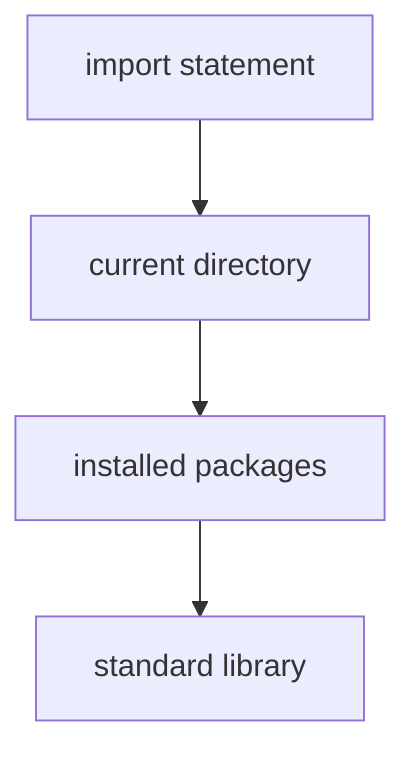

# Import Mechanics

Python programs are typically organized into **modules**.

A module is simply a Python file containing functions, classes, and variables that can be reused by other programs.

The `import` statement allows one module to access definitions from another.

```mermaid
flowchart LR
    A[Module A] -->|import| B[Module B]
    B --> C[functions]
    B --> D[classes]
    B --> E[variables]
````

---

## 1. What Is a Module?

A module is a file ending in `.py`.

Example file:

```python
# math_utils.py

def square(x):
    return x * x
```

Another program can use this function by importing the module.

```python
import math_utils

print(math_utils.square(5))
```

---

## 2. Basic Import Syntax

The simplest form:

```python
import module_name
```

Example:

```python
import math

print(math.sqrt(9))
```

Output:

```text
3.0
```

The module name acts as a namespace.

---

## 3. Importing Specific Names

Sometimes only certain functions are needed.

```python
from math import sqrt

print(sqrt(16))
```

This allows calling `sqrt()` directly without the module prefix.

---

## 4. Import Aliases

Modules can be imported with shorter names.

```python
import numpy as np
```

Example:

```python
import math as m

print(m.sqrt(25))
```

Aliases make code shorter and more readable.

---

## 5. Importing Multiple Names

```python
from math import sqrt, sin, cos
```

---

## 6. How Python Finds Modules

Python searches for modules in several locations.



This search path is stored in `sys.path`.

---

## 7. The Standard Library

Python includes many built-in modules.

Examples:

| Module     | Purpose                 |
| ---------- | ----------------------- |
| `math`     | mathematical functions  |
| `random`   | random numbers          |
| `datetime` | dates and times         |
| `os`       | operating system tools  |
| `sys`      | interpreter interaction |

Example:

```python
import random

print(random.randint(1, 10))
```

---

## 8. Worked Example

Create a module:

```python
# geometry.py

def area_square(x):
    return x * x
```

Use it:

```python
import geometry

print(geometry.area_square(4))
```

Output:

```text
16
```

---


## 9. Summary

Key ideas:

* modules are Python files containing reusable code
* `import` loads a module
* `from module import name` imports specific objects
* aliases can simplify code
* Python searches several locations when importing modules

Modules help organize programs and promote code reuse.


## Exercises

**Exercise 1.**
When you write `import math`, Python executes the module's code and creates a module object. What happens if you `import math` a second time in the same program? Does Python re-execute the module code? Explain the caching mechanism and why it exists.

??? success "Solution to Exercise 1"
    Python does NOT re-execute the module code. The first `import math` executes `math.py` (or the C equivalent), creates a module object, and stores it in `sys.modules` (a dictionary mapping module names to module objects). Every subsequent `import math` in any part of the program simply retrieves the cached module object from `sys.modules`.

    This caching exists because:

    1. **Performance**: Re-executing module code on every import would be wasteful, especially for large modules.
    2. **Correctness**: Module-level variables (like configuration settings) would be reset on every import. Caching ensures there is one consistent module object.
    3. **Avoiding side effects**: If a module prints output or opens files at import time, re-execution would repeat those side effects.

    To force re-execution (rarely needed), use `importlib.reload(math)`.

---

**Exercise 2.**
Compare these three import styles and explain when each is appropriate:

```python
import math
from math import sqrt
from math import *
```

Why is `from math import *` generally discouraged? What specific problem can it cause with name collisions?

??? success "Solution to Exercise 2"
    - `import math`: imports the module as a **namespace**. Access via `math.sqrt()`. Best for standard library modules where the module name provides useful context and prevents name collisions.

    - `from math import sqrt`: imports `sqrt` directly into the current namespace. Access via `sqrt()` without the module prefix. Good when you use a few specific functions frequently and the names are unambiguous.

    - `from math import *`: imports ALL public names from the module into the current namespace. **Discouraged** because:
        1. **Name collisions**: If two modules define a function with the same name, the second import silently overwrites the first. For example, `from os.path import *` and `from posixpath import *` both define `join`, and you cannot tell which one you are using.
        2. **Readability**: When reading code, `sqrt(x)` gives no clue which module `sqrt` comes from. `math.sqrt(x)` is immediately clear.
        3. **Tooling**: Linters and IDEs cannot determine where imported names come from, making refactoring and error detection harder.

---

**Exercise 3.**
A programmer writes a file called `random.py` in their project directory:

```python
# random.py
import random
print(random.randint(1, 10))
```

Running this produces `AttributeError: module 'random' has no attribute 'randint'`. Explain why. What is happening with Python's module search path, and why does the file's name cause this problem?

??? success "Solution to Exercise 3"
    Python's module search path checks the **current directory first** before the standard library. When the programmer writes `import random`, Python finds their own `random.py` in the current directory and imports it instead of the standard library's `random` module.

    This creates a **circular import**: the file `random.py` tries to `import random`, which loads itself (since it is the first `random` found in the search path). The module object for this file does not have `randint` (it is the programmer's file, not the standard library), so `random.randint` raises `AttributeError`.

    The fix: rename the file to something that does not shadow a standard library module (e.g., `my_random.py` or `random_demo.py`). This is a common pitfall. Never name your Python files after standard library modules (`math.py`, `os.py`, `sys.py`, `random.py`, etc.).
